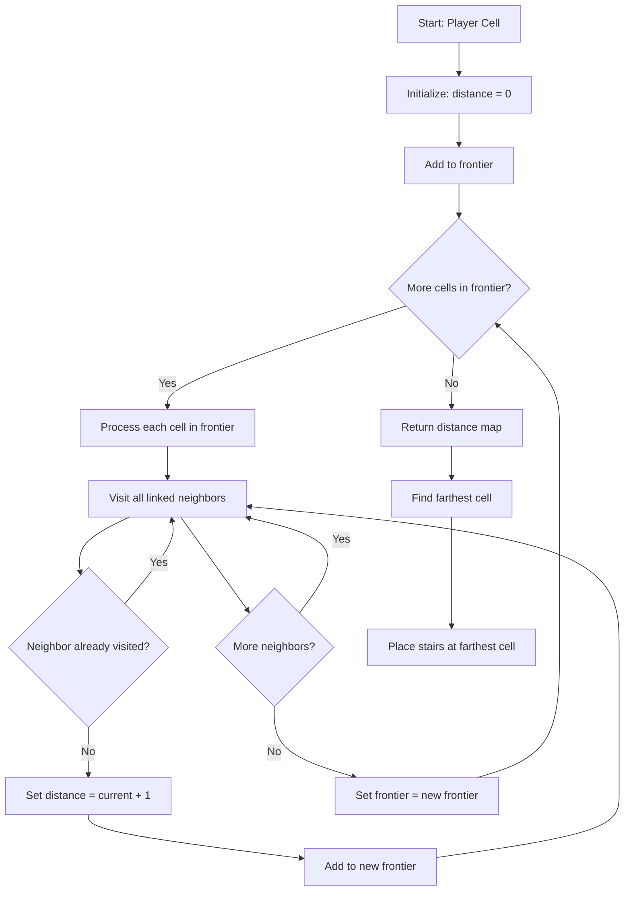

# Ensuring Player Accessibility in Procedurally Generated Levels

When building a roguelike game, one of the most critical challenges is ensuring that procedurally generated levels are playable. The player must always be able to reach critical objectives—like stairs to the next level, important items, or quest objectives. This article explores how to guarantee accessibility using pathfinding algorithms and path verification techniques.

## The Problem

Procedural generation algorithms create mazes that are mathematically valid—they're spanning trees where every cell is connected. However, when you start placing entities like stairs, items, or monsters, you can accidentally create situations where:

1. **The stairs are placed in an unreachable location** - Perhaps due to a bug in placement logic
2. **Items spawn in disconnected regions** - If you modify the maze after generation
3. **The player gets stuck** - If entity placement breaks connectivity

Even though maze algorithms guarantee connectivity, entity placement and post-generation modifications can break this guarantee.

## Why It Matters

In a roguelike game, if the player cannot reach the stairs, the game becomes unwinnable. This is a critical bug that will frustrate players and damage your game's reputation. Ensuring accessibility isn't just about preventing bugs—it's about creating a reliable, playable experience.

## Solution 1: Using Dijkstra's Algorithm for Smart Placement

The first solution is to place critical entities (like stairs) at locations that are guaranteed to be reachable. We can use Dijkstra's algorithm to find the farthest reachable cell from the player's starting position.

### How It Works

Dijkstra's algorithm calculates the shortest distance from a starting point to all other reachable points in a graph. In a maze context, this means finding all cells that are connected to the starting cell and calculating their distances.

Here's how we use it in Vanilla Roguelike:

```ruby
def find_stairs_position(grid, player_cell)
  # Calculate distances from player to all reachable cells
  distances = player_cell.distances

  # Find the cell with maximum distance (farthest from player)
  farthest_cell = distances.max&.first || grid.random_cell

  # Avoid placing stairs at player's position
  if farthest_cell == player_cell
    # Fallback: find any other cell
    stairs_cell = grid.random_cell
    while stairs_cell == player_cell
      stairs_cell = grid.random_cell
    end
    return { row: stairs_cell.row, column: stairs_cell.column }
  end

  { row: farthest_cell.row, column: farthest_cell.column }
end
```

### The Distance Calculation

The `distances` method on a cell uses a breadth-first search to calculate distances:

```ruby
def distances
  distances = DistanceBetweenCells.new(self)
  frontier = [self]

  while frontier.any?
    new_frontier = []

    frontier.each do |cell|
      cell.links.each do |linked|
        next if distances[linked]  # Already visited

        distances[linked] = distances[cell] + 1
        new_frontier << linked
      end
    end

    frontier = new_frontier
  end

  distances
end
```

This algorithm:
1. Starts at the root cell (distance 0)
2. Visits all linked neighbors (distance 1)
3. Visits neighbors of those neighbors (distance 2)
4. Continues until all reachable cells are visited

The result is a `DistanceBetweenCells` object that maps each cell to its distance from the start.



This flowchart shows how the distance calculation works: starting from the player, it expands outward layer by layer, calculating distances to all reachable cells, then uses this information to place stairs at the farthest point.

### Finding the Farthest Cell

Once we have distances, finding the farthest cell is straightforward:

```ruby
def max
  max_distance = 0
  max_cell = @root

  @cells.each do |cell, distance|
    if distance > max_distance
      max_cell = cell
      max_distance = distance
    end
  end

  [max_cell, max_distance]
end
```

This ensures the stairs are placed at maximum distance from the player, encouraging exploration while guaranteeing they're reachable.

## Solution 2: Path Verification and Repair

Even with smart placement, sometimes you need to verify and repair paths. This is especially important if you modify the maze after generation or if you want to ensure connectivity after placing multiple entities.

### The `ensure_path` Method

Vanilla Roguelike includes an `ensure_path` method that guarantees a path exists between two cells:

```ruby
def ensure_path(grid, start_cell, goal_cell)
  current = start_cell

  until current == goal_cell
    # Find the neighbor closest to the goal (greedy approach)
    next_cell = [current.north, current.south, current.east, current.west]
      .compact
      .min_by do |cell|
        # Manhattan distance heuristic
        (cell.row - goal_cell.row).abs + (cell.column - goal_cell.column).abs
      end

    if next_cell
      # Create a link if it doesn't exist
      current.link(cell: next_cell, bidirectional: true)
      next_cell.tile = TileType::EMPTY unless next_cell == goal_cell
      current = next_cell
    else
      # Fallback: if no valid neighbor, move goal to a random cell
      goal_cell = grid.random_cell while goal_cell == start_cell
      current = start_cell  # Restart pathing
    end
  end
end
```

This method:
1. Uses a greedy approach: always move toward the goal
2. Creates links between cells if they don't exist
3. Has a fallback if pathing fails completely

### When to Use Path Repair

Path repair is useful when:
- You modify the maze after generation (e.g., adding walls or removing connections)
- You need to guarantee connectivity between multiple points
- You want a safety net for edge cases

However, it can alter the natural structure of your maze, so use it judiciously.

## Trade-offs

### Dijkstra-Based Placement

**Pros:**
- Guarantees reachability
- Places objectives at interesting locations (farthest points)
- No maze modification needed
- O(n) time complexity for grid-based mazes

**Cons:**
- Requires pathfinding calculation
- May place stairs in predictable locations (always farthest)
- Doesn't help if maze is modified after placement

### Path Repair

**Pros:**
- Works even after maze modifications
- Can guarantee connectivity between any two points
- Simple greedy algorithm

**Cons:**
- Modifies the natural maze structure
- Can create "unnatural" paths
- May not preserve maze algorithm characteristics

## Implementation Tips

1. **Calculate distances once**: If you need to place multiple entities, calculate distances once and reuse the result.

2. **Cache distance calculations**: Distance calculations are expensive. Cache them if you're placing many entities.

3. **Verify after modifications**: If you modify the maze after generation, always verify paths to critical entities.

4. **Use path repair sparingly**: It's a safety net, not a primary strategy. Prefer smart placement.

5. **Test edge cases**: What happens if the maze is very small? What if all cells are walls? Test these scenarios.

## Lessons Learned

From implementing this in Vanilla Roguelike:

1. **Always verify accessibility**: Don't assume maze algorithms guarantee reachability after entity placement.

2. **Farthest placement creates better gameplay**: Placing stairs at maximum distance encourages exploration and creates natural difficulty progression.

3. **Path repair is a safety net**: Use it as a fallback, but prefer smart placement.

4. **Performance matters**: Distance calculations can be expensive for large grids. Consider caching or using simpler heuristics for very large mazes.

5. **Test with seeds**: Use fixed seeds to reproduce and test accessibility issues.

## Further Reading

- [Finding the Longest Path: A Key to Better Level Design](./02-finding-longest-path.md) - Using longest path algorithms for level design
- [Implementing Dijkstra's Algorithm for Game Pathfinding](./04-implementing-dijkstra.md) - Deep dive into Dijkstra's implementation
- [Testing Procedural Generation: How to Test Randomness](./09-testing-procedural-generation.md) - Strategies for testing accessibility

## Conclusion

Ensuring player accessibility in procedurally generated levels is critical for playability. Using Dijkstra's algorithm for smart entity placement and path verification techniques provides a robust solution. The key is to place critical entities at guaranteed reachable locations and verify paths when needed.

By implementing these techniques, you can create procedurally generated levels that are both interesting and playable, ensuring players never get stuck and always have a path to victory.

