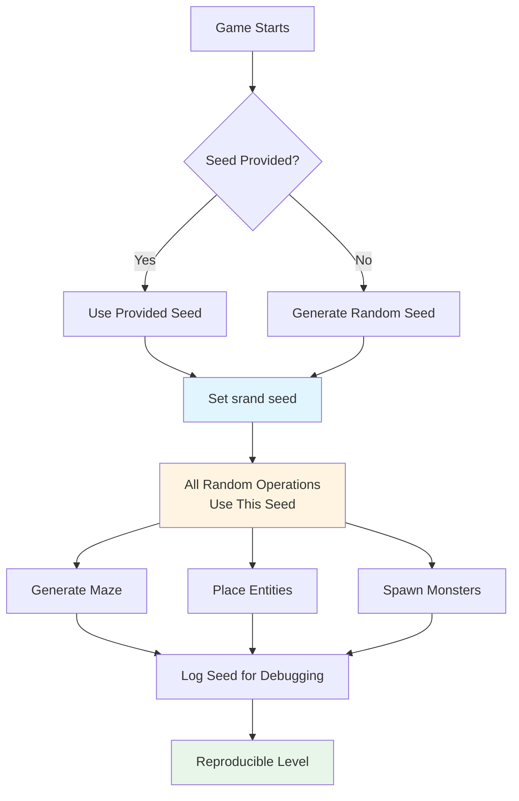

# Seeding for Reproducibility: Debugging Procedural Generation

One of the most powerful features of procedural generation is the ability to reproduce the same content using a seed. This capability transforms debugging from a frustrating exercise in randomness into a systematic process. This article explores how to implement seeding effectively and use it for debugging, testing, and player experience.

## What is Seeding?

A seed is a starting value for a random number generator. When you use the same seed, the random number generator produces the same sequence of "random" numbers. This means:

- Same seed → Same maze layout
- Same seed → Same entity placement
- Same seed → Same monster spawns
- Same seed → Reproducible gameplay

## Why It Matters

Seeding is essential for:

1. **Debugging**: Reproduce bugs by using the same seed that caused the issue
2. **Testing**: Create deterministic tests for non-deterministic systems
3. **Player Experience**: Allow players to share interesting seeds
4. **Development**: Test specific scenarios consistently

Without seeding, debugging procedural generation is nearly impossible—you can't reproduce the exact conditions that caused a bug.

## Implementation in Vanilla Roguelike



This flowchart shows how seeding works: the seed is set early, all random operations use it, and the seed is logged for later reproduction.

Here's how Vanilla Roguelike implements seeding:

```ruby
class MazeSystem < System
  def initialize(world, difficulty:, seed: Random.new_seed)
    super(world)

    @difficulty = difficulty
    @seed = seed
    srand(@seed)  # Set the random number generator seed

    @logger.debug("[MazeSystem] Initializing with difficulty: #{@difficulty}, seed: #{@seed}")

    @algorithm = Vanilla::Algorithms::RecursiveBacktracker
    @type_factory = Vanilla::MapUtils::CellTypeFactory.new
  end
end
```

### Key Points

1. **Default to random seed**: `seed: Random.new_seed` creates a new random seed if none is provided
2. **Set seed early**: Call `srand(@seed)` before any random operations
3. **Log the seed**: Always log the seed for debugging purposes
4. **Store the seed**: Keep the seed so you can reproduce the level later

## Setting the Seed

Ruby's `srand` function sets the seed for the global random number generator:

```ruby
# Set seed to a specific value
srand(12345)

# Now all random operations use this seed
rand(100)  # Always produces the same sequence
rand(100)  # Same sequence every time
rand(100)  # Same sequence every time
```

### When to Set the Seed

Set the seed **before** any random operations:

```ruby
def initialize(world, difficulty:, seed: Random.new_seed)
  @seed = seed
  srand(@seed)  # Set seed FIRST

  # Now all subsequent random operations use this seed
  @algorithm = select_algorithm  # Uses rand
  generate_maze  # Uses rand
  place_entities  # Uses rand
end
```

If you set the seed after some random operations, those operations won't be reproducible.

## Using Seeds for Bug Reproduction

The most common use case for seeds is reproducing bugs. Here's the workflow:

### 1. Capture the Seed

When a bug occurs, log the seed:

```ruby
def generate_level
  seed = Random.new_seed
  srand(seed)

  begin
    level = generate_maze
    populate_entities(level)
  rescue => e
    @logger.error("Error generating level with seed #{seed}: #{e.message}")
    raise
  end

  level
end
```

### 2. Reproduce with the Same Seed

Once you have the seed, you can reproduce the exact same level:

```ruby
# In your test or debug script
seed = 1234567890  # The seed from the error log
srand(seed)

# Now generate the level - it will be identical
level = generate_level
```

### 3. Debug Systematically

With a reproducible level, you can:
- Step through the generation process
- Add breakpoints at specific points
- Inspect the exact state that caused the bug
- Test fixes against the exact problematic scenario

## Testing with Fixed Seeds

Testing procedural generation is challenging because it's non-deterministic. Seeds solve this:

```ruby
describe "MazeSystem" do
  it "generates the same maze with the same seed" do
    seed = 42

    srand(seed)
    maze1 = generate_maze

    srand(seed)  # Reset to same seed
    maze2 = generate_maze

    expect(maze1).to eq(maze2)
  end

  it "ensures stairs are reachable" do
    seed = 12345
    srand(seed)

    level = generate_level
    player = level.player
    stairs = level.stairs

    # This test is now deterministic
    expect(path_exists?(player, stairs)).to be true
  end
end
```

### Property-Based Testing

You can also test properties across many seeds:

```ruby
it "always generates connected mazes" do
  100.times do
    seed = Random.new_seed
    srand(seed)

    maze = generate_maze
    expect(maze.connected?).to be true
  end
end
```

This tests that your generation algorithm has the correct properties, regardless of the specific seed.

## Seed Sharing Between Players

Seeds enable players to share interesting levels:

```ruby
class Game
  def initialize(seed: nil)
    @seed = seed || Random.new_seed
    srand(@seed)

    # Display seed to player
    puts "Level seed: #{@seed}"
    puts "Share this seed to replay this level!"
  end
end
```

Players can:
- Share seeds of interesting levels
- Challenge friends to beat the same level
- Replay favorite levels
- Report bugs with reproducible seeds

## Challenges: Ensuring All Systems Respect the Seed

The biggest challenge with seeding is ensuring **all** random operations use the same seed. If any system uses a different random number generator or doesn't respect the seed, reproducibility breaks.

### Problem: Multiple Random Number Generators

```ruby
# BAD: Creates a new RNG that doesn't use the seed
def spawn_monster
  rng = Random.new  # New RNG, ignores srand!
  position = rng.rand(grid.size)
end
```

### Solution: Use the Global RNG

```ruby
# GOOD: Uses the global RNG that respects srand
def spawn_monster
  position = rand(grid.size)  # Uses srand seed
end
```

### Problem: External Libraries

Some libraries create their own random number generators. You may need to:

1. **Seed library RNGs**: If the library exposes a seed method
2. **Avoid libraries**: Use your own random functions
3. **Wrap libraries**: Create a wrapper that respects your seed

### Solution: Centralized Random Functions

Create a centralized random module:

```ruby
module GameRandom
  def self.rand(max = nil)
    if max
      Kernel.rand(max)
    else
      Kernel.rand
    end
  end

  def self.seed=(value)
    srand(value)
  end
end
```

Then use `GameRandom.rand` everywhere instead of `rand`. This makes it easier to ensure all random operations use the seed.

## Best Practices

1. **Set seed early**: Before any random operations
2. **Log the seed**: Always log seeds for debugging
3. **Store the seed**: Keep seeds with level data for replay
4. **Use global RNG**: Avoid creating new Random instances
5. **Test with seeds**: Use fixed seeds in tests
6. **Document seed behavior**: Make it clear which operations are seeded

## Advanced: Seed Hierarchies

For complex games, you might want different seeds for different systems:

```ruby
class LevelGenerator
  def initialize(base_seed)
    @base_seed = base_seed
    @maze_seed = derive_seed(base_seed, "maze")
    @entity_seed = derive_seed(base_seed, "entities")
    @monster_seed = derive_seed(base_seed, "monsters")
  end

  def derive_seed(base, component)
    # Create a deterministic seed for each component
    Digest::MD5.hexdigest("#{base}-#{component}").to_i(16)
  end
end
```

This allows you to:
- Regenerate only specific parts (e.g., keep maze, regenerate monsters)
- Test components independently
- Have fine-grained control over reproducibility

## Debugging Workflow

Here's a typical debugging workflow using seeds:

1. **Reproduce the bug**: Use the seed from the error log
2. **Add logging**: Log all random decisions
3. **Step through**: Use a debugger to step through generation
4. **Isolate the issue**: Narrow down which random operation causes the bug
5. **Fix and verify**: Fix the bug and verify with the same seed
6. **Test with other seeds**: Test the fix with multiple seeds

## Lessons Learned

From implementing seeding in Vanilla Roguelike:

1. **Seeding is essential**: It transforms debugging from impossible to systematic
2. **Set seed early**: Before any random operations
3. **Log everything**: Seeds are useless if you don't log them
4. **Test deterministically**: Fixed seeds make testing possible
5. **Player value**: Players love sharing seeds
6. **Watch for RNG leaks**: Ensure all systems respect the seed

## Further Reading

- [Testing Procedural Generation: How to Test Randomness](./09-testing-procedural-generation.md) - Using seeds for testing
- [Ensuring Player Accessibility in Procedurally Generated Levels](./01-ensuring-player-accessibility.md) - Reproducing accessibility bugs
- [Optimizing Procedural Generation: When Speed Matters](./10-optimizing-procedural-generation.md) - Performance with seeded generation

## Conclusion

Seeding is one of the most important features for procedural generation. It enables debugging, makes testing possible, and enhances player experience through seed sharing. The key is to set the seed early, ensure all systems respect it, and log seeds for debugging.

By implementing seeding correctly, you transform procedural generation from a black box into a debuggable, testable system. This is essential for building reliable roguelike games.

