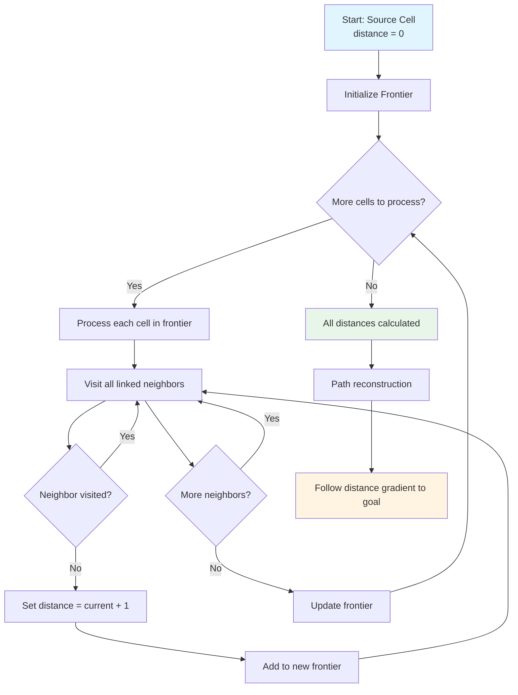
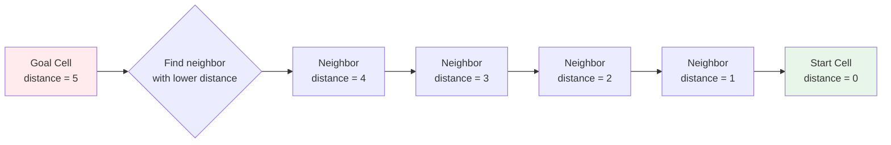

# Implementing Dijkstra's Algorithm for Game Pathfinding

Dijkstra's algorithm is a fundamental pathfinding algorithm that finds the shortest path between points in a graph. For roguelike games, it's perfect for grid-based movement, distance calculations, and AI pathfinding. This article explores a practical implementation of Dijkstra's algorithm specifically for roguelike game development.

## Why Dijkstra's for Roguelikes?

Dijkstra's algorithm is ideal for roguelikes because:

1. **Grid-based movement**: Roguelikes use discrete grid cells, perfect for graph-based pathfinding
2. **Uniform costs**: Movement between adjacent cells costs the same (1 step)
3. **All paths needed**: Often you need distances to all cells, not just one path
4. **Simple implementation**: Easier than A* for uniform-cost grids
5. **Multiple uses**: Distance calculation, pathfinding, accessibility checks, AI

## The Algorithm

Dijkstra's algorithm works by:
1. Starting at a source node (distance 0)
2. Visiting all neighbors of visited nodes
3. Assigning distances based on the shortest path found
4. Continuing until all reachable nodes are visited

For grid-based mazes, this becomes a breadth-first search since all edges have the same cost.



This flowchart shows the complete Dijkstra's algorithm: distance calculation followed by path reconstruction.

## Implementation in Vanilla Roguelike

Vanilla Roguelike implements Dijkstra's through the `Cell#distances` method:

```ruby
def distances
  distances = DistanceBetweenCells.new(self)
  frontier = [self]

  while frontier.any?
    new_frontier = []

    frontier.each do |cell|
      cell.links.each do |linked|
        next if distances[linked]  # Already visited

        distances[linked] = distances[cell] + 1
        new_frontier << linked
      end
    end

    frontier = new_frontier
  end

  distances
end
```

### Step-by-Step Breakdown

1. **Initialize**: Create a `DistanceBetweenCells` object with the root cell at distance 0
2. **Frontier**: Start with the root cell in the frontier (cells to process)
3. **Process frontier**: For each cell in the frontier:
   - Visit all linked neighbors
   - If neighbor hasn't been visited, set its distance to current + 1
   - Add neighbor to the new frontier
4. **Repeat**: Continue until the frontier is empty (all reachable cells visited)

### The DistanceBetweenCells Class

This class stores distances from a root cell:

```ruby
class DistanceBetweenCells
  def initialize(root)
    @root = root
    @cells = {}
    @cells[@root] = 0  # Root is distance 0 from itself
  end

  def [](cell)
    @cells[cell]
  end

  def []=(cell, distance)
    @cells[cell] = distance
  end

  def cells
    @cells.keys
  end
end
```

It's essentially a hash map from cells to their distances.

## Finding Shortest Paths

Once you have distances, finding the actual path is straightforward:

```ruby
def path_to(goal)
  current = goal
  breadcrumbs = DistanceBetweenCells.new(@root)
  breadcrumbs[current] = @cells[current]

  until current == @root
    # Find neighbor with lower distance (closer to root)
    current.links.each do |neighbor|
      if @cells[neighbor] < @cells[current]
        breadcrumbs[neighbor] = @cells[neighbor]
        current = neighbor
        break
      end
    end
  end

  breadcrumbs
end
```

This method:
1. Starts at the goal
2. Follows the gradient of decreasing distances back to the root
3. Builds a path (breadcrumbs) along the way



This diagram shows path reconstruction: starting at the goal, we follow the gradient of decreasing distances back to the start, building the path as we go.

### Using the Path

```ruby
# Calculate distances from start
distances = start_cell.distances

# Get path to goal
path = distances.path_to(goal_cell)

# Get cells in order
path_cells = path.cells  # Array of cells from start to goal
```

## The Dijkstra Wrapper Class

Vanilla Roguelike provides a convenient wrapper:

```ruby
class Dijkstra < AbstractAlgorithm
  def self.on(_grid, start:, goal: nil)
    distances = start.distances
    return distances.path_to(goal) if goal

    distances
  end

  def self.shortest_path(_grid, start:, goal:)
    distances = start.distances
    distances.path_to(goal).cells
  end

  def self.path_exists?(start, goal)
    distances = start.distances
    !!distances[goal]  # Returns true if goal is reachable
  end
end
```

### Usage Examples

```ruby
# Get all distances from a cell
distances = Dijkstra.on(grid, start: player_cell)

# Find shortest path between two cells
path = Dijkstra.shortest_path(grid, start: player_cell, goal: stairs_cell)

# Check if path exists
if Dijkstra.path_exists?(player_cell, stairs_cell)
  puts "Stairs are reachable!"
end
```

## Performance Considerations

### Time Complexity

For a grid with n cells:
- **Time**: O(n) - Each cell is visited once
- **Space**: O(n) - Store distance for each cell

This is efficient for roguelike-sized grids (typically 100-1000 cells).

### Optimization Tips

1. **Cache results**: If you need distances multiple times, cache them
2. **Early termination**: If you only need one path, stop when you reach the goal
3. **Incremental updates**: If the maze changes slightly, update distances incrementally
4. **Spatial partitioning**: For very large grids, partition into regions

### When to Use Dijkstra's vs. A*

- **Use Dijkstra's when**:
  - All edges have the same cost (like grid movement)
  - You need distances to all cells
  - Simple implementation is preferred

- **Use A* when**:
  - Edges have different costs
  - You only need one path
  - Performance is critical for large graphs

For roguelikes, Dijkstra's is usually the better choice.

## Common Use Cases

### 1. Finding Farthest Cell

```ruby
def find_farthest_cell(start_cell)
  distances = start_cell.distances
  farthest_cell, distance = distances.max
  farthest_cell
end
```

### 2. Accessibility Checking

```ruby
def can_reach?(start_cell, goal_cell)
  distances = start_cell.distances
  !distances[goal_cell].nil?
end
```

### 3. Distance-Based Placement

```ruby
def place_at_distance(start_cell, min_distance, max_distance)
  distances = start_cell.distances
  candidates = distances.cells.select do |cell|
    dist = distances[cell]
    dist >= min_distance && dist <= max_distance
  end
  candidates.sample
end
```

### 4. Path Visualization

```ruby
def visualize_path(start_cell, goal_cell)
  path = Dijkstra.shortest_path(grid, start: start_cell, goal: goal_cell)
  path.each_with_index do |cell, index|
    cell.mark = index.to_s  # Mark path cells
  end
end
```

## Handling Edge Cases

### No Path Exists

```ruby
def safe_path_to(start, goal)
  distances = start.distances
  return nil unless distances[goal]  # No path exists

  distances.path_to(goal)
end
```

### Multiple Paths

Dijkstra's finds **a** shortest path, not necessarily **the only** shortest path. If you need all shortest paths, use a different algorithm.

### Disconnected Regions

If the goal is in a disconnected region:

```ruby
distances = start.distances
if distances[goal].nil?
  # Goal is unreachable
  # Handle accordingly (e.g., create a path, move goal, etc.)
end
```

## Testing Dijkstra's Implementation

```ruby
describe "Dijkstra" do
  it "calculates distances correctly" do
    grid = create_simple_maze
    start = grid[0, 0]

    distances = start.distances

    expect(distances[start]).to eq(0)
    expect(distances[grid[0, 1]]).to eq(1)
    expect(distances[grid[1, 1]]).to eq(2)
  end

  it "finds shortest path" do
    grid = create_simple_maze
    start = grid[0, 0]
    goal = grid[2, 2]

    path = Dijkstra.shortest_path(grid, start: start, goal: goal)

    expect(path.first).to eq(start)
    expect(path.last).to eq(goal)
    expect(path.length).to eq(3)  # 3 steps
  end

  it "detects unreachable cells" do
    grid = create_disconnected_maze
    start = grid[0, 0]
    goal = grid[5, 5]  # In different region

    expect(Dijkstra.path_exists?(start, goal)).to be false
  end
end
```

## Integration with Game Systems

### Maze System

```ruby
class MazeSystem
  def find_stairs_position(grid, player_cell)
    distances = player_cell.distances
    farthest_cell = distances.max&.first
    # Place stairs at farthest cell
  end
end
```

### Monster AI

```ruby
class MonsterSystem
  def move_toward_player(monster, player)
    monster_cell = get_cell(monster)
    player_cell = get_cell(player)

    path = Dijkstra.shortest_path(grid, start: monster_cell, goal: player_cell)
    next_cell = path[1]  # First step toward player
    move_to(monster, next_cell)
  end
end
```

### Collision System

```ruby
class CollisionSystem
  def can_move_to?(entity, target_cell)
    current_cell = get_cell(entity)
    distances = current_cell.distances
    !distances[target_cell].nil?  # Reachable?
  end
end
```

## Lessons Learned

From implementing Dijkstra's in Vanilla Roguelike:

1. **Breadth-first is sufficient**: For uniform-cost grids, BFS is simpler than full Dijkstra's
2. **Distance maps are powerful**: Having distances to all cells enables many features
3. **Path reconstruction is simple**: Following the distance gradient back works well
4. **Performance is good**: O(n) is fast enough for roguelike grids
5. **Multiple uses**: One implementation serves many purposes

## Further Reading

- [Ensuring Player Accessibility in Procedurally Generated Levels](./01-ensuring-player-accessibility.md) - Using Dijkstra's for accessibility
- [Finding the Longest Path: A Key to Better Level Design](./02-finding-longest-path.md) - Using Dijkstra's twice for longest path
- [Monster AI: Simple Pathfinding That Feels Smart](./05-monster-ai.md) - Using Dijkstra's for AI

## Conclusion

Dijkstra's algorithm is a fundamental tool for roguelike development. Its simple implementation, good performance, and multiple use cases make it ideal for grid-based games. By implementing it correctly, you enable pathfinding, distance calculations, accessibility checks, and AI behavior—all with one algorithm.

The key is understanding that for uniform-cost grids, Dijkstra's simplifies to breadth-first search, making implementation straightforward while maintaining all the benefits of the algorithm.

