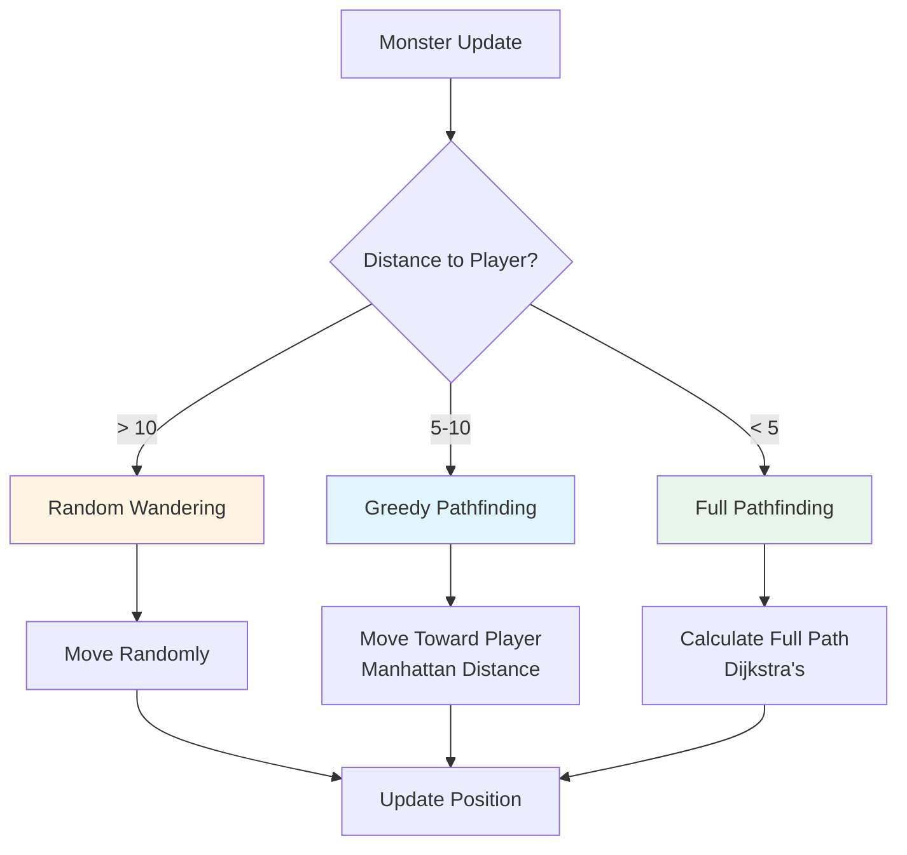

# Monster AI: Simple Pathfinding That Feels Smart

Creating engaging monster AI in roguelikes doesn't require complex behavior trees or state machines. Simple pathfinding techniques can create monsters that feel intelligent and challenging without being frustrating. This article explores how to implement effective monster AI using basic pathfinding.

## The Challenge

Monster AI in roguelikes needs to:
- **Feel smart**: Monsters should seem to pursue the player intelligently
- **Not be too smart**: Perfect pathfinding makes monsters too challenging
- **Perform well**: Pathfinding for multiple monsters shouldn't lag the game
- **Be interesting**: Different behaviors create variety

## Simple Approaches



This flowchart shows the decision-making process: monsters use different strategies based on their distance from the player.

### Random Wandering

The simplest approach is random movement:

```ruby
def move_monster(monster)
  directions = [:north, :south, :east, :west]
  direction = directions.sample
  try_move(monster, direction)
end
```

**Pros:**
- Very simple
- Fast performance
- Unpredictable behavior

**Cons:**
- Doesn't feel intelligent
- Monsters may wander away from player
- No challenge

### Greedy Pathfinding

Move toward the player using Manhattan distance:

```ruby
def move_toward_player(monster, player)
  monster_pos = get_position(monster)
  player_pos = get_position(player)

  # Calculate direction with smallest distance
  options = [
    [:north, monster_pos.row - 1, monster_pos.column],
    [:south, monster_pos.row + 1, monster_pos.column],
    [:east, monster_pos.row, monster_pos.column + 1],
    [:west, monster_pos.row, monster_pos.column - 1]
  ]

  best = options.min_by do |dir, row, col|
    (row - player_pos.row).abs + (col - player_pos.column).abs
  end

  try_move(monster, best[0])
end
```

**Pros:**
- Simple to implement
- Monsters move toward player
- Fast performance

**Cons:**
- Can get stuck on walls
- Doesn't find optimal paths
- May look "dumb" when blocked

### Full Pathfinding

Use Dijkstra's to find the actual path:

```ruby
def move_toward_player(monster, player)
  monster_cell = get_cell(monster)
  player_cell = get_cell(player)

  distances = monster_cell.distances
  return unless distances[player_cell]  # No path exists

  # Find next step on path
  next_cell = monster_cell.links.min_by do |neighbor|
    distances[neighbor] || Float::INFINITY
  end

  move_to(monster, next_cell)
end
```

**Pros:**
- Finds optimal paths
- Never gets stuck
- Feels intelligent

**Cons:**
- More expensive (pathfinding for each monster)
- May be too challenging
- Predictable behavior

## Balancing Challenge

The key is finding the right balance. Vanilla Roguelike uses a hybrid approach:

### Spawn Placement

Monsters are placed with distance constraints:

```ruby
def find_spawn_location(grid)
  walkable_cells = []
  grid.each_cell do |cell|
    next unless cell.tile == TileType::EMPTY

    player_pos = @player.get_component(:position)
    distance = (cell.row - player_pos.row).abs + (cell.column - player_pos.column).abs
    next if distance < 5  # Ensure distance from player

    # Avoid clustering
    has_nearby_monster = @monsters.any? do |m|
      m_pos = m.get_component(:position)
      nearby_distance = (cell.row - m_pos.row).abs + (cell.column - m_pos.column).abs
      nearby_distance < 3
    end
    next if has_nearby_monster

    walkable_cells << cell
  end

  walkable_cells.sample
end
```

This ensures:
- Monsters don't spawn too close to the player
- Monsters are spread out (no clustering)
- Spawn locations are valid (walkable cells)

### Movement Strategy

For movement, you can vary behavior:

```ruby
def update_monster(monster)
  case monster_behavior(monster)
  when :aggressive
    move_toward_player(monster)
  when :cautious
    move_toward_player(monster) if player_nearby?(monster)
  when :wander
    move_randomly(monster)
  end
end
```

## Implementation in Vanilla Roguelike

Vanilla Roguelike's monster system focuses on spawning and collision detection. Movement is handled by the movement system, but the principles apply:

### Monster Spawning

```ruby
class MonsterSystem
  def spawn_monsters(level, grid)
    count = determine_monster_count(level)
    count.times { spawn_monster(level, grid) }
  end

  def spawn_monster(level, grid)
    cell = find_spawn_location(grid)
    return nil unless cell

    # Create monster with level-appropriate stats
    health = 10 + (level * 2)
    damage = 1 + (level / 2)

    monster = EntityFactory.create_monster(cell.row, cell.column, health, damage)
    @monsters << monster
    @world.add_entity(monster)
  end
end
```

### Collision Detection

```ruby
def player_collision?
  player_pos = @player.get_component(:position)
  monster_at(player_pos.row, player_pos.column) != nil
end
```

## Performance Considerations

Pathfinding for multiple monsters can be expensive. Here are optimization strategies:

### 1. Limit Pathfinding Frequency

Don't recalculate paths every turn:

```ruby
def update_monster(monster)
  @pathfinding_turns ||= {}
  @pathfinding_turns[monster.id] ||= 0

  if @pathfinding_turns[monster.id] % 3 == 0  # Every 3 turns
    recalculate_path(monster)
  else
    follow_existing_path(monster)
  end

  @pathfinding_turns[monster.id] += 1
end
```

### 2. Use Greedy for Distant Monsters

Only use full pathfinding for nearby monsters:

```ruby
def update_monster(monster)
  distance = distance_to_player(monster)

  if distance > 10
    move_randomly(monster)  # Too far, just wander
  elsif distance > 5
    move_greedy(monster)  # Medium distance, use greedy
  else
    move_pathfind(monster)  # Close, use full pathfinding
  end
end
```

### 3. Batch Pathfinding

Calculate paths for multiple monsters in one pass:

```ruby
def update_all_monsters
  player_cell = get_cell(@player)
  distances = player_cell.distances  # Calculate once

  @monsters.each do |monster|
    monster_cell = get_cell(monster)
    next_cell = find_next_step(monster_cell, distances)
    move_to(monster, next_cell)
  end
end
```

### 4. Spatial Partitioning

For many monsters, partition the grid:

```ruby
def update_monsters_in_region(region)
  # Only update monsters in this region
  monsters = @monsters.select { |m| in_region?(m, region) }
  update_monster_batch(monsters)
end
```

## Advanced: Behavior Variety

Create more interesting monsters with different behaviors:

### Aggressive Monsters

Always pursue the player:

```ruby
class AggressiveMonster
  def update(monster, player)
    move_toward_player(monster, player)
  end
end
```

### Cautious Monsters

Only pursue if player is nearby:

```ruby
class CautiousMonster
  def update(monster, player)
    if distance_to_player(monster) < 5
      move_toward_player(monster, player)
    else
      move_randomly(monster)
    end
  end
end
```

### Patrolling Monsters

Move between waypoints:

```ruby
class PatrollingMonster
  def initialize(waypoints)
    @waypoints = waypoints
    @current_waypoint = 0
  end

  def update(monster, player)
    target = @waypoints[@current_waypoint]
    if reached?(monster, target)
      @current_waypoint = (@current_waypoint + 1) % @waypoints.length
    else
      move_toward(monster, target)
    end
  end
end
```

### Fleeing Monsters

Run away from the player:

```ruby
class FleeingMonster
  def update(monster, player)
    # Move in opposite direction of player
    direction = away_from_player(monster, player)
    move(monster, direction)
  end
end
```

## When to Use Each Approach

### Use Random Wandering When:
- Monsters are far from the player
- You want unpredictable behavior
- Performance is critical
- Monsters are not a threat

### Use Greedy Pathfinding When:
- Monsters are medium distance
- You want simple pursuit
- Performance matters
- Paths are mostly open

### Use Full Pathfinding When:
- Monsters are close to the player
- You want intelligent behavior
- Performance allows it
- Challenge is important

## Testing Monster AI

```ruby
describe "MonsterSystem" do
  it "spawns monsters at appropriate distance" do
    system = MonsterSystem.new(world, player: player)
    system.spawn_monsters(1, grid)

    system.monsters.each do |monster|
      pos = monster.get_component(:position)
      player_pos = player.get_component(:position)
      distance = (pos.row - player_pos.row).abs + (pos.column - player_pos.column).abs

      expect(distance).to be >= 5
    end
  end

  it "monsters can reach player" do
    monster = spawn_monster_at(grid[5, 5])
    player = spawn_player_at(grid[0, 0])

    # Verify path exists
    distances = get_cell(monster).distances
    player_cell = get_cell(player)
    expect(distances[player_cell]).not_to be_nil
  end
end
```

## Lessons Learned

From implementing monster AI in Vanilla Roguelike:

1. **Simple is often better**: Greedy pathfinding feels smart without complexity
2. **Distance matters**: Spawn monsters far enough to give player time
3. **Variety creates interest**: Different behaviors make monsters memorable
4. **Performance is important**: Limit pathfinding to maintain framerate
5. **Balance is key**: Too smart is frustrating, too dumb is boring

## Further Reading

- [Implementing Dijkstra's Algorithm for Game Pathfinding](./04-implementing-dijkstra.md) - Pathfinding fundamentals
- [Ensuring Player Accessibility in Procedurally Generated Levels](./01-ensuring-player-accessibility.md) - Ensuring monsters can reach player
- [Optimizing Procedural Generation: When Speed Matters](./10-optimizing-procedural-generation.md) - Performance optimization

## Conclusion

Monster AI in roguelikes doesn't need to be complex. Simple pathfinding techniques—from random wandering to full Dijkstra's—can create engaging, challenging monsters. The key is choosing the right approach for each situation and balancing challenge with performance.

By using distance-based spawning, appropriate pathfinding strategies, and behavior variety, you can create monsters that feel intelligent and challenging without being frustrating or performance-intensive.

