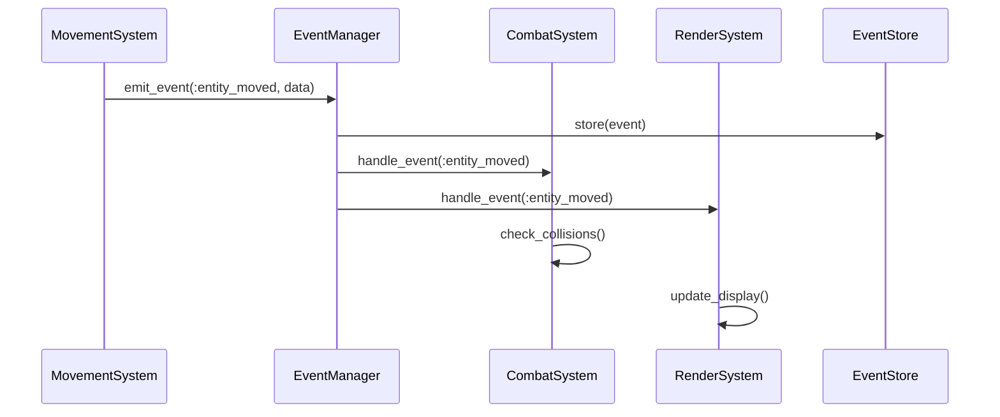
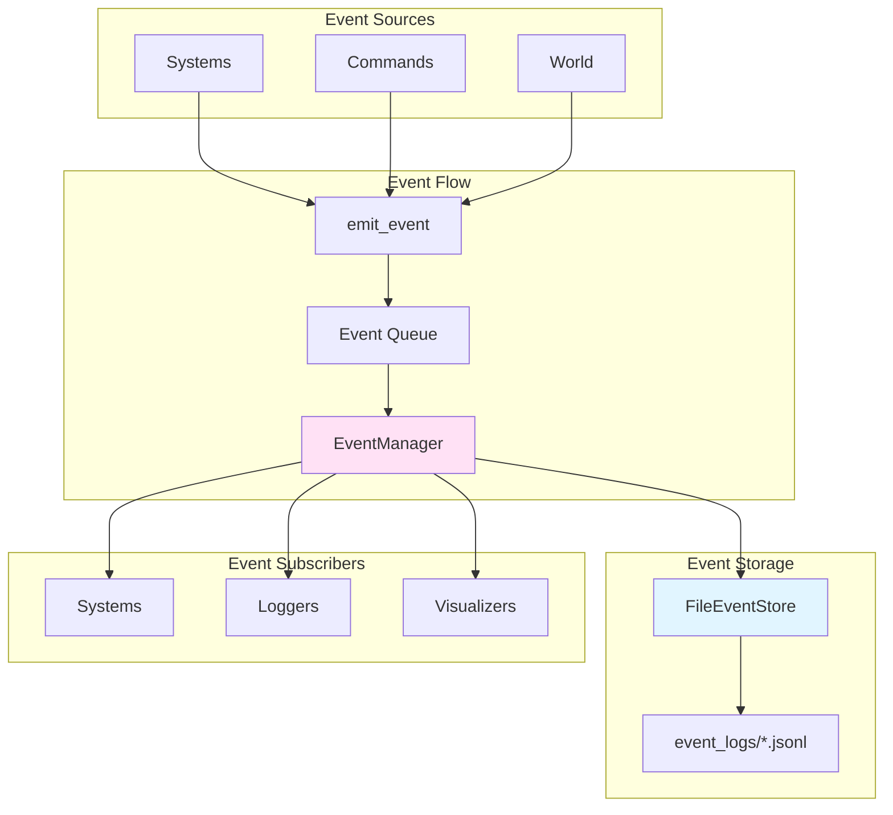

# Event-Driven Architecture for Game Debugging

Event-driven architecture is a powerful pattern for game development that provides decoupling, comprehensive logging, and powerful debugging capabilities. This article explores how to implement an event system and use it to transform game debugging from guesswork into systematic analysis.

## Why Events Matter

Traditional game architecture uses direct method calls between systems:

```ruby
# Tightly coupled
class MovementSystem
  def move(entity)
    # ... movement logic ...
    @combat_system.check_collision(entity)  # Direct dependency
    @render_system.update_display(entity)   # Direct dependency
    @logger.log("Entity moved")             # Direct dependency
  end
end
```

This creates problems:
- **Tight coupling**: Systems depend on each other
- **Hard to debug**: No record of what happened
- **Difficult to test**: Can't isolate systems
- **No replay**: Can't reproduce bugs

Event-driven architecture solves these problems:

```ruby
# Decoupled
class MovementSystem
  def move(entity)
    # ... movement logic ...
    emit_event(:entity_moved, { entity_id: entity.id })  # No dependencies
  end
end
```

Other systems subscribe to events they care about, but `MovementSystem` doesn't know who's listening.



This sequence diagram shows how events flow: the MovementSystem emits an event, the EventManager stores it and notifies all subscribers, who then react independently.

## Core Concepts

### Events

An event is a message representing something that happened:

```ruby
class Event
  attr_reader :id, :timestamp, :source, :type, :data

  def initialize(type, source = nil, data = {}, id = nil, timestamp = nil)
    @id = id || SecureRandom.uuid
    @type = type
    @source = source
    @data = data
    @timestamp = timestamp || Time.now.utc
  end
end
```

Events have:
- **Type**: What happened (e.g., `:entity_moved`, `:combat_attack`)
- **Source**: What caused it (e.g., `MovementSystem`, `CombatSystem`)
- **Data**: Additional information (e.g., `{ entity_id: 123, position: [5, 10] }`)
- **Timestamp**: When it happened
- **ID**: Unique identifier for tracking

### Event Manager

The event manager handles publishing and subscription:

```ruby
class EventManager
  def initialize
    @subscribers = Hash.new { |h, k| h[k] = [] }
  end

  def subscribe(event_type, subscriber)
    @subscribers[event_type] << subscriber
  end

  def publish(event)
    @subscribers[event.type].each do |subscriber|
      subscriber.handle_event(event)
    end
  end
end
```

### Subscribers

Systems subscribe to events they care about:

```ruby
class CombatSystem
  def initialize(event_manager)
    event_manager.subscribe(:entity_moved, self)
  end

  def handle_event(event)
    case event.type
    when :entity_moved
      check_collisions(event.data[:entity_id])
    end
  end
end
```

## Implementation in Vanilla Roguelike

Vanilla Roguelike implements a comprehensive event system:

### Event Class

```ruby
class Event
  def initialize(type, source = nil, data = {}, id = nil, timestamp = nil)
    @id = id || SecureRandom.uuid
    @type = type
    @source = source
    @data = data
    @timestamp = timestamp || Time.now.utc
  end

  def to_json
    {
      id: @id,
      type: @type,
      source: @source.to_s,
      timestamp: @timestamp.iso8601(3),
      data: @data
    }.to_json
  end
end
```

### Event Manager

```ruby
class EventManager
  def initialize(store_config: { file: true })
    @subscribers = Hash.new { |h, k| h[k] = [] }
    @event_store = FileEventStore.new if store_config[:file]
  end

  def subscribe(event_type, subscriber)
    @subscribers[event_type] << subscriber
  end

  def publish(event)
    @event_store&.store(event)  # Store for debugging
    @subscribers[event.type].each do |subscriber|
      subscriber.handle_event(event)
    end
  end
end
```

### Emitting Events

Systems emit events through the world:

```ruby
class MovementSystem
  def move(entity, direction)
    # ... movement logic ...
    @world.emit_event(:entity_moved, {
      entity_id: entity.id,
      from: [old_row, old_col],
      to: [new_row, new_col]
    })
  end
end
```

## Event Storage: Recording Game History



This architecture diagram shows how events flow through the system: from sources through the event manager to storage and subscribers.

Events are stored in JSONL (JSON Lines) format:

```ruby
class FileEventStore
  def initialize(directory = "event_logs")
    @directory = directory
    @current_session = Time.now.strftime("%Y%m%d_%H%M%S")
  end

  def store(event)
    ensure_file_open
    @current_file.puts(event.to_json)
    @current_file.flush
  end
end
```

Each game session creates a file like `events_20250111_143022.jsonl` containing all events:

```json
{"id":"abc-123","type":"entity_moved","source":"MovementSystem","timestamp":"2025-01-11T14:30:22.123Z","data":{"entity_id":1,"from":[0,0],"to":[0,1]}}
{"id":"def-456","type":"combat_attack","source":"CombatSystem","timestamp":"2025-01-11T14:30:23.456Z","data":{"attacker_id":1,"target_id":2,"damage":15}}
```

## Debugging with Events

### 1. Reproducing Bugs

When a bug occurs, you have a complete event log:

```ruby
# Load events from the bug session
events = event_store.load_session("20250111_143022")

# Replay events to reproduce the bug
events.each do |event|
  replay_event(event)
end
```

### 2. Analyzing Event Sequences

Find patterns in event sequences:

```ruby
def analyze_combat_events(session_id)
  events = event_store.query(session_id: session_id, type: :combat_attack)

  events.group_by { |e| e.data[:attacker_id] }.each do |attacker, attacks|
    puts "Attacker #{attacker}: #{attacks.count} attacks"
    puts "  Average damage: #{attacks.map { |e| e.data[:damage] }.sum / attacks.count}"
  end
end
```

### 3. Finding Anomalies

Detect unexpected behavior:

```ruby
def find_rapid_movement(session_id)
  events = event_store.query(session_id: session_id, type: :entity_moved)

  events.each_cons(2) do |e1, e2|
    time_diff = e2.timestamp - e1.timestamp
    if time_diff < 0.01  # Less than 10ms between moves
      puts "Rapid movement detected: #{e1.data} -> #{e2.data}"
    end
  end
end
```

## Event Visualization

Vanilla Roguelike includes visualization tools:

### Timeline Visualization

Generate HTML timelines showing event sequences:

```ruby
visualizer = EventVisualization.new(event_store)
output_path = visualizer.generate_timeline(session_id)
# Opens interactive HTML timeline in browser
```

The timeline shows:
- Event types grouped together
- Temporal relationships
- Event details on click
- Time offsets from start

### Querying Events

Query events by type, time range, or other criteria:

```ruby
# Get all combat events
combat_events = event_store.query(type: :combat_attack)

# Get events in time range
recent_events = event_store.query(
  start_time: Time.now - 60,
  end_time: Time.now
)

# Get last 100 events
recent = event_store.query(limit: 100)
```

## Common Event Types

### Game Events

Events representing player actions:
- `:entity_moved` - Entity changed position
- `:combat_attack` - Attack initiated
- `:item_picked_up` - Item collected
- `:level_transitioned` - Level changed

### System Events

Events for system communication:
- `:level_transition_requested` - Request new level
- `:entities_collided` - Collision detected
- `:combat_damage` - Damage dealt
- `:monster_spawned` - Monster created

### Debug Events

Events for development:
- `:debug_state_dump` - Request state information
- `:debug_command` - Debug command executed

## Best Practices

### 1. Emit Events for Important Actions

```ruby
# Good: Emit event for important state changes
def attack(attacker, target)
  damage = calculate_damage(attacker, target)
  target.take_damage(damage)
  emit_event(:combat_attack, {
    attacker_id: attacker.id,
    target_id: target.id,
    damage: damage
  })
end
```

### 2. Include Relevant Data

```ruby
# Good: Include all relevant information
emit_event(:entity_moved, {
  entity_id: entity.id,
  from: [old_row, old_col],
  to: [new_row, new_col],
  direction: direction
})

# Bad: Missing important data
emit_event(:entity_moved, { entity_id: entity.id })
```

### 3. Use Consistent Event Types

```ruby
# Good: Consistent naming
:entity_moved
:combat_attack
:item_picked_up

# Bad: Inconsistent naming
:move
:attack_combat
:pickupItem
```

### 4. Store Events Persistently

Always store events to disk for debugging:

```ruby
event_manager = EventManager.new(store_config: { file: true })
```

### 5. Subscribe Selectively

Only subscribe to events you need:

```ruby
# Good: Subscribe only to relevant events
event_manager.subscribe(:combat_attack, self)
event_manager.subscribe(:combat_damage, self)

# Bad: Subscribe to everything
event_manager.subscribe(:*, self)  # Too broad
```

## Performance Considerations

Event systems have overhead:

1. **Event creation**: Creating event objects has cost
2. **Storage**: Writing to disk has I/O cost
3. **Subscription lookup**: Finding subscribers has cost

### Optimization Tips

1. **Disable in production**: Only enable event storage in development
2. **Filter events**: Don't store every single event
3. **Batch storage**: Write events in batches, not individually
4. **Async storage**: Store events asynchronously to avoid blocking

```ruby
class EventManager
  def initialize(store_config: { file: true, async: true })
    @async = store_config[:async]
    @event_queue = Queue.new if @async

    Thread.new { process_queue } if @async
  end

  def publish(event)
    if @async
      @event_queue << event
    notify_subscribers(event)
    else
      @event_store&.store(event)
      notify_subscribers(event)
    end
  end

  private

  def process_queue
    loop do
      event = @event_queue.pop
      @event_store.store(event)
    end
  end
end
```

## Lessons Learned

From implementing events in Vanilla Roguelike:

1. **Events transform debugging**: From guesswork to systematic analysis
2. **Storage is essential**: Without persistent storage, events are less useful
3. **Visualization helps**: Timelines make event sequences understandable
4. **Start simple**: Basic event system is better than no event system
5. **Performance matters**: Async storage prevents blocking
6. **Consistency is key**: Consistent event types make analysis easier

## Further Reading

- [Seeding for Reproducibility: Debugging Procedural Generation](./03-seeding-for-reproducibility.md) - Combining seeds with events for debugging
- [Testing Procedural Generation: How to Test Randomness](./09-testing-procedural-generation.md) - Using events for testing

## Conclusion

Event-driven architecture is a game-changer for debugging. By decoupling systems, providing comprehensive logging, and enabling visualization, events transform game development from frustrating guesswork into systematic analysis.

The key is to start simple—emit events for important actions, store them persistently, and use visualization tools to understand what happened. As your game grows, the event system becomes increasingly valuable for debugging, testing, and understanding player behavior.

