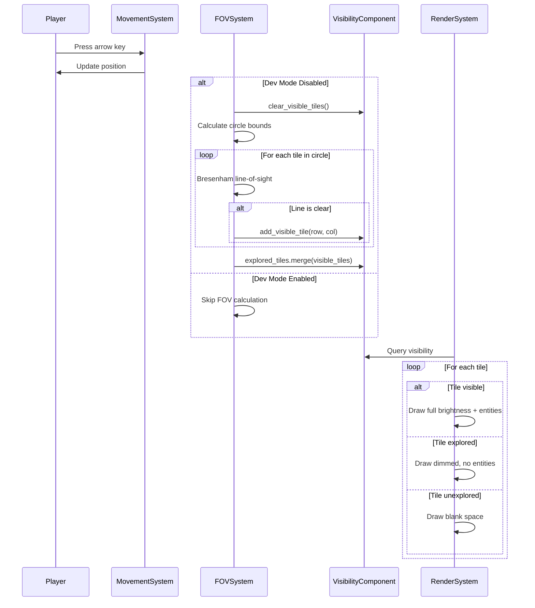

# Field of View: Revealing the Unknown

Field of View (FOV) is what separates roguelikes from puzzle games. Without FOV, you see the entire maze at once—it becomes a navigation problem. With FOV, you explore darkness, discover danger too late, and feel the tension of the unknown. This article shares how we implemented FOV using a simple but effective approach: circle-based visibility with Bresenham's line-of-sight.

## Why FOV Matters

FOV transforms the player experience:

**Exploration**: The map reveals itself progressively. You don't know what's around the corner.

**Tension**: That goblin might be one tile away. You won't know until you move.

**Tactics**: Do you peek around the corner or charge ahead? FOV makes positioning matter.

**Discovery**: Finding a new room or secret area feels rewarding because you had to work to reveal it.

Without FOV, roguelikes lose much of their appeal. The challenge becomes solving a visible puzzle rather than exploring an unknown dungeon.

## The Challenge

We needed a system that:
1. **Recalculates quickly**: FOV runs every time the player moves
2. **Handles obstacles**: Walls block vision, creating natural fog of war
3. **Feels natural**: Players should intuitively understand what they can and can't see
4. **Supports development**: We need to toggle FOV off for testing and debugging

We also wanted three distinct visibility states:
- **Unexplored**: Never seen (rendered as blank space)
- **Explored**: Previously seen but not currently visible (dimmed, no entities)
- **Visible**: Currently in FOV (full brightness, all entities shown)

## Algorithm Selection

The roguelike community has well-established FOV algorithms. The most accurate is **Recursive Shadowcasting**—it handles complex geometry and ensures symmetric visibility (if A sees B, then B sees A).

We chose a simpler approach: **Circle-based FOV with Bresenham line-of-sight**.

### Why Not Shadowcasting?

Shadowcasting is powerful but complex:
- Harder to understand and debug
- More edge cases to handle
- Overkill for simple grid-based mazes

### Why Circle + Bresenham?

Our approach is straightforward:
1. Check all tiles in a circle around the player
2. For each tile, trace a line from player to tile using Bresenham's algorithm
3. If any point along the line blocks vision (wall), the tile isn't visible

Benefits:
- **Simple**: Easy to understand and test
- **Fast enough**: O(radius²) is fine for turn-based games
- **Good enough**: Handles walls and obstacles naturally
- **Debuggable**: Clear what's happening at each step

The tradeoff: Slightly less accurate than shadowcasting in some edge cases. In practice, players don't notice.

## The Architecture

### VisibilityComponent

Every entity that needs vision gets a `VisibilityComponent`:

```ruby
class VisibilityComponent < Component
  attr_accessor :vision_radius      # How far entity can see (default: 8)
  attr_accessor :visible_tiles      # Set of currently visible [row, col]
  attr_accessor :explored_tiles     # Set of all explored [row, col]
  attr_accessor :blocks_vision      # Does this entity block vision?

  def initialize(vision_radius: 8, blocks_vision: false)
    @vision_radius = vision_radius
    @visible_tiles = Set.new
    @explored_tiles = Set.new
    @blocks_vision = blocks_vision
  end

  def tile_visible?(row, col)
    @visible_tiles.include?([row, col])
  end

  def tile_explored?(row, col)
    @explored_tiles.include?([row, col])
  end
end
```

Key design decisions:

**Using Sets**: Ruby's `Set` provides O(1) lookups. The renderer checks visibility for every tile every frame—this needs to be fast.

**Separate visible and explored**: `visible_tiles` changes every turn. `explored_tiles` only grows, never shrinks. This gives us fog of war: you remember where you've been, even if you can't see it now.

**Vision radius as component data**: Different entities could have different vision ranges. Players might see 8 tiles, bats might see 15, moles might see only 3.

### DevModeComponent

During development, we needed to see the entire map:

```ruby
class DevModeComponent < Component
  attr_accessor :fov_disabled        # Boolean: FOV system disabled?
  attr_accessor :show_all_entities   # Boolean: show all entities?

  def initialize(fov_disabled: false)
    @fov_disabled = fov_disabled
    @show_all_entities = fov_disabled
  end

  def toggle_fov
    @fov_disabled = !@fov_disabled
    @show_all_entities = @fov_disabled
  end
end
```

This component only exists on the player and only when requested. Press 'F' during gameplay to toggle it. Essential for testing maze generation and debugging monster AI.

## The FOVSystem

The system runs at priority 2.5—after movement (priority 2) but before combat (priority 3):

```ruby
class FOVSystem < System
  def update(delta_time)
    @grid ||= @world.current_level&.grid
    return unless @grid

    entities_with(:visibility, :position).each do |entity|
      next if dev_mode_active?(entity)

      calculate_fov(entity)
      update_explored_tiles(entity)
    end
  end
end
```

### Why Priority 2.5?

FOV must run:
- **After movement**: Player moves first, then we recalculate what they can see
- **Before combat**: Monsters only attack if they can see the player (future enhancement)
- **Before rendering**: The renderer needs to know what's visible

### The Core Algorithm

Here's the FOV calculation:

```ruby
def calculate_fov(entity)
  position = entity.get_component(:position)
  visibility = entity.get_component(:visibility)
  radius = visibility.vision_radius

  # Clear current visible tiles
  visibility.clear_visible_tiles

  # Player's tile is always visible
  visibility.add_visible_tile(position.row, position.column)

  # Check all tiles in a square around the player
  (-radius..radius).each do |dr|
    (-radius..radius).each do |dc|
      target_row = position.row + dr
      target_col = position.column + dc

      # Skip tiles outside the circle (use squared distance)
      distance_sq = dr * dr + dc * dc
      next if distance_sq > radius * radius

      # Skip out of bounds
      next unless in_bounds?(target_row, target_col)

      # Check if there's a clear line of sight to this tile
      if has_line_of_sight?(position.row, position.column, target_row, target_col)
        visibility.add_visible_tile(target_row, target_col)
      end
    end
  end
end
```

Let's break this down:

**1. Clear visible tiles**: Each turn starts fresh. Visible tiles from last turn don't carry over.

**2. Player's tile always visible**: You can always see where you're standing.

**3. Square iteration**: We check a square from `-radius` to `+radius`. This is inefficient but simple.

**4. Circle check**: `distance_sq > radius * radius` culls tiles outside the circle. This avoids expensive square root calculations.

**5. Bounds check**: Don't check tiles outside the grid.

**6. Line-of-sight**: The key check. Can we draw a clear line from player to target?

### Bresenham's Line Algorithm

The heart of FOV is line-of-sight checking:

```ruby
def has_line_of_sight?(from_row, from_col, to_row, to_col)
  # Use Bresenham's line algorithm to trace the path
  points = bresenham_line(from_row, from_col, to_row, to_col)

  # Check each point along the line (except the target)
  points[0..-2].each do |row, col|
    return false if blocks_vision?(row, col)
  end

  # We reached the target without hitting a blocker
  true
end
```

Note: We check `points[0..-2]`—all points *except the target*. This allows seeing walls. If we checked the target, you'd never see the wall blocking your vision, which feels wrong.

Bresenham's algorithm is a classic from computer graphics. It finds the optimal path of pixels to draw a line:

```ruby
def bresenham_line(row0, col0, row1, col1)
  points = []

  dx = (col1 - col0).abs
  dy = (row1 - row0).abs

  sx = col0 < col1 ? 1 : -1
  sy = row0 < row1 ? 1 : -1

  err = dx - dy
  row = row0
  col = col0

  loop do
    points << [row, col]
    break if row == row1 && col == col1

    e2 = 2 * err

    if e2 > -dy
      err -= dy
      col += sx
    end

    if e2 < dx
      err += dx
      row += sy
    end
  end

  points
end
```

This algorithm efficiently finds the integer coordinates that best approximate a straight line. For vision, we check each coordinate—if any is a wall, vision stops.

### Updating Explored Tiles

After calculating visible tiles, we update exploration:

```ruby
def update_explored_tiles(entity)
  visibility = entity.get_component(:visibility)
  visibility.explored_tiles.merge(visibility.visible_tiles)
end
```

Simple: any tile you can see is now explored. Explored tiles are never removed—you remember where you've been. This creates the fog of war effect.

## Integration with Rendering

The `RenderSystem` queries the player's visibility to decide what to draw:

```ruby
def render_grid
  grid = @world.current_level&.grid
  player = @world.find_entity_by_tag(:player)
  visibility = player&.get_component(:visibility)
  dev_mode = player&.get_component(:dev_mode)

  @renderer.draw_grid(
    grid,
    @world.current_level&.algorithm&.demodulize || "Unknown",
    visibility: visibility,
    dev_mode: dev_mode
  )
end
```

The renderer then uses visibility to determine how to draw each tile:

### Three Rendering Modes

**1. Visible tiles** (currently in FOV):
- Full brightness colors
- All entities shown (monsters, items, stairs)
- The player's current view

**2. Explored tiles** (fog of war):
- Dimmed colors (white becomes dark gray, etc.)
- Terrain shown (walls, floors)
- Entities hidden (you saw a goblin there earlier, but is it still there?)

**3. Unexplored tiles** (never seen):
- Rendered as blank space
- Complete mystery
- The unknown

### Dev Mode Override

When dev mode is active (`fov_disabled = true`), the renderer shows everything regardless of visibility. Essential for testing maze generation and item placement.

## Developer Mode Features

### ToggleFOVCommand

Press 'F' during gameplay to toggle FOV:

```ruby
class ToggleFOVCommand < Command
  def execute(world)
    player = world.find_entity_by_tag(:player)
    return unless player

    dev_mode = player.get_component(:dev_mode)

    # If no dev mode component, add one and enable it
    unless dev_mode
      dev_mode = DevModeComponent.new(fov_disabled: true)
      player.add_component(dev_mode)
    else
      # Toggle existing dev mode
      dev_mode.toggle_fov
    end

    mode_text = dev_mode.fov_disabled ? "OFF" : "ON"
    world.emit_event(:dev_mode_toggled, { fov: mode_text, entity: player.id })

    # Show message to player
    message_system = ServiceRegistry.get(:message_system)
    if message_system
      message = dev_mode.fov_disabled ?
        "DEV MODE: FOV disabled - Full map visible" :
        "FOV enabled - Exploration mode active"
      message_system.add_message(message)
    end
  end
end
```

### Use Cases

**Testing**: Generate a maze, press 'F', see the entire layout. Check if it looks reasonable.

**Debugging**: Monsters not spawning? Press 'F' to see where they actually are.

**Demonstration**: Showing someone the game? Toggle FOV to reveal the entire maze.

**Accessibility**: Some players might find FOV disorienting. They can disable it.

## The Flow

Here's how FOV works in the game loop:



## Testing Strategy

We wrote comprehensive tests for FOV:

### Empty Room Tests

```ruby
context "in empty room (no walls)" do
  it "makes all tiles within radius visible" do
    fov_system.calculate_fov(entity)

    expect(visibility.tile_visible?(11, 10)).to be true  # 1 south
    expect(visibility.tile_visible?(10, 11)).to be true  # 1 east
  end

  it "respects vision_radius limit" do
    fov_system.calculate_fov(entity)

    # Tile at distance 6 should not be visible (radius is 5)
    expect(visibility.tile_visible?(16, 10)).to be false
  end
end
```

### Wall Blocking Tests

```ruby
context "with walls blocking vision" do
  before do
    # Wall at (10, 12) blocks vision
    allow(grid).to receive(:blocks_vision?) do |row, col|
      row == 10 && col == 12
    end
  end

  it "blocks vision behind walls" do
    fov_system.calculate_fov(entity)

    # Tile directly behind wall should not be visible
    expect(visibility.tile_visible?(10, 13)).to be false
  end
end
```

### Explored Tiles Persistence

```ruby
it "retains previously explored tiles" do
  visibility.explored_tiles.add([1, 2])
  visibility.add_visible_tile(5, 10)

  fov_system.send(:update_explored_tiles, entity)

  expect(visibility.tile_explored?(1, 2)).to be true  # Old tile
  expect(visibility.tile_explored?(5, 10)).to be true  # New tile
end
```

### Dev Mode

```ruby
it "skips FOV calculation when dev mode enabled" do
  entity.add_component(DevModeComponent.new(fov_disabled: true))

  fov_system.update(0.016)

  expect(visibility.visible_tiles).to be_empty  # No calculation
end
```

## What We Learned

### 1. Start Simple

We initially researched shadowcasting—the "correct" algorithm. It seemed complex. We decided to try Bresenham first, expecting to upgrade later.

We never needed to upgrade. The simple approach worked well enough. Lesson: Don't optimize prematurely. Start with the simplest thing that could work.

### 2. Separate State from Rendering

`VisibilityComponent` stores what's visible. `RenderSystem` decides how to render it. This separation made both simpler:
- FOV doesn't care about colors or rendering
- Rendering doesn't care about Bresenham or line-of-sight
- We could change either without touching the other

### 3. Dev Mode is Essential

Being able to toggle FOV during development saved hours. We could:
- Verify maze generation looked reasonable
- Check monster spawning was working
- Debug pathfinding issues
- Demo the game to others

Build debugging tools early. You'll use them more than you expect.

### 4. Sets for Performance

Using Ruby's `Set` for visible and explored tiles was crucial. The renderer checks `tile_visible?` and `tile_explored?` for every tile every frame. With arrays, this would be O(n) per check. With sets, it's O(1).

For 40×40 grids, that's 1,600 checks per frame. Sets make this negligible.

### 5. Priority Matters

FOV must run after movement but before rendering. We tried other orders:
- FOV before movement: Player moves, sees old FOV, feels laggy
- FOV after rendering: Flicker as FOV updates after frame drawn

Getting the system priority right (2.5) made FOV feel instantaneous.

## Common Pitfalls

### Recalculating Every Frame

Don't calculate FOV every frame:

```ruby
# Bad: Runs every frame
def render
  calculate_fov(player)
  draw_everything
end

# Good: Only recalculates when player moves
def update
  if player_moved?
    calculate_fov(player)
  end
end
```

In a turn-based game, FOV only changes when the player acts. Calculate it once per turn, not 60 times per second.

### Forgetting to Clear visible_tiles

```ruby
# Bad: Visible tiles accumulate
def calculate_fov(entity)
  # No clear!
  visibility.add_visible_tile(position.row, position.column)
  # ...
end

# Good: Start fresh each turn
def calculate_fov(entity)
  visibility.clear_visible_tiles  # Reset
  visibility.add_visible_tile(position.row, position.column)
  # ...
end
```

Without clearing, the visible area grows forever. Every tile you've ever seen remains visible.

### Not Preserving explored_tiles

```ruby
# Bad: Lose exploration history
def calculate_fov(entity)
  visibility.explored_tiles.clear  # Don't do this!
  # ...
end

# Good: Explored tiles accumulate
def update_explored_tiles(entity)
  visibility.explored_tiles.merge(visibility.visible_tiles)  # Add, never remove
end
```

Fog of war requires remembering where you've been. Never clear `explored_tiles`.

### Vision Blocking at Target Tile

```ruby
# Bad: Can't see the wall blocking you
points.each do |row, col|
  return false if blocks_vision?(row, col)
end

# Good: Can see the wall, but not beyond it
points[0..-2].each do |row, col|  # Exclude target
  return false if blocks_vision?(row, col)
end
```

Players need to see walls. Check points *before* the target, not including it.

### Asymmetric Visibility

Bresenham can produce slightly different paths depending on direction. Test both directions:

```ruby
# If A can see B, B should be able to see A
expect(visibility_from(a, b)).to eq(visibility_from(b, a))
```

In practice, small asymmetries don't matter much. But test edge cases.

## Performance Considerations

### FOV Calculation Cost

For vision radius 8:
- Square iteration: 17×17 = 289 tiles checked
- Circle culling: ~201 tiles within circle
- Bresenham per tile: ~8 checks average
- Total: ~1,600 checks per FOV calculation

On modern hardware, this is negligible. FOV takes <1ms.

### Rendering Cost

With visibility:
- 40×40 grid = 1,600 tiles to render
- Each tile: 2 Set lookups (`tile_visible?`, `tile_explored?`)
- Sets provide O(1) lookup
- Total: ~3,200 O(1) operations per frame

Also negligible. The rendering itself (drawing to terminal) is the bottleneck, not visibility checks.

### Memory Cost

For a 40×40 grid fully explored:
- `explored_tiles`: 1,600 entries maximum
- Each entry: [row, col] = 2 integers
- Ruby overhead: ~40 bytes per entry
- Total: ~64 KB worst case

Irrelevant for modern systems.

### Turn-Based Advantage

Because the game is turn-based, FOV only recalculates when the player acts. Not every frame. This makes even complex FOV algorithms viable.

If we were building a real-time game (60 FPS), FOV performance would matter more. For turn-based, it doesn't.

## Further Reading

- [System Priority: Why Order Matters in ECS](./14-system-priority.md) - Why FOV runs at priority 2.5 between movement and combat
- [The Rendering Pipeline: From Game State to Terminal](./12-rendering-pipeline.md) - How FOV integrates with the rendering system
- [Component Design: Data Without Behavior](./19-component-design.md) - Design philosophy behind VisibilityComponent
- [The Command Pattern: Undoable Actions](./16-command-pattern.md) - How ToggleFOVCommand fits the command pattern

## Future Enhancements

### Light Sources

Items that modify vision radius:
- Torch: +3 vision radius
- Lantern: +5 vision radius
- Darkness: -4 vision radius

Implementation: Modify `vision_radius` based on equipped items or level properties.

### Monster FOV

Give monsters their own FOV:
- Monsters can't see through walls either
- Adds stealth mechanics
- Player could hide behind corners

Implementation: Calculate FOV for monster entities, use it in AI decisions.

### Sound Detection

Hear monsters outside FOV:
- "You hear growling to the north"
- Different radius than vision (sound travels farther)
- Directional: Tell the player which direction

Implementation: Separate `SoundComponent` with larger radius, doesn't check line-of-sight.

### Upgrade to Shadowcasting

For more accurate FOV:
- Perfectly symmetric visibility
- Better handling of corners
- Standard roguelike feel

Implementation: Replace `calculate_fov` with shadowcasting algorithm. Interface stays the same.

### Telepathy

Magic items that reveal all monsters:
- Show all monsters regardless of FOV
- Still can't see through walls for terrain
- Classic roguelike feature

Implementation: Special rendering mode when player has telepathy item.

### Exploration Statistics

Track exploration progress:
- "You've explored 45% of this level"
- Show on death: "You explored 12 of 15 levels"
- Encourage thorough exploration

Implementation: Calculate `explored_tiles.size / total_tiles * 100`.

## Conclusion

FOV transforms roguelikes from puzzles to explorations. The unknown becomes threatening. Discovery becomes rewarding. Simple turns become tactical decisions.

Our implementation—circle-based FOV with Bresenham line-of-sight—is simple but effective. It's fast enough, accurate enough, and most importantly, easy to understand and maintain.

Key takeaways:
- Start with the simplest algorithm that could work
- Separate state (VisibilityComponent) from rendering
- Build debugging tools (dev mode) early
- Use the right data structures (Sets for O(1) lookups)
- Get system priority right (after movement, before rendering)

FOV is one of those features that makes roguelikes feel like roguelikes. The darkness, the discovery, the tension—it all comes from not knowing what's around the corner.

And now you know how to build it.


