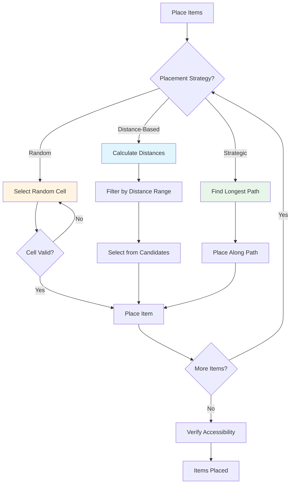

# Procedural Item Placement: Balancing Loot Distribution

Placing items procedurally in roguelike games is more complex than it seems. Items need to be accessible, fairly distributed, and balanced for difficulty. This article explores strategies for procedural item placement that create engaging gameplay without manual level design.

## The Challenge

Procedural item placement must solve several problems:

1. **Accessibility**: Can the player reach the item?
2. **Distribution**: Are items spread fairly across the level?
3. **Balance**: Do items match the difficulty level?
4. **Interest**: Are items placed in interesting locations?
5. **Avoidance**: Don't place items too close to player or each other

## Basic Approaches



This flowchart shows different item placement strategies and when to use each approach.

### Random Placement

The simplest approach is random placement:

```ruby
def place_items_randomly(grid, count)
  count.times do
    cell = grid.random_cell
    while cell.tile != TileType::EMPTY
      cell = grid.random_cell
    end
    place_item(cell)
  end
end
```

**Pros:**
- Very simple
- Fast performance
- Unpredictable

**Cons:**
- Items may be unreachable
- Clustering possible
- No difficulty consideration
- May place at player spawn

### Distance-Based Placement

Place items at specific distances from the player:

```ruby
def place_items_at_distance(grid, player_cell, count, min_distance, max_distance)
  distances = player_cell.distances
  candidates = distances.cells.select do |cell|
    dist = distances[cell]
    dist >= min_distance && dist <= max_distance && cell.tile == TileType::EMPTY
  end

  candidates.sample(count)
end
```

**Pros:**
- Guarantees reachability
- Controls placement distance
- More interesting than random

**Cons:**
- May cluster in distance bands
- Doesn't consider item importance
- Still random within distance range

## Implementation in Vanilla Roguelike

Vanilla Roguelike uses a loot system that generates items when monsters die:

### Loot Generation

```ruby
class LootSystem
  def generate_loot
    loot = { gold: 0, items: [] }

    # 90% chance for gold (1-10 coins)
    if rand < 0.9
      loot[:gold] = rand(1..10)
    end

    # 30% chance for apple
    if rand < 0.3
      loot[:items] << create_apple
    end

    loot
  end

  def create_apple
    apple = Entity.new
    apple.add_component(ItemComponent.new(
      name: "Apple",
      item_type: :food,
      stackable: false
    ))
    apple.add_component(ConsumableComponent.new(
      charges: 1,
      effects: [{ type: :heal, amount: 20 }]
    ))
    apple
  end
end
```

### Item Placement

Items are placed when monsters die:

```ruby
class ItemDropSystem
  def drop_item(entity, item, position)
    item.get_component(:position)&.set_position(position.row, position.column)
    @world.add_entity(item)
    @world.emit_event(:item_dropped, {
      entity_id: entity.id,
      item_id: item.id,
      position: [position.row, position.column]
    })
  end
end
```

## Advanced Strategies

### 1. Strategic Placement

Place important items along the longest path:

```ruby
def place_important_items(grid, player_cell, items)
  # Calculate longest path
  distances = player_cell.distances
  farthest_cell = distances.max&.first
  path_distances = farthest_cell.distances
  path = path_distances.path_to(player_cell)

  # Place items along path
  path_cells = path.cells
  items.each_with_index do |item, index|
    position = path_cells[index * path_cells.length / items.length]
    place_item(position, item)
  end
end
```

This ensures:
- Items are on a guaranteed path
- Items are spread along the exploration route
- Player will discover items naturally

### 2. Difficulty-Based Placement

Scale item quality with difficulty:

```ruby
def generate_loot_for_level(level)
  loot = { gold: 0, items: [] }

  # Gold scales with level
  base_gold = 5 + (level * 2)
  loot[:gold] = rand(base_gold..(base_gold * 2))

  # Better items at higher levels
  if level >= 3 && rand < 0.2
    loot[:items] << create_potion
  end

  if level >= 5 && rand < 0.1
    loot[:items] << create_rare_item
  end

  loot
end
```

### 3. Avoid Clustering

Ensure items are spread out:

```ruby
def place_items_with_spacing(grid, items, min_distance)
  placed = []

  items.each do |item|
    attempts = 0
    cell = nil

    loop do
      cell = grid.random_cell
      break if cell.tile == TileType::EMPTY &&
               placed.all? { |c| distance(cell, c) >= min_distance } &&
               attempts < 100
      attempts += 1
    end

    if cell
      place_item(cell, item)
      placed << cell
    end
  end
end

def distance(cell1, cell2)
  (cell1.row - cell2.row).abs + (cell1.column - cell2.column).abs
end
```

### 4. Accessibility Verification

Always verify items are reachable:

```ruby
def place_item_safely(grid, player_cell, item)
  cell = find_placement_cell(grid, player_cell)

  # Verify accessibility
  distances = player_cell.distances
  unless distances[cell]
    # Item is unreachable, find alternative
    cell = distances.cells.sample
  end

  place_item(cell, item)
end
```

### 5. Weighted Placement

Prefer certain locations:

```ruby
def place_items_weighted(grid, player_cell, items)
  distances = player_cell.distances

  # Calculate weights (prefer medium distance)
  weights = distances.cells.map do |cell|
    dist = distances[cell]
    weight = case dist
    when 0..3 then 0.1      # Too close
    when 4..10 then 1.0     # Good distance
    when 11..20 then 0.5    # Far but okay
    else 0.2                # Very far
    end
    [cell, weight]
  end

  # Select cells based on weights
  items.each do |item|
    cell = weighted_sample(weights)
    place_item(cell, item)
  end
end

def weighted_sample(weights)
  total = weights.sum { |_, w| w }
  roll = rand(total)
  running = 0

  weights.each do |cell, weight|
    running += weight
    return cell if roll <= running
  end

  weights.first[0]  # Fallback
end
```

## Item Types and Placement

Different item types may need different placement strategies:

### Consumables (Potions, Food)

- Place frequently
- Can cluster (multiple potions in one area)
- Lower value, more common

```ruby
def place_consumables(grid, count)
  count.times do
    cell = find_empty_cell(grid)
    place_item(cell, create_consumable)
  end
end
```

### Equipment (Weapons, Armor)

- Place rarely
- Should be spread out
- Higher value, more important

```ruby
def place_equipment(grid, player_cell, count)
  distances = player_cell.distances
  candidates = distances.cells.select do |cell|
    distances[cell] >= 5 && cell.tile == TileType::EMPTY
  end

  candidates.sample(count).each do |cell|
    place_item(cell, create_equipment)
  end
end
```

### Quest Items

- Must be reachable
- Should be on main path
- Guaranteed placement

```ruby
def place_quest_item(grid, player_cell, item)
  distances = player_cell.distances
  farthest_cell = distances.max&.first

  # Place at farthest point (on longest path)
  place_item(farthest_cell, item)
end
```

## Balancing Loot

### Drop Rates

Balance drop rates for fun:

```ruby
class LootSystem
  DROP_RATES = {
    gold: 0.9,           # 90% chance
    consumable: 0.3,      # 30% chance
    equipment: 0.1,      # 10% chance
    rare: 0.05           # 5% chance
  }.freeze

  def generate_loot
    loot = {}

    DROP_RATES.each do |type, rate|
      if rand < rate
        loot[type] = create_item(type)
      end
    end

    loot
  end
end
```

### Level Scaling

Scale loot with level:

```ruby
def generate_loot(level)
  loot = {}

  # Base rates increase with level
  base_rate = 0.3 + (level * 0.1)

  if rand < base_rate
    loot[:items] = create_items_for_level(level)
  end

  loot
end

def create_items_for_level(level)
  case level
  when 1..2
    [create_consumable]
  when 3..5
    [create_consumable, create_common_equipment].sample(1)
  when 6..10
    [create_consumable, create_rare_equipment].sample(1)
  else
    [create_rare_equipment]
  end
end
```

## Testing Item Placement

```ruby
describe "ItemPlacement" do
  it "places items at reachable locations" do
    grid = generate_maze
    player_cell = grid[0, 0]
    items = [create_item, create_item, create_item]

    place_items(grid, player_cell, items)

    distances = player_cell.distances
    items.each do |item|
      item_cell = get_cell(item)
      expect(distances[item_cell]).not_to be_nil
    end
  end

  it "spreads items appropriately" do
    grid = generate_maze
    items = Array.new(10) { create_item }

    place_items_with_spacing(grid, items, min_distance: 3)

    positions = items.map { |i| get_cell(i) }
    positions.combination(2).each do |c1, c2|
      distance = (c1.row - c2.row).abs + (c1.column - c2.column).abs
      expect(distance).to be >= 3
    end
  end
end
```

## Performance Considerations

Item placement can be expensive if done naively:

1. **Cache distance calculations**: If placing many items, calculate distances once
2. **Limit attempts**: Don't try forever to find placement
3. **Batch placement**: Place items in one pass when possible
4. **Early termination**: Stop if no valid locations found

```ruby
def place_items_efficiently(grid, player_cell, items)
  distances = player_cell.distances  # Calculate once
  candidates = distances.cells.select { |c| c.tile == TileType::EMPTY }

  items.each do |item|
    cell = candidates.sample
    place_item(cell, item)
    candidates.delete(cell)  # Avoid placing multiple items in same cell
  end
end
```

## Lessons Learned

From implementing item placement in Vanilla Roguelike:

1. **Accessibility is critical**: Always verify items are reachable
2. **Distance matters**: Medium distance creates better gameplay
3. **Spacing prevents clustering**: Minimum distance between items
4. **Balance through rates**: Drop rates control item frequency
5. **Level scaling**: Items should scale with difficulty
6. **Strategic placement**: Important items on main paths

## Further Reading

- [Ensuring Player Accessibility in Procedurally Generated Levels](./01-ensuring-player-accessibility.md) - Ensuring items are reachable
- [Finding the Longest Path: A Key to Better Level Design](./02-finding-longest-path.md) - Placing items along paths
- [Testing Procedural Generation: How to Test Randomness](./09-testing-procedural-generation.md) - Testing item placement

## Conclusion

Procedural item placement is a balancing act between accessibility, distribution, and gameplay. By using distance-based placement, accessibility verification, spacing constraints, and difficulty scaling, you can create engaging loot distribution that enhances gameplay without manual level design.

The key is to combine multiple strategies: use distance calculations for reachability, spacing for distribution, and weighted placement for interest. With careful implementation, procedural item placement can create levels that feel intentional and well-designed.

