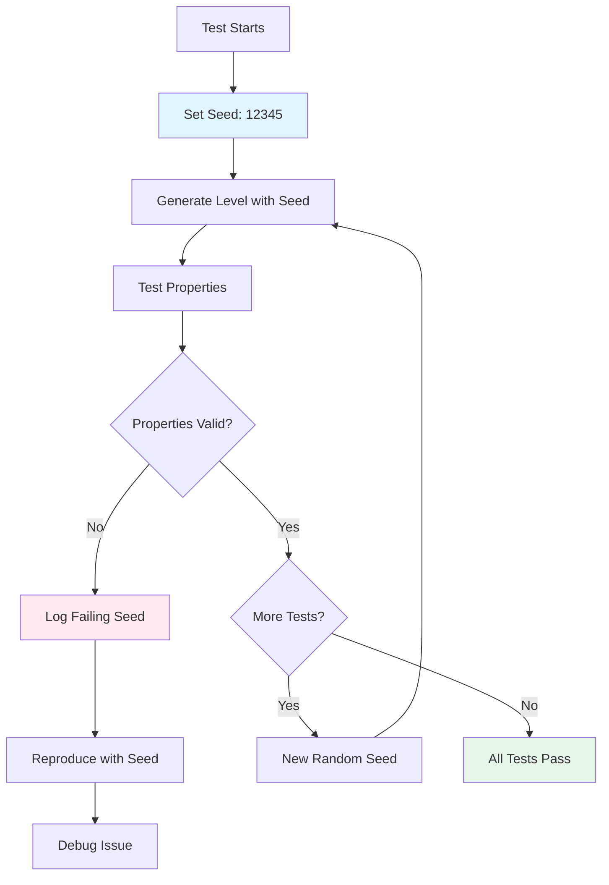

# Testing Procedural Generation: How to Test Randomness

Testing procedural generation is challenging because it's inherently non-deterministic. How do you test code that produces different results every time? This article explores strategies for testing procedural generation systems effectively.

## The Challenge

Procedural generation creates unique content each time:

```ruby
def generate_maze
  grid = Grid.new(10, 10)
  grid.each_cell do |cell|
    if rand < 0.5
      cell.link(cell.north) if cell.north
    else
      cell.link(cell.east) if cell.east
    end
  end
  grid
end
```

Testing this is difficult because:
- **Non-deterministic**: Different results each run
- **Hard to assert**: What's the "correct" output?
- **Edge cases**: Rare bugs are hard to reproduce
- **Property testing**: Need to test properties, not specific outputs

## Solution: Seeding for Determinism



This flowchart shows the testing workflow: using seeds for deterministic testing, verifying properties, and reproducing failures.

The key is using seeds to make generation deterministic:

```ruby
def generate_maze(seed: nil)
  seed ||= Random.new_seed
  srand(seed)  # Set seed before any random operations

  grid = Grid.new(10, 10)
  # ... generation logic using rand ...
  grid
end
```

Now you can test deterministically:

```ruby
describe "MazeGeneration" do
  it "generates the same maze with the same seed" do
    seed = 12345

    srand(seed)
    maze1 = generate_maze

    srand(seed)  # Reset to same seed
    maze2 = generate_maze

    expect(maze1).to eq(maze2)
  end
end
```

## Testing Properties, Not Outputs

Instead of testing specific outputs, test properties:

### Connectivity

All cells should be reachable:

```ruby
it "generates connected mazes" do
  seed = 12345
  srand(seed)

  maze = generate_maze
  start = maze[0, 0]
  distances = start.distances

  # All cells should be reachable
  maze.each_cell do |cell|
    expect(distances[cell]).not_to be_nil, "Cell #{cell} is unreachable"
  end
end
```

### Accessibility

Critical entities should be reachable:

```ruby
it "places stairs at reachable locations" do
  seed = 12345
  srand(seed)

  level = generate_level
  player = level.player
  stairs = level.stairs

  distances = player.position.distances
  expect(distances[stairs.position]).not_to be_nil
end
```

### Distribution

Items should be distributed fairly:

```ruby
it "distributes items across the level" do
  seed = 12345
  srand(seed)

  level = generate_level
  items = level.items

  # Items should not all be in the same area
  positions = items.map { |i| i.position }
  distances = positions.combination(2).map { |p1, p2| distance(p1, p2) }
  average_distance = distances.sum / distances.length

  expect(average_distance).to be > 5  # Minimum spacing
end
```

## Property-Based Testing

Test properties across many seeds:

```ruby
it "always generates connected mazes" do
  100.times do
    seed = Random.new_seed
    srand(seed)

    maze = generate_maze
    expect(maze.connected?).to be true
  end
end
```

This tests that your algorithm has the correct properties regardless of the seed.

### Common Properties to Test

1. **Connectivity**: All cells reachable
2. **Completeness**: All required entities present
3. **Accessibility**: Entities are reachable
4. **Distribution**: Items spread appropriately
5. **Bounds**: Values within expected ranges
6. **Invariants**: Properties that should always hold

## Testing with Fixed Seeds

For specific scenarios, use fixed seeds:

```ruby
describe "MazeGeneration with seed 42" do
  before do
    srand(42)
  end

  it "generates a specific known maze" do
    maze = generate_maze

    # Test specific properties of this known maze
    expect(maze[0, 0].links.count).to eq(1)
    expect(maze[5, 5].links.count).to eq(2)
  end

  it "places stairs at known location" do
    level = generate_level
    stairs = level.stairs

    expect(stairs.position).to eq([9, 9])
  end
end
```

## Testing Edge Cases

### Small Grids

```ruby
it "handles 1x1 grids" do
  srand(12345)
  maze = generate_maze(rows: 1, columns: 1)

  expect(maze[0, 0]).not_to be_nil
  expect(maze[0, 0].links).to be_empty  # No neighbors to link
end
```

### Large Grids

```ruby
it "handles large grids efficiently" do
  srand(12345)
  start_time = Time.now
  maze = generate_maze(rows: 100, columns: 100)
  duration = Time.now - start_time

  expect(duration).to be < 1.0  # Should complete in under 1 second
end
```

### Boundary Conditions

```ruby
it "handles edge cells correctly" do
  srand(12345)
  maze = generate_maze(rows: 5, columns: 5)

  # Top-left corner
  expect(maze[0, 0].north).to be_nil
  expect(maze[0, 0].west).to be_nil

  # Bottom-right corner
  expect(maze[4, 4].south).to be_nil
  expect(maze[4, 4].east).to be_nil
end
```

## Integration Testing

Test the full generation pipeline:

```ruby
describe "LevelGeneration" do
  it "generates complete playable levels" do
    seed = 12345
    srand(seed)

    level = generate_level

    # Level should have all required components
    expect(level.player).not_to be_nil
    expect(level.stairs).not_to be_nil
    expect(level.grid).not_to be_nil

    # Player should be able to reach stairs
    player_cell = level.grid[level.player.position.row, level.player.position.column]
    stairs_cell = level.grid[level.stairs.position.row, level.stairs.position.column]

    distances = player_cell.distances
    expect(distances[stairs_cell]).not_to be_nil
  end
end
```

## Testing Reproducibility

Ensure seeds work correctly:

```ruby
it "reproduces levels with same seed" do
  seed = 12345

  srand(seed)
  level1 = generate_level

  srand(seed)  # Reset seed
  level2 = generate_level

  # Compare critical properties
  expect(level1.player.position).to eq(level2.player.position)
  expect(level1.stairs.position).to eq(level2.stairs.position)
  expect(level1.monsters.count).to eq(level2.monsters.count)
end
```

## Testing Algorithm Correctness

Test that algorithms produce valid mazes:

```ruby
describe "RecursiveBacktracker" do
  it "generates spanning trees" do
    seed = 12345
    srand(seed)

    grid = Grid.new(10, 10)
    RecursiveBacktracker.on(grid)

    # Spanning tree: n cells, n-1 links
    total_cells = grid.rows * grid.columns
    total_links = grid.each_cell.sum { |c| c.links.count } / 2  # Divide by 2 (bidirectional)

    expect(total_links).to eq(total_cells - 1)
  end
end
```

## Testing Performance

Ensure generation is fast enough:

```ruby
it "generates mazes quickly" do
  seed = 12345
  srand(seed)

  start_time = Time.now
  100.times { generate_maze(rows: 20, columns: 20) }
  duration = Time.now - start_time

  average_time = duration / 100
  expect(average_time).to be < 0.1  # Under 100ms per maze
end
```

## Testing Random Distribution

Verify randomness is appropriate:

```ruby
it "distributes items randomly" do
  positions = []
  100.times do
    srand(Random.new_seed)  # Different seed each time
    level = generate_level
    positions << level.stairs.position
  end

  # Positions should vary (not all the same)
  unique_positions = positions.uniq
  expect(unique_positions.count).to be > 10  # At least 10 different positions
end
```

## Debugging Failed Tests

When a property test fails:

1. **Capture the seed**: Log the seed that caused failure
2. **Reproduce**: Use that seed to reproduce the failure
3. **Debug**: Step through generation with that seed
4. **Fix**: Fix the bug
5. **Verify**: Test with the same seed to verify fix

```ruby
it "always generates connected mazes" do
  100.times do |i|
    seed = Random.new_seed
    srand(seed)

    begin
      maze = generate_maze
      expect(maze.connected?).to be true
    rescue RSpec::Expectations::ExpectationNotMetError => e
      puts "Failed with seed: #{seed}"
      raise e
    end
  end
end
```

## Best Practices

1. **Always use seeds**: Make tests deterministic
2. **Test properties**: Not specific outputs
3. **Test many seeds**: Property-based testing
4. **Test edge cases**: Small, large, boundary conditions
5. **Test performance**: Ensure generation is fast
6. **Test reproducibility**: Same seed = same output
7. **Log failing seeds**: For debugging

## Example Test Suite

```ruby
describe "ProceduralGeneration" do
  describe "determinism" do
    it "generates same output with same seed" do
      seed = 12345
      srand(seed)
      output1 = generate_level

      srand(seed)
      output2 = generate_level

      expect(output1).to eq(output2)
    end
  end

  describe "properties" do
    it "always generates connected mazes" do
      100.times do
        srand(Random.new_seed)
        maze = generate_maze
        expect(maze.connected?).to be true
      end
    end

    it "always places stairs at reachable locations" do
      100.times do
        srand(Random.new_seed)
        level = generate_level
        expect(level.stairs_reachable?).to be true
      end
    end
  end

  describe "edge cases" do
    it "handles minimum size grids" do
      srand(12345)
      maze = generate_maze(rows: 1, columns: 1)
      expect(maze).not_to be_nil
    end

    it "handles maximum size grids" do
      srand(12345)
      maze = generate_maze(rows: 100, columns: 100)
      expect(maze.connected?).to be true
    end
  end

  describe "performance" do
    it "generates levels quickly" do
      srand(12345)
      start = Time.now
      generate_level
      duration = Time.now - start

      expect(duration).to be < 0.5
    end
  end
end
```

## Lessons Learned

From testing procedural generation in Vanilla Roguelike:

1. **Seeds are essential**: Without seeds, testing is impossible
2. **Test properties**: Not specific outputs
3. **Many seeds**: Property-based testing catches edge cases
4. **Reproducibility**: Same seed must produce same output
5. **Performance matters**: Generation must be fast
6. **Edge cases**: Test boundaries and extremes

## Further Reading

- [Seeding for Reproducibility: Debugging Procedural Generation](./03-seeding-for-reproducibility.md) - Using seeds effectively
- [Ensuring Player Accessibility in Procedurally Generated Levels](./01-ensuring-player-accessibility.md) - Testing accessibility
- [Event-Driven Architecture for Game Debugging](./06-event-driven-architecture.md) - Using events for testing

## Conclusion

Testing procedural generation requires a different approach than traditional testing. By using seeds for determinism, testing properties instead of outputs, and running property-based tests across many seeds, you can ensure your procedural generation systems are correct, reliable, and performant.

The key is to think about what properties your generation should have (connectivity, accessibility, distribution) and test those properties, not the specific outputs. With careful testing, procedural generation can be as reliable as any other system.

