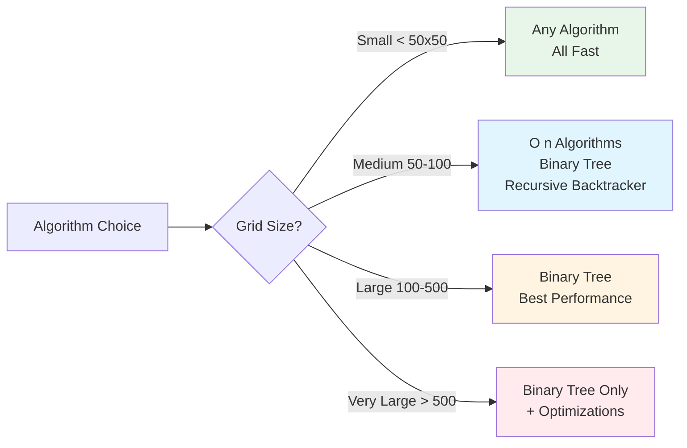
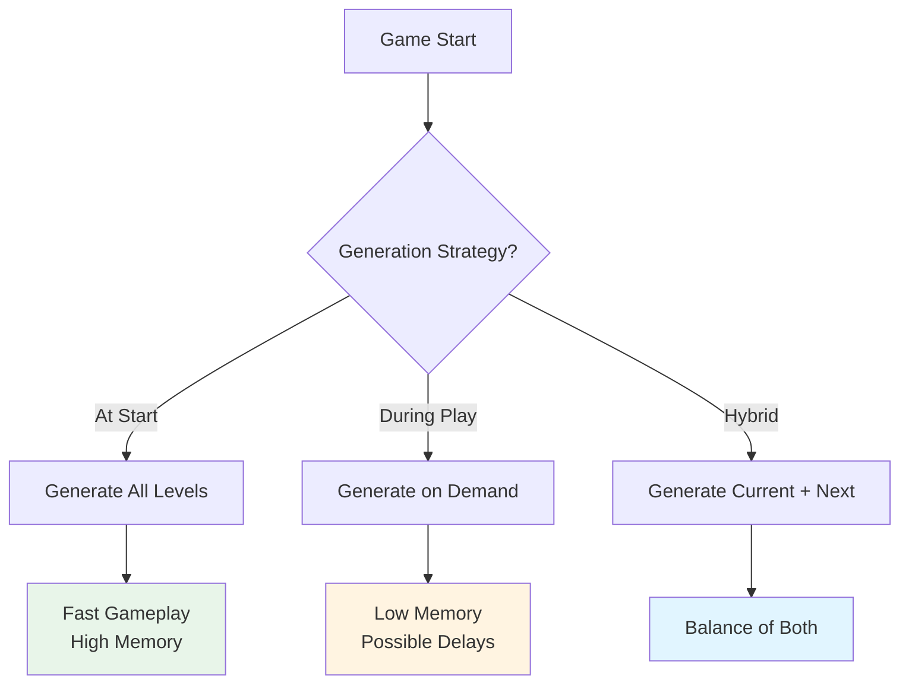

# Optimizing Procedural Generation: When Speed Matters

Procedural generation can be expensive, especially for large grids or when generating during gameplay. This article explores performance considerations and optimization strategies for procedural generation in roguelike games.

## The Performance Challenge

Procedural generation involves:
- **Algorithm execution**: Running maze generation algorithms
- **Distance calculations**: Pathfinding for placement
- **Entity spawning**: Creating and placing entities
- **Validation**: Ensuring accessibility and correctness

For small grids (10x10 = 100 cells), this is fast. For large grids (100x100 = 10,000 cells), it can be slow.

## Algorithm Complexity

Different algorithms have different performance characteristics:

### Time Complexity

- **Binary Tree**: O(n) - Linear time, visits each cell once
- **Recursive Backtracker**: O(n) - Linear time, but uses stack space
- **Recursive Division**: O(n log n) - Slower for large grids
- **Aldous-Broder**: O(n) average, but unpredictable worst case

### Space Complexity

- **Binary Tree**: O(1) - Constant space, no recursion
- **Recursive Backtracker**: O(n) - Stack space for recursion
- **Recursive Division**: O(log n) - Stack space for recursion
- **Aldous-Broder**: O(1) - Constant space

### Performance Comparison



This decision tree helps choose the right algorithm based on grid size and performance requirements.

For a 100x100 grid (10,000 cells):

| Algorithm | Time | Space | Notes |
|-----------|------|-------|-------|
| Binary Tree | ~10ms | O(1) | Fastest, least memory |
| Recursive Backtracker | ~15ms | O(n) | Good balance |
| Recursive Division | ~50ms | O(log n) | Slower for large grids |
| Aldous-Broder | ~100ms+ | O(1) | Unpredictable |

## When to Generate



This flowchart shows different generation timing strategies and their trade-offs.

### At Game Start

Generate levels when the game starts:

```ruby
class Game
  def initialize
    @levels = {}
    generate_levels_ahead_of_time
  end

  def generate_levels_ahead_of_time
    10.times do |level|
      @levels[level] = generate_level(level)
    end
  end
end
```

**Pros:**
- No delay during gameplay
- Can generate multiple levels
- Player doesn't notice generation time

**Cons:**
- Uses memory for all levels
- Can't adapt to player progress
- Slower initial load

### During Gameplay

Generate levels as needed:

```ruby
class Game
  def transition_to_level(level_number)
    @current_level = generate_level(level_number)
  end
end
```

**Pros:**
- Only generates what's needed
- Can adapt to player
- Lower memory usage

**Cons:**
- May cause frame drops
- Player may notice delay
- Must be fast enough

### Hybrid Approach

Generate current + next level:

```ruby
class Game
  def initialize
    @current_level = generate_level(1)
    @next_level = generate_level(2)  # Pre-generate next
  end

  def transition_to_next_level
    @current_level = @next_level
    @next_level = generate_level(@current_level.number + 1)  # Generate next in background
  end
end
```

## Optimization Strategies

### 1. Cache Distance Calculations

Distance calculations are expensive. Cache them:

```ruby
class LevelGenerator
  def initialize
    @distance_cache = {}
  end

  def find_stairs_position(grid, player_cell)
    cache_key = [grid.object_id, player_cell.object_id]

    unless @distance_cache[cache_key]
      @distance_cache[cache_key] = player_cell.distances
    end

    distances = @distance_cache[cache_key]
    farthest_cell = distances.max&.first
    farthest_cell
  end
end
```

### 2. Limit Distance Calculations

Only calculate distances when needed:

```ruby
def place_entities_efficiently(grid, player_cell, entities)
  # Calculate distances once
  distances = player_cell.distances

  entities.each do |entity|
    # Use cached distances
    position = find_position_with_distances(distances, entity)
    place_entity(position, entity)
  end
end
```

### 3. Early Termination

Stop early when possible:

```ruby
def find_farthest_cell(start_cell, max_distance = nil)
  distances = start_cell.distances

  if max_distance
    # Only consider cells within max_distance
    candidates = distances.cells.select { |c| distances[c] <= max_distance }
    candidates.max_by { |c| distances[c] }
  else
    distances.max&.first
  end
end
```

### 4. Batch Operations

Process multiple items in one pass:

```ruby
def place_items_batch(grid, player_cell, items)
  distances = player_cell.distances  # Calculate once
  candidates = distances.cells.select { |c| c.tile == TileType::EMPTY }

  items.each do |item|
    cell = candidates.sample
    place_item(cell, item)
    candidates.delete(cell)  # Avoid duplicates
  end
end
```

### 5. Spatial Partitioning

For very large grids, partition into regions:

```ruby
class SpatialPartition
  def initialize(grid, region_size: 50)
    @grid = grid
    @region_size = region_size
    @regions = partition_grid
  end

  def partition_grid
    regions = {}
    @grid.each_cell do |cell|
      region_key = [cell.row / @region_size, cell.column / @region_size]
      regions[region_key] ||= []
      regions[region_key] << cell
    end
    regions
  end

  def generate_region(region_key)
    cells = @regions[region_key]
    generate_for_cells(cells)  # Only generate this region
  end
end
```

## Algorithm-Specific Optimizations

### Binary Tree

Already optimal - O(n) time, O(1) space. No optimizations needed.

### Recursive Backtracker

Optimize stack usage:

```ruby
class RecursiveBacktracker
  def self.on(grid)
    # Use iterative approach instead of recursion for large grids
    if grid.size > 10000
      iterative_backtracker(grid)
    else
      recursive_backtracker(grid)
    end
  end

  def self.iterative_backtracker(grid)
    stack = [grid.random_cell]
    visited = Set.new

    while stack.any?
      current = stack.last
      visited.add(current)

      unvisited = current.neighbors.reject { |n| visited.include?(n) }
      if unvisited.any?
        next_cell = unvisited.sample
        current.link(next_cell)
        stack << next_cell
      else
        stack.pop
      end
    end
  end
end
```

### Recursive Division

Limit recursion depth:

```ruby
class RecursiveDivision
  def self.on(grid, max_depth: 10)
    divide(grid, 0, 0, grid.rows, grid.columns, max_depth)
  end

  def self.divide(grid, row, col, height, width, depth)
    return if depth >= max_depth  # Limit recursion

    # ... division logic ...
  end
end
```

## Memory Optimization

### Lazy Generation

Generate only visible areas:

```ruby
class Level
  def initialize
    @generated_regions = {}
  end

  def get_cell(row, col)
    region = [row / 50, col / 50]
    generate_region(region) unless @generated_regions[region]
    @grid[row, col]
  end
end
```

### Object Pooling

Reuse objects instead of creating new ones:

```ruby
class EntityPool
  def initialize
    @pool = []
  end

  def get_entity
    @pool.pop || Entity.new
  end

  def return_entity(entity)
    entity.reset
    @pool << entity
  end
end
```

## Profiling and Measurement

### Measure Generation Time

```ruby
def benchmark_generation
  times = []

  100.times do
    start = Time.now
    level = generate_level
    duration = Time.now - start
    times << duration
  end

  average = times.sum / times.length
  puts "Average generation time: #{average * 1000}ms"
  puts "Min: #{times.min * 1000}ms"
  puts "Max: #{times.max * 1000}ms"
end
```

### Identify Bottlenecks

```ruby
require 'benchmark'

def profile_generation
  Benchmark.bm do |x|
    x.report("maze generation:") { generate_maze }
    x.report("distance calc:") { calculate_distances }
    x.report("entity placement:") { place_entities }
    x.report("validation:") { validate_level }
  end
end
```

## Practical Guidelines

### Small Grids (< 50x50)

- Any algorithm is fine
- Generation is fast (< 50ms)
- Choose based on gameplay feel

### Medium Grids (50x50 to 100x100)

- Prefer O(n) algorithms
- Binary Tree or Recursive Backtracker
- Cache distance calculations
- Generate at game start if possible

### Large Grids (100x100 to 500x500)

- Use Binary Tree for speed
- Consider spatial partitioning
- Generate asynchronously
- Cache aggressively

### Very Large Grids (> 500x500)

- Use Binary Tree exclusively
- Implement lazy generation
- Consider streaming generation
- May need different architecture

## Real-World Example

Vanilla Roguelike uses 8x14 grids (112 cells), which is small enough that any algorithm works. However, the principles apply:

```ruby
class MazeSystem
  def generate_maze
    # 8x14 is small, so any algorithm is fast
    # But we still optimize by:
    # 1. Using Recursive Backtracker (good balance)
    # 2. Caching distance calculations
    # 3. Generating at level transition (not during gameplay)

    grid = Grid.new(8, 14)
    @algorithm.on(grid)  # Fast enough for real-time
    grid
  end
end
```

## When to Optimize

Don't optimize prematurely:

1. **Measure first**: Profile to find bottlenecks
2. **Optimize bottlenecks**: Focus on slow parts
3. **Test impact**: Ensure optimizations help
4. **Maintain readability**: Don't sacrifice clarity

## Lessons Learned

From optimizing procedural generation:

1. **Algorithm choice matters**: O(n) vs O(n log n) makes a difference
2. **Cache distance calculations**: They're expensive
3. **Generate at the right time**: Start vs. gameplay trade-offs
4. **Measure before optimizing**: Profile to find real bottlenecks
5. **Small grids are fast**: Don't over-optimize small cases

## Further Reading

- [Implementing Dijkstra's Algorithm for Game Pathfinding](./04-implementing-dijkstra.md) - Pathfinding performance
- [Finding the Longest Path: A Key to Better Level Design](./02-finding-longest-path.md) - Longest path performance
- [Testing Procedural Generation: How to Test Randomness](./09-testing-procedural-generation.md) - Testing performance

## Conclusion

Optimizing procedural generation requires understanding algorithm complexity, choosing the right generation timing, and applying targeted optimizations like caching and batching. For most roguelikes, O(n) algorithms like Binary Tree or Recursive Backtracker are fast enough, but for large grids or real-time generation, careful optimization is essential.

The key is to measure first, optimize bottlenecks, and choose algorithms and strategies appropriate for your grid size and performance requirements. With careful optimization, procedural generation can be fast enough for real-time gameplay even on large grids.

