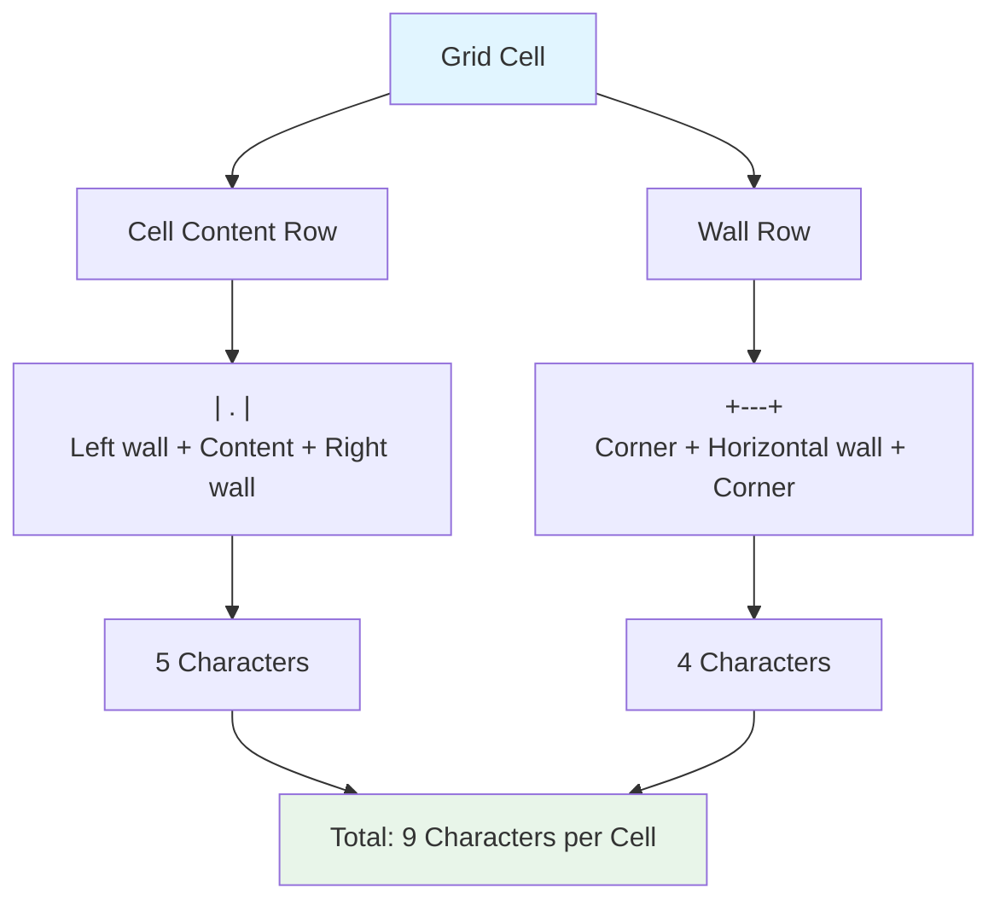

# Terminal Rendering: The 9-Character Cell Solution

When building a roguelike game for the terminal, one of the first challenges we encountered was how to represent grid cells visually. Each cell needed to show its content (player, monster, item, or empty space) while also displaying walls between cells. This article shares what we learned about terminal rendering and the approach that worked for us.

## The Challenge

In a grid-based roguelike, we need to display:
- **Cell content**: What's in each cell (player `@`, stairs `%`, monster `M`, or empty `.`)
- **Walls**: Visual boundaries between cells
- **Readability**: The grid should be easy to read and understand

The terminal is just text—we can't draw arbitrary shapes. We need to use ASCII characters to represent everything.

## Early Attempts

Initially, we tried simpler approaches:

1. **Single character per cell**: Each cell = one character. But where do walls go?
2. **Separate wall characters**: Use `#` for walls, `.` for floors. But this doesn't show connections clearly.
3. **Unicode box-drawing**: Use box-drawing characters. But terminal compatibility becomes an issue.

None of these felt right. We needed something that clearly showed both cell content and wall connections.

## The Solution We Discovered

After experimenting, we settled on an approach where each logical grid cell is rendered using 9 terminal characters. Here's how it works:



This diagram shows how each grid cell is broken down into its visual components.

### Cell Structure

Each cell is rendered as:
```
| . |
+---+
```

Breaking it down:
- **Cell content row**: `| . |` - Left wall, content (3 chars: space + tile + space), right wall
- **Wall row**: `+---+` - Corner, horizontal wall (3 dashes), corner

### The 9 Characters

For each cell, we use:
1. Left border: `|`
2. Space before content: ` `
3. Cell content: `.` (or `@`, `%`, `M`, etc.)
4. Space after content: ` `
5. Right border/wall: `|` or ` ` (if linked east)
6. Corner: `+`
7. Horizontal wall: `---` or `   ` (if linked south)
8. Corner: `+`

That's 9 characters total per cell when you include the walls.

### Visual Movement Effect

An interesting side effect of this rendering approach: when the player moves one grid cell, they appear to move 2 visual spaces in the terminal. This is because:
- One grid cell = `| . |` (5 characters including walls)
- Moving to the next cell = moving past the wall separator
- Visually, this creates a 2-space movement effect

Players noticed this and commented on it—it's a natural consequence of the rendering format.

## Implementation

Here's how we implemented this in the terminal renderer:

```ruby
def draw_grid(grid, algorithm)
  # Draw the top border
  top_border = "+"
  grid.columns.times { top_border += "---+" }
  output << top_border

  # For each row, draw cells and walls below them
  grid.rows.times do |row|
    row_cells = "|"  # Start with left border
    row_walls = "+"  # Start with corner
    
    grid.columns.times do |col|
      cell = grid[row, col]
      
      # Cell content: tile (or '.' if empty), padded with spaces
      row_cells += " #{cell.tile || '.'} "
      
      # East wall: space if linked (open), | if not (wall)
      row_cells += col == grid.columns - 1 ? "|" : 
                   (cell.linked?(cell.east) ? " " : "|")
      
      # South wall: spaces if linked (open path), --- if not (wall)
      row_walls += cell.linked?(cell.south) ? "   +" : "---+"
    end
    
    output << row_cells  # e.g., "| . | @ |"
    output << row_walls  # e.g., "+---+   +"
  end
end
```

### How It Works

1. **Top border**: Draw `+---+---+...` based on column count
2. **For each row**:
   - **Cell row**: Start with `|`, then for each cell:
     - Add ` #{tile} ` (content with padding)
     - Add `|` if wall to east, or ` ` if linked
   - **Wall row**: Start with `+`, then for each cell:
     - Add `---+` if wall to south, or `   +` if linked

### Example Output

For a 2x2 grid with connections:

```
+---+---+
| . | @ |
+   +---+
| % | . |
+---+---+
```

This shows:
- Top-left: Empty cell, connected east (no wall)
- Top-right: Player `@`, wall to south
- Bottom-left: Stairs `%`, wall to east
- Bottom-right: Empty cell

## Why This Approach Works

### Clarity

The walls are always visible, making it easy to see:
- Which cells are connected (no wall = open path)
- Which cells are separated (wall = blocked)
- The overall maze structure

### Consistency

Every cell follows the same format:
- Same width (3 characters for content)
- Same structure (walls on all sides)
- Predictable layout

### Terminal-Friendly

- Uses standard ASCII characters (`|`, `+`, `-`, spaces)
- Works in any terminal
- No special fonts or Unicode required

## Trade-offs

### Pros

- **Clear visualization**: Walls and connections are obvious
- **Readable**: Easy to see cell contents
- **Consistent**: Every cell follows the same pattern
- **Compatible**: Works in any terminal

### Cons

- **Terminal space**: Uses more horizontal space than single-character cells
- **Fixed width**: All cells are the same width (can't vary)
- **Movement appearance**: The 2-space visual movement might confuse some players initially

## What We Learned

1. **Terminal rendering requires creativity**: We can't just draw pixels, so we need to think about how to represent concepts with text.

2. **Consistency matters**: Having every cell follow the same format makes the code simpler and the output more predictable.

3. **Side effects can be features**: The 2-space visual movement was unintentional but players found it interesting—sometimes unexpected behaviors become features.

4. **Start simple, iterate**: We tried several approaches before settling on this one. Don't be afraid to experiment.

5. **Readability over cleverness**: A clear, readable grid is more important than a clever rendering trick.

## Further Reading

- [The Rendering Pipeline: From Game State to Terminal](./12-rendering-pipeline.md) - How rendering fits into the larger system
- [Ensuring Player Accessibility in Procedurally Generated Levels](./01-ensuring-player-accessibility.md) - How we ensure the rendered levels are playable

## Conclusion

Terminal rendering for roguelikes requires thinking differently about how to represent a grid. The 9-character cell approach we discovered provides clear visualization of both cell content and wall connections. While it uses more terminal space than simpler approaches, the clarity and consistency make it worth it.

The key lesson: don't be afraid to experiment with different rendering approaches until you find one that works for your game. What matters is that players can understand the game state, not that you use the fewest characters possible.

