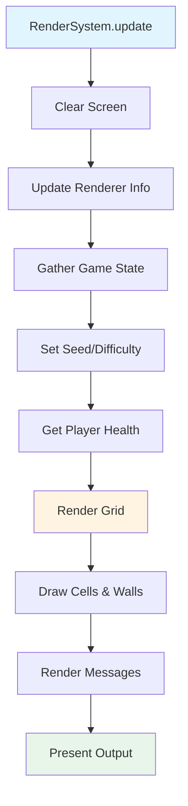

# The Rendering Pipeline: From Game State to Terminal

Rendering a game to the terminal involves more than just drawing characters. We need to transform game state (entities, positions, health) into visual output in a structured way. This article explores what we learned about building a rendering pipeline that's both flexible and maintainable.

## The Problem

When we started, rendering was scattered throughout the code:
- Game state was mixed with display logic
- Hard to change rendering approaches
- Difficult to test rendering independently
- No clear separation between "what to render" and "how to render"

We needed a better approach.

## The Solution: A Rendering Pipeline

We discovered that a clear pipeline helps organize rendering:

1. **Clear**: Prepare for new frame
2. **Update Info**: Gather current game state
3. **Draw Grid**: Render the game world
4. **Draw Messages**: Render UI elements
5. **Present**: Display the final output

This pipeline separates concerns and makes the code easier to understand and modify.

## The Rendering System

The `RenderSystem` coordinates the rendering pipeline:

```ruby
class RenderSystem < System
  def initialize(world, difficulty, seed)
    super(world)
    @renderer = Vanilla::Renderers::TerminalRenderer.new
    @difficulty = difficulty
    @seed = seed
  end

  def update(_delta_time)
    @renderer.clear
    update_renderer_info
    render_grid
    render_messages
    @renderer.present
  end
end
```

Each step has a specific responsibility.

### Step 1: Clear

Clear the screen to prepare for a new frame:

```ruby
def clear
  system("clear")  # Clear terminal screen
end
```

This ensures we're starting with a clean slate each frame.

### Step 2: Update Renderer Info

Gather current game state that affects rendering:

```ruby
def update_renderer_info
  # Get current difficulty from level
  current_difficulty = @world.current_level&.difficulty || @difficulty

  # Set game info (seed and difficulty)
  @renderer.set_game_info(seed: @seed, difficulty: current_difficulty)

  # Get player health
  player = @world.get_entity_by_name('Player')
  if player
    health_component = player.get_component(:health)
    if health_component
      @renderer.set_player_health(
        current: health_component.current_health,
        max: health_component.max_health
      )
    end
  end
end
```

This step collects dynamic information that changes during gameplay.

### Step 3: Render Grid

Draw the game world:

```ruby
def render_grid
  grid = @world.current_level&.grid
  algorithm_name = @world.current_level&.algorithm&.demodulize || "Unknown"
  @renderer.draw_grid(grid, algorithm_name)
end
```

This delegates to the renderer to actually draw the grid.

### Step 4: Render Messages

Draw UI elements like messages:

```ruby
def render_messages
  message_system = Vanilla::ServiceRegistry.get(:message_system)
  message_system&.render(self)
end
```

Messages are handled separately because they have different rendering needs.

### Step 5: Present

Display the final output:

```ruby
def present
  # For terminal rendering, output is already printed in draw_grid
  # This method exists for future graphical renderers
end
```

For terminal rendering, output happens during `draw_grid`, but having a `present` step allows for future buffer-based rendering.

## Buffer-Based Rendering Explained

Buffer-based rendering is a technique where you build the entire frame in memory before displaying it. Instead of printing characters immediately as you draw them, you accumulate everything in a buffer (like a string or 2D array) and then display it all at once.

### Why Use Buffers?

**Current Approach (Immediate Rendering)**:
```ruby
def draw_grid(grid, algorithm)
  # Print immediately as we build
  print "| . | @ |\n"  # Printed right away
  print "+---+   +\n"  # Printed right away
end
```

**Buffer-Based Approach**:
```ruby
def draw_grid(grid, algorithm)
  @buffer = []  # Build in memory first
  @buffer << "| . | @ |"
  @buffer << "+---+   +"
  # Nothing printed yet - all in buffer
end

def present
  # Display entire buffer at once
  print @buffer.join("\n")
end
```

### Benefits of Buffer-Based Rendering

1. **Atomic Updates**: The entire frame appears at once, preventing flickering or partial frames
2. **Performance**: Can optimize the buffer before displaying (e.g., minimize redraws)
3. **Flexibility**: Can modify the buffer before presenting (e.g., add overlays, effects)
4. **Testing**: Can inspect the buffer without actually displaying it

### Example: Terminal Buffer Renderer

Here's how a buffer-based terminal renderer might work:

```ruby
class BufferedTerminalRenderer < Renderer
  def initialize
    @buffer = []
    @width = 80
    @height = 24
  end

  def clear
    @buffer = Array.new(@height) { " " * @width }
  end

  def draw_grid(grid, algorithm)
    # Build grid in buffer instead of printing
    row = 0
    grid.rows.times do |grid_row|
      # Draw cell row
      line = "|"
      grid.columns.times do |col|
        cell = grid[grid_row, col]
        line += " #{cell.tile || '.'} "
        line += cell.linked?(cell.east) ? " " : "|"
      end
      @buffer[row] = line
      row += 1

      # Draw wall row
      line = "+"
      grid.columns.times do |col|
        cell = grid[grid_row, col]
        line += cell.linked?(cell.south) ? "   +" : "---+"
      end
      @buffer[row] = line
      row += 1
    end
  end

  def present
    # Clear screen and display entire buffer at once
    system("clear")
    print @buffer.join("\n")
    @buffer.clear
  end
end
```

### Example: Graphical Buffer Renderer

For a graphical renderer (like SDL or similar), buffers are even more important:

```ruby
class GraphicalRenderer < Renderer
  def initialize
    @buffer = Array.new(24) { Array.new(80) }  # 2D buffer
    @screen = initialize_graphics
  end

  def clear
    @buffer.each { |row| row.fill(nil) }
  end

  def draw_grid(grid, algorithm)
    # Draw to buffer (in memory)
    grid.rows.times do |row|
      grid.columns.times do |col|
        cell = grid[row, col]
        @buffer[row * 2][col * 4] = cell.tile  # Map to buffer coordinates
      end
    end
  end

  def present
    # Copy entire buffer to screen at once
    @buffer.each_with_index do |row, y|
      row.each_with_index do |char, x|
        @screen.draw_char(x, y, char) if char
      end
    end
    @screen.flip  # Display the frame
  end
end
```

### Double Buffering

Double buffering uses two buffers to prevent flickering:

```ruby
class DoubleBufferedRenderer < Renderer
  def initialize
    @front_buffer = []  # Currently displayed
    @back_buffer = []   # Being drawn to
  end

  def clear
    @back_buffer = []  # Clear back buffer
  end

  def draw_grid(grid, algorithm)
    # Draw to back buffer
    @back_buffer << "| . | @ |"
    @back_buffer << "+---+   +"
  end

  def present
    # Swap buffers: back becomes front
    @front_buffer, @back_buffer = @back_buffer, @front_buffer

    # Display front buffer
    system("clear")
    print @front_buffer.join("\n")
  end
end
```

This ensures the screen always shows a complete frame, never a partially drawn one.

### When to Use Buffers

**Use immediate rendering when**:
- Simple terminal output
- Performance isn't critical
- Flickering isn't noticeable

**Use buffer-based rendering when**:
- You need atomic frame updates
- You want to optimize before displaying
- You're building a graphical renderer
- You need to test rendering without displaying

### Our Current Implementation

Currently, we use immediate rendering because it's simpler for terminal output:

```ruby
def draw_grid(grid, algorithm)
  output = []
  # ... build output array ...
  print output.join("\n") + "\n"  # Print immediately
end

def present
  # Empty - output already printed
end
```

But the `present` method exists so we can switch to buffer-based rendering later without changing the `RenderSystem`:

```ruby
def draw_grid(grid, algorithm)
  @buffer = []
  # ... build buffer ...
  # Don't print yet
end

def present
  system("clear")
  print @buffer.join("\n")  # Print entire buffer
end
```

This is why having a `present` step is valuable—it enables this optimization without changing the system architecture.

## Renderer Abstraction

We learned that separating "what to render" from "how to render" is valuable. The `Renderer` base class defines the interface:

```ruby
class Renderer
  def clear
    raise NotImplementedError
  end

  def draw_grid(grid)
    raise NotImplementedError
  end

  def present
    raise NotImplementedError
  end
end
```

Then `TerminalRenderer` implements it:

```ruby
class TerminalRenderer < Renderer
  def clear
    system("clear")
  end

  def draw_grid(grid, algorithm)
    # Terminal-specific rendering
  end

  def present
    # Terminal doesn't need buffering
  end
end
```

This abstraction means we could add a graphical renderer later without changing the `RenderSystem`.

## The Pipeline Flow



This flowchart shows how data flows through the pipeline: from game state to visual output.

## Why This Structure Works

### Separation of Concerns

Each step has one job:
- **Clear**: Reset display
- **Update Info**: Gather state
- **Render Grid**: Draw world
- **Render Messages**: Draw UI
- **Present**: Finalize output

### Testability

We can test each step independently:
- Test info gathering without rendering
- Test grid rendering without messages
- Mock the renderer to test the system

### Extensibility

Adding new rendering features is straightforward:
- New info? Add to `update_renderer_info`
- New UI element? Add a render step
- New renderer type? Implement the interface

## What We Learned

1. **Pipeline structure helps**: Having clear steps makes the code easier to understand and modify.

2. **Separate concerns**: Rendering system coordinates, renderer implements. This separation is valuable.

3. **Gather state early**: Collecting all needed information before rendering prevents inconsistencies.

4. **Abstraction enables flexibility**: The renderer interface allows swapping implementations without changing the system.

5. **Present step is important**: Even if it does nothing now, having a `present` step enables future optimizations like double buffering.

## Common Pitfalls

### Rendering During State Updates

Don't render while game state is changing:

```ruby
# Bad: Rendering during update
def update
  move_entity
  render  # State might be inconsistent
end

# Good: Render after all updates
def update
  move_entity
end

def game_loop
  update
  render  # State is consistent
end
```

### Forgetting to Clear

Always clear before rendering:

```ruby
# Bad: Old frame remains visible
def render
  draw_grid
end

# Good: Clear first
def render
  clear
  draw_grid
end
```

### Mixing Logic and Rendering

Keep rendering separate from game logic:

```ruby
# Bad: Logic in renderer
def draw_grid
  if player.health < 10
    draw_red_background  # Logic in renderer
  end
end

# Good: Logic in system, renderer just draws
def update_renderer_info
  @renderer.set_health_warning(player.health < 10)
end
```

## Further Reading

- [Terminal Rendering: The 9-Character Cell Solution](./11-terminal-rendering.md) - How individual cells are rendered
- [The Game Loop: Turn-Based Architecture in Action](./13-game-loop.md) - How rendering fits into the game loop

## Conclusion

Building a rendering pipeline helped us organize rendering code and separate concerns. The clear-draw-present pattern provides structure while the renderer abstraction enables flexibility. The key lesson: structure your rendering code early—it makes everything else easier.

By following a clear pipeline, we can add new rendering features without breaking existing code, and we can swap rendering implementations as needed. This structure has served us well as the game has grown.

