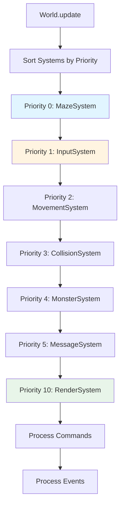

# System Priority: Why Order Matters in ECS

In Entity-Component-System architecture, systems need to run in a specific order. Input must be processed before movement, movement before collision, collision before rendering. This article explores what we learned about system priorities and why getting the order right matters.

## The Problem

When we first implemented systems, we didn't think about execution order. We just ran them:

```ruby
# Early attempt: No ordering
def update
  @systems.each { |system| system.update }
end
```

This caused subtle bugs:
- Rendering happened before movement completed
- Collisions were detected before entities moved
- Input was processed after everything else

We needed a way to control execution order.

## The Solution: Priority-Based Ordering

We discovered that assigning priorities to systems solves the ordering problem:

```ruby
def add_system(system, priority = 0)
  @systems << [system, priority]
  @systems.sort_by! { |_system, system_priority| system_priority }
  system
end
```

Lower priority numbers run first. Systems are sorted by priority before each update.

## Our Priority Scheme

Here's the priority order we use:

```ruby
@world.add_system(MazeSystem.new(@world), 0)        # Generate maze first
@world.add_system(InputSystem.new(@world), 1)       # Process input early
@world.add_system(MovementSystem.new(@world), 2)    # Move entities
@world.add_system(CollisionSystem.new(@world), 3)   # Check collisions
@world.add_system(MonsterSystem.new(@world), 4)    # Update monsters
@world.add_system(MessageSystem.new(@world), 5)    # Process messages
@world.add_system(RenderSystem.new(@world), 10)    # Render last
```

### Why This Order?

**Priority 0: MazeSystem**
- Must run first to generate the initial level
- Creates the grid that other systems depend on

**Priority 1: InputSystem**
- Processes player input early
- Queues commands for later execution

**Priority 2: MovementSystem**
- Moves entities based on input
- Must run after input is processed

**Priority 3: CollisionSystem**
- Detects collisions after movement
- Must run after entities have moved

**Priority 4: MonsterSystem**
- Updates monster AI
- Runs after player movement

**Priority 5: MessageSystem**
- Processes message queue
- Updates UI state

**Priority 10: RenderSystem**
- Renders the final state
- Must run last to show consistent state

## The Update Flow



This flowchart shows how systems execute in priority order, ensuring each system runs at the right time.

## Why Order Matters

### Example: Movement Before Collision

If collision runs before movement:

```ruby
# Wrong order: Collision before movement
CollisionSystem.update  # Checks old positions
MovementSystem.update   # Moves entities
# Collision missed the movement!
```

With correct order:

```ruby
# Correct order: Movement before collision
MovementSystem.update   # Moves entities
CollisionSystem.update  # Checks new positions
# Collision detects correctly!
```

### Example: Input Before Movement

Input must be processed before movement:

```ruby
# Wrong order: Movement before input
MovementSystem.update   # No input to process
InputSystem.update      # Input processed too late
```

With correct order:

```ruby
# Correct order: Input before movement
InputSystem.update      # Process input, queue commands
MovementSystem.update   # Execute movement commands
```

### Example: Rendering Last

Rendering must happen after all updates:

```ruby
# Wrong order: Render before updates
RenderSystem.update     # Shows old state
MovementSystem.update   # State changes after render
```

With correct order:

```ruby
# Correct order: Render after updates
MovementSystem.update   # Update state
CollisionSystem.update  # Update state
RenderSystem.update     # Show final state
```

## Debugging Priority Issues

When systems run in the wrong order, bugs can be subtle:

### Symptom: Entities Not Moving

**Possible cause**: MovementSystem running before InputSystem

**Fix**: Ensure InputSystem has lower priority than MovementSystem

### Symptom: Collisions Not Detected

**Possible cause**: CollisionSystem running before MovementSystem

**Fix**: Ensure MovementSystem has lower priority than CollisionSystem

### Symptom: Rendering Shows Old State

**Possible cause**: RenderSystem running before other systems

**Fix**: Ensure RenderSystem has highest priority (runs last)

## What We Learned

1. **Priority matters**: Systems must run in the correct order. Getting it wrong causes subtle bugs.

2. **Lower numbers first**: Using lower numbers for earlier systems makes priorities intuitive.

3. **Gaps help**: Using gaps (0, 1, 2, 3, 4, 5, 10) allows inserting new systems without renumbering.

4. **Document priorities**: Document why each system has its priority. Future you will thank you.

5. **Test order changes**: When adding new systems, test that the order is correct.

## Best Practices

### Use Meaningful Gaps

Don't use consecutive numbers:

```ruby
# Bad: No room for new systems
add_system(A, 1)
add_system(B, 2)
add_system(C, 3)

# Good: Gaps allow insertion
add_system(A, 0)
add_system(B, 5)
add_system(C, 10)
```

### Document Dependencies

Comment why systems have their priorities:

```ruby
# Priority 0: Must run first to generate level
add_system(MazeSystem.new, 0)

# Priority 2: Must run after InputSystem (1) to process movement commands
add_system(MovementSystem.new, 2)

# Priority 10: Must run last to render final state
add_system(RenderSystem.new, 10)
```

### Group Related Systems

Systems that can run in any order can share priorities:

```ruby
# These can run in any order relative to each other
add_system(CollisionSystem.new, 3)
add_system(CombatSystem.new, 3)
add_system(LootSystem.new, 3)
```

## Further Reading

- [The Game Loop: Turn-Based Architecture in Action](./13-game-loop.md) - How priorities fit into the game loop
- [The World Coordinator: Managing ECS Complexity](./15-world-coordinator.md) - How World manages system priorities

## Conclusion

System priority is crucial for ECS architecture. Getting the order right prevents subtle bugs and ensures systems run when they need to. The key is understanding dependencies between systems and assigning priorities accordingly.

By using a priority-based system with meaningful gaps, we've found it easier to add new systems and maintain correct execution order. The structure has helped us avoid many ordering-related bugs.

