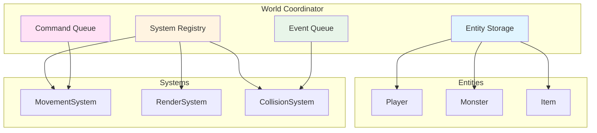

# The World Coordinator: Managing ECS Complexity

The World class in an Entity-Component-System architecture doesn't contain game logic—it coordinates everything. It manages entities, systems, commands, and events without knowing what any of them do. This article shares what we learned about building a coordinator that enables flexibility without becoming a god object.

## The Challenge

When we started building the ECS architecture, we weren't sure what the World class should do. Should it contain game logic? Should it know about specific systems? How should it manage entities?

We learned that World should be a coordinator, not a logic container.

## What World Does

The World class coordinates four main things:

1. **Entities**: Storage and lookup
2. **Systems**: Registration and execution
3. **Commands**: Queuing and processing
4. **Events**: Queuing and subscription

It doesn't contain game logic—it just coordinates.

## Entity Management

World stores entities and provides lookup methods:

```ruby
class World
  def initialize
    @entities = {}  # Hash of entity_id => Entity
  end

  def add_entity(entity)
    @entities[entity.id] = entity
    entity
  end

  def remove_entity(entity_id)
    @entities.delete(entity_id)
  end

  def get_entity(entity_id)
    @entities[entity_id]
  end

  def get_entity_by_name(name)
    @entities.values.find { |e| e.name == name }
  end

  def query_entities(component_types)
    return @entities.values if component_types.empty?
    @entities.values.select do |entity|
      component_types.all? { |type| entity.has_component?(type) }
    end
  end
end
```

World doesn't know what entities are—it just stores and retrieves them.

## System Management

World registers systems and runs them in priority order:

```ruby
def add_system(system, priority = 0)
  @systems << [system, priority]
  @systems.sort_by! { |_system, system_priority| system_priority }
  system
end

def update(_unused)
  @systems.each do |system, _|
    system.update(nil)
  end
  process_commands
  process_events
end
```

World doesn't know what systems do—it just runs them in order.

## Command Management

World queues and processes commands:

```ruby
def queue_command(command_type, params = {})
  @command_queue << [command_type, params]
end

def process_commands
  until @command_queue.empty?
    command, params = @command_queue.shift
    if command.is_a?(Vanilla::Commands::Command)
      command.execute(self)
    else
      handle_command(command, params)
    end
  end
end
```

World doesn't know what commands do—it just executes them.

## Event Management

World queues events and manages subscriptions:

```ruby
def emit_event(event_type, data = {})
  @event_queue << [event_type, data]
end

def subscribe(event_type, subscriber)
  @event_subscribers[event_type] << subscriber
end

def process_events
  until @event_queue.empty?
    event_type, data = @event_queue.shift
    event_manager.publish_event(event_type, self, data)
    @event_subscribers[event_type].each do |subscriber|
      subscriber.handle_event(event_type, data)
    end
  end
end
```

World doesn't know what events mean—it just routes them to subscribers.

## The Coordinator Pattern



This diagram shows how World coordinates without containing logic: it stores entities, registers systems, and routes commands and events.

## Why This Design Works

### Separation of Concerns

World coordinates, systems execute:
- World doesn't know about movement logic
- MovementSystem doesn't know about other systems
- They communicate through World

### Flexibility

Adding new systems is easy:
- Create the system
- Register it with World
- World handles the rest

### Testability

World can be tested independently:
- Test entity storage
- Test system registration
- Test command/event routing
- No game logic to test

## What We Learned

1. **World is a coordinator**: It doesn't contain game logic—it just coordinates. This separation is valuable.

2. **Storage, not logic**: World stores entities and routes commands/events. Systems contain the logic.

3. **Query methods help**: Methods like `query_entities` let systems find what they need without World knowing why.

4. **Queues enable decoupling**: Commands and events are queued, allowing systems to communicate without direct dependencies.

5. **Keep it simple**: World should be simple. If it's getting complex, logic probably belongs in systems.

## Common Pitfalls

### Putting Logic in World

Don't put game logic in World:

```ruby
# Bad: Logic in World
def update
  @entities.each do |entity|
    if entity.has_component?(:position) && entity.has_component?(:movement)
      move_entity(entity)  # Logic in World
    end
  end
end

# Good: Logic in Systems
def update
  @systems.each { |system| system.update }
end
```

### World Knowing About Specific Systems

Don't make World know about specific systems:

```ruby
# Bad: World knows about MovementSystem
def update
  @movement_system.update
  @render_system.update
end

# Good: World just runs systems
def update
  @systems.each { |system| system.update }
end
```

### Direct Entity Manipulation

Don't manipulate entities directly in World:

```ruby
# Bad: World manipulates entities
def update
  @entities.each { |e| e.position.row += 1 }
end

# Good: Systems manipulate entities
def update
  @systems.each { |system| system.update }
end
```

## Further Reading

- [System Priority: Why Order Matters in ECS](./14-system-priority.md) - How World manages system execution
- [The Game Loop: Turn-Based Architecture in Action](./13-game-loop.md) - How World fits into the game loop
- [Component Design: Data Containers in ECS](./19-component-design.md) - How World queries entities by components

## Conclusion

The World class is the coordinator of ECS architecture. It doesn't contain game logic—it just coordinates entities, systems, commands, and events. This separation enables flexibility and makes the code easier to understand and test.

By keeping World simple and focused on coordination, we've found it easier to add new systems and features. The structure has held up well as the game has grown.


