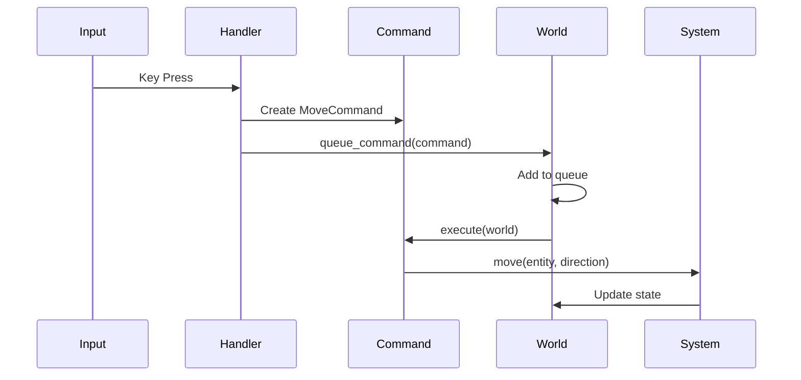

# The Command Pattern: Encapsulating User Actions

When building the input system, we needed a way to represent user actions that could be queued, logged, and potentially undone. The Command pattern provided a solution. This article explores what we learned about using commands to encapsulate user actions.

## The Problem

Initially, input directly called methods:

```ruby
# Early approach: Direct method calls
def handle_input(key)
  case key
  when 'k'
    @player.move(:north)  # Direct call
  when 'j'
    @player.move(:south)
  end
end
```

This approach had problems:
- Can't queue actions
- Can't log actions easily
- Can't undo actions
- Hard to test

We needed a better way to represent actions.

## The Solution: Command Objects

Commands encapsulate actions as objects:

```ruby
class Command
  attr_reader :executed

  def initialize
    @executed = false
  end

  def execute(world)
    raise NotImplementedError
  end
end
```

Each command represents one action and can be executed later.

## MoveCommand Example

Here's how we implemented movement as a command:

```ruby
class MoveCommand < Command
  VALID_DIRECTIONS = [:north, :south, :east, :west].freeze

  attr_reader :entity, :direction

  def initialize(entity, direction)
    raise InvalidDirectionError unless VALID_DIRECTIONS.include?(direction)
    @entity = entity
    @direction = direction
  end

  def execute(world)
    return if @executed

    movement_system = world.systems.find { |s, _| s.is_a?(MovementSystem) }&.first
    return unless movement_system

    movement_system.move(@entity, @direction)
    
    # Check for stairs
    if at_stairs?(@entity, world)
      world.queue_command(ChangeLevelCommand.new(world.current_level.difficulty + 1, @entity))
    end
    
    @executed = true
  end
end
```

The command encapsulates:
- **What**: Move entity in direction
- **Who**: The entity to move
- **When**: Execute when processed

## Command Flow



This sequence shows how commands flow from input through execution.

## Benefits We Discovered

### Queuing

Commands can be queued for later execution:

```ruby
def handle_input(key)
  command = create_command(key)
  @world.queue_command(command)  # Queue for later
end

def process_commands
  until @command_queue.empty?
    command = @command_queue.shift
    command.execute(@world)  # Execute when ready
  end
end
```

This allows batching commands or executing them at the right time.

### Logging

Commands can be logged easily:

```ruby
def execute(world)
  @logger.info("Executing #{self.class} for entity #{@entity.id}")
  # ... execute ...
  @logger.info("Command executed successfully")
end
```

Every action is logged, making debugging easier.

### Undo/Redo Potential

Commands can store state for undo:

```ruby
class MoveCommand < Command
  def initialize(entity, direction)
    @entity = entity
    @direction = direction
    @old_position = entity.position  # Store for undo
  end

  def execute(world)
    movement_system.move(@entity, @direction)
  end

  def undo(world)
    @entity.position = @old_position  # Restore old position
  end
end
```

While we haven't implemented undo yet, the structure supports it.

### Testing

Commands are easy to test:

```ruby
describe MoveCommand do
  it "moves entity north" do
    entity = create_entity_at(5, 5)
    command = MoveCommand.new(entity, :north)
    
    command.execute(world)
    
    expect(entity.position.row).to eq(4)
  end
end
```

Commands can be tested in isolation.

## Other Commands

We use commands for various actions:

### ExitCommand

```ruby
class ExitCommand < Command
  def execute(world)
    world.quit = true
  end
end
```

### ChangeLevelCommand

```ruby
class ChangeLevelCommand < Command
  def initialize(new_difficulty, player)
    @new_difficulty = new_difficulty
    @player = player
  end

  def execute(world)
    world.emit_event(:level_transition_requested, { 
      player_id: @player.id,
      new_difficulty: @new_difficulty
    })
  end
end
```

### NullCommand

```ruby
class NullCommand < Command
  def execute(world)
    # Do nothing - handles unknown input
  end
end
```

## When to Use Commands

We use commands for:
- **User actions**: Movement, attacks, item use
- **System actions**: Level transitions, entity creation
- **Menu actions**: Opening/closing menus

We don't use commands for:
- **Internal system updates**: These happen in system.update
- **Automatic behaviors**: Monster AI, automatic effects

## What We Learned

1. **Commands enable queuing**: Actions can be queued and executed at the right time.

2. **Commands enable logging**: Every action is logged, making debugging easier.

3. **Commands enable undo**: The structure supports undo/redo, even if we haven't implemented it yet.

4. **Commands are testable**: Commands can be tested in isolation.

5. **Not everything needs to be a command**: Use commands for user actions, not internal updates.

## Common Pitfalls

### Making Everything a Command

Don't make everything a command:

```ruby
# Bad: Internal update as command
class UpdateMonsterAICommand < Command
  def execute(world)
    # This should be in MonsterSystem.update
  end
end

# Good: Command for user action
class AttackCommand < Command
  def execute(world)
    # User-initiated action
  end
end
```

### Commands with Side Effects

Commands should be idempotent when possible:

```ruby
# Bad: Command with side effects
class MoveCommand < Command
  def execute(world)
    @entity.move
    @entity.increment_move_count  # Side effect
  end
end

# Good: Side effects in systems
class MoveCommand < Command
  def execute(world)
    movement_system.move(@entity, @direction)
    # MovementSystem handles side effects
  end
end
```

## Further Reading

- [Input Handling: From Keyboard to Game Action](./17-input-handling.md) - How commands are created from input
- [The Game Loop: Turn-Based Architecture in Action](./13-game-loop.md) - How commands are processed in the loop

## Conclusion

The Command pattern has been valuable for representing user actions. Commands enable queuing, logging, and potential undo/redo while keeping the code testable and maintainable. The key is using commands for user actions, not internal system updates.

By encapsulating actions as objects, we've made the code more flexible and easier to extend. The structure has served us well as we've added new features.

