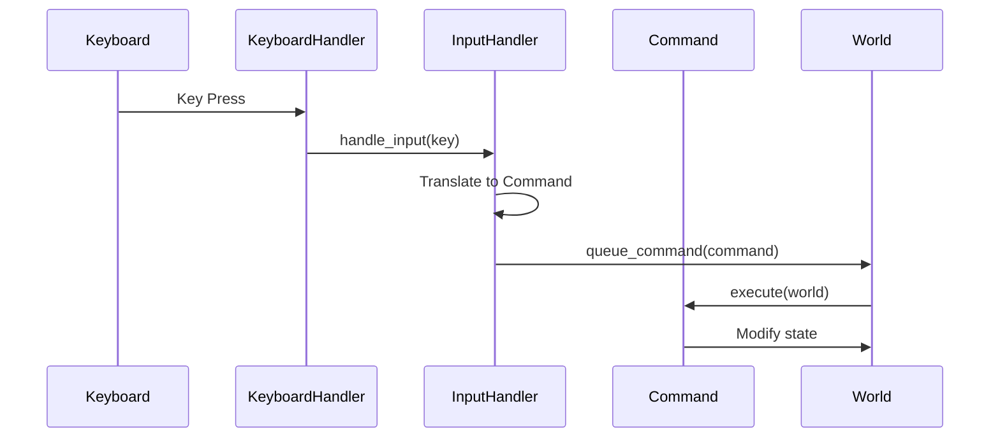

# Input Handling: From Keyboard to Game Action

Handling keyboard input in a terminal game involves multiple layers: reading keys, translating them to actions, creating commands, and executing them. This article shares what we learned about building an input handling system that's responsive and extensible.

## The Challenge

When we started, input handling was simple but limited:

```ruby
# Early approach: Direct key handling
def get_input
  key = $stdin.getc
  case key
  when 'k'
    move_player(:north)
  when 'j'
    move_player(:south)
  end
end
```

This worked, but it was hard to:
- Support multiple keybindings
- Handle special keys (arrows, escape)
- Test input handling
- Add new commands

We needed a better structure.

## The Input Flow

We discovered that input flows through multiple layers:



This flow separates concerns: reading keys, translating to actions, and executing commands.

## KeyboardHandler: Reading Keys

The KeyboardHandler reads raw keypresses. But what does "raw" mean?

### Understanding Raw Keypresses

By default, terminals use **line-buffered input**. This means:
- You type characters
- They appear on screen as you type
- The program doesn't receive them until you press Enter
- The program gets the entire line at once

This is fine for most programs, but terrible for games. Games need to respond immediately to each keypress, not wait for Enter.

**Raw mode** (also called "cbreak mode" or "raw input") changes this:
- Characters are sent to the program immediately
- No line buffering—each keypress is available right away
- No need to press Enter
- Special keys (like arrows) send escape sequences

### Example: Normal vs. Raw Mode

**Normal mode (line-buffered)**:
```ruby
# User types 'k' and presses Enter
input = gets  # Waits for Enter, returns "k\n"
# Program processes after Enter is pressed
```

**Raw mode**:
```ruby
# User types 'k'
$stdin.raw do
  char = $stdin.getc  # Gets 'k' immediately, no Enter needed
end
# Program processes immediately
```

### Why Games Need Raw Mode

In a roguelike, when the player presses 'k' to move north, they expect:
- Immediate response
- No need to press Enter
- Character doesn't appear on screen (it's consumed by the game)

Raw mode provides this behavior.

### How Raw Mode Works in Ruby

Ruby's `io/console` library provides raw mode:

```ruby
require 'io/console'

$stdin.raw do
  # Inside this block, terminal is in raw mode
  char = $stdin.getc  # Read one character immediately
  # Character is available without pressing Enter
end
# After the block, terminal returns to normal mode
```

The `raw` method:
1. Puts the terminal in raw mode
2. Executes the block
3. Restores normal mode when done

This ensures the terminal doesn't stay in raw mode if the program crashes.

### The KeyboardHandler Implementation

The KeyboardHandler reads raw keypresses:

```ruby
require 'io/console'

class KeyboardHandler
  def get_key
    $stdin.raw do
      char = $stdin.getc
      case char
      when "\e"  # Escape sequence
        read_escape_sequence
      else
        char.chr
      end
    end
  end

  private

  def read_escape_sequence
    # Handle arrow keys: \e[A = up, \e[B = down, etc.
    seq = $stdin.read_nonblock(2) rescue nil
    case seq
    when "[A" then :up
    when "[B" then :down
    when "[C" then :right
    when "[D" then :left
    else "\e"
    end
  end
end
```

This handles both regular keys and escape sequences (like arrow keys).

## InputHandler: Translating Keys to Commands

The InputHandler translates keys to commands:

```ruby
class InputHandler
  def initialize(world)
    @world = world
  end

  def handle_input(key)
    entity = @world.get_entity_by_name('Player')
    return unless entity

    # Emit event for tracking
    publish_key_press_event(key, entity)

    # Create command from key
    command = process_command(key, entity)
    @world.queue_command(command) if command

    # Emit command event
    publish_command_issued_event(command)

    command
  end

  private

  def process_command(key, entity)
    case key
    when 'k', :up
      MoveCommand.new(entity, :north)
    when 'j', :down
      MoveCommand.new(entity, :south)
    when 'l', :right
      MoveCommand.new(entity, :east)
    when 'h', :left
      MoveCommand.new(entity, :west)
    when 'q', "\C-c"
      ExitCommand.new
    when 'm'
      ToggleMenuModeCommand.new
    else
      NullCommand.new  # Unknown key
    end
  end
end
```

This translates keys to commands, supporting both vim-style (h, j, k, l) and arrow keys.

## InputSystem: Coordinating Input

The InputSystem coordinates input handling:

```ruby
class InputSystem < System
  def initialize(world)
    super(world)
    @keyboard_handler = KeyboardHandler.new
    @input_handler = InputHandler.new(world)
  end

  def update(_delta_time)
    return if @world.quit?

    if key_available?
      key = @keyboard_handler.get_key
      @input_handler.handle_input(key)
    end
  end

  private

  def key_available?
    $stdin.ready?
  end
end
```

The system checks for available input and processes it.

## Vim-Style Keybindings

We support vim-style keybindings:

- **h**: Move west (left)
- **j**: Move south (down)
- **k**: Move north (up)
- **l**: Move east (right)

These are familiar to many developers and feel natural for grid-based movement.

## Arrow Key Support

We also support arrow keys for players who prefer them:

```ruby
def process_command(key, entity)
  case key
  when 'k', :up
    MoveCommand.new(entity, :north)
  when 'j', :down
    MoveCommand.new(entity, :south)
  # ... etc
  end
end
```

Arrow keys are translated to the same commands as vim keys.

## Handling Unknown Keys

Unknown keys are handled gracefully:

```ruby
def process_command(key, entity)
  case key
  # ... known keys ...
  else
    NullCommand.new  # Do nothing
  end
end
```

This prevents errors when players press unexpected keys.

## Event Emission

Input events are emitted for tracking:

```ruby
def publish_key_press_event(key, entity)
  @event_manager.publish_event(
    :key_pressed,
    self,
    { key: key, entity_id: entity.id }
  )
end

def publish_command_issued_event(command)
  @event_manager.publish_event(
    :command_issued,
    self,
    { command: command }
  )
end
```

This allows logging and debugging of input.

## What We Learned

1. **Multiple layers help**: Separating key reading, translation, and execution makes the code clearer.

2. **Support multiple keybindings**: Vim-style and arrow keys both work. Players can choose what they prefer.

3. **Handle unknown keys gracefully**: Don't crash on unexpected input—just ignore it.

4. **Emit events for tracking**: Input events help with debugging and logging.

5. **Commands enable flexibility**: Translating keys to commands makes it easy to add new actions.

## Common Pitfalls

### Blocking Input

Don't block the game loop waiting for input:

```ruby
# Bad: Blocks until keypress
def update
  key = $stdin.getc  # Blocks here
  handle_input(key)
end

# Good: Check if key available
def update
  if key_available?
    key = $stdin.getc
    handle_input(key)
  end
end
```

### Not Handling Escape Sequences

Arrow keys send escape sequences:

```ruby
# Bad: Doesn't handle arrows
def get_key
  $stdin.getc.chr
end

# Good: Handles escape sequences
def get_key
  char = $stdin.getc
  if char == "\e"
    read_escape_sequence  # Handle arrows
  else
    char.chr
  end
end
```

### Hardcoding Keybindings

Make keybindings configurable:

```ruby
# Bad: Hardcoded
case key
when 'k'
  MoveCommand.new(entity, :north)
end

# Good: Configurable
KEYBINDINGS = {
  'k' => :north,
  'j' => :south,
  # ...
}.freeze
```

## Further Reading

- [The Command Pattern: Encapsulating User Actions](./16-command-pattern.md) - How input creates commands
- [The Game Loop: Turn-Based Architecture in Action](./13-game-loop.md) - How input fits into the loop

## Conclusion

Input handling requires multiple layers: reading keys, translating to actions, and executing commands. By separating these concerns, we've made the code more maintainable and extensible. Supporting multiple keybinding styles and handling unknown keys gracefully makes the game more accessible.

The key lesson: structure input handling early. A good input system makes everything else easier.

