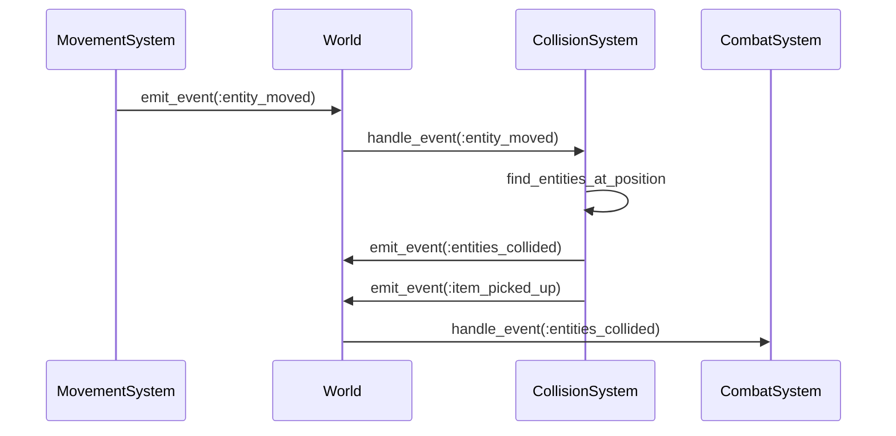

# Collision Detection: Simple Grid-Based Approach

In a grid-based roguelike, collision detection is simpler than in games with continuous movement. Two entities collide if they're at the same position. This article explores what we learned about implementing collision detection that's both simple and effective.

## The Challenge

When we first implemented movement, we didn't think about collisions. Entities could move anywhere, even into walls or other entities. We needed a way to detect when entities occupy the same space and handle those collisions appropriately.

## The Simple Solution

In a grid-based game, collision detection is straightforward:

**Two entities collide if they're at the same position.**

That's it. No complex physics calculations needed. Just check if `entity1.position == entity2.position`.

## Event-Driven Collision Detection

We discovered that event-driven collision detection works well:

```ruby
class CollisionSystem < System
  def initialize(world)
    super(world)
    @world.subscribe(:entity_moved, self)
  end

  def handle_event(event_type, data)
    return unless event_type == :entity_moved

    entity = @world.get_entity(data[:entity_id])
    return unless entity

    position = entity.get_component(:position)
    entities_at_position = find_entities_at_position(position.row, position.column)

    entities_at_position.each do |other_entity|
      next if other_entity.id == entity.id

      emit_event(:entities_collided, {
        entity_id: entity.id,
        other_entity_id: other_entity.id,
        position: { row: position.row, column: position.column }
      })

      handle_specific_collisions(entity, other_entity)
    end
  end
end
```

The system subscribes to movement events and checks for collisions when entities move.

## Finding Entities at Position

The collision system finds all entities at a specific position:

```ruby
def find_entities_at_position(row, column)
  entities_with(:position).select do |entity|
    pos = entity.get_component(:position)
    pos.row == row && pos.column == column
  end
end
```

This queries all entities with a position component and filters by coordinates.

## Handling Specific Collisions

Different entity types interact differently:

```ruby
def handle_specific_collisions(entity, other_entity)
  # Player + Stairs = Level transition
  if (entity.has_tag?(:player) && other_entity.has_tag?(:stairs)) ||
     (entity.has_tag?(:stairs) && other_entity.has_tag?(:player))
    player = entity.has_tag?(:player) ? entity : other_entity
    emit_event(:level_transition_requested, { player_id: player.id })
  end

  # Player + Item = Pickup
  if (entity.has_tag?(:player) && other_entity.has_tag?(:item)) ||
     (entity.has_tag?(:item) && other_entity.has_tag?(:player))
    player = entity.has_tag?(:player) ? entity : other_entity
    item = entity.has_tag?(:item) ? entity : other_entity

    if player.has_component?(:inventory) && item.has_component?(:item)
      emit_event(:item_picked_up, {
        player_id: player.id,
        item_id: item.id
      })
      @world.queue_command(:add_to_inventory, {
        player_id: player.id,
        item_id: item.id
      })
    end
  end

  # Player + Monster = Combat (handled by CombatSystem)
  # This is detected but handled elsewhere
end
```

Each collision type has its own handling logic.

## Collision Flow



This sequence shows how collisions are detected and handled through events.

## Why This Approach Works

### Simplicity

Grid-based collision is simple:
- Same position = collision
- No complex calculations
- Easy to understand

### Event-Driven

Event-driven detection is flexible:
- Systems react to collisions
- No direct dependencies
- Easy to add new collision types

### Extensible

Adding new collision types is easy:

```ruby
def handle_specific_collisions(entity, other_entity)
  # Existing collisions...

  # New collision type
  if entity.has_tag?(:player) && other_entity.has_tag?(:trap)
    handle_trap_collision(entity, other_entity)
  end
end
```

## What We Learned

1. **Grid-based collision is simple**: Same position = collision. No need for complex physics.

2. **Event-driven is flexible**: Systems react to collisions without direct dependencies.

3. **Tag-based detection helps**: Using tags (like `:player`, `:item`) makes collision handling clearer.

4. **Specific handling is important**: Different entity types need different collision responses.

5. **Don't handle everything in one place**: CollisionSystem detects, other systems handle (CombatSystem for combat, InventorySystem for items).

## Common Pitfalls

### Checking Collisions Too Early

Don't check collisions before movement completes:

```ruby
# Bad: Check before move
def move(entity, direction)
  check_collisions(entity)  # Old position
  entity.position = new_position
end

# Good: Check after move
def move(entity, direction)
  entity.position = new_position
  emit_event(:entity_moved)  # CollisionSystem checks new position
end
```

### Handling All Collisions in One Place

Don't handle all collisions in CollisionSystem:

```ruby
# Bad: All logic in CollisionSystem
def handle_collision(entity1, entity2)
  if player_and_monster?
    # Combat logic here
  elsif player_and_item?
    # Pickup logic here
  end
end

# Good: CollisionSystem detects, other systems handle
def handle_collision(entity1, entity2)
  emit_event(:entities_collided)  # Other systems handle
end
```

### Not Handling Bidirectional Collisions

Check both directions:

```ruby
# Bad: Only checks one direction
if entity.has_tag?(:player) && other_entity.has_tag?(:item)
  handle_collision(entity, other_entity)
end

# Good: Checks both directions
if (entity.has_tag?(:player) && other_entity.has_tag?(:item)) ||
   (entity.has_tag?(:item) && other_entity.has_tag?(:player))
  handle_collision(entity, other_entity)
end
```

## Further Reading

- [The Game Loop: Turn-Based Architecture in Action](./13-game-loop.md) - How collision detection fits into the loop
- [Event-Driven Architecture for Game Debugging](./06-event-driven-architecture.md) - How events enable collision detection

## Conclusion

Grid-based collision detection is simpler than continuous collision, but it still needs careful design. Event-driven detection provides flexibility while keeping the code maintainable. The key is detecting collisions and letting appropriate systems handle them.

By keeping collision detection simple and event-driven, we've found it easy to add new collision types and behaviors. The structure has served us well as the game has grown.


