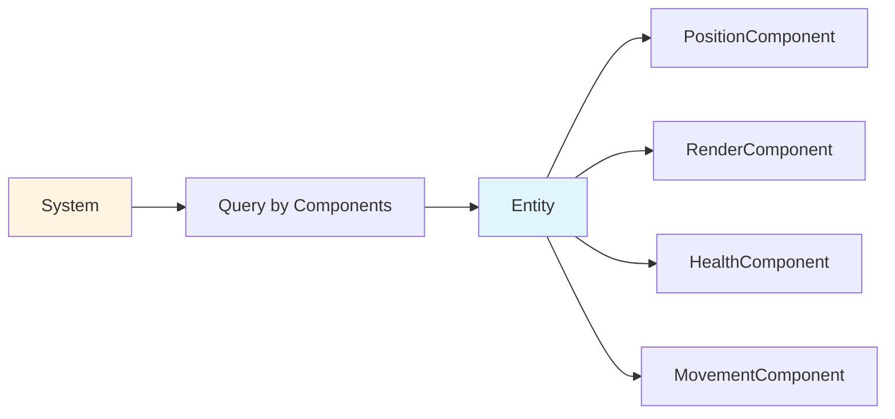

# Component Design: Data Containers in ECS

In Entity-Component-System architecture, components are pure data containers. They don't contain logic—they just store information. This article explores what we learned about designing effective components.

## The Core Principle

Components are **data only, no logic**.

This separation is fundamental to ECS:
- **Components**: What an entity has (data)
- **Systems**: What an entity does (logic)
- **Entities**: What exists (ID + components)

## What Components Look Like

Here's a simple component:

```ruby
class PositionComponent < Component
  attr_reader :row, :column

  def initialize(row:, column:)
    super()
    @row = row
    @column = column
  end

  def type
    :position
  end

  def set_position(row, column)
    @row = row
    @column = column
  end
end
```

It's just data: row and column. No logic, no behavior.

## Common Components

Here are components we use:

### PositionComponent

Stores location:

```ruby
class PositionComponent < Component
  attr_reader :row, :column

  def initialize(row:, column:)
    @row = row
    @column = column
  end
end
```

### RenderComponent

Stores visual representation:

```ruby
class RenderComponent < Component
  attr_reader :character, :color

  def initialize(character:, color: nil)
    @character = character
    @color = color
  end
end
```

### HealthComponent

Stores health data:

```ruby
class HealthComponent < Component
  attr_accessor :current_health, :max_health

  def initialize(max_health:)
    @max_health = max_health
    @current_health = max_health
  end
end
```

### MovementComponent

Stores movement capability:

```ruby
class MovementComponent < Component
  attr_accessor :active

  def initialize(active: true)
    @active = active
  end

  def active?
    @active
  end
end
```

## Component Composition

Entities combine multiple components:

```ruby
player = Entity.new
player.add_component(PositionComponent.new(row: 0, column: 0))
player.add_component(RenderComponent.new(character: '@'))
player.add_component(HealthComponent.new(max_health: 100))
player.add_component(MovementComponent.new)
```

The player entity has position, rendering, health, and movement capabilities.

## Querying by Components

Systems find entities by component types:

```ruby
def entities_with(*component_types)
  @world.query_entities(component_types)
end

# Find all entities that can move
movable = entities_with(:position, :movement)

# Find all entities that can be rendered
renderable = entities_with(:position, :render)
```

This lets systems find entities they can process.

## Component Design Principles

### Keep Components Small

Components should contain related data:

```ruby
# Good: Small, focused component
class PositionComponent < Component
  attr_reader :row, :column
end

# Bad: Too much data
class EntityDataComponent < Component
  attr_reader :row, :column, :health, :damage, :inventory
end
```

### No Logic in Components

Components are data containers:

```ruby
# Bad: Logic in component
class HealthComponent < Component
  def take_damage(amount)
    @current_health -= amount  # Logic in component
    die if @current_health <= 0
  end
end

# Good: Logic in system
class HealthComponent < Component
  attr_accessor :current_health, :max_health
end

class CombatSystem < System
  def damage_entity(entity, amount)
    health = entity.get_component(:health)
    health.current_health -= amount  # System modifies component
  end
end
```

### Use Accessors Appropriately

Components can have simple accessors:

```ruby
class PositionComponent < Component
  attr_reader :row, :column

  def set_position(row, column)
    @row = row
    @column = column
  end
end
```

This is fine—it's just data access, not logic.

## Component Relationships



This diagram shows how entities combine components and systems query by component types.

## What We Learned

1. **Components are data only**: No logic, just storage. This separation is valuable.

2. **Keep components small**: Small, focused components are easier to understand and reuse.

3. **Composition over inheritance**: Entities combine components instead of inheriting behavior.

4. **Query by components**: Systems find entities by what components they have, not what type they are.

5. **Accessors are fine**: Simple getters/setters are okay—they're just data access.

## Common Pitfalls

### Putting Logic in Components

Don't put logic in components:

```ruby
# Bad: Logic in component
class HealthComponent < Component
  def heal(amount)
    @current_health = [@current_health + amount, @max_health].min
  end
end

# Good: Logic in system
class HealthComponent < Component
  attr_accessor :current_health, :max_health
end

class HealthSystem < System
  def heal(entity, amount)
    health = entity.get_component(:health)
    health.current_health = [health.current_health + amount, health.max_health].min
  end
end
```

### Making Components Too Large

Don't put everything in one component:

```ruby
# Bad: Too much data
class PlayerComponent < Component
  attr_reader :position, :health, :inventory, :equipment, :stats
end

# Good: Separate components
class PositionComponent < Component; end
class HealthComponent < Component; end
class InventoryComponent < Component; end
```

### Components Knowing About Other Components

Components shouldn't know about each other:

```ruby
# Bad: Component knows about other component
class MovementComponent < Component
  def can_move?(entity)
    position = entity.get_component(:position)  # Knows about PositionComponent
    # ...
  end
end

# Good: System knows about components
class MovementSystem < System
  def can_move?(entity)
    position = entity.get_component(:position)  # System queries components
    # ...
  end
end
```

## Further Reading

- [The World Coordinator: Managing ECS Complexity](./15-world-coordinator.md) - How World queries entities by components
- [System Priority: Why Order Matters in ECS](./14-system-priority.md) - How systems process entities with specific components

## Conclusion

Components are the foundation of ECS architecture. They're pure data containers—no logic, just storage. By keeping components small and focused, we've made the code more flexible and easier to understand. The key is remembering: components store data, systems contain logic.

This separation has made it easier to add new features and modify existing ones. The structure has held up well as the game has grown.


