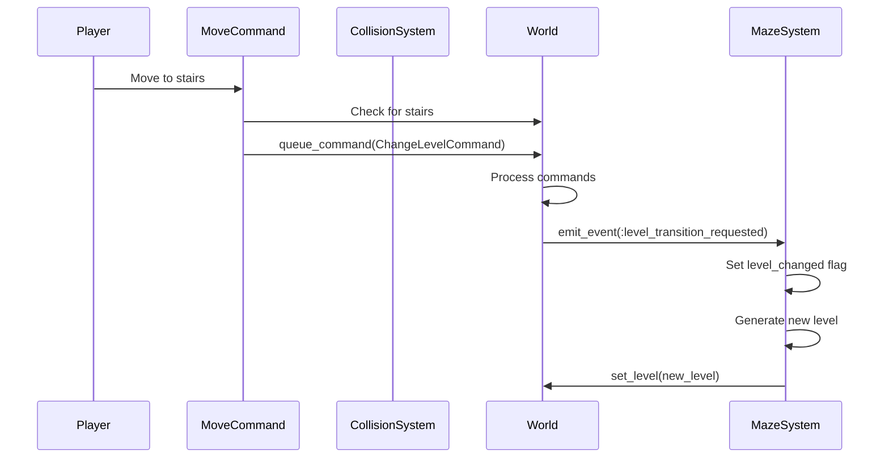

# Level Management: Creating and Transitioning Between Levels

Managing levels in a roguelike involves creating new levels, transitioning between them, and keeping entities synchronized. This article shares what we learned about building a level management system that handles generation, transitions, and state synchronization.

## The Challenge

When we first implemented levels, we struggled with:
- When to generate new levels
- How to transition between levels
- Keeping World entities and Level entities in sync
- Managing level state across transitions

We needed a clear approach to level management.

## Level Structure

A level contains:
- **Grid**: The maze layout
- **Entities**: Entities in this level
- **Difficulty**: Current difficulty level
- **Algorithm**: Algorithm used to generate it

```ruby
class Level
  attr_reader :grid, :difficulty, :entities, :algorithm

  def initialize(grid:, difficulty:, algorithm:)
    @grid = grid
    @algorithm = algorithm
    @difficulty = difficulty
    @entities = []
  end
end
```

The level is a container for level-specific data.

## Level Creation

Levels are created by the MazeSystem:

```ruby
class MazeSystem < System
  def update(_delta_time)
    return unless !@world.grid || @world.level_changed?

    grid = generate_maze
    populate_entities(grid)
    level = Level.new(grid: grid, difficulty: @difficulty, algorithm: @algorithm)
    @world.set_level(level)
  end
end
```

The system generates the maze, places entities, and creates the level object.

## Entity Synchronization

We discovered that entities need to exist in two places:
- **World entities**: All entities in the game
- **Level entities**: Entities in the current level

Keeping them synchronized is important:

```ruby
class Level
  def add_entity(entity)
    @entities << entity
    update_grid_with_entity(entity)
  end

  def update_grid_with_entity(entity)
    position = entity.get_component(:position)
    return unless position

    cell = @grid[position.row, position.column]
    return unless cell

    render = entity.get_component(:render)
    cell.tile = render.character if render && render.character
  end

  def update_grid_with_entities
    # Reset grid to base state
    @grid.each_cell do |cell|
      cell.tile = cell.links.empty? ? TileType::WALL : TileType::EMPTY
    end

    # Update with all entities
    @entities.each { |e| update_grid_with_entity(e) }
  end
end
```

The level keeps the grid in sync with entities.

## Level Transitions

Level transitions happen when the player reaches stairs:



This sequence shows how level transitions are triggered and processed.


This sequence shows how level transitions are triggered and processed.

### Detecting Stairs

The MoveCommand detects when the player reaches stairs:

```ruby
class MoveCommand < Command
  def execute(world)
    movement_system.move(@entity, @direction)
    new_position = @entity.get_component(:position)

    # Check for stairs at new position
    target_entities = world.current_level.entities.select do |entity|
      entity_position = entity.get_component(:position)
      entity_position&.row == new_position.row &&
      entity_position&.column == new_position.column &&
      entity.has_component?(:stairs)
    end

    if target_entities.any? && at_stairs_position?
      world.queue_command(ChangeLevelCommand.new(
        world.current_level.difficulty + 1,
        @entity
      ))
    end
  end
end
```

### Triggering Transition

The ChangeLevelCommand triggers the transition:

```ruby
class ChangeLevelCommand < Command
  def execute(world)
    world.emit_event(:level_transition_requested, {
      player_id: @player.id,
      new_difficulty: @new_difficulty
    })
  end
end
```

### Generating New Level

The MazeSystem responds to the transition event:

```ruby
class MazeSystem < System
  def handle_event(event_type, data)
    return unless event_type == :level_transition_requested

    @world.level_changed = true  # Trigger regeneration
    player = @world.get_entity(data[:player_id])
    player.get_component(:position).set_position(0, 0)  # Reset position
  end

  def update(_delta_time)
    return unless !@world.grid || @world.level_changed?

    # Generate new level
    grid = generate_maze
    populate_entities(grid)
    level = Level.new(grid: grid, difficulty: @difficulty, algorithm: @algorithm)
    @world.set_level(level)
  end
end
```

## Managing Level State

We learned that level state needs careful management:

### Resetting Player Position

When transitioning, reset player to start:

```ruby
def handle_event(event_type, data)
  if event_type == :level_transition_requested
    player = @world.get_entity(data[:player_id])
    player.get_component(:position).set_position(0, 0)
  end
end
```

### Clearing Old Entities

Old level entities should be cleared:

```ruby
def populate_entities(grid)
  @world.entities.clear  # Clear old entities
  # ... create new entities ...
end
```

### Syncing Entities

After creating entities, sync with level:

```ruby
def populate_entities(grid)
  # Create entities
  player = create_player(0, 0)
  @world.add_entity(player)

  # Sync with level
  level = Level.new(grid: grid, difficulty: @difficulty, algorithm: @algorithm)
  @world.entities.values.each { |e| level.add_entity(e) }
  @world.set_level(level)
end
```

## What We Learned

1. **Levels are containers**: Levels contain grid, entities, and metadata. They don't contain logic.

2. **Entity synchronization matters**: Entities exist in both World and Level. Keeping them in sync is important.

3. **Event-driven transitions work**: Using events for level transitions keeps systems decoupled.

4. **Reset state on transition**: Player position and entities should be reset when transitioning.

5. **Grid updates are important**: The grid must be updated when entities are added or removed.

## Common Pitfalls

### Not Clearing Old Entities

Don't forget to clear old entities:

```ruby
# Bad: Old entities remain
def generate_new_level
  # Create new entities but don't clear old ones
end

# Good: Clear old entities
def generate_new_level
  @world.entities.clear
  # Create new entities
end
```

### Not Resetting Player Position

Reset player position on transition:

```ruby
# Bad: Player keeps old position
def transition_level
  generate_new_level
  # Player still at old position
end

# Good: Reset position
def transition_level
  player.get_component(:position).set_position(0, 0)
  generate_new_level
end
```

### Not Updating Grid

Keep grid in sync with entities:

```ruby
# Bad: Grid not updated
def add_entity(entity)
  @entities << entity
  # Grid not updated
end

# Good: Update grid
def add_entity(entity)
  @entities << entity
  update_grid_with_entity(entity)
end
```

## Further Reading

- [Ensuring Player Accessibility in Procedurally Generated Levels](./01-ensuring-player-accessibility.md) - How we ensure levels are playable
- [The Game Loop: Turn-Based Architecture in Action](./13-game-loop.md) - How level transitions fit into the loop

## Conclusion

Level management ties together generation, entities, and progression. By treating levels as containers and using event-driven transitions, we've made the system flexible and maintainable. The key is keeping entities synchronized and resetting state appropriately on transitions.

This structure has made it easier to add new level features and handle edge cases. The separation between World and Level entities, while requiring synchronization, has provided the flexibility we needed.

