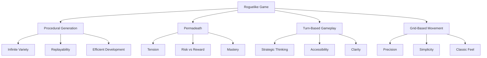
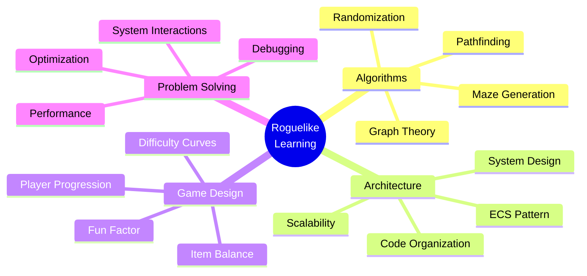

# Chapter 1: What is a Roguelike?

## Historical Context: Rogue (1980) and the Genre's Evolution

In 1980, a game called *Rogue* was created by Michael Toy, Glenn Wichman, and Ken Arnold. Running on Unix systems, it featured ASCII graphics, turn-based gameplay, and a dungeon that was different every time you played. This game would spawn an entire genre that continues to thrive today.

*Rogue* wasn't just a game—it was a technical achievement. At a time when computer memory was precious and graphics were primitive, the developers created something that felt infinite. Every playthrough was unique because the dungeon was generated procedurally. Every death was permanent, making each decision matter. The game was challenging, unforgiving, and endlessly replayable.

Over the decades, the roguelike genre has evolved. Modern games like *The Binding of Isaac*, *Spelunky*, and *Hades* have brought roguelike elements to broader audiences. But the core principles remain: procedural generation, permadeath, and the thrill of the unknown.

## Core Characteristics

What makes a roguelike a roguelike? While there's some debate in the community, most agree on these fundamental characteristics:

### Procedural Generation

The world is created algorithmically, not by hand. Every level, every room, every item placement is determined by algorithms. This means:

- **Infinite variety**: No two playthroughs are identical
- **Replayability**: The game stays fresh even after hundreds of hours
- **Efficiency**: Developers don't need to manually design every level

In Vanilla Roguelike, we use maze generation algorithms to create dungeons. The same algorithm, given different random seeds, produces completely different layouts.

### Permadeath

When your character dies, you start over. There's no loading a save file, no second chances. This creates:

- **Tension**: Every decision matters
- **Risk vs. reward**: Do you explore that dangerous area for better loot?
- **Mastery**: You learn from each death, getting better over time

### Turn-Based Gameplay

Unlike action games, roguelikes are turn-based. When you move, the world responds. Monsters move, traps trigger, time passes. This allows:

- **Strategic thinking**: You can plan your moves carefully
- **Accessibility**: No need for quick reflexes
- **Clarity**: You can see exactly what's happening

### Grid-Based Movement

Everything exists on a grid. You move from cell to cell, not smoothly across space. This provides:

- **Precision**: Exact positioning matters
- **Simplicity**: Easy to reason about movement and collisions
- **Classic feel**: Maintains the traditional roguelike aesthetic

## Why Build One?

Building a roguelike from scratch teaches you more than just game development. It's a masterclass in:

### Algorithms

Procedural generation requires understanding graph theory, pathfinding, and randomization. You'll implement maze generation algorithms, learn about spanning trees, and explore different approaches to creating content.

### Architecture

As your game grows, you'll face architectural challenges. How do you organize code that handles movement, combat, inventory, and AI? You'll learn patterns like Entity-Component-System (ECS) that are used in professional game engines.

### Game Design

You'll make decisions about difficulty curves, item balance, and player progression. You'll learn what makes gameplay fun and what makes it frustrating.

### Problem Solving

Roguelikes are complex systems. You'll debug interactions between systems, optimize performance, and solve problems you never anticipated.

## The Learning Journey

This book follows the development of Vanilla Roguelike, a game built in Ruby over five years. We'll explore:

- How to implement maze generation algorithms
- Why architecture matters and when to refactor
- How to build systems that work together
- The mistakes made along the way and what we learned

You don't need to be an expert programmer. You need curiosity, persistence, and a willingness to learn. By the end of this book, you'll understand not just how to build a roguelike, but how to think about software architecture, algorithms, and game design.

**Exploring the Source Code**: The complete source code for Vanilla Roguelike is available on GitHub at [github.com/Davidslv/vanilla-roguelike](https://github.com/Davidslv/vanilla-roguelike). You can explore the implementation, see how concepts from this book are applied in practice, and discover additional features and topics not covered in these pages. The codebase serves as a reference implementation and a learning resource.

## Key Takeaway

Roguelikes are more than games—they're technical and creative challenges. Understanding what makes them unique helps you appreciate both the genre and the skills you'll develop building one. The journey ahead will teach you algorithms, architecture, and design patterns that apply far beyond game development.

## Exercises

1. **Play a roguelike**: If you haven't already, play a classic roguelike like *NetHack* or *Brogue*. Pay attention to how the world feels different each time.

2. **Analyze characteristics**: Think about your favorite games. Which ones have roguelike elements? What makes them feel different from traditional games?

3. **Research the genre**: Look up the "Berlin Interpretation" of roguelikes. How does it compare to modern roguelike-inspired games?

