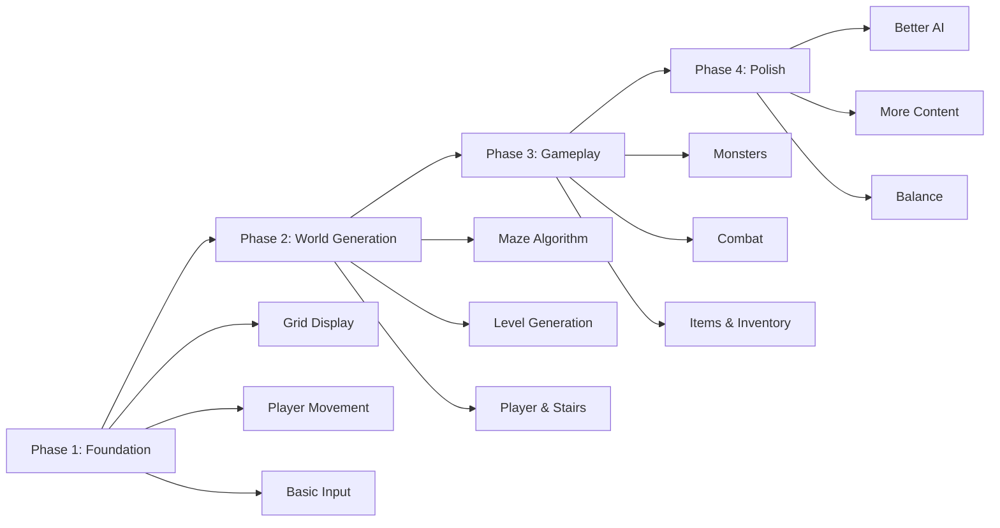
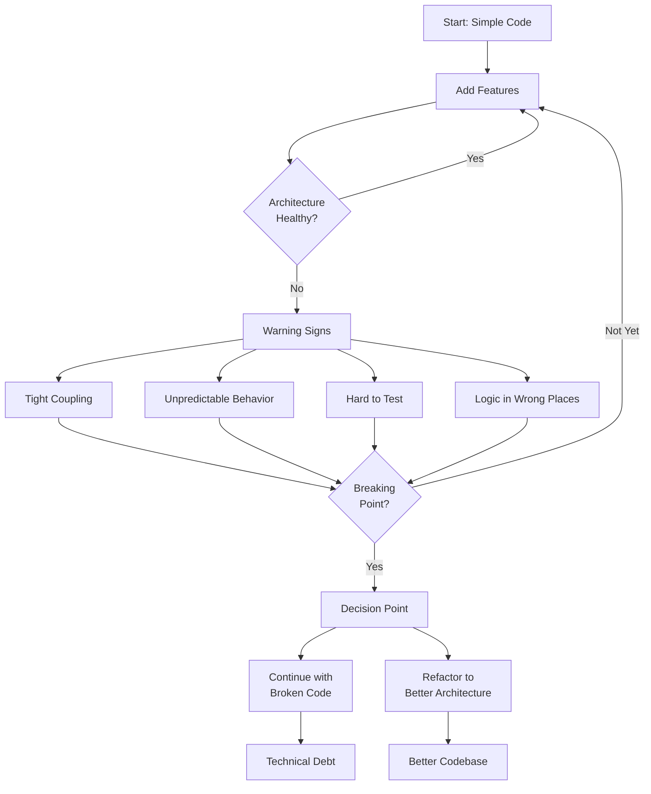

# Chapter 2: The Development Mindset

## Building from Scratch vs. Using Engines

When you decide to build a roguelike, you face a fundamental choice: use a game engine like Unity or Godot, or build from scratch with just a programming language and terminal.

Both approaches have value, but they teach different things.

### Using a Game Engine

**Pros:**
- Faster initial development
- Built-in rendering, physics, and tools
- Large community and resources
- Professional-grade features

**Cons:**
- You learn the engine, not the underlying concepts
- Less control over how things work
- Engine-specific knowledge may not transfer
- Can hide important architectural decisions

### Building from Scratch

**Pros:**
- Deep understanding of how everything works
- Complete control over architecture
- Knowledge transfers to any language or platform
- Learn fundamental algorithms and patterns

**Cons:**
- Slower initial progress
- You build everything yourself
- More debugging and problem-solving
- Steeper learning curve

This book focuses on building from scratch because that's where the deepest learning happens. When you implement maze generation yourself, you understand graph theory. When you build an ECS architecture, you understand how modern game engines work internally.

## The Iterative Approach: Start Simple, Add Complexity Gradually

The biggest mistake beginners make is trying to build everything at once. A roguelike has many systems: movement, combat, inventory, AI, procedural generation, rendering. Building all of them simultaneously leads to confusion, bugs, and frustration.

### The Right Way: Iterative Development

Start with the simplest possible version that works, then add one feature at a time.

**Phase 1: Foundation**
- A grid that displays on screen
- A player character that can move
- Basic input handling

**Phase 2: World Generation**
- Implement one maze generation algorithm
- Generate a playable level
- Place the player and stairs

**Phase 3: Gameplay**
- Add monsters
- Implement combat
- Add items and inventory

**Phase 4: Polish**
- Improve AI
- Add more content
- Balance difficulty

Each phase builds on the previous one. You always have a working game, even if it's simple. This approach has several benefits:

- **You can test as you go**: Each feature is tested in isolation
- **Less overwhelming**: Focus on one thing at a time
- **Easier debugging**: Problems are contained to new features
- **Visible progress**: You see your game improving incrementally

### The Vanilla Journey

Vanilla Roguelike started in April 2020 as an exploration of maze generation algorithms. It wasn't a game yet—just algorithms that created mazes. Over time, movement was added. Then rendering. Then monsters. Each addition was small and focused.

This iterative approach meant that when problems arose, they were manageable. When architecture needed to change (as we'll see in later chapters), the codebase wasn't so large that refactoring was impossible.

## Common Pitfalls

### Architecture Drift

As you add features, code starts appearing in the wrong places. The `LevelGenerator` class begins handling entity management. The `Game` class becomes a catch-all for game state, rendering, and input handling. Components become tightly coupled.

**Signs of architecture drift:**
- Classes doing multiple unrelated things
- Direct dependencies between components that shouldn't know about each other
- Changes in one place break things in unexpected places
- Hard to test individual pieces

**Solution:** Recognize the problem early and refactor. Don't wait until the codebase is a mess.

### Premature Optimization

You worry about performance before you have a working game. You optimize maze generation algorithms before you've implemented combat. You add caching before you know what the bottlenecks are.

**The problem:** You spend time optimizing code that might not even be the problem. Worse, premature optimization often makes code more complex and harder to maintain.

**Solution:** Build it first, measure it second, optimize it third. Make it work, make it right, make it fast—in that order.

### Feature Creep

You start building a simple roguelike, but then you want to add crafting, then multiplayer, then a story mode, then...

**The problem:** You never finish anything. The game becomes a collection of half-implemented features.

**Solution:** Finish one feature completely before starting the next. Define what "done" means for each feature and stick to it.

## The "Breaking Point" Concept

There comes a moment in every project's development when you realize the architecture isn't working. Code that used to be simple is now complex. Adding new features requires touching multiple files. Bugs appear in unexpected places. The codebase feels fragile.

This is the "breaking point"—the moment when you must choose: continue with a broken architecture, or refactor.

### Recognizing the Breaking Point

**Signs you've hit the breaking point:**
- Every new feature requires changes in multiple places
- Fixing one bug creates two new bugs
- You're afraid to change code because you don't know what will break
- The codebase feels like a house of cards

### The Vanilla Breaking Point

In March 2025, Vanilla Roguelike hit its breaking point. The game had grown organically over five years. Features were added as needed, but without a clear architectural pattern. The code worked, but it was fragile.

The breaking point came when trying to remove legacy code broke everything. The game rendered but wouldn't accept input. Movement stopped working. Level transitions failed. The game was completely non-functional.

This crisis forced a decision: give up, or commit to fixing the architecture properly.

The choice was to refactor to Entity-Component-System (ECS) architecture. It was painful—nine hours of debugging, 20+ commits, and many moments of frustration. But it saved the project.

### Why Breaking Points Are Valuable

Breaking points force you to learn. When everything breaks, you're forced to understand how the pieces fit together. You can't just add another hack—you must fix the underlying problem.

The breaking point in Vanilla led to:
- Understanding of proper game architecture
- Knowledge of ECS pattern
- A codebase that could grow sustainably
- Confidence in refactoring large systems

Breaking points aren't failures—they're learning opportunities. The key is recognizing them early and having the courage to fix the architecture rather than continuing with broken code.

## The Development Mindset

Building a roguelike is a marathon, not a sprint. You'll make mistakes. You'll write code you'll later throw away. You'll hit breaking points. This is all part of the process.

**Embrace the journey:**
- Every mistake teaches you something
- Every refactor makes you a better programmer
- Every breaking point forces you to learn

**Stay focused:**
- Build one feature at a time
- Keep the game playable
- Refactor when needed, not when convenient

**Learn continuously:**
- Read about algorithms and patterns
- Study other roguelikes
- Understand why things work, not just that they work

## Key Takeaway

The right mindset is more important than the right tools. Start simple, iterate gradually, recognize problems early, and have the courage to refactor when needed. The journey of building a roguelike teaches you as much about software development as it does about game design.

## Exercises

1. **Plan your iterations**: Break down building a roguelike into phases. What's the simplest version that would be playable? What would you add next?

2. **Identify breaking points**: Look at a project you've worked on (or an open-source project). Can you identify moments where architecture should have been refactored? What were the signs?

3. **Research refactoring**: Read about the "Strangler Fig Pattern" and "Boy Scout Rule". How do these apply to game development?

