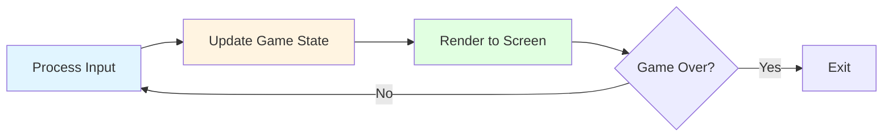
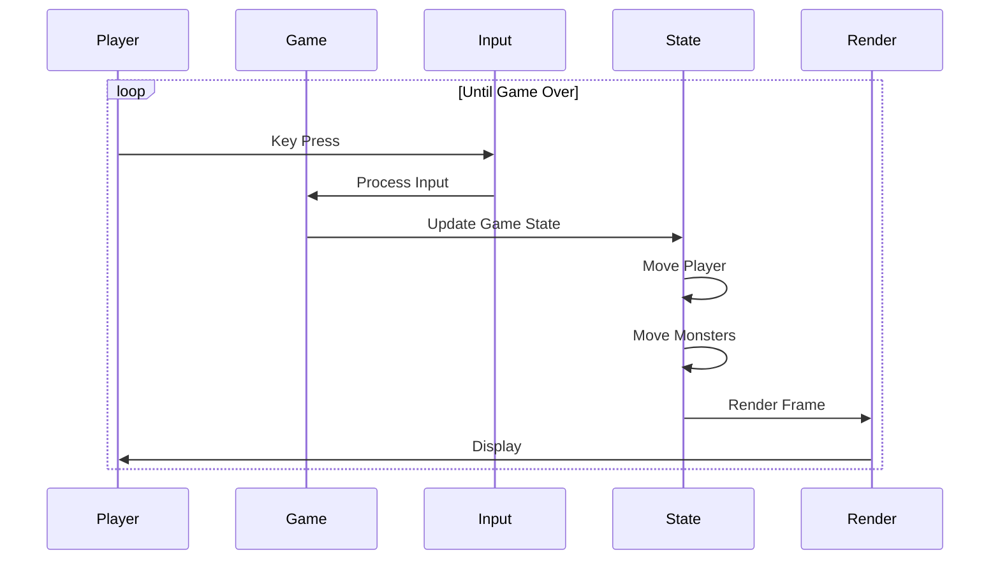

# Chapter 3: Your First Playable Prototype

## Minimal Viable Roguelike

Before we dive into procedural generation and complex architecture, let's build the simplest possible roguelike. This prototype will have:

- A grid that displays on screen
- A player character (represented by `@`)
- Basic movement (arrow keys or vim keys)
- Walls and floors

That's it. No monsters, no items, no levels. Just a character moving around a static grid.

This minimal version serves several purposes:
- It's immediately playable, giving you a sense of accomplishment
- It establishes the foundation for everything else
- It's simple enough to understand completely
- It demonstrates the core game loop

## The Game Loop

Every game, from Pong to modern AAA titles, follows the same fundamental pattern:



```
1. Process Input
2. Update Game State
3. Render to Screen
4. Repeat
```

This is the **game loop**. It runs continuously, typically 60 times per second in real-time games, or once per turn in turn-based games like roguelikes.

### Understanding the Loop

Let's break down what happens in each step:

**Process Input:**
- Read keyboard input
- Convert keys to game actions (move north, move south, etc.)
- Queue actions for processing

**Update Game State:**
- Execute queued actions
- Update entity positions
- Check for collisions
- Process AI
- Update any game logic

**Render to Screen:**
- Clear the screen
- Draw the game world (grid, walls, floors)
- Draw entities (player, monsters, items)
- Display any UI elements
- Present the frame to the player

**Repeat:**
- Go back to step 1
- Continue until the game ends

### The Roguelike Game Loop

In a roguelike, the loop is slightly different because it's turn-based:



```ruby
def game_loop
  until game_over?
    # Wait for player input (blocking)
    input = get_input

    # Process the input
    process_input(input)

    # Update game state (one turn)
    update_game_state

    # Render the current state
    render

    # Turn complete, wait for next input
  end
end
```

The key difference: the game waits for player input before proceeding. Each keypress represents one turn. The player moves, then monsters move, then the game waits for the next input.

## Terminal Rendering Basics

Roguelikes traditionally use terminal/console rendering. You're drawing ASCII characters to a text terminal, not pixels to a screen. This might seem primitive, but it has advantages:

- **Simplicity**: No need for graphics libraries or complex rendering
- **Portability**: Works on any system with a terminal
- **Performance**: Text rendering is extremely fast
- **Classic feel**: Maintains the traditional roguelike aesthetic

### Representing the World

In a terminal-based roguelike, you represent the world with characters:

- `#` = Wall
- `.` = Floor (empty space)
- `@` = Player
- `%` = Stairs
- `M` = Monster
- `!` = Item

The terminal becomes a grid of characters. Each position (row, column) can display one character.

### Basic Rendering Flow

Here's how rendering works conceptually:

```ruby
def render
  # Clear the screen
  clear_screen

  # Draw the grid
  grid.each_cell do |cell|
    if cell.is_wall?
      draw_character(cell.row, cell.column, '#')
    else
      draw_character(cell.row, cell.column, '.')
    end
  end

  # Draw entities on top
  entities.each do |entity|
    position = entity.position
    character = entity.character
    draw_character(position.row, position.column, character)
  end

  # Update the display
  refresh_screen
end
```

In Vanilla, this is handled by the `RenderSystem`, but for now, think of it as a simple function that draws characters to the terminal.

## Building the Prototype

Let's outline what you need for the minimal prototype:

### 1. Grid Representation

You need a way to represent a 2D grid. Each cell can be a wall or floor.

```ruby
class Grid
  def initialize(rows, columns)
    @rows = rows
    @columns = columns
    @cells = Array.new(rows) { Array.new(columns, :floor) }
  end

  def [](row, col)
    @cells[row][col]
  end

  def []=(row, col, value)
    @cells[row][col] = value
  end
end
```

For the prototype, you can manually create a simple grid with walls around the edges and floors in the middle.

### 2. Player Representation

You need to track the player's position:

```ruby
class Player
  attr_accessor :row, :column

  def initialize(row, column)
    @row = row
    @column = column
  end
end
```

### 3. Input Handling

Convert keyboard input to movement directions:

```ruby
def handle_input(key)
  case key
  when 'k', :up then :north
  when 'j', :down then :south
  when 'h', :left then :west
  when 'l', :right then :east
  when 'q' then :quit
  else nil
  end
end
```

### 4. Movement Logic

Check if movement is valid (not into a wall, not out of bounds), then update position:

```ruby
def move_player(player, direction, grid)
  new_row = player.row
  new_col = player.column

  case direction
  when :north then new_row -= 1
  when :south then new_row += 1
  when :west then new_col -= 1
  when :east then new_col += 1
  end

  # Check bounds
  return false if new_row < 0 || new_row >= grid.rows
  return false if new_col < 0 || new_col >= grid.columns

  # Check if it's a wall
  return false if grid[new_row, new_col] == :wall

  # Move is valid
  player.row = new_row
  player.column = new_col
  true
end
```

### 5. Putting It Together

The main game loop ties everything together:

```ruby
def main
  # Initialize
  grid = create_simple_grid(10, 10)
  player = Player.new(5, 5)

  # Game loop
  loop do
    # Render
    render(grid, player)

    # Get input
    key = get_keypress
    direction = handle_input(key)

    break if direction == :quit

    # Move if valid
    move_player(player, direction, grid) if direction
  end
end
```

## What This Teaches You

This simple prototype demonstrates:

1. **The game loop**: Input → Update → Render
2. **State management**: Tracking player position and grid state
3. **Input handling**: Converting keys to game actions
4. **Collision detection**: Checking walls before movement
5. **Rendering**: Drawing the world to the terminal

These fundamentals apply to every game you'll ever build, not just roguelikes.

## From Prototype to Game

Once you have this working, you have a foundation. The next steps are:

1. **Procedural generation**: Replace the static grid with algorithmically generated mazes
2. **Multiple levels**: Add stairs and level transitions
3. **Entities**: Add monsters, items, and other interactive elements
4. **Systems**: Implement combat, inventory, and AI

But for now, celebrate having a playable prototype. You can move a character around a grid. That's the foundation of everything else.

## Key Takeaway

The simplest playable version teaches you the fundamentals: the game loop, state management, input handling, and rendering. These concepts apply to all games. Start here, then build complexity gradually.

## Exercises

1. **Build the prototype**: Implement the minimal roguelike described above. Use any language you're comfortable with. Focus on getting the game loop working.

2. **Extend it**: Once it works, add one feature: maybe display the player's coordinates, or add a simple message when the player tries to move into a wall.

3. **Analyze the loop**: Play your prototype and think about each step of the game loop. Can you identify when input is processed? When the state updates? When rendering happens?

