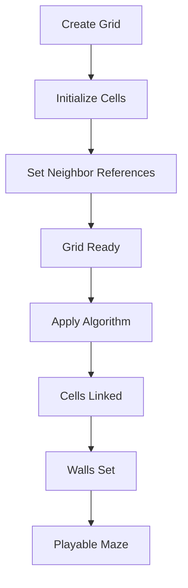

# Chapter 4: Understanding Grids and Cells

## Grid Data Structures: Representing 2D Space

At the heart of every roguelike is a grid—a two-dimensional structure that represents the game world. Each position in the grid is a cell, and each cell can contain walls, floors, entities, or other game elements.

Think of it like a chessboard, but instead of squares for pieces, you have cells for game content. The grid is the foundation upon which everything else is built.

### Why Grids?

Grids provide several advantages for roguelikes:

- **Precision**: Exact positioning—no floating-point coordinates or pixel-perfect placement
- **Simplicity**: Easy to reason about movement, collisions, and spatial relationships
- **Efficiency**: Fast lookups and neighbor queries
- **Classic feel**: Maintains the traditional roguelike aesthetic

### Representing a Grid

In Vanilla, a grid is represented as a collection of cells:

```ruby
module Vanilla
  module MapUtils
    class Grid
      attr_reader :rows, :columns

      def initialize(rows, columns, type_factory: CellTypeFactory.new)
        @rows = rows
        @columns = columns
        @type_factory = type_factory
        @grid = Array.new(rows * columns) do |i|
          Cell.new(row: i / columns, column: i % columns, type_factory: @type_factory)
        end
        # Set neighbors for each cell
        each_cell do |cell|
          row, col = cell.row, cell.column
          cell.north = self[row - 1, col] if row > 0
          cell.south = self[row + 1, col] if row < @rows - 1
          cell.east  = self[row, col + 1] if col < @columns - 1
          cell.west  = self[row, col - 1] if col > 0
        end
      end

      def [](row, col)
        return nil unless row.between?(0, @rows - 1) && col.between?(0, @columns - 1)
        @grid[row * @columns + col]
      end
    end
  end
end
```

Notice how the grid:
- Stores cells in a flat array (efficient memory layout)
- Provides array-like access with `[row, col]`
- Automatically sets up neighbor relationships when created
- Validates bounds to prevent out-of-range access

## Cell Concepts: Walls, Floors, Connections

Each cell in the grid represents a position in the game world. But cells are more than just positions—they have properties and relationships.

### Cell Properties

A cell can be:
- **A wall** (`#`): Impassable, blocks movement and line of sight
- **A floor** (`.`): Passable, entities can move through it
- **Empty**: No connections to neighbors (becomes a wall when rendered)

### Cell Connections

The key insight for maze generation is that cells can be **linked** to their neighbors. A link represents a passage between two cells—if two cells are linked, you can move between them.

```ruby
class Cell
  attr_reader :row, :column
  attr_accessor :north, :south, :east, :west

  def initialize(row:, column:)
    @row, @column = row, column
    @links = {}  # Hash of connected cells
  end

  def link(cell:, bidirectional: true)
    @links[cell] = true
    cell.link(cell: self, bidirectional: false) if bidirectional
    self
  end

  def links
    @links.keys
  end

  def linked?(cell)
    @links.key?(cell)
  end
end
```

When two cells are linked, there's a passage between them. When they're not linked, there's a wall. This simple concept is the foundation of all maze generation algorithms.

### Visualizing Links

Think of a cell and its four neighbors (north, south, east, west):

```
    [N]
     |
[W]-[C]-[E]
     |
    [S]
```

If cell `C` is linked to `N` and `E`, you can move north or east from `C`. If `C` is not linked to `W` or `S`, those directions are blocked by walls.

## Graph Theory Basics: Cells as Nodes, Connections as Edges

Maze generation algorithms are fundamentally about graph theory. Understanding this connection helps you see why algorithms work the way they do.

### The Graph Model

Think of the grid as a graph:
- **Nodes**: Each cell is a node
- **Edges**: Links between cells are edges
- **Graph type**: It's an undirected graph (if A links to B, B links to A)

### Spanning Trees

Most maze generation algorithms create a **spanning tree**—a graph where:
- Every cell is reachable from every other cell (connected)
- There's exactly one path between any two cells (no cycles)
- It's a tree, not a general graph

Why a spanning tree? Because it guarantees:
- **Solvability**: You can always reach any cell from any starting point
- **No cycles**: There's only one way to get anywhere (makes mazes more interesting)
- **Efficiency**: Minimal number of connections needed

### Pathfinding Implications

Because mazes are spanning trees, pathfinding is straightforward:
- There's always exactly one path between any two points
- You can use simple algorithms like depth-first search
- No need for complex pathfinding like A* (though you can still use it)

## The Grid in Action

When you create a grid in Vanilla, here's what happens:



1. **Grid Creation**: Allocate cells in a 2D array
2. **Neighbor Setup**: Each cell gets references to its four neighbors
3. **Algorithm Application**: Maze generation algorithm links cells
4. **Wall Assignment**: Cells with no links become walls
5. **Rendering**: Grid is displayed with walls (`#`) and floors (`.`)

### Accessing Cells

You access cells using row and column indices:

```ruby
grid = Grid.new(10, 10)
cell = grid[5, 3]  # Get cell at row 5, column 3
cell.north         # Get northern neighbor
cell.neighbors     # Get all neighbors (north, south, east, west)
```

### Iterating Over Cells

Most algorithms need to process every cell:

```ruby
grid.each_cell do |cell|
  # Process each cell
  # Maybe link it to a neighbor
  # Maybe check its properties
end
```

## Key Takeaway

Grids and cells are the foundation of roguelike worlds. Cells represent positions, links represent passages, and the grid organizes everything. Understanding this structure is essential before diving into maze generation algorithms. The grid is your canvas, and algorithms are your brushes.

## Exercises

1. **Visualize a grid**: Draw a 5x5 grid on paper. Label each cell with its row and column. Draw arrows showing which cells are neighbors.

2. **Think about links**: In your 5x5 grid, pick two cells. How many different paths could exist between them? What if the grid was a spanning tree—how many paths then?

3. **Explore the code**: Look at Vanilla's `Grid` and `Cell` classes. Can you trace how neighbors are set up? How are links stored?

