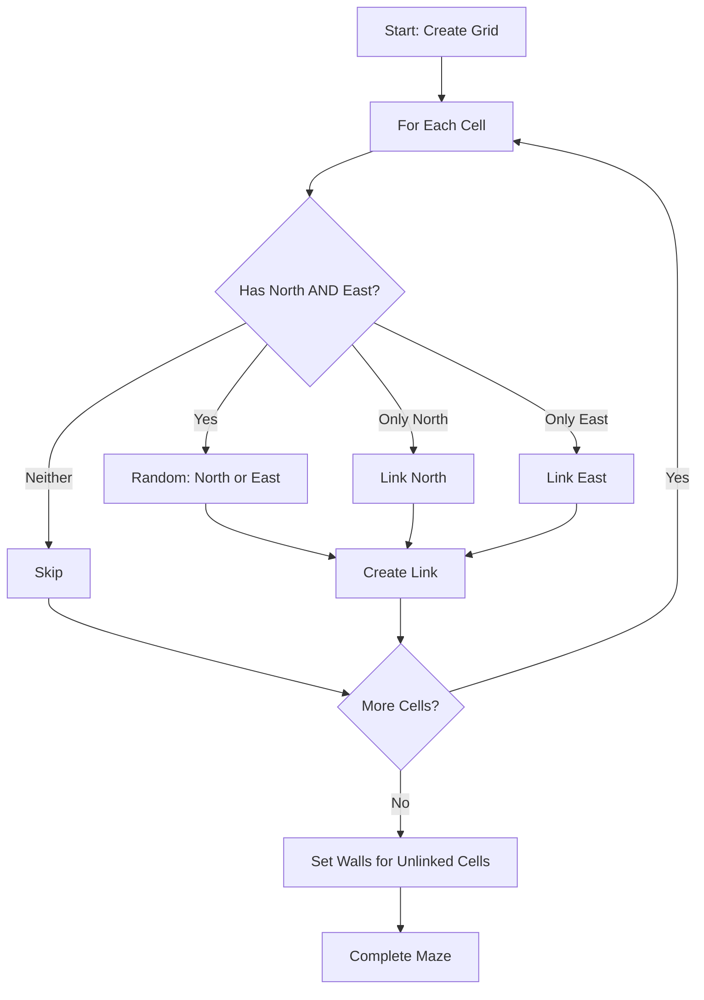

# Chapter 5: Maze Generation Algorithms

## Binary Tree Algorithm: The Simplest Starting Point

The Binary Tree algorithm is where Vanilla Roguelike began. It's the simplest maze generation algorithm, perfect for understanding the fundamentals before moving to more complex approaches.

### The Concept

For each cell in the grid, randomly choose to link it either north or east (if both are available). That's it. The entire algorithm fits in a few lines of code.

Here's how it works in Vanilla:

```ruby
module Vanilla
  module Algorithms
    class BinaryTree < AbstractAlgorithm
      def self.on(grid)
        grid.each_cell do |cell|
          has_north = !cell.north.nil?
          has_east = !cell.east.nil?
          if has_north && has_east
            cell.link(cell: rand(2) == 0 ? cell.north : cell.
                  east, bidirectional: true)
          elsif has_north
            cell.link(cell: cell.north, bidirectional: true)
          elsif has_east
            cell.link(cell: cell.east, bidirectional: true)
          end
        end

        grid.each_cell do |cell|
          if cell.links.empty?
            cell.tile = Vanilla::Support::TileType::WALL
          end
        end

        grid
      end
    end
  end
end
```

### Step-by-Step Walkthrough

Let's trace through what happens:

1. **Iterate over every cell**: The algorithm visits each cell exactly once
2. **Check available neighbors**: For each cell, see if it has a north and/or east neighbor
3. **Randomly choose**: If both exist, randomly pick one. If only one exists, use that one
4. **Create the link**: Link the cell to the chosen neighbor
5. **Set walls**: After linking, any cell with no links becomes a wall

### Visual Example

Imagine a 3x3 grid. Here's what might happen:

```
Initial state (all cells isolated):
[?][?][?]
[?][?][?]
[?][?][?]

After processing (example):
[→][→][↑]
[→][→][↑]
[→][→][↑]
```

Arrows show which direction each cell linked. Notice:
- Top row: All link east (can't link north, no neighbor)
- Right column: All link north (can't link east, no neighbor)
- Other cells: Randomly choose north or east

### Characteristics of Binary Tree Mazes

Binary Tree creates mazes with distinct properties:

**Bias toward northeast:**
- Cells always link north or east, never south or west
- This creates a diagonal bias—paths tend to flow northeast
- The northeast corner is always reachable from anywhere

**Many dead ends:**
- Because cells only link in two directions, many paths end abruptly
- This creates challenging navigation—you'll hit many dead ends

**Fast generation:**
- Visits each cell once
- Simple logic, no backtracking or complex state
- Very efficient for large grids

### Why Start Here?

Binary Tree is perfect for learning because:

1. **Simplicity**: The algorithm is easy to understand completely
2. **Immediate results**: You see a working maze right away
3. **Foundation**: Concepts learned here apply to all maze algorithms
4. **Debugging**: When something goes wrong, it's easy to trace

### The Algorithm Flow



### Understanding the Randomness

The `rand(2) == 0` check randomly chooses between north and east. This randomness is what makes each maze unique. But notice: the randomness is constrained. You can only link north or east, never south or west. This constraint is what creates the algorithm's characteristic bias.

### From Algorithm to Playable Maze

Once the algorithm runs, you have a grid with linked cells. But that's not enough for a game—you need to render it. Here's how Vanilla converts links to visual representation:

```ruby
grid.each_cell do |cell|
  if cell.links.empty?
    cell.tile = Vanilla::Support::TileType::WALL  # '#'
  else
    cell.tile = Vanilla::Support::TileType::EMPTY  # '.'
  end
end
```

Cells with links become floors (`.`). Cells without links become walls (`#`).

### The Journey Begins

This simple algorithm was Vanilla's starting point in April 2020. It wasn't perfect—the bias was obvious, dead ends were frustrating—but it worked. It created playable mazes. And that was enough to begin the journey.

From here, you can:
- Experiment with different random choices
- Try linking in different directions
- Understand why the bias exists
- Move on to more sophisticated algorithms

## Key Takeaway

The Binary Tree algorithm demonstrates the core concept of maze generation: visit cells, create links, render the result. It's simple, biased, and imperfect—but it works. Understanding this algorithm gives you the foundation to appreciate more sophisticated approaches.

## Exercises

1. **Trace the algorithm**: On paper, draw a 4x4 grid. Manually run the Binary Tree algorithm, making random choices. What does the resulting maze look like?

2. **Modify the bias**: What if you changed the algorithm to link south or west instead? How would the maze feel different?

3. **Count dead ends**: Generate a Binary Tree maze and count how many dead ends it has. Compare this to mazes from other algorithms (once you learn them).

4. **Implement it**: Try implementing Binary Tree in your own code. Start with a simple grid structure, then add the linking logic.

