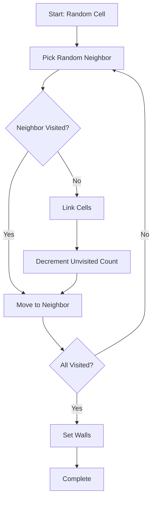
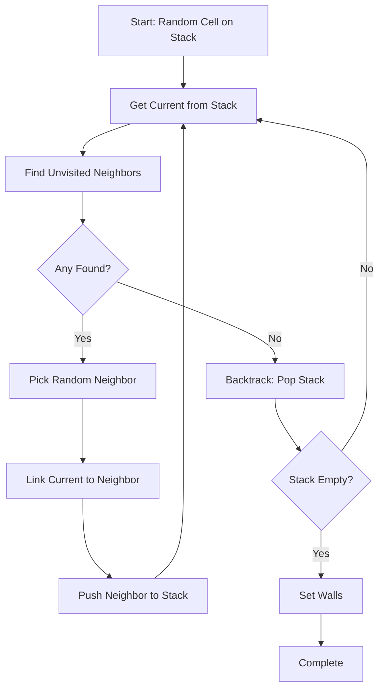
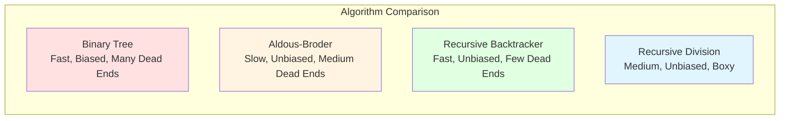

# Chapter 6: Exploring Algorithm Diversity

Once you understand Binary Tree, you're ready to explore other maze generation algorithms. Each algorithm has different characteristics, creating mazes that feel different to play. Understanding these differences helps you choose the right algorithm for your game.

## Aldous-Broder: Completely Unbiased

The Aldous-Broder algorithm creates mazes with no bias whatsoever. It's a random walk algorithm that visits every cell exactly once.

### The Concept

Start at a random cell. Then, repeatedly:
1. Pick a random neighbor
2. Move to that neighbor
3. If you haven't visited it before, link it to the previous cell
4. Repeat until every cell has been visited

Here's the Vanilla implementation:

```ruby
module Vanilla
  module Algorithms
    class AldousBroder < AbstractAlgorithm
      def self.on(grid)
        cell = grid.random_cell
        unvisited = grid.size - 1
        while unvisited > 0
          neighbor = cell.neighbors.sample
          if neighbor.links.empty?
            cell.link(cell: neighbor)
            unvisited -= 1
          end
          cell = neighbor
        end

        grid.each_cell do |cell|
          if cell.links.empty?
            cell.tile = Vanilla::Support::TileType::WALL
          end
        end

        grid
      end
    end
  end
end
```

### How It Works

The algorithm performs a random walk through the grid:



### Characteristics

**Completely unbiased:**
- No directional preference
- Every valid maze configuration is equally likely
- No northeast bias like Binary Tree

**Slower generation:**
- Random walk can take a long time
- Might visit the same cell many times before finding unvisited ones
- Worst-case time complexity is high

**Uniform distribution:**
- All mazes are equally likely
- No "typical" maze structure
- More unpredictable than other algorithms

### Performance Characteristics

**Time Complexity**: O(n²) worst case, O(n log n) average case
- The random walk can revisit cells many times before finding unvisited ones
- Worst case: might visit the same cell O(n) times before discovering an unvisited neighbor
- Average case is better but still unpredictable—you can't guarantee completion time

**Space Complexity**: O(1) additional space
- No extra data structures needed beyond the grid
- Works in-place, using only a constant amount of memory

**Performance for different grid sizes**:
- Small grids (10x10 = 100 cells): Fast (< 10ms), acceptable
- Medium grids (50x50 = 2,500 cells): Slow (100-500ms), noticeable delay
- Large grids (100x100 = 10,000 cells): Very slow (1-5 seconds), problematic
- Very large grids (500x500 = 250,000 cells): Impractical (minutes), avoid

**When to use**: Small grids only, when you want completely unbiased mazes and generation time isn't critical. Avoid for larger grids or real-time generation.

### When to Use Aldous-Broder

Use Aldous-Broder when:
- You want completely unbiased mazes
- Generation time isn't critical
- You want maximum variety

Avoid it when:
- You need fast generation
- You want predictable maze characteristics
- Performance matters

## Recursive Backtracker: Long Corridors, Fewer Dead Ends

The Recursive Backtracker creates mazes with long corridors and relatively few dead ends. It uses a depth-first search approach with backtracking.

### The Concept

1. Start at a random cell
2. While there are unvisited neighbors:
   - Pick a random unvisited neighbor
   - Link to it and move there
   - Recursively continue
3. When stuck, backtrack to the previous cell
4. Continue until all cells are visited

Here's the Vanilla implementation:

```ruby
module Vanilla
  module Algorithms
    class RecursiveBacktracker < AbstractAlgorithm
      def self.on(grid)
        stack = []
        stack.push(grid.random_cell)

        while stack.any?
          current = stack.last
          neighbors = current.neighbors.select { |cell| cell.
                links.empty? }

          if neighbors.empty?
            stack.pop
          else
            neighbor = neighbors.sample
            current.link(cell: neighbor)
            stack.push(neighbor)
          end
        end

        grid.each_cell do |cell|
          cell.tile = Vanilla::Support::TileType::WALL if cell.
                links.empty?
        end

        grid
      end
    end
  end
end
```

### How It Works

The algorithm uses a stack to track the current path:



### Characteristics

**Long corridors:**
- Depth-first search creates winding paths
- Fewer abrupt dead ends
- More "dungeon-like" feel

**Efficient generation:**
- Visits each cell exactly once
- Predictable time complexity
- Fast even for large grids

**Fewer dead ends:**
- Compared to Binary Tree, fewer cells with only one link
- More interesting navigation
- Better for gameplay

### Performance Characteristics

**Time Complexity**: O(n) where n = number of cells
- Visits each cell exactly once
- Stack operations (push/pop) are O(1)
- Linear time complexity—predictable and fast

**Space Complexity**: O(n) worst case, O(log n) to O(√n) typical
- Uses a stack to track the current path
- Worst case: stack depth equals longest path (could be O(n) for a snake-like maze)
- Typical case: stack depth is much less than n, usually logarithmic or square root
- For most mazes, space usage is reasonable

**Performance for different grid sizes**:
- Small grids (10x10 = 100 cells): Instant (< 1ms)
- Medium grids (50x50 = 2,500 cells): Very fast (< 10ms)
- Large grids (100x100 = 10,000 cells): Fast (< 50ms)
- Very large grids (500x500 = 250,000 cells): Acceptable (< 500ms)

**When to use**: Default choice for most games. Fast, predictable, and produces high-quality mazes. Best balance of performance and quality.

### When to Use Recursive Backtracker

Use Recursive Backtracker when:
- You want mazes that feel like dungeons
- You need fast, reliable generation
- You want fewer dead ends

This is Vanilla's default algorithm because it balances speed, quality, and gameplay feel.

## Recursive Division: Boxy, Rectangular Mazes

Recursive Division creates mazes with a more structured, boxy feel. It divides the space recursively, creating walls with passages.

### The Concept

1. Start with all cells linked to neighbors (open grid)
2. Recursively divide the space:
   - Choose a random wall position
   - Create a wall, leaving one passage
   - Recursively divide each side
3. Stop when regions are too small

Here's a simplified version of the Vanilla implementation:

```ruby
module Vanilla
  module Algorithms
    class RecursiveDivision < AbstractAlgorithm
      MINIMUM_SIZE = 5
      TOO_SMALL = 1

      def self.on(grid)
        new(grid).process
      end

      def process
        # Start with all cells linked
        @grid.each_cell do |cell|
          cell.neighbors.each { |n| cell.
                link(cell: n, bidirectional: false) }
        end
        divide(0, 0, @grid.rows, @grid.columns)
        @grid.each_cell { |cell| cell.tile = :WALL if cell.
              links.empty? }
        @grid
      end

      def divide(row, column, height, width)
        return if height <= TOO_SMALL || width <= TOO_SMALL

        if height > width
          divide_horizontally(row, column, height, width)
        else
          divide_vertically(row, column, height, width)
        end
      end

      def divide_horizontally(row, column, height, width)
        divide_south_of = rand(height - 1)
        passage_at = rand(width)
        width.times do |x|
          next if passage_at == x
          cell = @grid[row + divide_south_of, column + x]
          cell.unlink(cell: cell.south)
        end
        divide(row, column, divide_south_of + 1, width)
        divide(
          row + divide_south_of + 1,
          column,
          height - divide_south_of - 1,
          width
        )
      end

      def divide_vertically(row, column, height, width)
        divide_east_of = rand(width - 1)
        passage_at = rand(height)
        height.times do |y|
          next if passage_at == y
          cell = @grid[row + y, column + divide_east_of]
          cell.unlink(cell: cell.east)
        end
        divide(row, column, height, divide_east_of + 1)
        divide(
          row,
          column + divide_east_of + 1,
          height,
          width - divide_east_of - 1
          )
      end
    end
  end
end
```

### Characteristics

**Boxy, rectangular:**
- Creates more structured layouts
- Less organic than other algorithms
- Clear room-like regions

**Recursive structure:**
- Divides space hierarchically
- Creates nested regions
- Predictable structure

**Different feel:**
- Less like a traditional maze
- More like a building with rooms
- Good for certain game styles

### Performance Characteristics

**Time Complexity**: O(n log n) average case
- Recursive division creates log(n) levels of recursion
- Each level processes O(n) cells (dividing and creating walls)
- More complex than linear algorithms but still efficient
- Performance is predictable and consistent

**Space Complexity**: O(log n) for recursion stack
- Recursion depth is logarithmic (divides space in half each time)
- Each recursive call uses constant space
- Memory usage grows slowly with grid size

**Performance for different grid sizes**:
- Small grids (10x10 = 100 cells): Fast (< 5ms)
- Medium grids (50x50 = 2,500 cells): Good (< 50ms)
- Large grids (100x100 = 10,000 cells): Acceptable (< 200ms)
- Very large grids (500x500 = 250,000 cells): Slow (1-3 seconds), consider alternatives

**When to use**: When you want structured, room-like layouts. Good for medium-sized grids. For very large grids, consider faster algorithms if generation speed matters.

### When to Use Recursive Division

Use Recursive Division when:
- You want structured, room-like layouts
- You need a different aesthetic
- You want predictable maze structure

## Comparing Algorithms

Here's a quick comparison:



| Algorithm | Bias | Time Complexity | Space Complexity | Dead Ends | Feel |
|-----------|------|----------------|------------------|-----------|------|
| Binary Tree | Northeast | O(n) | O(1) | Many | Simple, biased |
| Aldous-Broder | None | O(n²) worst, O(n log n) avg | O(1) | Medium | Completely random |
| Recursive Backtracker | None | O(n) | O(n) worst, O(log n) typical | Few | Dungeon-like |
| Recursive Division | None | O(n log n) | O(log n) | Medium | Boxy, structured |

**Understanding the complexities:**
- **O(n)**: Linear time—visits each cell once. Fast and predictable for all grid sizes.
- **O(n log n)**: Slightly slower than linear, but still efficient. Performance degrades gradually as grids get larger.
- **O(n²)**: Quadratic time—can be slow for large grids. Avoid for real-time generation of large mazes.
- **O(1) space**: Constant memory—no extra data structures needed.
- **O(log n) space**: Logarithmic memory—grows slowly with grid size, usually negligible.
- **O(n) space**: Linear memory—grows with grid size, but typically much less than n in practice.

### Choosing the Right Algorithm

Consider:
- **Gameplay feel**: What kind of navigation do you want?
- **Generation speed**: How fast does it need to be?
- **Variety**: How much randomness do you want?
- **Aesthetic**: What should the mazes look like?

In Vanilla, Recursive Backtracker is the default because it balances all these factors well.

### Performance Considerations

When choosing an algorithm, consider your grid size and performance requirements:

**For small grids (< 50x50 = 2,500 cells):**
- All algorithms are fast enough (< 50ms)
- Choose based on gameplay feel and aesthetic preferences
- Complexity differences are negligible

**For medium grids (50x50 to 100x100 = 2,500-10,000 cells):**
- Binary Tree and Recursive Backtracker are fastest (both O(n))
- Recursive Division is acceptable (O(n log n))
- Avoid Aldous-Broder if generation speed matters

**For large grids (100x100 to 500x500 = 10,000-250,000 cells):**
- Binary Tree is fastest (O(n), O(1) space)
- Recursive Backtracker is fast (O(n), but uses more memory)
- Recursive Division becomes slower (O(n log n))
- Avoid Aldous-Broder—unpredictable and potentially very slow

**For very large grids (> 500x500 = 250,000+ cells):**
- Binary Tree is the clear winner (fastest, least memory)
- Recursive Backtracker is acceptable but uses more memory
- Recursive Division and Aldous-Broder are too slow

**Practical guidance:**
- **Generating at game start**: Any algorithm is fine—players won't notice a 100ms difference
- **Generating during gameplay**: Prefer O(n) algorithms (Binary Tree, Recursive Backtracker)
- **Memory constrained**: Prefer O(1) space algorithms (Binary Tree, Aldous-Broder)
- **Need predictable timing**: Avoid Aldous-Broder—its worst case is unpredictable
- **Default choice**: Recursive Backtracker—best balance of speed, quality, and predictability

## Key Takeaway

Different algorithms create different gameplay experiences. Understanding their characteristics helps you choose the right one for your game. Each algorithm teaches you something about graph theory, randomness, and procedural generation.

## Exercises

1. **Compare mazes**: Generate mazes with each algorithm. Can you see the differences? Which feels best for gameplay?

2. **Modify algorithms**: Try changing Recursive Backtracker to prefer certain directions. How does it affect the maze?

3. **Research more**: Look up other maze algorithms like Kruskal's or Prim's. How do they compare to these?

4. **Implement one**: Pick an algorithm and implement it yourself. Start with the pseudocode, then translate to code.

