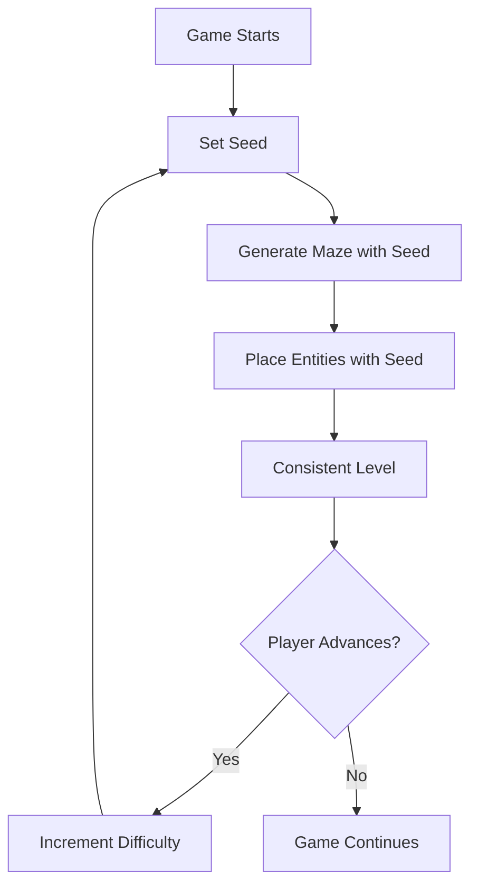
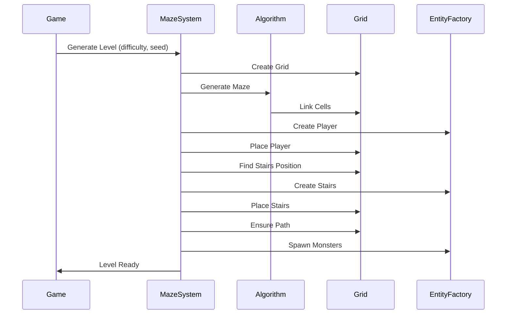

# Chapter 7: Beyond Mazes - Procedural Content

Maze generation is just the beginning. A roguelike needs more than walls and floors—it needs entities placed throughout the world. The player needs to spawn somewhere. Stairs need to lead to the next level. Monsters need to populate the dungeon. Items need to be scattered for the player to find.

This chapter explores how to place content procedurally in your generated mazes.

## Placing Entities: Player Spawn, Stairs, Items, Monsters

Once you have a generated maze, you need to populate it. This is where procedural generation extends beyond just creating the layout.

### The Challenge

Placing entities isn't just about picking random positions. You need to consider:

- **Accessibility**: Can the player reach this entity?
- **Balance**: Are entities distributed fairly?
- **Gameplay**: Do placements make the game fun?
- **Constraints**: Some entities have specific requirements

### Player Spawn

The player needs to start somewhere. In Vanilla, the player always spawns at position (0, 0):

```ruby
def populate_entities(grid)
  player = Vanilla::EntityFactory.create_player(0, 0)
  @world.add_entity(player)
  player_cell = grid[0, 0]
  player_cell.tile = player.get_component(:render).character
end
```

This is simple, but you could make it more interesting:
- Spawn at a random floor cell
- Spawn at the cell with the most open space around it
- Spawn at a "safe" location (far from monsters)

### Stairs Placement

Stairs need to be reachable and ideally challenging to reach. Vanilla places stairs at the cell farthest from the player:

```ruby
def find_stairs_position(grid, player_cell)
  distances = player_cell.distances
  farthest_cell = distances.max&.first || grid.random_cell

  # Avoid placing stairs at player's position
  if farthest_cell == player_cell
    stairs_cell = grid.random_cell
    while stairs_cell == player_cell
      stairs_cell = grid.random_cell
    end
    return { row: stairs_cell.row, column: stairs_cell.column }
  end

  { row: farthest_cell.row, column: farthest_cell.column }
end
```

This ensures:
- The stairs are at the maximum distance (encourages exploration)
- There's always a path (because mazes are spanning trees)
- The player must traverse the entire maze to reach them

### Ensuring Connectivity

Sometimes algorithms or entity placement can create disconnected regions. Vanilla ensures there's always a path from player to stairs:

```ruby
def ensure_path(grid, start_cell, goal_cell)
  current = start_cell
  until current == goal_cell
    next_cell = [current.north, current.south, current.east, current.west]
      .compact
      .min_by { |cell| manhattan_distance(cell, goal_cell) }

    if next_cell
      current.link(cell: next_cell, bidirectional: true)
      current = next_cell
    end
  end
end
```

This creates a guaranteed path using a simple greedy approach: always move toward the goal.

## Seeding for Reproducibility

One of the most powerful features of procedural generation is **seeding**—the ability to generate the same world by using the same random seed.

### Why Seeding Matters

Seeds enable:
- **Debugging**: Reproduce bugs by using the same seed
- **Testing**: Test specific scenarios consistently
- **Sharing**: Players can share interesting seeds
- **Replayability**: Revisit favorite levels

### How Seeding Works

In Vanilla, the seed is set when the game starts:

```ruby
def initialize(world, difficulty:, seed: Random.new_seed)
  @seed = seed
  srand(@seed)  # Set the random number generator seed
end
```

Then all random operations use this seed:

```ruby
# In maze generation
neighbor = neighbors.sample  # Uses the seed

# In entity placement
random_cell = grid.random_cell  # Uses the seed
```

### Seed-Based Generation Flow



Same seed + same algorithm = same level. This predictability is crucial for debugging and testing.

## Difficulty Scaling

As players progress, levels should become more challenging. Vanilla uses a simple difficulty system:

```ruby
def initialize(world, difficulty:, seed: Random.new_seed)
  @difficulty = difficulty
  @seed = seed
  # Difficulty affects monster spawning, not maze generation
end
```

### Scaling Strategies

**Monster density:**
- More monsters on deeper levels
- Stronger monsters as difficulty increases
- Different monster types at different depths

**Item rarity:**
- Better items on deeper levels
- More items to compensate for difficulty
- Rare items only at high difficulty

**Maze complexity:**
- Larger mazes at higher difficulty
- More complex algorithms for deeper levels
- More dead ends (harder navigation)

**Resource scarcity:**
- Fewer healing items
- More traps or hazards
- Limited resources force careful play

### Vanilla's Approach

Currently, Vanilla's difficulty primarily affects monster spawning:

```ruby
monster_system.spawn_monsters(@difficulty, grid)
```

The maze generation algorithm stays the same, but more (or stronger) monsters appear as difficulty increases. This is a simple approach that works, but you could make it more sophisticated.

## Procedural Item Placement

Items need to be placed thoughtfully. Random placement can create unfair situations or boring gameplay.

### Placement Strategies

**Random floor cells:**
- Simple but can create clusters
- Might place items in unreachable areas
- Fast but unpredictable

**Distance-based:**
- Place items at certain distances from player
- Ensures items are reachable
- Can create interesting exploration patterns

**Room-based:**
- If you have rooms, place items in rooms
- More structured, less random
- Feels more intentional

**Guaranteed minimums:**
- Ensure at least N items per level
- Prevent "empty" levels
- Balance gameplay

### Vanilla's Loot System

Vanilla uses a loot system that places items when monsters die (see Chapter 16). But you could also place items during level generation:

```ruby
def place_items(grid, difficulty)
  item_count = calculate_item_count(difficulty)
  floor_cells = grid.each_cell.select { |c| !c.links.empty? }

  item_count.times do
    cell = floor_cells.sample
    item = create_random_item
    place_item_at(cell, item)
  end
end
```

## Putting It All Together

Level generation in Vanilla follows this flow:



Each step uses the seed for reproducibility, and difficulty affects entity placement.

## Key Takeaway

Procedural generation extends far beyond maze creation. Entity placement, seeding, and difficulty scaling all contribute to creating interesting, playable levels. The same principles of algorithms and randomness apply, but now you're generating content, not just structure.

## Exercises

1. **Experiment with placement**: Modify Vanilla's entity placement. What happens if you place stairs randomly instead of at the farthest point?

2. **Test seeds**: Run Vanilla with the same seed multiple times. Does it generate the same level? What if you change the algorithm but keep the seed?

3. **Design difficulty scaling**: How would you scale difficulty in your roguelike? What would change between level 1 and level 10?

4. **Place items**: Implement a simple item placement system. How do you ensure items are reachable? How do you prevent clustering?

