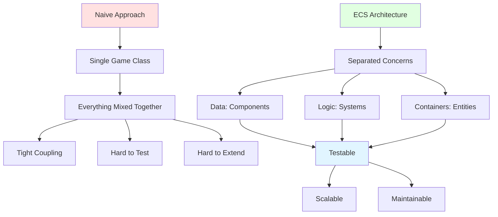

# Chapter 8: The Architecture Problem

## The Naive Approach: Everything in One Class

When you first start building a roguelike, the simplest approach seems obvious: put everything in one place. A `Game` class that handles input, movement, rendering, combat, and everything else. It works, and for a small game, it might even be fine.

But as your game grows, problems emerge.

### What the Naive Approach Looks Like

```ruby
class Game
  def initialize
    @player = { x: 0, y: 0, health: 100 }
    @monsters = []
    @grid = create_grid
  end

  def update
    handle_input
    move_player
    move_monsters
    check_collisions
    check_combat
    render
  end

  def handle_input
    # Input handling code
  end

  def move_player
    # Movement code
  end

  def move_monsters
    # Monster AI code
  end

  def check_collisions
    # Collision detection code
  end

  def check_combat
    # Combat code
  end

  def render
    # Rendering code
  end
end
```

This works. The game runs. But as you add features, this class grows. It becomes a thousand-line monster that's hard to understand, hard to test, and hard to modify.

## Signs of Trouble

How do you know when your architecture is breaking down? Here are the warning signs:

### Tight Coupling

Classes know too much about each other. The `Game` class knows exactly how `Monster` works. The `Monster` class knows how `Combat` works. Changing one thing breaks three others.

**Example:**
```ruby
def check_combat
  @monsters.each do |monster|
    if monster.x == @player.x && monster.y == @player.y
      damage = @player.attack_power - monster.defense
      monster.health -= damage
      if monster.health <= 0
        @monsters.delete(monster)
        @player.gold += monster.gold_drop
      end
    end
  end
end
```

This code is tightly coupled. It knows:
- How monsters are stored
- How player position works
- How combat damage is calculated
- How monsters die
- How gold is awarded

Change any of these, and this method might break.

### Unpredictable Behavior

You make a small change in one place, and something completely unrelated breaks. You fix a bug in movement, and suddenly combat stops working. The codebase feels like a house of cards.

**The problem:** Everything is connected to everything else. There's no clear separation of concerns.

### Hard to Test

You want to test combat, but you can't because combat is mixed with movement, rendering, and input handling. You can't test one thing in isolation.

**Example:**
```ruby
# How do you test this?
def update
  handle_input
  move_player
  move_monsters
  check_collisions
  check_combat
  render
end
```

You'd have to mock the entire game state, set up input, create monsters, and render—just to test if combat damage calculation works.

### Logic in the Wrong Places

The `LevelGenerator` class starts handling entity management. The `Game` class becomes a catch-all for game state, rendering, and input handling. Components become tightly coupled.

**Example from Vanilla's history:**
```ruby
class LevelGenerator
  def generate
    # Generate maze
    # ... maze code ...

    # Wait, I need to place the player
    @game.player.position = [0, 0]

    # And monsters
    @game.monsters = spawn_monsters

    # And items
    @game.items = spawn_items
  end
end
```

The `LevelGenerator` shouldn't know about the game's entity management. But without a clear architecture, code drifts into the wrong places.

## The "Breaking Point" Story

In March 2025, Vanilla Roguelike hit its breaking point. The game had grown organically over five years. Features were added as needed, but without a clear architectural pattern.

### The Crisis

The breaking point came when trying to remove legacy code broke everything. The game rendered but wouldn't accept input. Movement stopped working. Level transitions failed. Monsters didn't spawn. The game was completely non-functional.

Here's what the commit message said:

```
BREAKINGPOINT: Game renders but stays in a loop, prevents input

The game now is in a constant loop (the screen is flickering,
hence my assumption). We can't move forward until we fix this issue.
```

### The Symptoms

- **Game rendered**: The screen showed the maze
- **Input blocked**: Keyboard input was ignored
- **Movement disabled**: Player couldn't move
- **Level transitions broken**: Stairs didn't work
- **Monster spawning failed**: No monsters appeared

Everything was broken, and it wasn't clear why. The architecture had become so tangled that removing one piece broke everything else.

### The Root Cause

The architecture had drifted. Code that should have been separate was intertwined. Systems depended on each other in unpredictable ways. There was no clear pattern for how things should work together.

### The Decision

Two choices:
1. **Give up**: The game was broken, maybe it wasn't worth fixing
2. **Refactor**: Commit to fixing the architecture properly

The choice was to refactor. It was painful—nine hours of debugging, 20+ commits, and many moments of frustration. But it saved the project.

## Recognizing When Architecture Needs to Change

You don't have to wait for a breaking point. Here are signs that it's time to refactor:

### Every Feature Requires Changes in Multiple Places

You want to add a new monster type. You have to modify:
- The `Monster` class
- The `Combat` system
- The `Render` system
- The `AI` system
- The `LevelGenerator`

This is a sign that responsibilities aren't clearly separated.

### You're Afraid to Change Code

You see a bug, but you're hesitant to fix it because you don't know what else might break. This is a sign of tight coupling and unclear dependencies.

### Testing Is Difficult

You can't test individual features because they're all mixed together. This is a sign that code isn't modular.

### The Codebase Feels Fragile

Small changes cause unexpected breakage. The codebase feels like it could collapse at any moment. This is a sign that architecture has drifted too far.

## The Solution: Proper Architecture

The solution isn't to avoid architecture—it's to choose the right one. For roguelikes, Entity-Component-System (ECS) provides a pattern that:



- Separates data from behavior
- Makes systems independent and testable
- Allows flexible composition of game objects
- Scales as your game grows

But before we dive into ECS, it's important to understand why architecture matters. The breaking point in Vanilla wasn't a failure—it was a forced learning moment that led to a better architecture.

## Key Takeaway

Architecture problems don't appear overnight. They accumulate gradually as you add features. Recognizing the signs early—tight coupling, unpredictable behavior, hard-to-test code—helps you refactor before hitting a breaking point. But even breaking points can be valuable if they force you to learn proper patterns.

## Exercises

1. **Identify coupling**: Look at a project you've worked on. Can you find examples of tight coupling? Where does one class know too much about another?

2. **Trace dependencies**: Pick a feature in your codebase. How many other parts of the code does it depend on? Could it be more independent?

3. **Test isolation**: Try to write a test for one feature. How much setup do you need? Can you test it in isolation, or do you need the entire game running?

4. **Refactor practice**: Pick a small, tightly coupled piece of code. How would you refactor it to reduce coupling? What patterns would help?

