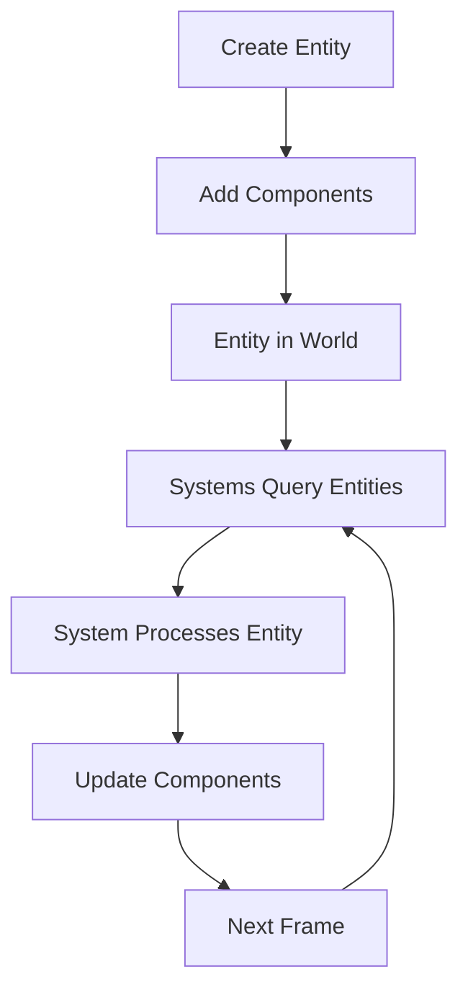
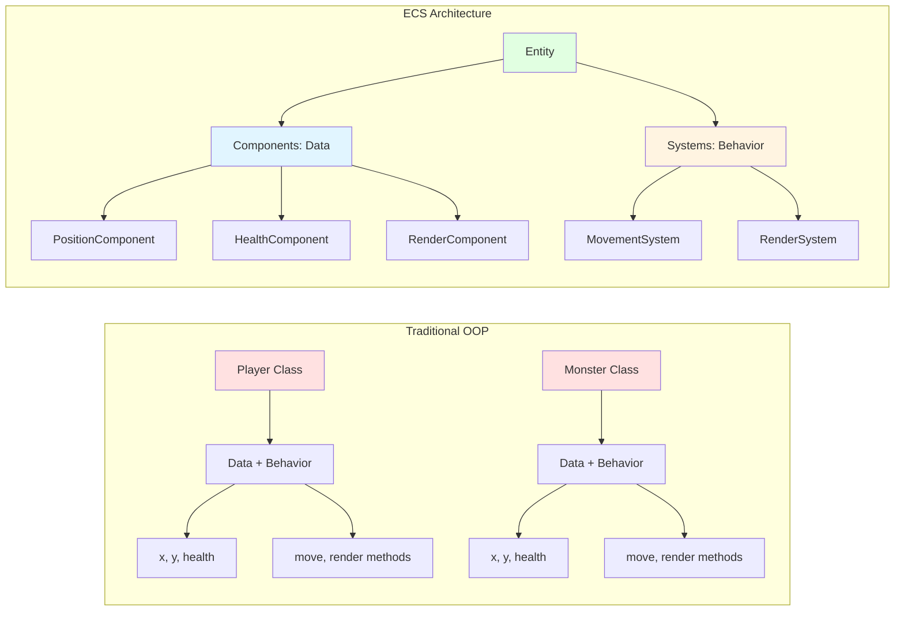

# Chapter 9: Introduction to Entity-Component-System (ECS)

## The Problem ECS Solves: Flexibility and Composition

Traditional object-oriented game development uses inheritance. You have a `Player` class, a `Monster` class, an `Item` class. Each class contains both data and behavior. This works, but it has limitations.

**The problem:** What if you want a monster that can fly? You create a `FlyingMonster` class. What if you want a monster that's also an item? You're stuck—you can't inherit from both `Monster` and `Item`.

**The ECS solution:** Instead of classes with inheritance, you compose entities from components. Want a flying monster? Add a `FlyingComponent`. Want a monster that's also an item? Add both `MonsterComponent` and `ItemComponent`.

ECS separates:
- **What exists** (Entities)
- **What something is** (Components)
- **How things work** (Systems)

This separation provides the flexibility that traditional inheritance lacks.

## Core Concepts

### Entities: What Exists

Entities are the simplest part of ECS. They're just containers with a unique ID. They don't contain logic. They don't have methods (beyond basic component management). They're just IDs.

In Vanilla:

```ruby
module Vanilla
  module Entities
    class Entity
      attr_reader :id

      def initialize(id: nil)
        @id = id || SecureRandom.uuid
        @components = []
        @component_map = {}
      end

      def add_component(component)
        type = component.type
        @components << component
        @component_map[type] = component
        self
      end

      def get_component(type)
        @component_map[type]
      end

      def has_component?(type)
        @component_map.key?(type)
      end
    end
  end
end
```

That's it. An entity is just an ID and a way to store components. No game logic. No behavior. Just a container.

### Components: What Something Is

Components are pure data. They define *what* an entity is, not *how* it behaves. A `PositionComponent` says "this entity has a position." A `HealthComponent` says "this entity has health." That's all.

In Vanilla:

```ruby
module Vanilla
  module Components
    class PositionComponent < Component
      attr_reader :row, :column

      def initialize(row:, column:)
        super()
        @row = row
        @column = column
      end

      def type
        :position
      end
    end
  end
end
```

No logic. Just data. The component stores the row and column. That's it.

### Systems: How Things Work

Systems contain the logic. They operate on entities that have specific component combinations. A `MovementSystem` processes entities that have both `PositionComponent` and `MovementComponent`. A `RenderSystem` draws entities that have `PositionComponent` and `RenderComponent`.

In Vanilla:

```ruby
module Vanilla
  module Systems
    class MovementSystem < System
      def update(_delta_time)
        movable_entities = entities_with(
          :position,
          :movement,
          :input,
          :render
        )
        movable_entities.
              each { |entity| process_entity_movement(entity) }
      end
    end
  end
end
```

The system queries for entities with specific components, then processes them. The logic is in the system, not in the entity or component.

## Mental Model: Nouns, Adjectives, Verbs

A helpful way to think about ECS:

- **Entities** are **nouns**: Player, Monster, Sword
- **Components** are **adjectives**: HasPosition, HasHealth, CanMove
- **Systems** are **verbs**: Move, Render, Attack

You compose entities by adding components (adjectives). Systems (verbs) act on entities that have the right components.

**Example:**
- Entity: "Monster"
- Components: PositionComponent (has position), HealthComponent (has health), RenderComponent (can be seen)
- Systems: MovementSystem (can move it), RenderSystem (can draw it), CombatSystem (can fight with it)

Want a flying monster? Add a `FlyingComponent`. The `MovementSystem` checks for `FlyingComponent` and allows movement through walls. No new class needed. Just add a component.

## Why ECS Exists

ECS solves several problems:

### Flexibility

You can compose entities in any way. Want a monster that's also an item? Add both `MonsterComponent` and `ItemComponent`. Want a player that can't move? Remove the `MovementComponent`. The architecture supports any combination.

### Separation of Concerns

Data (components) is separate from behavior (systems). This makes code easier to understand, test, and modify.

### Reusability

Systems are reusable. The `MovementSystem` works on any entity with `PositionComponent` and `MovementComponent`. It doesn't care if it's a player, monster, or item.

### Testability

You can test systems in isolation. Create test entities with the right components, pass them to the system, verify the behavior. No need to set up the entire game.

### Scalability

As your game grows, you add new components and systems. You don't need to modify existing code. The architecture scales naturally.

## The ECS Flow

Here's how ECS works in practice:



1. **Create Entity**: Make a new entity (just an ID)
2. **Add Components**: Attach components that define what it is
3. **World Registration**: Add entity to the world
4. **System Queries**: Systems find entities with the components they need
5. **System Processing**: Systems update entities based on their components
6. **Component Updates**: Components store the new state
7. **Repeat**: Next frame, systems query and process again

## ECS vs. Traditional OOP



**Traditional OOP:**
```ruby
class Player
  def initialize
    @x = 0
    @y = 0
    @health = 100
  end

  def move(direction)
    # Movement logic here
  end

  def render
    # Rendering logic here
  end
end
```

**ECS:**
```ruby
# Entity
player = Entity.new
player.add_component(PositionComponent.new(row: 0, column: 0))
player.add_component(HealthComponent.new(max_health: 100))
player.add_component(RenderComponent.new(character: '@'))

# Systems handle the logic
MovementSystem.
      process(player)  # System moves entities with PositionComponent
RenderSystem.
      process(player)   # System renders entities with RenderComponent
```

The difference: In OOP, the `Player` class contains both data and behavior. In ECS, components contain data, and systems contain behavior.

## Key Takeaway

ECS separates data from behavior, providing flexibility and scalability that traditional inheritance lacks. Entities are containers, components are data, and systems are logic. This separation makes code more modular, testable, and extensible. Understanding this philosophy is the foundation for building with ECS.

## Exercises

1. **Think in ECS**: Pick a game object (like a sword). What components would it have? What systems would process it?

2. **Compare approaches**: Think about how you'd implement a "flying monster" in traditional OOP vs. ECS. Which is more flexible?

3. **Component composition**: What components would a "healing potion" entity have? What about a "cursed sword that drains health"?

4. **System queries**: If you have a `CombatSystem`, what components should it look for? What components would an entity need to participate in combat?

