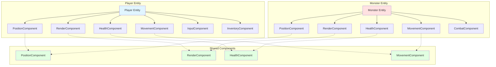

# Chapter 10: Building ECS - Entities and Components

## Entities: Just IDs and Component Containers

Entities are the simplest part of ECS. They're just containers with unique IDs. They don't contain logic. They don't have game-specific methods. They're just a way to group components together.

### Entity Structure

In Vanilla, an entity is remarkably simple:

```ruby
module Vanilla
  module Entities
    class Entity
      attr_reader :id, :components
      attr_accessor :name

      def initialize(id: nil)
        @id = id || SecureRandom.uuid
        @components = []
        @component_map = {}
        @tags = Set.new
        @name = "Entity_#{@id[0..7]}"
      end

      def add_component(component)
        type = component.type
        raise ArgumentError,
              "Entity already has component of type #{type}" if
                    @component_map.key?(type)

        @components << component
        @component_map[type] = component
        self
      end

      def get_component(type)
        @component_map[type]
      end

      def has_component?(type)
        @component_map.key?(type)
      end

      def remove_component(type)
        component = @component_map[type]
        return nil unless component

        @components.delete(component)
        @component_map.delete(type)
        component
      end
    end
  end
end
```

That's the entire entity class. It:
- Stores a unique ID
- Maintains a list of components
- Provides methods to add, get, and check for components
- Optionally supports tags for quick lookups

### No Logic, Just Data Storage

Notice what's **not** in the entity:
- No `move()` method
- No `attack()` method
- No `render()` method
- No game-specific logic

The entity is just a container. All behavior lives in systems.

### Component Composition: Mix and Match Capabilities

The power of ECS comes from composing entities with different components. Want a player? Add player components. Want a monster? Add monster components. Want something that's both? Add both sets of components.



**Example: Creating a player**
```ruby
player = Entity.new
player.add_component(PositionComponent.new(row: 0, column: 0))
player.add_component(RenderComponent.
      new(character: '@', color: :white))
player.add_component(HealthComponent.new(max_health: 100))
player.add_component(MovementComponent.new(active: true))
player.add_component(InputComponent.new)
player.add_tag(:player)
```

**Example: Creating a monster**
```ruby
monster = Entity.new
monster.add_component(PositionComponent.new(row: 5, column: 5))
monster.add_component(RenderComponent.new(character: 'M'))
monster.add_component(HealthComponent.new(max_health: 50))
monster.add_component(MovementComponent.new(active: true))
monster.add_component(CombatComponent.
      new(attack_power: 10, defense: 5))
```

Notice: Both have `PositionComponent`, `RenderComponent`, `HealthComponent`, and `MovementComponent`. The systems that process these components work on both player and monsters. That's the power of composition.

## Components: Pure Data Structures

Components are pure data. They define *what* an entity is, not *how* it behaves. They're simple data containers with no logic.

### The Component Base Class

All components in Vanilla inherit from a base `Component` class. This base class provides the foundation for the component system:

```ruby
module Vanilla
  module Components
    # Base class for all components
    class Component
      # Registry of component types to their implementation classes
      @component_classes = {}

      class << self
        # Register a component subclass
        def register(klass)
          instance = klass.new rescue return
          type = instance.type rescue return
          @component_classes[type] = klass
        end

        # Get a component class by type
        def get_class(type)
          @component_classes[type]
        end
      end

      # Initialize the component and check that type is implemented
      def initialize(*)
        type
      end

      # Required method that returns the component type
      # @return [Symbol] the component type
      def type
        raise NotImplementedError, "Component subclasses must implement #type"
      end

      # Convert component to a hash representation
      def to_hash
        { type: type }
      end
    end
  end
end
```

**Key points:**
- **`type` method**: Every component must implement this method, returning a symbol (e.g., `:position`, `:health`)
- **Registration**: The base class maintains a registry of component types (used for serialization and lookup)
- **Initialization check**: The base class ensures `type` is implemented when a component is created
- **Serialization**: The `to_hash` method provides a basic serialization format

For most components, you only need to:
1. Inherit from `Component`
2. Implement the `type` method
3. Store your data in instance variables

The base class handles the rest. This is why you see `super()` in component initializers—it calls the base class initialization which verifies `type` is implemented.

### PositionComponent: Where Something Is

```ruby
module Vanilla
  module Components
    class PositionComponent < Component
      attr_reader :row, :column

      def initialize(row:, column:)
        super()
        @row = row
        @column = column
      end

      def type
        :position
      end

      def set_position(row, column)
        @row = row
        @column = column
      end

      def to_hash
        { type: type, row: @row, column: @column }
      end
    end
  end
end
```

This component stores a position. That's it. No movement logic. No collision detection. Just data.

### RenderComponent: How It Looks

```ruby
module Vanilla
  module Components
    class RenderComponent < Component
      attr_reader :character, :color, :layer

      def initialize(character:, color: nil, layer: 0)
        @character = character
        @color = color
        @layer = layer
        super()
      end

      def type
        :render
      end
    end
  end
end
```

This component stores visual information. The `RenderSystem` uses it to draw the entity, but the component itself doesn't know how to render.

### HealthComponent: How Much Damage It Can Take

```ruby
module Vanilla
  module Components
    class HealthComponent < Component
      attr_reader :max_health, :current_health

      def initialize(max_health:, current_health: nil)
        @max_health = max_health
        @current_health = current_health || max_health
      end

      def type
        :health
      end

      def current_health=(value)
        @current_health = [value, @max_health].min
      end
    end
  end
end
```

This component stores health values. The `CombatSystem` reads and modifies it, but the component doesn't know about combat.

### MovementComponent: Can It Move?

```ruby
module Vanilla
  module Components
    class MovementComponent < Component
      attr_reader :speed, :active

      def initialize(active: true, speed: 1)
        super()
        @active = active
        @speed = speed
      end

      def type
        :movement
      end

      def active?
        !!@active
      end
    end
  end
end
```

This component indicates whether an entity can move. The `MovementSystem` checks `active?` before processing movement.

### Design Principles: Components Define Capabilities

Key principles for designing components:

1. **Pure data**: No logic, just storage
2. **Single responsibility**: Each component represents one aspect
3. **Composable**: Components can be combined in any way
4. **System-agnostic**: Components don't know which systems use them

**Good component:**
```ruby
class PositionComponent
  attr_reader :row, :column
  # Just stores position data
end
```

**Bad component:**
```ruby
class PositionComponent
  attr_reader :row, :column

  def move(direction)
    # Don't put logic in components!
    case direction
    when :north then @row -= 1
    # ...
    end
  end
end
```

The logic belongs in `MovementSystem`, not in the component.

## Component Examples from Vanilla

### CombatComponent

```ruby
class CombatComponent < Component
  attr_reader :attack_power, :defense, :accuracy

  def initialize(attack_power:, defense:, accuracy: 0.8)
    @attack_power = attack_power
    @defense = defense
    @accuracy = accuracy
    super()
  end

  def type
    :combat
  end
end
```

Stores combat stats. The `CombatSystem` uses these values, but the component doesn't know about combat logic.

### InventoryComponent

```ruby
class InventoryComponent < Component
  def initialize(capacity: 10)
    @items = []
    @capacity = capacity
    super()
  end

  def type
    :inventory
  end

  def add_item(item)
    return false if @items.size >= @capacity
    @items << item
    true
  end

  def items
    @items.dup
  end
end
```

Stores a list of items. The `InventorySystem` manages adding and removing items, but the component just stores the list.

## Creating Entities with Components

Vanilla uses a factory pattern to create common entities:

```ruby
module Vanilla
  class EntityFactory
    def self.create_player(row, column)
      player = Entity.new
      player.add_component(PositionComponent.
            new(row: row, column: column))
      player.add_component(RenderComponent.
            new(character: '@', color: :white))
      player.add_component(HealthComponent.new(max_health: 100))
      player.add_component(MovementComponent.new(active: true))
      player.add_component(InputComponent.new)
      player.add_component(InventoryComponent.new(capacity: 20))
      player.add_tag(:player)
      player.name = "Player"
      player
    end

    def self.create_monster(type, row, column, health, attack)
      monster = Entity.new
      monster.add_component(PositionComponent.
            new(row: row, column: column))
      monster.add_component(RenderComponent.new(character: 'M'))
      monster.add_component(HealthComponent.new(max_health: health))
      monster.add_component(MovementComponent.new(active: true))
      monster.add_component(CombatComponent.
            new(attack_power: attack, defense: 5))
      monster.add_tag(:monster)
      monster.name = "Monster"
      monster
    end
  end
end
```

The factory composes entities from components. This makes it easy to create variations: a fast monster (higher speed in `MovementComponent`), a strong monster (higher attack in `CombatComponent`), or a flying monster (add a `FlyingComponent`).

## Key Takeaway

Entities are simple containers. Components are pure data. This separation allows flexible composition—you can create any combination of capabilities by mixing and matching components. The data lives in components, and systems provide the behavior. This is the foundation of ECS.

## Exercises

1. **Design components**: Think of a new game feature (like flying). What component would you create? What data would it store?

2. **Compose entities**: Design an entity that's both a monster and an item. What components would it have?

3. **Component principles**: Look at Vanilla's components. Do they follow the "pure data" principle? Can you find any logic that shouldn't be there?

4. **Create a factory**: Design an `EntityFactory` method for a new entity type. What components does it need?

