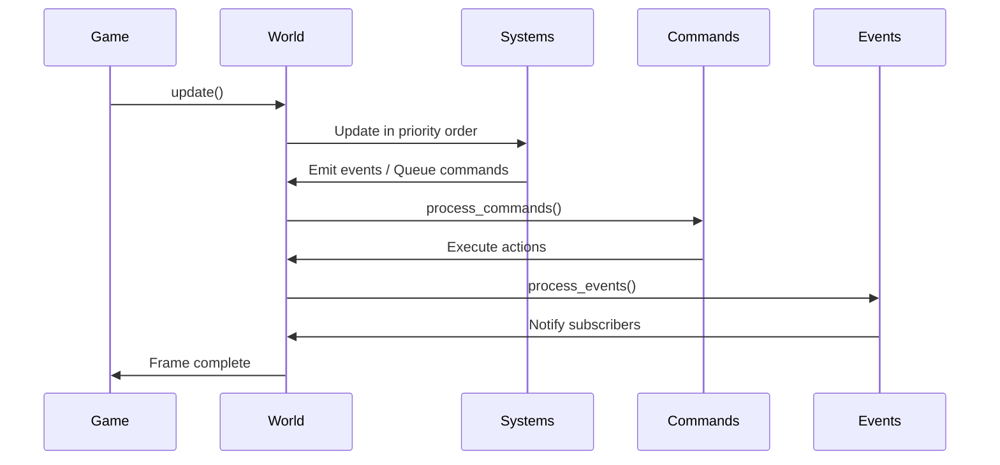
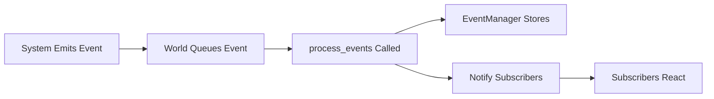
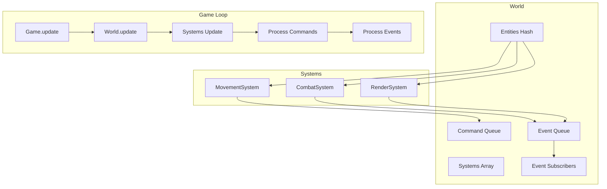

# Chapter 12: The World Coordinator

## World Class: Managing Entities, Systems, Commands, Events

The `World` class is the coordinator of the ECS architecture. It doesn't contain game logic itself—instead, it manages entities, systems, commands, and events. Think of it as a stage manager: it doesn't perform, but it ensures everything runs smoothly.

### World Structure

In Vanilla, the `World` class manages:

```ruby
module Vanilla
  class World
    attr_reader :entities, :systems, :display, :current_level
    attr_accessor :quit, :level_changed

    def initialize
      @entities = {}                    # Hash of entity_id => Entity
      @systems = []                     # Array of [System, Priority] pairs
      @quit = false                     # Game exit flag
      @display = DisplayHandler.new     # Rendering handler
      @current_level = nil              # Current level data
      @level_changed = false            # Level transition flag
      @event_subscribers = Hash.new { |h, k| h[k] = [] }  # Event subscriptions
      @event_queue = Queue.new          # Pending events
      @command_queue = Queue.new       # Pending commands
    end
  end
end
```

The world stores:
- **Entities**: All game objects
- **Systems**: All game systems with their priorities
- **Commands**: Queued actions to execute
- **Events**: Queued events to process
- **Subscribers**: Systems that listen to specific events

## Game Loop Integration: How Systems Update in Sequence

The world's `update` method is called each frame (or turn, in a turn-based game):

```ruby
def update(_unused)
  # Update all systems in priority order
  @systems.each do |system, _|
    system.update(nil)
  end

  # Process commands before events
  process_commands
  process_events
end
```

The update flow:



### System Execution Order

Systems are stored with priorities and sorted:

```ruby
def add_system(system, priority = 0)
  @systems << [system, priority]
  @systems.sort_by! { |_system, system_priority| system_priority }
  system
end
```

Lower priority numbers run first. This ensures:
- Maze generation (priority 0) runs before everything
- Input (priority 1) is processed early
- Movement (priority 2) happens before rendering
- Rendering (priority 10) happens last

## Command Pattern: Encapsulating User Actions

Commands encapsulate user actions as objects. This provides:
- **Undo/redo capability** (future feature)
- **Command queuing** (execute later)
- **Easy logging** (record all actions)
- **Decoupling** (input doesn't directly modify game state)

### Command Structure

In Vanilla, commands inherit from a base `Command` class:

```ruby
module Vanilla
  module Commands
    class Command
      def execute(world)
        raise NotImplementedError
      end
    end
  end
end
```

### MoveCommand Example

```ruby
module Vanilla
  module Commands
    class MoveCommand < Command
      def initialize(entity, direction)
        @entity = entity
        @direction = direction
      end

      def execute(world)
        movement_system = world.systems.find { |s, _| s.is_a?(MovementSystem) }&.first
        movement_system.move(@entity, @direction)
      end
    end
  end
end
```

The command:
- Encapsulates the action (move entity in direction)
- Executes when processed
- Doesn't modify state directly—delegates to systems

### Command Queue Processing

Commands are queued and processed after systems update:

```ruby
def queue_command(command)
  @command_queue << command
end

def process_commands
  until @command_queue.empty?
    command = @command_queue.shift
    command.execute(self)
  end
end
```

This ensures:
- Commands execute in order
- Systems update before commands process
- Commands can queue more commands (for chaining)

## Event System: Decoupled Communication

Events allow systems to communicate without direct dependencies. A system emits an event, and other systems can subscribe to react.

### Event Emission

Systems emit events through the world:

```ruby
def emit_event(event_type, data = {})
  @event_queue << [event_type, data]
end
```

Events are queued and processed after commands:

```ruby
def process_events
  event_manager = Vanilla::ServiceRegistry.get(:event_manager)

  until @event_queue.empty?
    event_type, data = @event_queue.shift

    # Store event
    event_manager.publish_event(event_type, self, data) if event_manager

    # Notify subscribers
    @event_subscribers[event_type].each do |subscriber|
      subscriber.handle_event(event_type, data)
    end
  end
end
```

### Event Subscription

Systems subscribe to events they care about:

```ruby
def subscribe(event_type, subscriber)
  @event_subscribers[event_type] << subscriber
end
```

**Example:**
```ruby
# MazeSystem subscribes to level transition events
@world.subscribe(:level_transition_requested, self)

def handle_event(event_type, data)
  return unless event_type == :level_transition_requested
  @world.level_changed = true  # Trigger regeneration
end
```

### Event Flow



## Entity Management

The world provides methods to manage entities:

```ruby
def add_entity(entity)
  @entities[entity.id] = entity
  entity
end

def remove_entity(entity_id)
  @entities.delete(entity_id)
end

def get_entity(entity_id)
  @entities[entity_id]
end

def query_entities(component_types)
  return @entities.values if component_types.empty?

  @entities.values.select do |entity|
    component_types.all? { |type| entity.has_component?(type) }
  end
end
```

These methods allow:
- Adding/removing entities
- Looking up entities by ID
- Querying entities by component types (used by systems)

## Level Management

The world manages the current level:

```ruby
def set_level(level)
  @current_level = level
end

def grid
  @current_level&.grid
end

def level_changed?
  changed = @level_changed
  @level_changed = false  # Reset after querying
  changed
end
```

Levels contain the grid and entities. The world provides access to the current level for systems that need it.

## Putting It All Together

Here's how the world coordinates everything:



## Key Takeaway

The `World` class is the coordinator of ECS. It manages entities, systems, commands, and events without containing game logic itself. It ensures systems run in the right order, commands execute properly, and events are delivered to subscribers. Understanding the world's role is essential for building with ECS.

## Exercises

1. **Trace the flow**: Follow a player movement from input to rendering. How does it flow through the world?

2. **Design commands**: What other commands might you need? How would you implement an `AttackCommand`?

3. **Event design**: What events would you emit when a player picks up an item? Who would subscribe to them?

4. **World queries**: How does `query_entities` work? Why is it important for systems?

