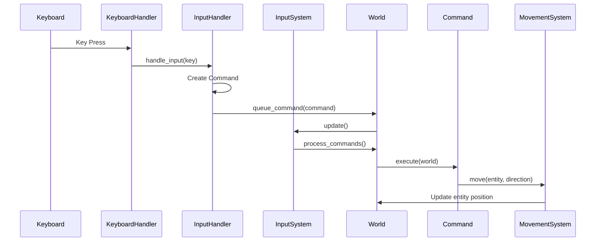

# Chapter 13: Input and Movement

## Input Handling: Keyboard → Commands → Systems

Input in a roguelike flows through multiple layers before affecting the game state. This separation allows for flexibility, testing, and proper architecture.

### The Input Flow



### InputHandler: Converting Keys to Commands

The `InputHandler` converts raw keyboard input into command objects:

```ruby
module Vanilla
  class InputHandler
    def handle_input(key, entity)
      case key
      when 'k', :up then MoveCommand.new(entity, :north)
      when 'j', :down then MoveCommand.new(entity, :south)
      when 'h', :left then MoveCommand.new(entity, :west)
      when 'l', :right then MoveCommand.new(entity, :east)
      when 'q' then ExitCommand.new
      else NullCommand.new
      end
    end
  end
end
```

This handler:
- Supports both vim keys (h, j, k, l) and arrow keys
- Creates command objects instead of directly modifying state
- Returns `NullCommand` for unrecognized keys (no-op)

### Terminal Input: DisplayHandler and KeyboardHandler

Before input reaches the `InputHandler`, it flows through terminal input handlers. These are simple wrappers around Ruby's standard library:

**DisplayHandler**: A simple wrapper that provides access to input and rendering:

```ruby
module Vanilla
  class DisplayHandler
    attr_reader :keyboard_handler

    def initialize
      @keyboard_handler = Vanilla::KeyboardHandler.new
    end
  end
end
```

**KeyboardHandler**: Does the actual work of reading keyboard input:

```ruby
module Vanilla
  class KeyboardHandler
    def wait_for_input
      $stdin.raw { $stdin.getc }
    end
  end
end
```

The `KeyboardHandler` uses Ruby's `io/console` library (via `require 'io/console'`) to read single keypresses without waiting for Enter. The `raw` mode reads characters immediately, which is essential for responsive game input.

**The flow**: `KeyboardHandler.wait_for_input` → `DisplayHandler.keyboard_handler` → `InputSystem` → `InputHandler`

This separation keeps input handling modular and testable. The `DisplayHandler` is just a container, while `KeyboardHandler` does the actual terminal I/O work.

### InputSystem: Processing Commands

The `InputSystem` processes input and queues commands:

```ruby
module Vanilla
  module Systems
    class InputSystem < System
      def update(_delta_time)
        return unless @world.display.keyboard_handler

        key = @world.display.keyboard_handler.wait_for_input
        return unless key

        player = @world.find_entity_by_tag(:player)
        return unless player

        command = InputHandler.new.handle_input(key, player)
        @world.queue_command(command)

        emit_event(:key_pressed, { key: key, entity_id: player.id })
      end
    end
  end
end
```

The system:
- Reads input from the display
- Finds the player entity
- Creates a command from the input
- Queues the command for later execution
- Emits an event for logging

## Movement Validation: Checking Walls, Boundaries, Collisions

Movement isn't just about changing coordinates. You need to validate that movement is allowed.

### MovementSystem: The Complete Flow

```ruby
module Vanilla
  module Systems
    class MovementSystem < System
      def move(entity, direction)
        position = entity.get_component(:position)
        movement = entity.get_component(:movement)
        return false unless movement&.active?

        grid = @world.current_level.grid
        return false unless grid

        # Get current cell
        current_cell = grid[position.row, position.column]

        # Get target cell
        new_cell = get_cell_in_direction(current_cell, direction)
        return false unless new_cell

        # Validate movement
        return false unless can_move_to?(new_cell)

        # Move is valid - update position
        position.set_position(new_cell.row, new_cell.column)

        emit_event(:movement_succeeded, {
          entity_id: entity.id,
          old_position: { row: current_cell.row, column: current_cell.
                column },
          new_position: { row: new_cell.row, column: new_cell.
                column },
          direction: direction
        })

        true
      end

      def can_move_to?(cell)
        # Check if cell is linked (passable)
        return false if cell.links.empty?

        # Check if cell is a wall
        return false if cell.tile == Vanilla::Support::TileType::WALL

        true
      end

      def get_cell_in_direction(cell, direction)
        case direction
        when :north then cell.north
        when :south then cell.south
        when :east then cell.east
        when :west then cell.west
        else nil
        end
      end
    end
  end
end
```

The system:
- Checks if the entity can move (has `MovementComponent` and it's active)
- Gets the target cell in the movement direction
- Validates the target cell is passable
- Updates the position component if valid
- Emits an event for other systems to react

### Boundary Checking

The grid's `[]` method handles boundary checking:

```ruby
def [](row, col)
  return nil unless row.between?(0, @rows - 1) && col.
        between?(0, @columns - 1)
  @grid[row * @columns + col]
end
```

If you try to access a cell outside the grid, it returns `nil`. The movement system checks for `nil` and rejects the movement.

### Wall Checking

Cells with no links are walls. The movement system checks:

```ruby
return false if cell.links.empty?
```

This ensures entities can't move through walls.

## Turn-Based vs. Real-Time: Why Roguelikes Are Turn-Based

Roguelikes are turn-based by design. Each action (move, attack, use item) takes one turn. After the player acts, monsters act, then the game waits for the next player input.

### The Turn-Based Game Loop

```ruby
def game_loop
  until @world.quit?
    # Wait for player input (blocking)
    @world.update(nil)  # Process systems, including input

    # Player has acted, now monsters act
    # (MonsterSystem processes during world.update)

    # Render the new state
    render

    # Turn complete, wait for next input
  end
end
```

### Why Turn-Based?

**Strategic gameplay:**
- Players can think about each move
- No need for quick reflexes
- Every decision matters

**Simplicity:**
- Easier to implement
- No need for delta-time calculations
- Predictable timing

**Classic feel:**
- Maintains traditional roguelike experience
- Allows for complex decision-making
- Perfect for terminal-based games

### Real-Time Alternative

You could make a real-time roguelike, but you'd need:
- Delta-time calculations
- Frame-rate independence
- More complex input handling
- Different game feel

For most roguelikes, turn-based is the right choice.

## Input Flows Through Architecture Cleanly

The input → command → system flow provides:

**Separation of concerns:**
- Input handling doesn't know about movement logic
- Commands encapsulate actions
- Systems process based on components

**Testability:**
- Test input handling without game state
- Test commands in isolation
- Test systems with mock entities

**Flexibility:**
- Easy to add new commands
- Easy to modify input mappings
- Easy to add new movement types

## Key Takeaway

Input flows through the architecture: keyboard → handler → command → system → component update. This clean separation makes the code modular, testable, and maintainable. Movement validation ensures entities can only move to valid locations, maintaining game rules.

## Exercises

1. **Trace input flow**: Follow a keypress from keyboard to entity movement. What happens at each step?

2. **Add a command**: Design a new command (like "wait" or "examine"). How would you implement it?

3. **Modify movement**: What if you wanted diagonal movement? How would you modify the movement system?

4. **Test movement**: How would you test that movement validation works correctly? What edge cases would you test?

