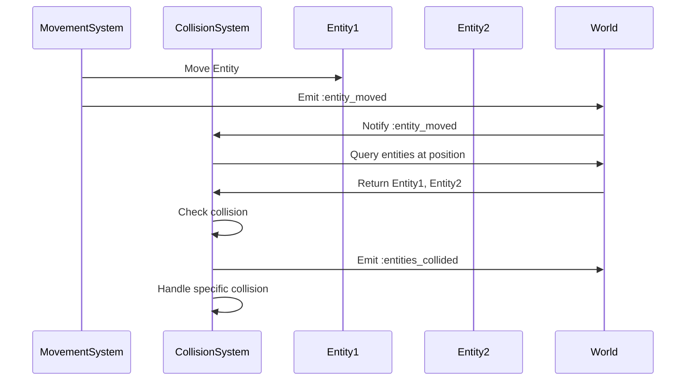

# Chapter 14: Collision and Interaction

## Collision Detection: Entity at Same Position

In a grid-based roguelike, collision detection is simple: two entities collide if they're at the same position. No complex physics calculations needed.



### CollisionSystem: Detecting Collisions

The `CollisionSystem` detects when entities occupy the same cell:

```ruby
module Vanilla
  module Systems
    class CollisionSystem < System
      def initialize(world)
        super(world)
        @world.subscribe(:entity_moved, self)
      end

      def handle_event(event_type, data)
        return unless event_type == :entity_moved

        entity = @world.get_entity(data[:entity_id])
        return unless entity

        position = entity.get_component(:position)
        entities_at_position = find_entities_at_position(position.row, position.column)

        entities_at_position.each do |other_entity|
          next if other_entity.id == entity.id

          emit_event(:entities_collided, {
            entity_id: entity.id,
            other_entity_id: other_entity.id,
            position: { row: position.row, column: position.column }
          })

          handle_specific_collisions(entity, other_entity)
        end
      end

      def find_entities_at_position(row, column)
        @world.query_entities([:position]).select do |entity|
          pos = entity.get_component(:position)
          pos.row == row && pos.column == column
        end
      end
    end
  end
end
```

The system:
- Subscribes to movement events
- When an entity moves, checks for other entities at that position
- Emits collision events
- Handles specific collision types

## Interaction Systems: What Happens When Entities Meet

Different entity types interact differently. Player + Monster = combat. Player + Item = pickup. Player + Stairs = level transition.

### Handling Specific Collisions

```ruby
def handle_specific_collisions(entity, other_entity)
  # Player collides with monster
  if entity.has_tag?(:player) && other_entity.has_tag?(:monster)
    handle_player_monster_collision(entity, other_entity)
  end

  # Player collides with item
  if entity.has_tag?(:player) && other_entity.has_component?(:item)
    handle_player_item_collision(entity, other_entity)
  end

  # Player collides with stairs
  if entity.has_tag?(:player) && other_entity.has_component?(:stairs)
    handle_player_stairs_collision(entity, other_entity)
  end
end
```

Each collision type triggers different behavior, but they all follow the same pattern: detect collision, determine type, handle appropriately.

## Stairs and Level Transitions: Changing the Game State

Level transitions are a special type of interaction. When the player steps on stairs, the game generates a new level.

### ChangeLevelCommand

```ruby
module Vanilla
  module Commands
    class ChangeLevelCommand < Command
      def initialize(new_difficulty, player)
        @new_difficulty = new_difficulty
        @player = player
      end

      def execute(world)
        world.emit_event(:level_transition_requested, {
          player_id: @player.id,
          new_difficulty: @new_difficulty
        })
      end
    end
  end
end
```

The command emits an event that triggers level generation.

### MazeSystem Handles Transition

```ruby
def handle_event(event_type, data)
  return unless event_type == :level_transition_requested

  @world.level_changed = true  # Trigger regeneration
  player = @world.get_entity(data[:player_id])
  player.get_component(:position).set_position(0, 0)  # Reset position
end
```

The `MazeSystem` subscribes to level transition events and regenerates the maze on the next update.

## Systems Communicate Through Events and Queries

Collision and interaction demonstrate how systems communicate:

**Events:**
- `MovementSystem` emits `:entity_moved`
- `CollisionSystem` subscribes and reacts
- `CollisionSystem` emits `:entities_collided`
- Other systems can subscribe to collision events

**Queries:**
- Systems query for entities at positions
- Systems query for entities with specific components
- No direct dependencies between systems

This decoupling allows systems to work together without knowing about each other.

## Key Takeaway

Collision detection in grid-based games is simple: same position = collision. Interaction systems handle what happens when entities meet. Events and queries allow systems to communicate without tight coupling, maintaining clean architecture.

## Exercises

1. **Design interactions**: What other entity interactions might you need? How would you implement them?

2. **Event flow**: Trace a collision from detection to resolution. What events are emitted? Who subscribes?

3. **Level transitions**: How would you implement a "return to previous level" feature? What would need to change?

4. **Collision optimization**: For a large number of entities, how could you optimize collision detection?

