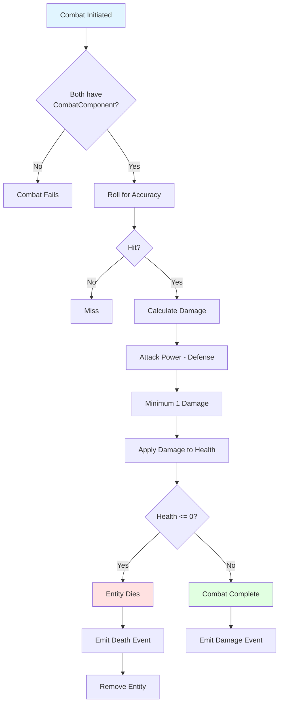

# Chapter 15: Combat System

## Turn-Based Combat: Attacker, Defender, Damage Calculation

Combat in Vanilla is turn-based and simple: attacker rolls against defender, damage is calculated, health is reduced.



### CombatSystem: Processing Attacks

```ruby
module Vanilla
  module Systems
    class CombatSystem < System
      def process_attack(attacker, target)
        attacker_combat = attacker.get_component(:combat)
        target_combat = target.get_component(:combat)
        return false unless attacker_combat && target_combat

        # Check if attack hits
        hit = rand < attacker_combat.accuracy
        return false unless hit

        # Calculate and apply damage
        damage = calculate_damage(attacker_combat, target_combat)
        apply_damage(target, damage, attacker)

        # Check for death
        check_death(target, attacker)

        true
      end

      def calculate_damage(attacker_combat, defender_combat)
        damage = attacker_combat.attack_power - defender_combat.
              defense
        [damage, 1].max  # Minimum 1 damage
      end
    end
  end
end
```

The system:
- Checks both entities have combat components
- Rolls for accuracy
- Calculates damage (attack - defense, minimum 1)
- Applies damage to health component
- Checks if target died

## Health and Death: Managing Entity Lifecycle

Health is stored in a component, and death is handled by removing the entity.

### HealthComponent

```ruby
class HealthComponent < Component
  attr_reader :max_health, :current_health

  def initialize(max_health:, current_health: nil)
    @max_health = max_health
    @current_health = current_health || max_health
  end

  def current_health=(value)
    @current_health = [value, @max_health].min
  end
end
```

The component stores health values. Systems read and modify it, but the component doesn't know about combat.

### Death Handling

```ruby
def check_death(entity, killer = nil)
  health = entity.get_component(:health)
  return false unless health
  return false unless health.current_health <= 0

  emit_event(:combat_death, {
    entity_id: entity.id,
    killer_id: killer&.id
  })

  @world.remove_entity(entity.id)
  true
end
```

When health reaches 0:
- Emit death event
- Remove entity from world
- Other systems can react to the event (loot generation, etc.)

### Events: System Communication

You may have noticed `emit_event` calls in the combat system. Events are messages that systems can send to notify other systems about what happened, without systems needing to know about each other directly.

**What events do:**
- Allow systems to communicate without direct dependencies
- Enable loose coupling between systems
- Support logging, debugging, and reactive behaviors

**Example from combat:**
```ruby
emit_event(:combat_death, {
  entity_id: entity.id,
  killer_id: killer&.id
})
```

This event notifies any system that's listening: "An entity died in combat." Other systems can react:
- A loot system might generate items at the death location
- A statistics system might record the kill
- A message system might display "Monster killed!"

**The event system:**
- Systems can emit events (send messages)
- Systems can subscribe to events (listen for messages)
- The World coordinates event delivery

Events are explained in detail in Chapter 18, including how to subscribe to events and build reactive systems. For now, understand that `emit_event` sends a message that other systems can react to, keeping systems decoupled.

## Combat Components: Attack Power, Defense, Accuracy

Combat stats are stored in components:

```ruby
class CombatComponent < Component
  attr_reader :attack_power, :defense, :accuracy

  def initialize(attack_power:, defense:, accuracy: 0.8)
    @attack_power = attack_power
    @defense = defense
    @accuracy = accuracy
    super()
  end
end
```

These values are pure data. The `CombatSystem` uses them for calculations, but the component doesn't contain combat logic.

## Complex Systems Built from Simple Components

Combat demonstrates how ECS builds complex features from simple pieces:

- **Components** store data (health, combat stats)
- **Systems** contain logic (damage calculation, death checking)
- **Events** notify other systems (death, damage dealt)
- **Queries** find relevant entities (entities with combat components)

Each piece is simple, but together they create a complete combat system.

## Key Takeaway

Combat in ECS is built from components (data) and systems (logic). Health and combat stats are components. Damage calculation and death handling are systems. This separation makes combat testable, extensible, and maintainable.

## Exercises

1. **Design combat**: How would you add critical hits? What components and systems would change?

2. **Status effects**: How would you implement poison or burning? What new components would you need?

3. **Combat types**: How would you implement ranged combat? What would be different?

4. **Balance testing**: How would you test that combat is balanced? What metrics would you track?

