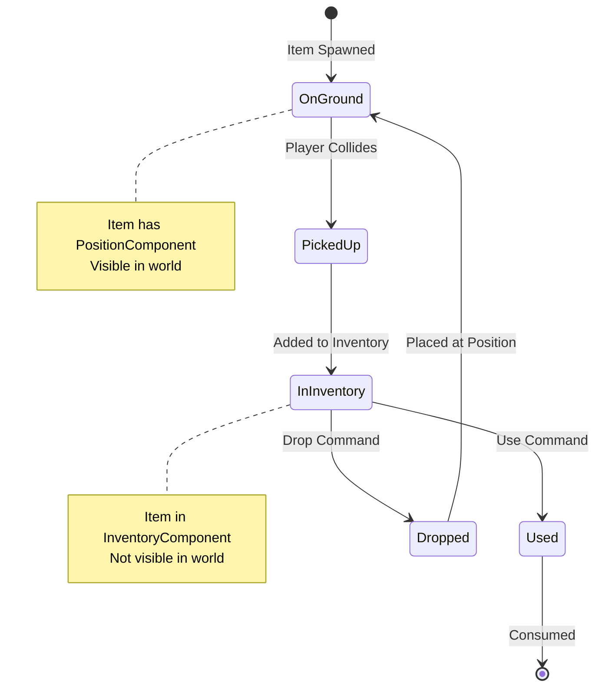

# Chapter 16: Items and Inventory

## Item Entities: Components That Define Item Properties

Items are entities with item-specific components. They can be picked up, carried, and used.

### Item Components

```ruby
class ItemComponent < Component
  attr_reader :name, :description, :value

  def initialize(name:, description: "", value: 0)
    @name = name
    @description = description
    @value = value
    super()
  end
end

class ConsumableComponent < Component
  attr_reader :effect_type, :effect_value

  def initialize(effect_type:, effect_value:)
    @effect_type = effect_type  # :heal, :damage, etc.
    @effect_value = effect_value
    super()
  end
end
```

Items are just entities with these components. A healing potion has `ItemComponent` and `ConsumableComponent` with `effect_type: :heal`.

## Inventory System: Managing Collections of Items

The `InventorySystem` manages adding, removing, and using items.

### InventoryComponent

```ruby
class InventoryComponent < Component
  def initialize(capacity: 10)
    @items = []
    @capacity = capacity
    super()
  end

  def add_item(item)
    return false if @items.size >= @capacity
    @items << item
    true
  end

  def remove_item(item)
    @items.delete(item)
  end

  def items
    @items.dup
  end
end
```

The component stores a list of item entities. The `InventorySystem` manages it.

### InventorySystem Operations

```ruby
module Vanilla
  module Systems
    class InventorySystem
      def add_item(entity, item)
        return false unless entity.has_component?(:inventory)

        inventory = entity.get_component(:inventory)
        result = inventory.add_item(item)

        if result
          emit_event(:item_picked_up, {
            entity_id: entity.id,
            item_id: item.id
          })
        end

        result
      end

      def use_item(entity, item)
        return false unless entity.has_component?(:inventory)
        return false unless entity.get_component(:inventory).items.
              include?(item)

        consumable = item.get_component(:consumable)
        return false unless consumable

        apply_effect(entity, consumable)
        entity.get_component(:inventory).remove_item(item)
        @world.remove_entity(item.id)

        true
      end
    end
  end
end
```

The system handles pickup, use, and removal, emitting events for other systems to react.

## Item Interactions: Pickup, Drop, Use

Items interact with entities through systems:



**Pickup:**
- `ItemPickupSystem` detects player on item
- Adds item to inventory
- Removes item from world
- Emits pickup event

**Use:**
- `ItemUseSystem` processes use commands
- Applies item effects
- Removes item from inventory
- Emits use event

**Drop:**
- `InventorySystem` removes item from inventory
- Places item entity at player position
- Adds item back to world
- Emits drop event

## Loot Generation: Procedural Item Creation

Items can be generated procedurally:

```ruby
module Vanilla
  module Systems
    class LootSystem
      def generate_loot
        gold = rand(10..50)
        items = []

        if rand < 0.3  # 30% chance for item
          items << create_random_item
        end

        { gold: gold, items: items }
      end

      def create_random_item
        item = Entity.new
        item.add_component(ItemComponent.new(
          name: random_item_name,
          value: rand(5..20)
        ))
        item.add_component(ConsumableComponent.new(
          effect_type: :heal,
          effect_value: rand(10..30)
        ))
        item.add_component(RenderComponent.new(character: '!'))
        item
      end
    end
  end
end
```

Loot is generated when monsters die, creating variety and replayability.

## ECS Makes Complex Features Manageable

Items and inventory demonstrate ECS power:

- **Items are entities**: Same as monsters and players
- **Components define properties**: ItemComponent, ConsumableComponent
- **Systems handle interactions**: Pickup, use, drop
- **Events notify changes**: Other systems react to item events

This architecture makes adding new item types easy: just add new components and systems handle them automatically.

## Key Takeaway

Items are entities with item-specific components. The inventory system manages collections of items. ECS makes complex features like inventory manageable by separating data (components) from behavior (systems).

## Exercises

1. **Design items**: What components would a "sword" entity need? What about a "scroll of fireball"?

2. **Item effects**: How would you implement items that modify stats? What components would you add?

3. **Inventory UI**: How would you display inventory to the player? What system would handle that?

4. **Item generation**: How would you create more interesting procedural items? What properties would vary?

