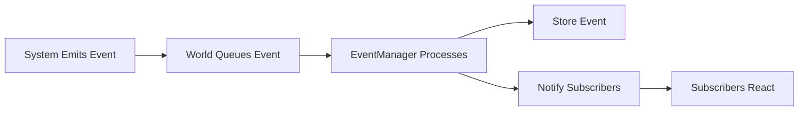

# Chapter 18: Event-Driven Architecture

## Why Events Matter: Decoupling, Debugging, Logging

Events are a powerful tool in game architecture. They allow systems to communicate without direct dependencies, enable comprehensive logging, and make debugging easier.

### Decoupling Systems

Without events, systems would need direct references to each other:

```ruby
# Tightly coupled
class MovementSystem
  def move(entity)
    # ... movement logic ...
    @combat_system.check_collision(entity)  # Direct dependency
    @render_system.update_display(entity)   # Direct dependency
  end
end
```

With events, systems are independent:

```ruby
# Decoupled
class MovementSystem
  def move(entity)
    # ... movement logic ...
    emit_event(:entity_moved, { entity_id: entity.id })  # No dependencies
  end
end
```

Other systems subscribe to events they care about, but `MovementSystem` doesn't know who's listening.

### Debugging and Logging

Events provide a complete record of game state changes:

```ruby
# Every event is logged
emit_event(:combat_attack, {
  attacker_id: attacker.id,
  target_id: target.id,
  damage: 15
})
```

You can:
- Replay events to debug issues
- Analyze event sequences to understand behavior
- Visualize game flow through event timelines
- Track down bugs by examining event logs

## Event Types: Game Events, System Events, Debug Events

Events fall into categories:

### Game Events

Events that represent game actions:
- `:entity_moved` - Entity changed position
- `:combat_attack` - Attack initiated
- `:item_picked_up` - Item collected
- `:level_transitioned` - Level changed

### System Events

Events for system communication:
- `:level_transition_requested` - Request new level
- `:entities_collided` - Collision detected
- `:combat_damage` - Damage dealt

### Debug Events

Events for development:
- `:debug_state_dump` - Request state information
- `:debug_command` - Debug command executed

## Event Storage: Recording Game History

Vanilla stores events in JSONL files:

```ruby
module Vanilla
  module Events
    module Storage
      class FileEventStore
        def store(event)
          File.open(@file_path, 'a') do |file|
            file.puts(event.to_json)
          end
        end
      end
    end
  end
end
```

This allows:
- **Replay**: Replay a game session from events
- **Analysis**: Analyze player behavior
- **Debugging**: Trace what happened before a bug
- **Visualization**: Create event timelines

## Event Flow



Events flow through the system:
1. System emits event
2. World queues it
3. EventManager stores and delivers
4. Subscribers react

## Events Enable Powerful Debugging and Extensibility

Events make the system:
- **Extensible**: Add new systems that react to events
- **Debuggable**: Complete event log of game state
- **Testable**: Mock events for testing
- **Observable**: Monitor game behavior through events

## Key Takeaway

Events decouple systems, enable debugging, and provide extensibility. They're a powerful tool for building maintainable game architecture. Understanding events helps you build systems that work together without tight coupling.

## Exercises

1. **Design events**: What events would you emit for a "save game" feature? Who would subscribe?

2. **Event analysis**: How would you use event logs to balance combat? What events would you track?

3. **Extend with events**: How would you add a "statistics" system that tracks player actions? What events would it subscribe to?

4. **Debug with events**: How would you use events to debug a movement bug? What events would you examine?

