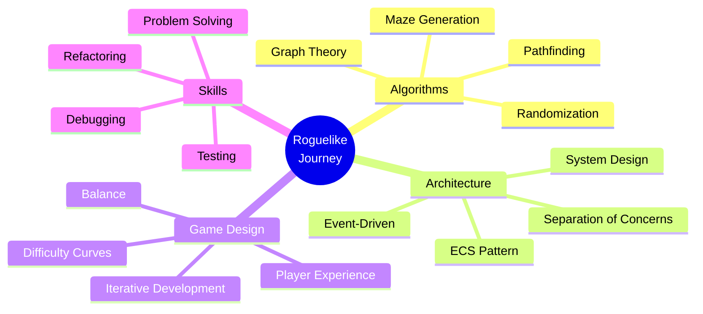

# Chapter 22: Your Roguelike Journey

## What You've Learned: Algorithms, Architecture, Game Design

Building a roguelike teaches you more than just game development. You've learned:

### Algorithms

- **Maze generation**: Graph theory, spanning trees, procedural generation
- **Pathfinding**: Distance calculations, connectivity
- **Randomization**: Seeding, reproducibility, variety

These algorithms apply beyond games: network routing, procedural content, data structures.

### Architecture

- **Entity-Component-System**: Separation of data and behavior
- **Event-driven design**: Decoupled communication
- **System design**: Independent, testable modules

These patterns are used in professional game engines and large software systems.

### Game Design

- **Iterative development**: Start simple, add complexity
- **Player experience**: What makes gameplay fun
- **Balance**: Difficulty curves, resource management

Understanding game design helps you build better software, not just games.

## Next Steps: Ideas for Expansion

Your roguelike is a foundation. Here are ideas to expand it:

### Content

- **More items**: Weapons, armor, consumables, scrolls
- **More monsters**: Different types with unique behaviors
- **More levels**: Themed dungeons, special rooms
- **More algorithms**: Try different maze generation approaches

### Systems

- **Magic system**: Spells, mana, spellbooks
- **Crafting**: Combine items, create equipment
- **Character progression**: Experience, levels, skills
- **Quests**: Objectives, rewards, story elements

### Polish

- **Better UI**: Menus, inventory display, stats
- **Sound effects**: Audio feedback for actions
- **Animations**: Visual feedback (even in ASCII)
- **Save/load**: Persist game state

### Advanced Features

- **Multiplayer**: Multiple players in the same dungeon
- **Procedural items**: Generate unique equipment
- **Advanced AI**: Pathfinding, group behavior, tactics
- **Mod support**: Let players extend the game

## Community and Resources: Where to Go From Here

### Communities

- **/r/roguelikedev**: Reddit community for roguelike developers
- **Roguelike Celebration**: Annual conference
- **RogueBasin**: Wiki with tutorials and resources

### Resources

- **Maze algorithms**: Jamis Buck's "Mazes for Programmers"
- **Game architecture**: "Game Programming Patterns" by Robert Nystrom
- **ECS patterns**: Articles on entity-component-system architecture
- **Roguelike tutorials**: Complete roguelike tutorial series

### Learning

- **Study other roguelikes**: Play and analyze
- **Read source code**: Learn from open-source roguelikes
- **Experiment**: Try new algorithms and patterns
- **Share**: Write about your journey, help others

## The Journey Continues

Building Vanilla Roguelike took five years. It started as algorithm exploration, hit a breaking point, and evolved into a complete game with solid architecture. Your journey will be different, but the lessons are the same:

- **Start simple**: Build the simplest version that works
- **Iterate**: Add one feature at a time
- **Learn from mistakes**: Breaking points teach you the most
- **Refactor when needed**: Good architecture enables growth
- **Keep learning**: There's always more to discover

## Key Takeaway

You've learned algorithms, architecture, and game design. You have the foundation to build your own roguelike. The journey doesn't end here—it's just beginning. Keep building, keep learning, keep iterating. Your roguelike will evolve, and so will you as a developer.

## Final Exercises

1. **Plan your roguelike**: What features do you want? How will you implement them?

2. **Join the community**: Find roguelike developers. Share your work. Learn from others.

3. **Keep building**: Add one new feature. Then another. Keep iterating.

4. **Teach others**: Write about what you learned. Help others on their journey.

## Conclusion

Building a roguelike is a journey. You'll make mistakes, hit breaking points, and learn valuable lessons. But you'll also create something unique, learn valuable skills, and join a community of passionate developers.

The code you write, the algorithms you implement, the architecture you design—they all contribute to your growth as a developer. The roguelike you build is just the beginning.

Good luck on your journey. May your mazes be solvable, your architecture be clean, and your code be maintainable.

Now go build something amazing.

Thank you for reading,
David Silva