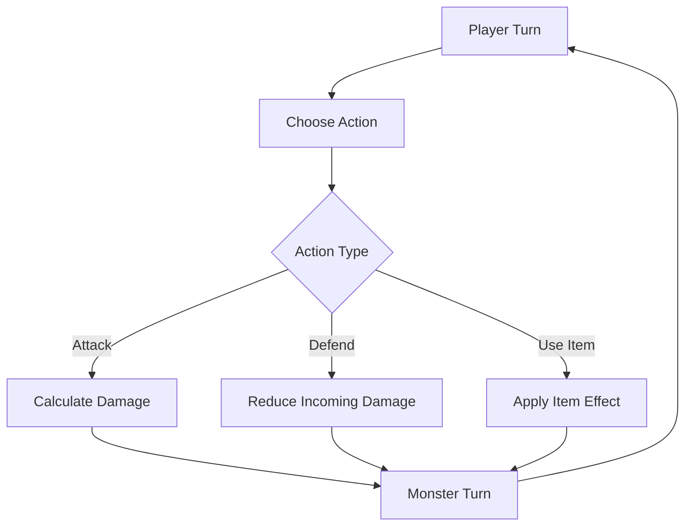

# Battle System Proposal

## Introduction

In roguelike games, battles between the player and monsters are a core element, providing excitement and challenge. This document proposes an implementation of a battle system in the Vanilla Roguelike game, incorporating a message system and interaction options to enhance gameplay.

## Concept

The battle system will allow players to engage in combat with monsters, using various actions such as attacking, defending, or using items. A message system will provide feedback on battle events, and players will have options to interact with the battle dynamically.

## Implementation Plan

### 1. Data Structures

- **Battle Component:** A component that can be added to entities, representing battle-related attributes like health, attack power, and defense.
- **Message System:** A system to queue and display messages related to battle events.

### 2. Battle Mechanics

- **Combat Actions:**
  - Players and monsters can perform actions such as attack, defend, or use items.
  - Implement logic to calculate damage, considering attack power and defense.

- **Turn-Based System:**
  - Battles proceed in turns, with players and monsters taking actions in sequence.
  - Implement a turn manager to handle the order of actions.

### 3. Message System

- **Message Queue:**
  - Queue messages for each battle event, such as attacks, misses, or critical hits.
  - Display messages to the player in a dedicated area of the UI.

### 4. Interaction Options

- **Player Choices:**
  - Allow players to choose actions during their turn, such as attacking or using an item.
  - Implement a menu system for selecting actions.

### 5. Code Example

```ruby
class BattleComponent
  attr_accessor :health, :attack_power, :defense

  def initialize(health:, attack_power:, defense:)
    @health = health
    @attack_power = attack_power
    @defense = defense
  end

  def take_damage(amount)
    @health -= amount
    @health = 0 if @health < 0
  end
end

class MessageSystem
  def initialize
    @messages = []
  end

  def add_message(message)
    @messages << message
  end

  def display_messages
    @messages.each { |msg| puts msg }
    @messages.clear
  end
end
```

### 6. Integration with Existing Codebase

- **Entity Updates:** Add `BattleComponent` to player and monster entities.
- **Turn Manager:** Implement a turn manager to handle the sequence of actions in battles.
- **UI Updates:** Update the UI to include a message display area and action menu.

## Diagram



## Conclusion

Implementing a battle system with a message system and interaction options will enhance the Vanilla Roguelike game by adding depth and excitement to combat. This proposal outlines a method to integrate these features into the existing codebase, providing players with engaging and dynamic battles.