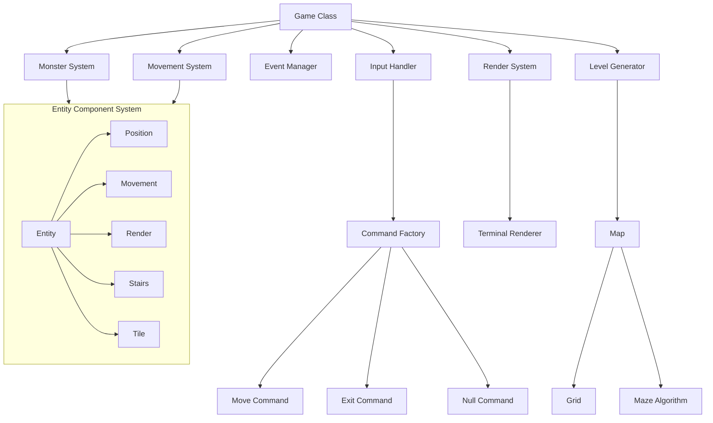

# Vanilla Roguelike: Current State Assessment

## Overview

This document provides a comprehensive analysis of the current state of the Vanilla roguelike game codebase. The assessment covers architecture, design patterns, code organization, and the game's core systems and mechanics.

## Table of Contents

1. [Architecture Overview](#architecture-overview)
2. [Core Game Components](#core-game-components)
3. [Design Patterns](#design-patterns)
4. [Code Organization](#code-organization)
5. [Game Systems Analysis](#game-systems-analysis)
6. [Testing Approach](#testing-approach)
7. [Current Limitations](#current-limitations)

## Architecture Overview

The Vanilla roguelike game follows a component-based architecture with clear separation of concerns. The codebase is structured around several key modules that handle different aspects of the game.



At a high level, the game follows a turn-based game loop pattern where each iteration processes input, updates game state, and renders the output.

## Core Game Components

### 1. Game Class (`lib/vanilla.rb`)

The `Game` class serves as the entry point and core coordinator, implementing a classic game loop pattern. It manages:

- Game initialization
- Level generation
- Monster spawning
- Input processing
- Collision handling
- Level transitions
- Game cleanup

### 2. Entity Component System (ECS)

The game uses an ECS architecture for game objects:

- **Entities**: Base objects with unique IDs (`Entity` class)
- **Components**: Data and behavior containers attached to entities:
  - `PositionComponent`: Coordinates in the grid
  - `MovementComponent`: Movement capabilities and restrictions
  - `RenderComponent`: Visual representation
  - `StairsComponent`: Tracking if stairs are found
  - `TileComponent`: Character representation on the map

### 3. Systems

Systems operate on entities with relevant components:

- **MovementSystem**: Handles entity position changes and collision detection
- **MonsterSystem**: Manages monster spawning, behavior, and cleanup
- **RenderSystem**: Coordinates display of all entities on the grid

### 4. Level Generation

The game has sophisticated maze generation algorithms:

- `BinaryTree`: Simple randomized binary tree maze
- `RecursiveBacktracker`: Depth-first search with backtracking
- `AldousBroder`: Random walk algorithm
- `RecursiveDivision`: Divide-and-conquer approach
- `Dijkstra`: Pathfinding algorithm for distance calculation

### 5. Event System

A publisher-subscriber pattern for game events:

- **EventManager**: Central hub for event publication and subscription
- **Event**: Data class with type, source, and payload
- **Event Storage**: Optional persistence for event logging and replay

### 6. Rendering

Terminal-based rendering system:

- **TerminalRenderer**: Handles grid and character display in the terminal
- **RenderSystem**: Coordinates which entities to display

### 7. Input Handling

- **InputHandler**: Translates raw keyboard input into game commands
- **Commands**: Move, Exit, and Null command implementations

## Design Patterns

The codebase employs several design patterns:

1. **Game Loop Pattern**: The core game loop in the `Game` class
2. **Entity Component System**: Component-based architecture for game objects
3. **Command Pattern**: Encapsulating player actions as command objects
4. **Factory Pattern**: For command and renderer creation
5. **Strategy Pattern**: Various maze generation algorithms
6. **Observer/Publisher-Subscriber Pattern**: For the event system
7. **Singleton Pattern**: For the logger instance

## Code Organization

The codebase follows a modular organization approach:

```
lib/
├── vanilla.rb             # Main entry point and Game class
├── vanilla/
    ├── algorithms/        # Maze generation algorithms
    ├── commands/          # Command pattern implementations
    ├── components/        # ECS components
    ├── entities/          # Entity definitions
    ├── events/            # Event system
    ├── map_utils/         # Map generation utilities
    ├── renderers/         # Display handling
    ├── systems/           # Game systems
    ├── support/           # Utility classes
    ├── input_handler.rb   # Input processing
    ├── level.rb           # Level creation and management
    ├── logger.rb          # Logging utilities
    └── map.rb             # Map generation
```

## Game Systems Analysis

### Movement System

The movement system handles entity position changes based on:
- Direction input
- Wall/obstacle collision detection
- Entity movement capabilities
- Special location detection (stairs)

It's well-designed with proper validation and clear separation of concerns.

### Monster System

The monster system manages:
- Monster spawning based on difficulty
- Monster type selection and initialization
- Monster cleanup when killed
- Basic monster movement (currently basic)

The implementation is flexible but lacks sophisticated AI behavior.

### Rendering System

The rendering system:
- Uses a terminal-based ASCII representation
- Supports layered rendering (z-index)
- Draws the grid/maze with walls and passages
- Places characters representing entities
- Provides a factory for creating renderers

The system is simple but effective for an ASCII roguelike.

## Testing Approach

The codebase has extensive unit tests for most components:

- **Component Tests**: Verify component behaviors
- **System Tests**: Ensure systems operate correctly
- **Algorithm Tests**: Validate maze generation
- **Integration Tests**: Test interaction between systems

The tests use RSpec with appropriate mocking and stubbing patterns.

## Current Limitations

1. **Input Handling**: Limited to basic movement and exit commands
2. **UI**: Purely terminal-based with minimal visual feedback
3. **Game Mechanics**: Limited combat system and entity interactions
4. **Progression**: Basic level progression without saving/loading
5. **Monster AI**: Simplistic monster behavior
6. **Performance**: Not optimized for large maps or many entities
7. **Debugging**: Limited debugging tools and visualization
8. **Game Elements**: Missing key roguelike elements like items, inventory, skills

## Conclusion

The Vanilla roguelike game has a solid foundation with good architecture and separation of concerns. The Entity Component System provides flexibility for extension, and the event system allows for loose coupling between components. However, the game lacks several features typical of roguelike games and would benefit from expanded game mechanics, improved UI/UX, and better tooling for debugging and development.