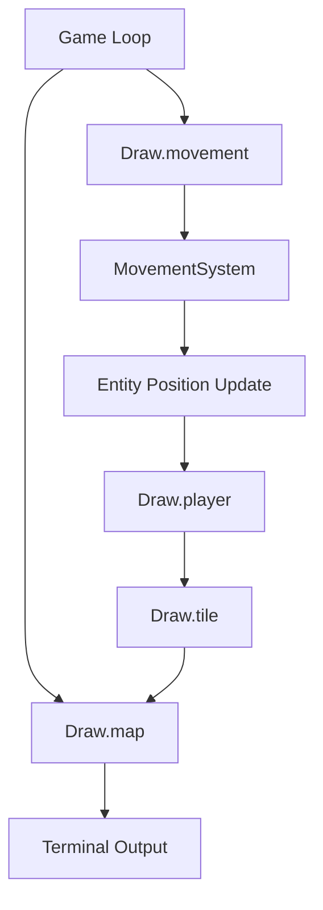
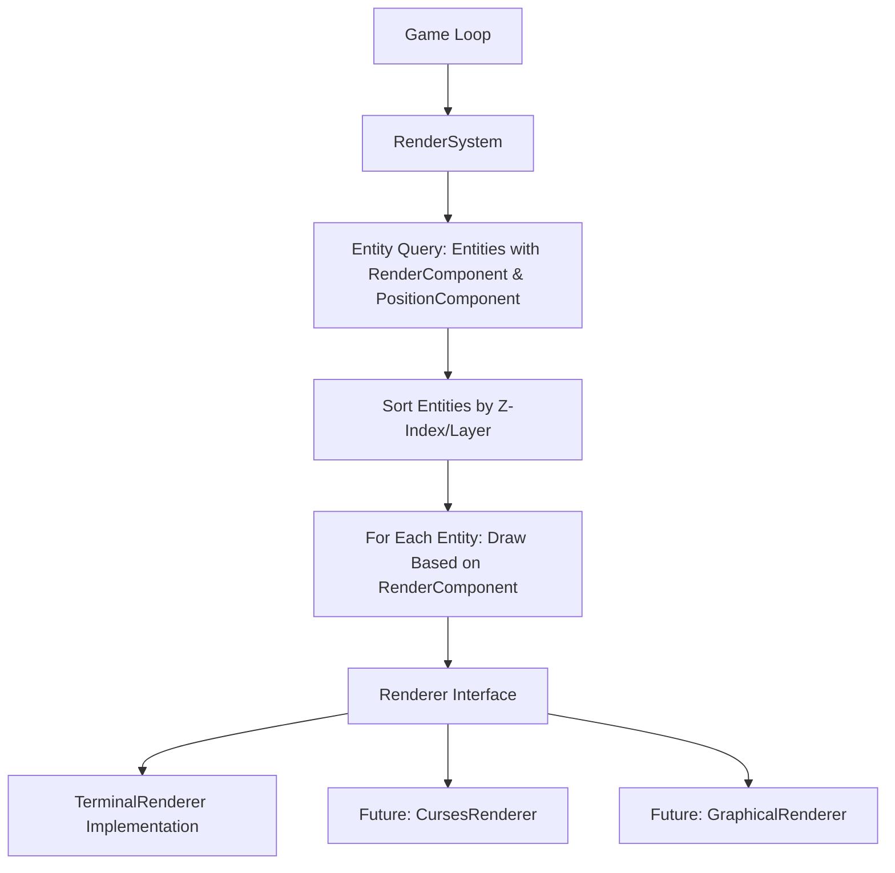
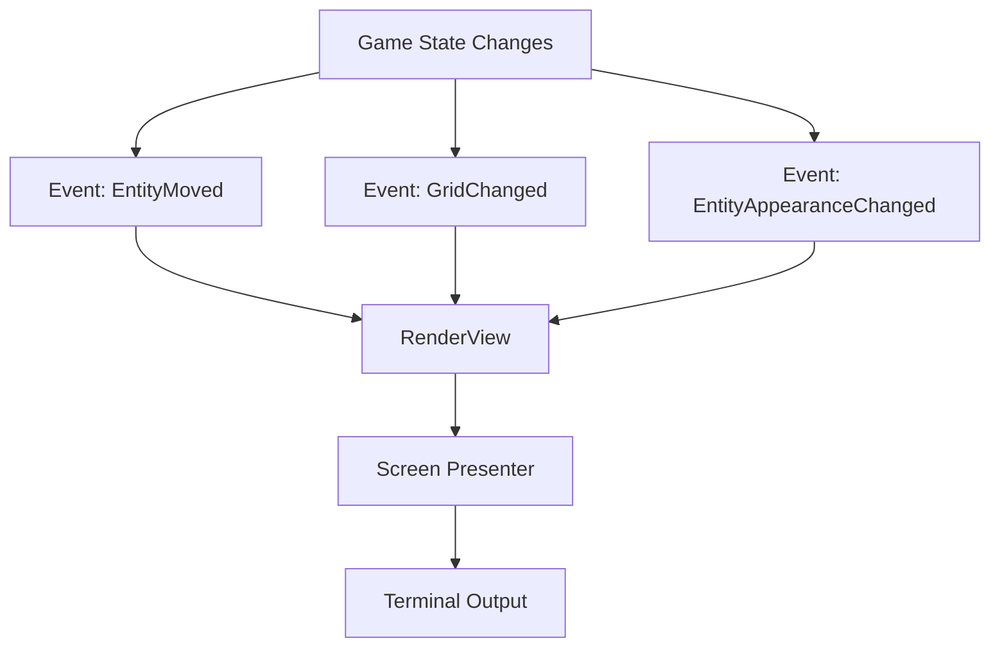
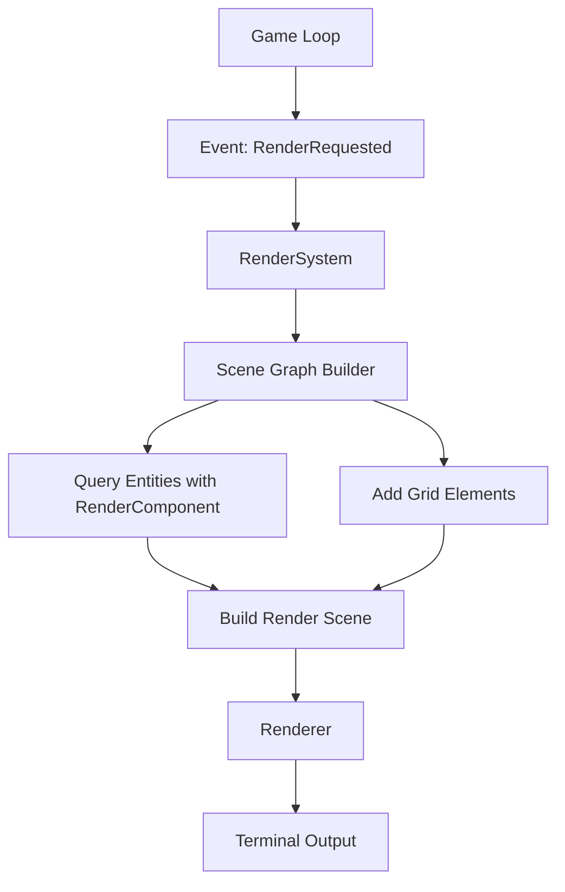

# Drawing System Architecture Proposal

## Current Implementation Analysis

The current drawing system in Vanilla is implemented as a simple module with class methods that handle rendering the game state to the terminal. While functional, it has several limitations:



### Limitations of Current Approach

1. **Mixed Responsibilities**: The Draw module combines rendering logic with game mechanics (e.g., the `movement` method invokes MovementSystem)
2. **Tight Coupling**: Direct dependencies between drawing and game systems
3. **Limited Extensibility**: Difficult to add new visual effects or rendering methods
4. **Inconsistent with ECS**: Doesn't follow the same Entity-Component-System architecture used elsewhere
5. **No Rendering Abstraction**: Terminal output is the only supported rendering target

## Proposed Approaches

Below are three architectural approaches for a new drawing system, each with different trade-offs.

### Option 1: Renderer + RenderComponent Pattern

This approach introduces a dedicated Renderer system and RenderComponent for entities, fully embracing the ECS pattern.



#### Implementation Details

1. **RenderComponent**:
   ```ruby
   class RenderComponent < Component
     attr_reader :character, :color, :layer

     def initialize(character:, color: nil, layer: 0)
       @character = character
       @color = color
       @layer = layer
       super()
     end

     def type
       :render
     end

     # ... serialization methods
   end
   ```

2. **RenderSystem**:
   ```ruby
   class RenderSystem
     def initialize(renderer)
       @renderer = renderer
     end

     def render(entities, grid)
       @renderer.clear

       # Draw the grid first
       @renderer.draw_grid(grid)

       # Draw entities with render components
       drawable_entities = entities.select do |entity|
         entity.has_component?(:render) && entity.has_component?(:position)
       end

       # Sort by layer for proper drawing order
       drawable_entities.sort_by! { |e| e.get_component(:render).layer }

       drawable_entities.each do |entity|
         render_component = entity.get_component(:render)
         position = entity.get_component(:position)
         @renderer.draw_character(
           position.row,
           position.column,
           render_component.character,
           render_component.color
         )
       end

       @renderer.present
     end
   end
   ```

3. **Renderer Interface**:
   ```ruby
   class Renderer
     def clear
       raise NotImplementedError
     end

     def draw_grid(grid)
       raise NotImplementedError
     end

     def draw_character(row, column, character, color = nil)
       raise NotImplementedError
     end

     def present
       raise NotImplementedError
     end
   end
   ```

#### Pros and Cons

**Pros:**
- Complete alignment with ECS architecture
- Clear separation of concerns
- Highly extensible for different rendering implementations
- Supports layered rendering (z-ordering)
- Easy to add visual effects to specific entity types

**Cons:**
- Requires more significant refactoring
- More complex than current implementation
- Requires adding RenderComponent to all visible entities

### Option 2: View/Presenter Pattern with Event System

This approach separates rendering logic from game state using a View/Presenter pattern integrated with the event system.



#### Implementation Details

1. **Rendering Events**:
   ```ruby
   module Events
     module Types
       # Add rendering-related event types
       GRID_UPDATED = "grid_updated"
       ENTITY_MOVED = "entity_moved"
       ENTITY_APPEARANCE_CHANGED = "entity_appearance_changed"
       RENDER_REQUESTED = "render_requested"
     end
   end
   ```

2. **RenderView**:
   ```ruby
   class RenderView
     def initialize(event_manager, presenter)
       @event_manager = event_manager
       @presenter = presenter
       @dirty = true

       # Subscribe to rendering events
       @event_manager.subscribe(Events::Types::GRID_UPDATED, method(:mark_dirty))
       @event_manager.subscribe(Events::Types::ENTITY_MOVED, method(:mark_dirty))
       @event_manager.subscribe(Events::Types::ENTITY_APPEARANCE_CHANGED, method(:mark_dirty))
       @event_manager.subscribe(Events::Types::RENDER_REQUESTED, method(:render))
     end

     def mark_dirty(*_args)
       @dirty = true
     end

     def render(event)
       return unless @dirty

       grid = event.data[:grid]
       entities = event.data[:entities]

       @presenter.present(grid, entities)
       @dirty = false
     end
   end
   ```

3. **ScreenPresenter**:
   ```ruby
   class ScreenPresenter
     def present(grid, entities)
       # Clear the screen
       Kernel.system("clear")

       # Create visual representation
       output = build_output(grid, entities)

       # Display to user
       puts output
     end

     private

     def build_output(grid, entities)
       # Logic to build the visual representation
       # ...
     end
   end
   ```

#### Pros and Cons

**Pros:**
- Decoupled from game logic via events
- Only renders when necessary (dirty flag)
- Separates rendering logic (view) from display (presenter)
- Works well with existing event system

**Cons:**
- Less aligned with pure ECS architecture
- Requires careful event management
- May lead to multiple redraws without proper debouncing

### Option 3: Hybrid Approach with Render Components and Events

This approach combines elements from both previous options, using RenderComponents for entity appearance but triggering rendering through the event system.



#### Implementation Details

1. **RenderComponent** (as in Option 1)

2. **Event-Driven RenderSystem**:
   ```ruby
   class RenderSystem
     def initialize(event_manager, renderer)
       @event_manager = event_manager
       @renderer = renderer

       # Subscribe to render events
       @event_manager.subscribe(Events::Types::RENDER_REQUESTED, method(:render))
     end

     def render(event)
       grid = event.data[:grid]
       entities = event.data[:entities]

       # Create a scene graph
       scene = build_scene(grid, entities)

       # Render the scene
       @renderer.render(scene)
     end

     private

     def build_scene(grid, entities)
       # Build a structured scene representation
       # with layers, grid elements, and entities
       # ...
     end
   end
   ```

3. **Scene Graph**:
   ```ruby
   class SceneNode
     attr_reader :layer, :position, :character, :color

     def initialize(layer:, position:, character:, color: nil)
       @layer = layer
       @position = position
       @character = character
       @color = color
     end
   end

   class Scene
     attr_reader :nodes, :dimensions

     def initialize(rows, columns)
       @nodes = []
       @dimensions = { rows: rows, columns: columns }
     end

     def add_node(node)
       @nodes << node
     end

     def sorted_nodes
       @nodes.sort_by(&:layer)
     end
   end
   ```

#### Pros and Cons

**Pros:**
- Combines the strengths of both approaches
- Maintains ECS compatibility with RenderComponent
- Event-driven rendering for efficiency
- Scene graph provides more advanced rendering capabilities
- Most extensible for future enhancements

**Cons:**
- Most complex implementation
- Requires careful coordination between components and events
- Higher learning curve for new developers

## Recommendation

### Option 3: Hybrid Approach with Render Components and Events

While all three approaches would improve the current implementation, the hybrid approach (Option 3) offers the best balance of alignment with existing architecture, extensibility, and rendering capabilities.

The hybrid approach allows:

1. **Full ECS Integration**: RenderComponents align with the existing Entity-Component-System pattern
2. **Event-Driven Efficiency**: Only render when needed, triggered by game events
3. **Advanced Rendering**: Scene graph enables more sophisticated visual effects
4. **Future-Proofing**: Abstraction layers make it easy to add new renderers (e.g., ncurses, SDL)
5. **Cleaner Game Loop**: Rendering is triggered by events rather than direct method calls

## Implementation Plan

1. **Phase 1: Create Basic Components**
   - Implement RenderComponent
   - Create Renderer interface and TerminalRenderer implementation
   - Define rendering-related events

2. **Phase 2: Scene Graph**
   - Implement Scene and SceneNode classes
   - Create scene building utilities

3. **Phase 3: RenderSystem**
   - Implement event-driven RenderSystem
   - Connect to existing event manager

4. **Phase 4: Integration**
   - Refactor entities to use RenderComponent
   - Update game loop to publish render events
   - Remove old Draw module

5. **Phase 5: Extensions**
   - Add support for colors, animations, or other visual effects
   - Implement additional renderers as needed
   - Add debugging visualizations (e.g., pathfinding, vision cones)

## Conclusion

This proposal presents three viable options for upgrading Vanilla's drawing mechanism to better align with the game's Entity-Component-System architecture and event system. The recommended hybrid approach offers the most flexibility while maintaining consistency with the codebase's design patterns.

By implementing this proposal, Vanilla will gain a more modular, extensible rendering system that separates concerns properly and enables more sophisticated visual effects in the future.