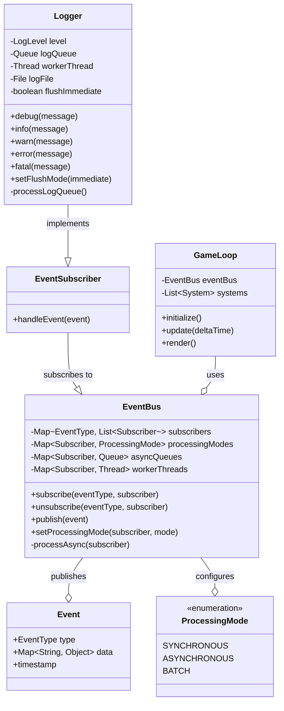
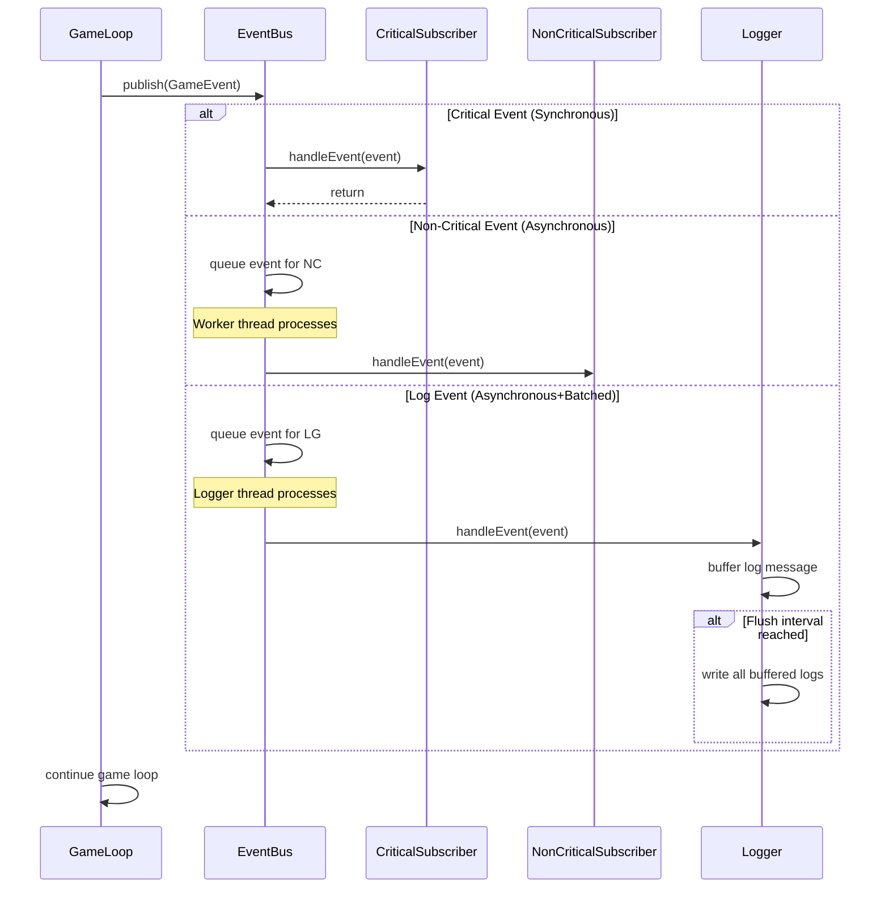

# Event & Logging Architecture Separation for Vanilla Game Engine

## 1. Executive Summary

This proposal outlines an architecture to decouple logging and event handling from the main Vanilla game loop, improving performance and maintainability. We recommend implementing an Event Bus pattern with selective asynchronous processing for non-critical components like logging, while maintaining synchronous processing for gameplay-critical events.

## 2. Current Architecture Analysis

### 2.1 Current Implementation

The Vanilla game engine currently implements:

- A singleton `Logger` class with direct file I/O operations
- An event system with tightly coupled components
- Synchronous processing of all events and logs within the main thread

### 2.2 Current Limitations

- Logging operations block the main thread during I/O
- Event handling for non-critical events unnecessarily impacts gameplay performance
- Limited scalability as the number of events/logs increases
- No prioritization between critical and non-critical operations

## 3. Proposed Architecture

### 3.1 Core Components



### 3.2 Event Flow



### 3.3 Configuration Options

The system allows flexible configuration:

1. **Processing Modes**:
   - `SYNCHRONOUS`: Immediate processing on main thread
   - `ASYNCHRONOUS`: Background thread processing
   - `BATCH`: Collect and process periodically

2. **Subscriber Categories**:
   - **Critical**: Always synchronous (movement, collisions)
   - **Important**: Synchronous or batch (scoring, achievements)
   - **Non-critical**: Asynchronous (logging, analytics)

## 4. Implementation Plan

### 4.1 Core EventBus Implementation

```ruby
module Vanilla
  class EventBus
    include Singleton

    PROCESSING_MODES = [:synchronous, :asynchronous, :batch]

    def initialize
      @subscribers = Hash.new { |h, k| h[k] = [] }
      @processing_modes = {}
      @async_queues = {}
      @batch_queues = {}
      @worker_threads = {}
      @running = true
      @batch_interval = 0.5 # seconds
    end

    def subscribe(event_type, subscriber)
      @subscribers[event_type] << subscriber
      # Default to synchronous mode unless specified
      @processing_modes[subscriber] ||= :synchronous
    end

    def unsubscribe(event_type, subscriber)
      @subscribers[event_type].delete(subscriber)
    end

    def set_processing_mode(subscriber, mode)
      raise ArgumentError, "Invalid mode: #{mode}" unless PROCESSING_MODES.include?(mode)

      old_mode = @processing_modes[subscriber]
      @processing_modes[subscriber] = mode

      # Setup appropriate processing mechanism if changed
      if mode == :asynchronous && old_mode != :asynchronous
        setup_async_processing(subscriber)
      elsif mode == :batch && old_mode != :batch
        setup_batch_processing(subscriber)
      end
    end

    def publish(event)
      @subscribers[event.type].each do |subscriber|
        case @processing_modes[subscriber]
        when :synchronous
          subscriber.handle_event(event)
        when :asynchronous
          @async_queues[subscriber] << event
        when :batch
          @batch_queues[subscriber] << event
        end
      end
    end

    def shutdown
      @running = false
      @worker_threads.each_value(&:join)
    end

    private

    def setup_async_processing(subscriber)
      @async_queues[subscriber] = Queue.new

      @worker_threads[subscriber] = Thread.new do
        while @running || !@async_queues[subscriber].empty?
          begin
            event = @async_queues[subscriber].pop(true)
            subscriber.handle_event(event)
          rescue ThreadError
            sleep 0.01
          end
        end
      end
    end

    def setup_batch_processing(subscriber)
      @batch_queues[subscriber] = []

      @worker_threads[subscriber] = Thread.new do
        last_process_time = Time.now

        while @running
          if Time.now - last_process_time >= @batch_interval
            # Process all events in batch
            events = nil

            # Thread-safe extraction of current batch
            synchronized do
              events = @batch_queues[subscriber].dup
              @batch_queues[subscriber].clear
            end

            # Process the batch
            events.each { |event| subscriber.handle_event(event) }
            last_process_time = Time.now
          end

          sleep 0.01
        end
      end
    end

    def synchronized
      mutex = @mutex ||= Mutex.new
      mutex.synchronize { yield }
    end
  end
end
```

### 4.2 Logger Implementation

```ruby
module Vanilla
  class Logger
    include Singleton
    include EventSubscriber

    LOG_LEVELS = {
      debug: 0,
      info: 1,
      warn: 2,
      error: 3,
      fatal: 4
    }.freeze

    def initialize
      @level = ENV['VANILLA_LOG_LEVEL']&.downcase&.to_sym || :info
      @log_env = ENV['VANILLA_LOG_DIR'] || 'development'
      @log_dir = File.join(Dir.pwd, 'logs', @log_env)

      FileUtils.mkdir_p(@log_dir) unless Dir.exist?(@log_dir)
      @log_file = File.join(@log_dir, "vanilla_#{Time.now.strftime('%Y%m%d_%H%M%S')}.log")
      @file = File.open(@log_file, 'w')

      # Write header
      @file.puts "=== Vanilla Game Log Started at #{Time.now} ==="
      @file.flush

      # Subscribe to log events
      EventBus.instance.subscribe(:log, self)
      EventBus.instance.set_processing_mode(self, :asynchronous)

      # Message buffer for batch writes
      @message_buffer = []
      @buffer_mutex = Mutex.new
      @max_buffer_size = 100
    end

    def debug(message)
      log_event(:debug, message)
    end

    def info(message)
      log_event(:info, message)
    end

    def warn(message)
      log_event(:warn, message)
    end

    def error(message)
      log_event(:error, message)
    end

    def fatal(message)
      log_event(:fatal, message)
    end

    def handle_event(event)
      return unless event.type == :log

      level = event.data[:level]
      message = event.data[:message]
      timestamp = event.data[:timestamp] || Time.now

      @buffer_mutex.synchronize do
        @message_buffer << [level, message, timestamp]
        flush_buffer if @message_buffer.size >= @max_buffer_size
      end
    end

    def close
      flush_buffer
      @file.puts "=== Vanilla Game Log Ended at #{Time.now} ==="
      @file.close
      @file = nil
    end

    private

    def log_event(level, message)
      return if LOG_LEVELS[level] < LOG_LEVELS[@level]

      event = Event.new(
        type: :log,
        data: {
          level: level,
          message: message,
          timestamp: Time.now
        }
      )

      EventBus.instance.publish(event)
    end

    def flush_buffer
      return if @message_buffer.empty?

      @message_buffer.each do |level, message, timestamp|
        write_log(level, message, timestamp)
      end
      @message_buffer.clear
    end

    def write_log(level, message, timestamp)
      formatted_time = timestamp.strftime('%Y-%m-%d %H:%M:%S.%L')
      formatted_message = "[#{formatted_time}] [#{level.to_s.upcase}] #{message}"
      @file.puts(formatted_message)
      @file.flush
    end
  end
end
```

### 4.3 Event System Implementation

```ruby
module Vanilla
  class Event
    attr_reader :type, :data, :timestamp

    def initialize(type:, data: {})
      @type = type
      @data = data
      @timestamp = Time.now
    end
  end

  module EventSubscriber
    def handle_event(event)
      raise NotImplementedError, "Subscribers must implement #handle_event"
    end
  end

  class EventManager
    def initialize(event_bus = EventBus.instance)
      @event_bus = event_bus

      # Configure subscribers
      setup_subscribers
    end

    private

    def setup_subscribers
      # Register game-critical subscribers as synchronous
      critical_subscribers.each do |event_type, subscriber|
        @event_bus.subscribe(event_type, subscriber)
        @event_bus.set_processing_mode(subscriber, :synchronous)
      end

      # Register important but non-blocking subscribers
      important_subscribers.each do |event_type, subscriber|
        @event_bus.subscribe(event_type, subscriber)
        @event_bus.set_processing_mode(subscriber, :batch)
      end

      # Register non-critical subscribers as async
      non_critical_subscribers.each do |event_type, subscriber|
        @event_bus.subscribe(event_type, subscriber)
        @event_bus.set_processing_mode(subscriber, :asynchronous)
      end
    end

    def critical_subscribers
      # Return mapping of event type to subscriber for critical game events
      # Example: { player_move: MovementSystem, collision: CollisionSystem }
    end

    def important_subscribers
      # Return mapping for important but not time-critical events
      # Example: { score_change: ScoreSystem, achievement: AchievementSystem }
    end

    def non_critical_subscribers
      # Return mapping for non-critical events
      # Example: { log: Logger.instance, analytics: AnalyticsSystem }
    end
  end
end
```

## 5. Benefits and Trade-offs

### 5.1 Benefits

1. **Performance Improvements**:
   - Main game loop no longer blocked by I/O operations
   - Critical systems receive immediate processing
   - Non-critical systems processed asynchronously

2. **Scalability**:
   - Event load distributed across multiple threads
   - Batched processing reduces overhead for frequent events
   - Clear separation of concerns between systems

3. **Flexibility**:
   - Processing modes configurable at runtime
   - New subscribers can be added without architectural changes
   - Prioritization based on gameplay significance

### 5.2 Trade-offs

1. **Complexity**:
   - More complex architecture to understand and maintain
   - Potential for threading issues if not carefully implemented
   - Debugging may be more challenging

2. **Resource Usage**:
   - Additional memory for event queues
   - Thread overhead for worker threads
   - Potential for race conditions

3. **Implementation Challenges**:
   - Thread safety requirements
   - Proper shutdown handling
   - Error handling across threads

## 6. Testing Strategy

### 6.1 Unit Testing

```ruby
RSpec.describe Vanilla::EventBus do
  # Test synchronous event handling
  it "processes synchronous events immediately" do
    bus = Vanilla::EventBus.instance
    subscriber = double("Subscriber")

    allow(subscriber).to receive(:handle_event)
    bus.subscribe(:test_event, subscriber)

    event = Vanilla::Event.new(type: :test_event)
    bus.publish(event)

    expect(subscriber).to have_received(:handle_event).with(event)
  end

  # Test asynchronous event handling
  it "processes asynchronous events in background" do
    bus = Vanilla::EventBus.instance
    subscriber = double("Subscriber")

    allow(subscriber).to receive(:handle_event)
    bus.subscribe(:test_event, subscriber)
    bus.set_processing_mode(subscriber, :asynchronous)

    event = Vanilla::Event.new(type: :test_event)
    bus.publish(event)

    # Give the worker thread time to process
    sleep 0.1

    expect(subscriber).to have_received(:handle_event).with(event)
  end

  # Additional tests for batch processing, thread safety, etc.
end
```

### 6.2 Performance Testing

Create benchmark tests to measure:
- Main thread framerate with/without separation
- Processing latency for critical events
- Log throughput under high volume

## 7. Implementation Timeline

1. **Phase 1: Core Infrastructure (1-2 weeks)**
   - Implement EventBus with processing modes
   - Create Event and EventSubscriber base classes
   - Add thread-safety mechanisms

2. **Phase 2: Logger Migration (1 week)**
   - Refactor Logger to use the EventBus
   - Implement asynchronous/batch logging
   - Test performance improvements

3. **Phase 3: Event System Migration (1-2 weeks)**
   - Categorize existing event handlers
   - Migrate to new EventBus architecture
   - Configure processing modes

4. **Phase 4: Testing & Optimization (1 week)**
   - Performance testing
   - Thread safety verification
   - Memory optimization

## 8. Recommendations

1. **Begin with Logger Migration**: Simplest component to move to asynchronous processing
2. **Use Thread Pool**: Consider a thread pool for worker threads to limit resource usage
3. **Monitor Performance**: Add metrics to track event processing times
4. **Gradual Implementation**: Start with simple events before migrating critical systems

## 9. Conclusion

The proposed architecture provides a flexible, performant solution for separating logging and event handling from the main game loop. The Event Bus pattern with configurable processing modes offers the best balance between performance gains and implementation complexity.

By implementing this architecture, the Vanilla game engine will gain significant performance improvements for I/O-intensive operations while maintaining responsive gameplay for time-critical events.