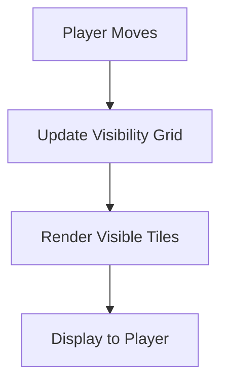

# Fog of War Implementation Proposal

## Introduction

In roguelike games, the "Fog of War" is a feature that limits the player's visibility to only the areas around them and those they have previously visited. This adds a layer of challenge and strategy, as players must explore the map to reveal it. This document proposes an implementation of the Fog of War feature in the Vanilla Roguelike game.

## Concept

The Fog of War will obscure unexplored areas of the map, only revealing tiles within a certain radius of the player and those that have been visited. This will require tracking which tiles have been seen and updating the visible area as the player moves.

## Implementation Plan

### 1. Data Structures

- **Visibility Grid:** A 2D array that mirrors the game map, storing visibility states for each tile (e.g., `:unseen`, `:visible`, `:visited`).
- **Player Position:** Track the player's current position to update visibility.

### 2. Updating Visibility

- **On Player Move:**
  - Calculate the visible area around the player using a radius (e.g., 3 tiles).
  - Update the visibility grid to mark these tiles as `:visible`.
  - Mark previously visible tiles as `:visited` if they are no longer within the visible radius.

### 3. Rendering

- **Modify Render System:**
  - Update the rendering logic to only draw tiles marked as `:visible` or `:visited`.
  - Use different visual cues (e.g., dimming) for `:visited` tiles.

### 4. Code Example

```ruby
class FogOfWar
  attr_reader :visibility_grid

  def initialize(map_width, map_height)
    @visibility_grid = Array.new(map_height) { Array.new(map_width, :unseen) }
  end

  def update_visibility(player_x, player_y, radius)
    (-radius..radius).each do |dx|
      (-radius..radius).each do |dy|
        x, y = player_x + dx, player_y + dy
        next unless in_bounds?(x, y)
        @visibility_grid[y][x] = :visible
      end
    end
    mark_visited
  end

  private

  def in_bounds?(x, y)
    x >= 0 && y >= 0 && y < @visibility_grid.size && x < @visibility_grid[0].size
  end

  def mark_visited
    @visibility_grid.each_with_index do |row, y|
      row.each_with_index do |tile, x|
        @visibility_grid[y][x] = :visited if tile == :visible
      end
    end
  end
end
```

### 5. Integration with Existing Codebase

- **Player Movement:** Hook into the player movement logic to call `FogOfWar#update_visibility` whenever the player moves.
- **Rendering System:** Modify the rendering system to check the visibility grid before drawing each tile.

## Diagram



## Conclusion

Implementing the Fog of War will enhance the gameplay experience by adding exploration and strategy elements. This proposal outlines a straightforward approach to integrating this feature into the existing Vanilla Roguelike codebase, leveraging the current systems and architecture.