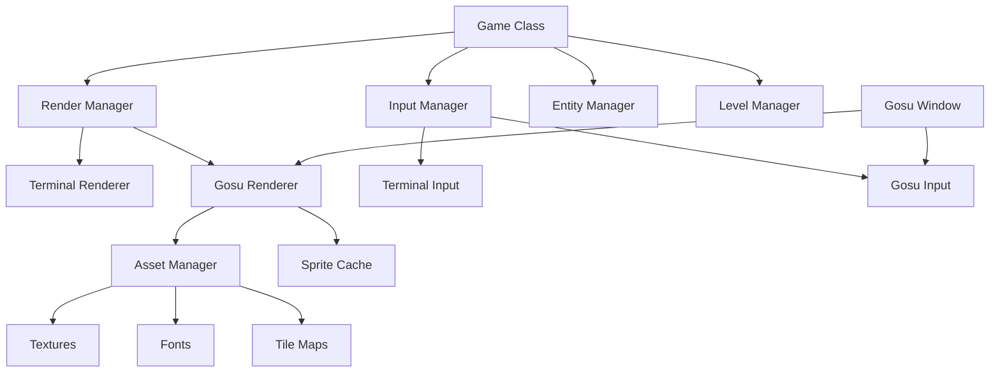
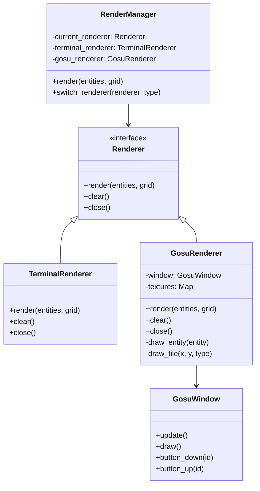
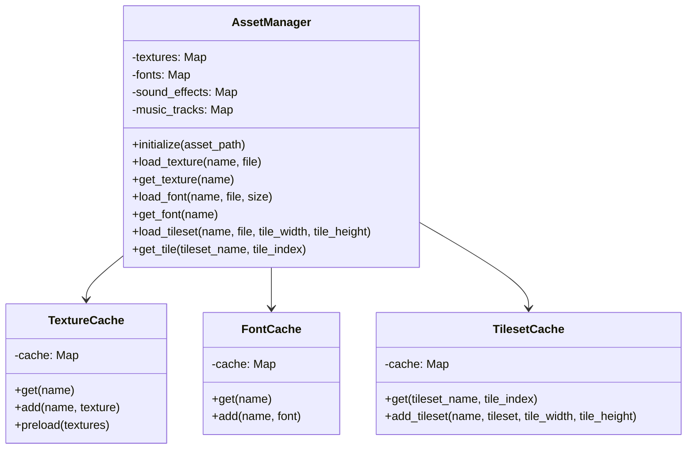
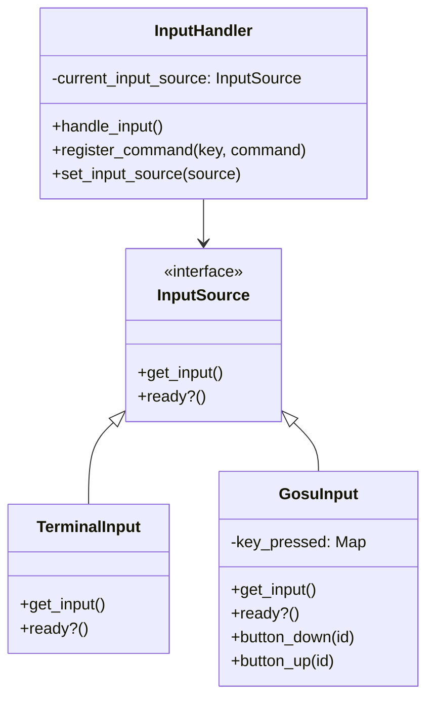
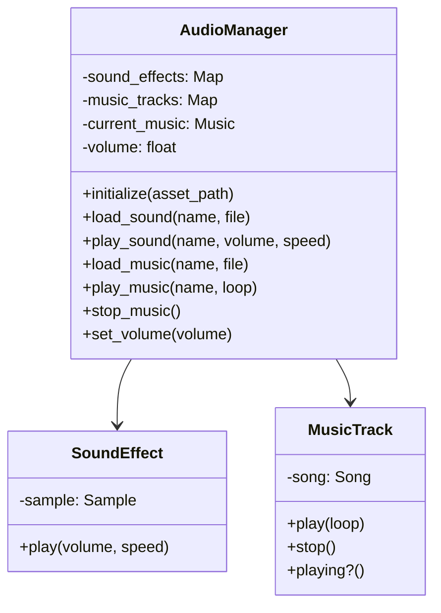

# Vanilla Roguelike: Gosu Integration Proposal

## Overview

This document outlines a comprehensive proposal for integrating the Gosu library into the Vanilla roguelike game. The proposal focuses on enhancing the game's visual presentation and user experience while maintaining compatibility with the existing terminal-based renderer. The result will be a dual-renderer system that allows players to choose between classic ASCII display and a more modern graphical presentation.

## Table of Contents

1. [Introduction to Gosu](#introduction-to-gosu)
2. [Architecture Design](#architecture-design)
3. [Renderer Abstraction](#renderer-abstraction)
4. [Asset Management](#asset-management)
5. [Input Handling](#input-handling)
6. [Window Management](#window-management)
7. [Sound and Music](#sound-and-music)
8. [Implementation Plan](#implementation-plan)
9. [Technical Challenges](#technical-challenges)
10. [Performance Considerations](#performance-considerations)

## Introduction to Gosu

[Gosu](https://www.libgosu.org/) is a 2D game development library for Ruby and C++ that provides:

- Fast 2D graphics rendering with hardware acceleration
- Simple and portable input handling
- Sound sample and music playback
- Text rendering with fully customizable fonts
- Cross-platform window creation and management (Windows, macOS, Linux)

Gosu is ideal for roguelikes because it:
- Has a Ruby API that integrates well with our existing codebase
- Is lightweight and focused on 2D rendering
- Supports both bitmap-based and vector graphics
- Has minimal dependencies and simple installation
- Maintains active development and community support

### Basic Gosu Concepts

```ruby
# Simple Gosu window example
require 'gosu'

class GameWindow < Gosu::Window
  def initialize
    super(640, 480, false)
    self.caption = "Vanilla Roguelike"
    @font = Gosu::Font.new(20)
  end

  def update
    # Game logic here
  end

  def draw
    @font.draw_text("Hello, Gosu World!", 10, 10, 0)
  end

  def button_down(id)
    close if id == Gosu::KB_ESCAPE
  end
end

GameWindow.new.show
```

## Architecture Design

The proposed architecture maintains the existing terminal renderer while adding a parallel Gosu-based rendering system. This dual-renderer approach allows players to choose their preferred visual style.

### High-Level Architecture



### Renderer Strategy Pattern

The key to this architecture is using the Strategy pattern for rendering, allowing seamless switching between terminal and Gosu renderers:



## Renderer Abstraction

To support both renderers, we'll create an abstraction layer that defines a common interface for rendering.

### Base Renderer Interface

```ruby
module Vanilla
  module Renderers
    class BaseRenderer
      # Initialize the renderer
      def initialize(options = {})
        # Implementation in subclasses
      end

      # Render the grid and entities
      def render(entities, grid)
        raise NotImplementedError, "Renderer must implement render method"
      end

      # Clear the display
      def clear
        raise NotImplementedError, "Renderer must implement clear method"
      end

      # Close and clean up resources
      def close
        # Implementation in subclasses
      end

      # Check if renderer is ready
      def ready?
        true
      end
    end
  end
end
```

### Existing Terminal Renderer Adaptation

We'll update the existing `TerminalRenderer` to conform to the new interface:

```ruby
module Vanilla
  module Renderers
    class TerminalRenderer < BaseRenderer
      def initialize(options = {})
        super
        # Existing initialization
      end

      def render(entities, grid)
        clear

        # Draw grid
        grid.height.times do |y|
          grid.width.times do |x|
            cell = grid.cell_at(x, y)
            print(cell_to_char(cell))
          end
          puts
        end

        # Draw entities
        entities.each do |entity|
          pos = entity.get_component(Components::PositionComponent)
          render = entity.get_component(Components::RenderComponent)

          if pos && render
            # Position cursor and draw character
            print "\e[#{pos.y + 1};#{pos.x + 1}H#{render.character}"
          end
        end

        # Reset cursor position
        print "\e[#{grid.height + 1};1H"
      end

      def clear
        print "\e[2J\e[H"  # Clear screen and move cursor to top-left
      end

      def close
        # No specific cleanup needed for terminal
      end

      private

      def cell_to_char(cell)
        # Convert cell to ASCII character
        case cell
        when :wall then '#'
        when :floor then '.'
        when :door then '+'
        when :stairs then '>'
        else ' '
        end
      end
    end
  end
end
```

### New Gosu Renderer Implementation

```ruby
module Vanilla
  module Renderers
    class GosuRenderer < BaseRenderer
      attr_reader :window

      def initialize(options = {})
        super
        @tile_size = options[:tile_size] || 32
        @window_width = options[:width] || 800
        @window_height = options[:height] || 600
        @asset_path = options[:asset_path] || "assets/graphics"

        initialize_window
        load_assets
      end

      def render(entities, grid)
        return unless @window && !@window.closed?

        @current_entities = entities
        @current_grid = grid

        # The actual rendering happens in the window's draw method
        # This method just updates what should be rendered
      end

      def clear
        # No explicit clear needed, as Gosu clears the screen each frame
      end

      def close
        @window.close if @window && !@window.closed?
      end

      def ready?
        @window && !@window.closed?
      end

      private

      def initialize_window
        @window = VanillaWindow.new(
          @window_width,
          @window_height,
          false, # fullscreen
          self
        )
        @window.caption = "Vanilla Roguelike"
      end

      def load_assets
        @textures = {
          player: Gosu::Image.new(File.join(@asset_path, "player.png")),
          wall: Gosu::Image.new(File.join(@asset_path, "wall.png")),
          floor: Gosu::Image.new(File.join(@asset_path, "floor.png")),
          door: Gosu::Image.new(File.join(@asset_path, "door.png")),
          stairs: Gosu::Image.new(File.join(@asset_path, "stairs.png")),
          # Add more textures as needed
        }

        # Set up fonts
        @font = Gosu::Font.new(16)
      end

      # Methods below are called by the VanillaWindow

      def draw_game
        return unless @current_grid && @current_entities

        # Draw grid
        @current_grid.height.times do |y|
          @current_grid.width.times do |x|
            cell = @current_grid.cell_at(x, y)
            draw_tile(x, y, cell)
          end
        end

        # Draw entities
        @current_entities.each do |entity|
          draw_entity(entity)
        end
      end

      def draw_tile(x, y, type)
        texture = case type
                  when :wall then @textures[:wall]
                  when :floor then @textures[:floor]
                  when :door then @textures[:door]
                  when :stairs then @textures[:stairs]
                  else @textures[:floor] # Default
                  end

        texture.draw(
          x * @tile_size,
          y * @tile_size,
          0, # z-order
          1, # scale_x
          1  # scale_y
        )
      end

      def draw_entity(entity)
        pos = entity.get_component(Components::PositionComponent)
        render = entity.get_component(Components::RenderComponent)

        return unless pos && render

        # Determine which texture to use based on entity type
        texture = case render.character
                  when '@' then @textures[:player]
                  when 'M', 'g' then @textures[:monster]
                  # Add other entity types
                  else nil
                  end

        # Draw the entity if we have a texture for it
        if texture
          texture.draw(
            pos.x * @tile_size,
            pos.y * @tile_size,
            1, # z-order (above tiles)
            1, # scale_x
            1  # scale_y
          )
        end
      end
    end

    # Gosu Window implementation
    class VanillaWindow < Gosu::Window
      def initialize(width, height, fullscreen, renderer)
        super(width, height, fullscreen)
        @renderer = renderer
        @input_handler = Vanilla.game.input_handler
      end

      def update
        # This is called by Gosu before draw
        # We'll use it to update game state if needed
      end

      def draw
        # Gosu calls this method to render each frame
        @renderer.draw_game
      end

      def button_down(id)
        # Convert Gosu key code to our internal format
        key = gosu_key_to_vanilla_key(id)
        @input_handler.handle_key(key) if key

        close if id == Gosu::KB_ESCAPE # Default escape behavior
      end

      def button_up(id)
        # Handle key release events if needed
      end

      private

      def gosu_key_to_vanilla_key(id)
        # Map Gosu key codes to our internal representation
        case id
        when Gosu::KB_H then :left
        when Gosu::KB_J then :down
        when Gosu::KB_K then :up
        when Gosu::KB_L then :right
        when Gosu::KB_I then :inventory
        when Gosu::KB_SPACE then :action
        # Add more key mappings as needed
        else nil
        end
      end
    end
  end
end
```

### Render Manager

The `RenderManager` will coordinate between the two renderers:

```ruby
module Vanilla
  class RenderManager
    RENDERER_TYPES = [:terminal, :gosu]

    def initialize(options = {})
      @renderers = {}
      @current_renderer_type = options[:default_renderer] || :terminal

      # Initialize renderers
      @renderers[:terminal] = Renderers::TerminalRenderer.new
      @renderers[:gosu] = Renderers::GosuRenderer.new(options[:gosu] || {})

      # Start Gosu in a separate thread to avoid blocking
      start_gosu_thread if @current_renderer_type == :gosu
    end

    def current_renderer
      @renderers[@current_renderer_type]
    end

    def render(entities, grid)
      # Always update Gosu renderer data even if not currently displayed
      @renderers[:gosu].render(entities, grid) if @renderers[:gosu].ready?

      # Render with current renderer
      current_renderer.render(entities, grid) if current_renderer.ready?
    end

    def switch_renderer(renderer_type)
      return unless RENDERER_TYPES.include?(renderer_type)

      # Switch renderer type
      @current_renderer_type = renderer_type

      # Start Gosu thread if switching to Gosu
      start_gosu_thread if renderer_type == :gosu
    end

    def close
      RENDERER_TYPES.each do |type|
        @renderers[type].close if @renderers[type]
      end
    end

    private

    def start_gosu_thread
      # Run Gosu in a separate thread if not already running
      return if @gosu_thread && @gosu_thread.alive?

      @gosu_thread = Thread.new do
        gosu_renderer = @renderers[:gosu]
        gosu_renderer.window.show if gosu_renderer.window && !gosu_renderer.window.closed?
      end
    end
  end
end
```

## Asset Management

To efficiently handle game assets for the Gosu renderer, we'll implement an `AssetManager`:



### Asset Manager Implementation

```ruby
module Vanilla
  module Gosu
    class AssetManager
      def initialize(asset_path = "assets")
        @asset_path = asset_path
        @textures = {}
        @fonts = {}
        @tilesets = {}
        @tile_caches = {}
      end

      # Texture methods

      def load_texture(name, file)
        path = File.join(@asset_path, "graphics", file)
        @textures[name] = ::Gosu::Image.new(path)
      end

      def get_texture(name)
        @textures[name]
      end

      def preload_textures(texture_list)
        texture_list.each do |name, file|
          load_texture(name, file)
        end
      end

      # Font methods

      def load_font(name, file, size)
        path = File.join(@asset_path, "fonts", file)
        @fonts[name] = ::Gosu::Font.new(size, name: path)
      end

      def get_font(name, size = nil)
        if size && !@fonts[name]
          # Create default font if not loaded
          @fonts[name] = ::Gosu::Font.new(size)
        end
        @fonts[name]
      end

      # Tileset methods

      def load_tileset(name, file, tile_width, tile_height)
        path = File.join(@asset_path, "graphics", file)
        tileset = ::Gosu::Image.load_tiles(
          path,
          tile_width,
          tile_height,
          tileable: true
        )
        @tilesets[name] = tileset
        @tile_caches[name] = {
          width: tile_width,
          height: tile_height,
          tiles: tileset
        }
      end

      def get_tile(tileset_name, tile_index)
        cache = @tile_caches[tileset_name]
        return nil unless cache

        cache[:tiles][tile_index]
      end
    end
  end
end
```

## Input Handling

For the input system to work with both terminal and Gosu modes, we need to abstract the input handling:



### Input System Implementation

```ruby
module Vanilla
  # Base InputSource interface
  class InputSource
    def get_input
      raise NotImplementedError, "InputSource must implement get_input"
    end

    def ready?
      true
    end
  end

  # Terminal input implementation
  class TerminalInput < InputSource
    def initialize
      # Configure terminal for immediate input if needed
      system("stty raw -echo") if RUBY_PLATFORM =~ /darwin|linux/
    end

    def get_input
      # Read a character from STDIN without waiting for Enter
      c = STDIN.getc
      key = char_to_key(c)

      # Reset terminal mode if needed
      system("stty -raw echo") if RUBY_PLATFORM =~ /darwin|linux/

      key
    end

    def close
      # Reset terminal mode if needed
      system("stty -raw echo") if RUBY_PLATFORM =~ /darwin|linux/
    end

    private

    def char_to_key(char)
      case char
      when 'h' then :left
      when 'j' then :down
      when 'k' then :up
      when 'l' then :right
      when 'i' then :inventory
      when ' ' then :action
      when 'q' then :quit
      # Add more mappings as needed
      else nil
      end
    end
  end

  # Gosu input implementation
  class GosuInput < InputSource
    def initialize
      @key_queue = Queue.new
    end

    def get_input
      # Return nil if no key is available
      @key_queue.empty? ? nil : @key_queue.pop
    end

    def button_down(id)
      # Convert Gosu keycode to our internal format
      key = gosu_key_to_vanilla_key(id)
      @key_queue.push(key) if key
    end

    private

    def gosu_key_to_vanilla_key(id)
      case id
      when ::Gosu::KB_H, ::Gosu::KB_LEFT then :left
      when ::Gosu::KB_J, ::Gosu::KB_DOWN then :down
      when ::Gosu::KB_K, ::Gosu::KB_UP then :up
      when ::Gosu::KB_L, ::Gosu::KB_RIGHT then :right
      when ::Gosu::KB_I then :inventory
      when ::Gosu::KB_SPACE then :action
      when ::Gosu::KB_Q, ::Gosu::KB_ESCAPE then :quit
      # Add more mappings as needed
      else nil
      end
    end
  end

  # Enhanced InputHandler
  class InputHandler
    def initialize
      @terminal_input = TerminalInput.new
      @gosu_input = GosuInput.new
      @current_input_source = @terminal_input
      @key_command_map = {}
    end

    def set_input_source(source_type)
      @current_input_source = case source_type
                            when :terminal then @terminal_input
                            when :gosu then @gosu_input
                            else @terminal_input
                            end
    end

    def get_input
      @current_input_source.get_input
    end

    def register_command(key, command)
      @key_command_map[key] = command
    end

    def handle_key(key)
      command = @key_command_map[key]
      command.execute if command
    end

    def gosu_input
      @gosu_input
    end

    def close
      @terminal_input.close
    end
  end
end
```

## Window Management

The Gosu window is the container for the graphical display. Here's a more detailed implementation:

```ruby
module Vanilla
  module Gosu
    class GameWindow < ::Gosu::Window
      attr_reader :game

      def initialize(game, width, height, fullscreen = false)
        super(width, height, fullscreen)
        self.caption = "Vanilla Roguelike"

        @game = game
        @asset_manager = game.asset_manager
        @input_handler = game.input_handler.gosu_input

        @render_scale = 1.0  # Can be adjusted for zooming
        @camera_x = 0
        @camera_y = 0

        # UI components
        @ui_components = []
      end

      def update
        # Called by Gosu before each frame
        # If we're in Gosu mode, we need to advance the game state here
        if @game.render_manager.current_renderer_type == :gosu
          @game.update
        end
      end

      def draw
        # Apply camera transformation
        scale(@render_scale, @render_scale) do
          translate(-@camera_x, -@camera_y) do
            # Draw the game world
            draw_game_world
          end
        end

        # Draw UI elements (always in screen coordinates)
        draw_ui
      end

      def button_down(id)
        # Pass to input handler
        @input_handler.button_down(id)

        # Special window handling
        case id
        when ::Gosu::KB_ESCAPE
          close
        when ::Gosu::KB_F11
          self.fullscreen = !fullscreen?
        when ::Gosu::KB_F10
          @game.render_manager.switch_renderer(:terminal)
        end
      end

      def button_up(id)
        @input_handler.button_up(id) if @input_handler.respond_to?(:button_up)
      end

      def center_on(x, y)
        @camera_x = x - width / (2 * @render_scale)
        @camera_y = y - height / (2 * @render_scale)
      end

      def add_ui_component(component)
        @ui_components << component
      end

      private

      def draw_game_world
        # This is implemented by the GosuRenderer
        # and will be called from there
      end

      def draw_ui
        @ui_components.each(&:draw)
      end
    end
  end
end
```

## Sound and Music

Gosu provides excellent audio capabilities, which we can integrate:



### Audio Manager Implementation

```ruby
module Vanilla
  module Gosu
    class AudioManager
      def initialize(asset_path = "assets")
        @asset_path = asset_path
        @sound_effects = {}
        @music_tracks = {}
        @current_music = nil
        @volume = 1.0
        @enabled = true
      end

      # Sound effect methods

      def load_sound(name, file)
        path = File.join(@asset_path, "audio", "sfx", file)
        @sound_effects[name] = ::Gosu::Sample.new(path)
      end

      def play_sound(name, volume = 1.0, speed = 1.0)
        return unless @enabled

        sound = @sound_effects[name]
        sound.play(volume * @volume, speed) if sound
      end

      # Music methods

      def load_music(name, file)
        path = File.join(@asset_path, "audio", "music", file)
        @music_tracks[name] = ::Gosu::Song.new(path)
      end

      def play_music(name, loop = true)
        return unless @enabled

        # Stop current music if playing
        stop_music

        # Play new music
        music = @music_tracks[name]
        if music
          music.volume = @volume
          music.play(loop)
          @current_music = music
        end
      end

      def stop_music
        @current_music.stop if @current_music
        @current_music = nil
      end

      # Volume control

      def set_volume(volume)
        @volume = [[0.0, volume].max, 1.0].min
        @current_music.volume = @volume if @current_music
      end

      def enable
        @enabled = true
      end

      def disable
        @enabled = false
        stop_music
      end
    end
  end
end
```

## Implementation Plan

Integrating Gosu into the Vanilla roguelike requires a systematic approach to ensure backward compatibility and minimal disruption.

### Phase 1: Environment Setup

1. **Add Gosu Dependency**: Update the gemfile or gemspec to include Gosu
   ```ruby
   # In Gemfile
   gem 'gosu', '~> 1.4.0'
   ```

2. **Create Asset Directory Structure**:
   ```
   assets/
   ├── graphics/
   │   ├── entities/
   │   ├── tiles/
   │   └── ui/
   ├── fonts/
   └── audio/
       ├── sfx/
       └── music/
   ```

3. **Add Configuration Options**: Update config to support renderer selection
   ```ruby
   module Vanilla
     class Config
       attr_accessor :default_renderer, :gosu_options

       def initialize
         @default_renderer = :terminal
         @gosu_options = {
           width: 1024,
           height: 768,
           fullscreen: false,
           tile_size: 32
         }
       end
     end
   end
   ```

### Phase 2: Abstraction Layer

1. **Create Renderer Interface**: Implement the `BaseRenderer` class
2. **Adapt Terminal Renderer**: Update existing renderer to implement the interface
3. **Create Render Manager**: Implement the manager that switches between renderers

### Phase 3: Gosu Implementation

1. **Create Asset Manager**: Implement asset loading and caching
2. **Implement Gosu Renderer**: Create the Gosu-based rendering system
3. **Create Window Manager**: Implement the Gosu window and GL integration
4. **Adapt Input System**: Update input handling to work with both renderers

### Phase 4: Game Integration

1. **Update Game Loop**: Modify the main game loop to work with either renderer
2. **Add UI Components**: Implement UI elements for the Gosu renderer
3. **Add Sound and Music**: Integrate audio capabilities
4. **Create Configuration UI**: Allow players to switch renderers and adjust settings

### Phase 5: Testing and Optimization

1. **Cross-Platform Testing**: Ensure compatibility across Windows, macOS, and Linux
2. **Performance Optimization**: Profile and optimize rendering performance
3. **Memory Management**: Ensure proper resource cleanup and memory usage

## Technical Challenges

### 1. Synchronization Between Renderers

When switching between renderers, we need to ensure game state consistency:

```ruby
def switch_renderer(renderer_type)
  # Save current state if needed
  current_state = @game.get_state_snapshot

  # Switch renderer
  @render_manager.switch_renderer(renderer_type)

  # Update input handler
  @input_handler.set_input_source(renderer_type)

  # Restore state if needed
  @game.restore_state_snapshot(current_state)
end
```

### 2. Terminal vs. Window Management

Terminal and Gosu have different window management approaches:

```ruby
# In Game class
def start
  initialize_game

  if @render_manager.current_renderer_type == :terminal
    # Terminal mode - run game loop directly
    game_loop
  else
    # Gosu mode - game loop is driven by Gosu's update/draw cycle
    @render_manager.start_gosu_window
  end
end
```

### 3. Input Blocking vs. Event-Driven

Terminal input is blocking while Gosu is event-driven:

```ruby
# In terminal mode game loop
def terminal_game_loop
  loop do
    # Blocking input
    input = @input_handler.get_input
    handle_input(input)

    update
    render

    break if @game_over
  end
end

# In Gosu mode, the window drives the loop
def update
  # Non-blocking input check
  input = @input_handler.get_input
  handle_input(input) if input

  update_game_state
end
```

## Performance Considerations

### 1. Texture Atlases

Use texture atlases to reduce draw calls:

```ruby
def load_texture_atlas(name, file, tile_width, tile_height)
  # Load a single image containing multiple sprites
  # More efficient than separate files
end
```

### 2. Viewport Culling

Only render entities visible in the current viewport:

```ruby
def draw_entities(entities)
  entities.each do |entity|
    pos = entity.get_component(Components::PositionComponent)

    # Skip if outside viewport
    next unless in_viewport?(pos.x, pos.y)

    draw_entity(entity)
  end
end
```

### 3. Batched Rendering

Group similar drawing operations to reduce state changes:

```ruby
def draw_tiles
  # Sort tiles by texture to reduce texture binding changes
  @tiles_to_draw.sort_by! { |tile| tile.texture_id }

  current_texture = nil
  @tiles_to_draw.each do |tile|
    if tile.texture_id != current_texture
      # Bind new texture only when necessary
      current_texture = tile.texture_id
      bind_texture(current_texture)
    end

    draw_tile(tile)
  end
end
```

## Appendix: Example Asset Requirements

### Minimum Required Assets

1. **Tileset for basic map elements**:
   - Wall tile
   - Floor tile
   - Door tile (closed/open)
   - Stairs tile

2. **Character sprites**:
   - Player character
   - Basic monster types (2-3 variants)

3. **UI elements**:
   - Panel backgrounds
   - Button sprites
   - Status bar elements

4. **Fonts**:
   - Main game font
   - UI font

5. **Sound effects**:
   - Movement
   - Combat
   - Item pickup
   - Door open/close

6. **Music**:
   - Main theme
   - Combat theme

## Conclusion

This proposal outlines a comprehensive approach to integrating Gosu into the Vanilla roguelike while preserving the existing terminal-based renderer. By using the Strategy pattern for rendering and careful abstraction of the input system, we can provide players with the choice between classic ASCII display and enhanced graphics, sound, and user interface elements.

The phased implementation plan ensures a smooth transition, allowing incremental testing and refinement. The result will be a more accessible and visually engaging roguelike experience without sacrificing the traditional roguelike essence that makes Vanilla special.