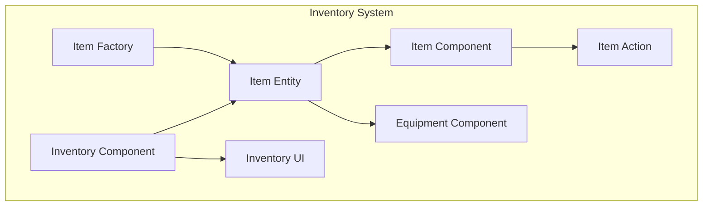
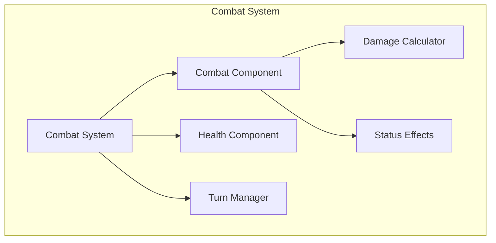
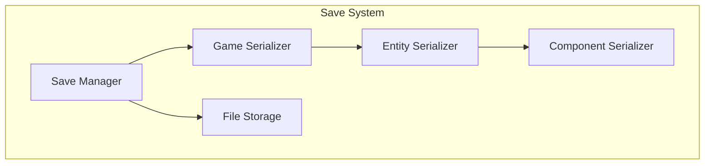
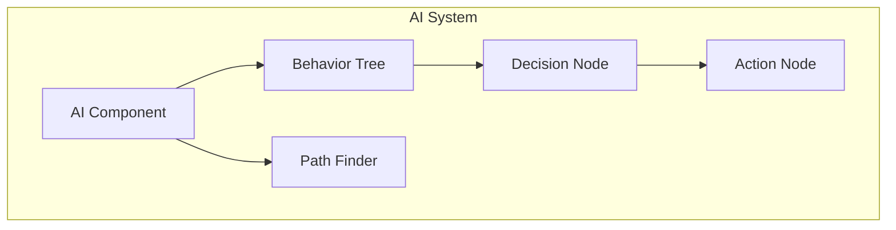
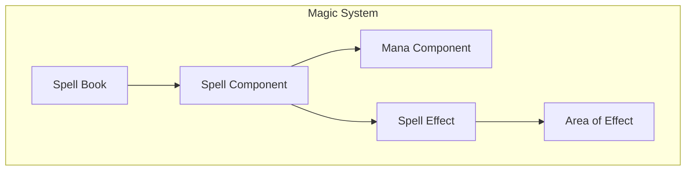
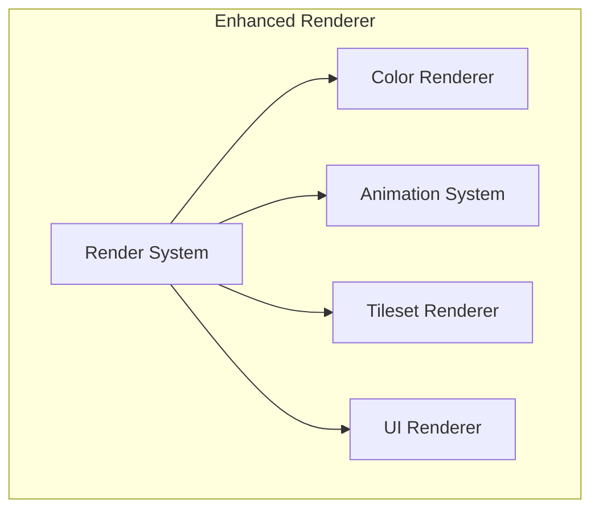
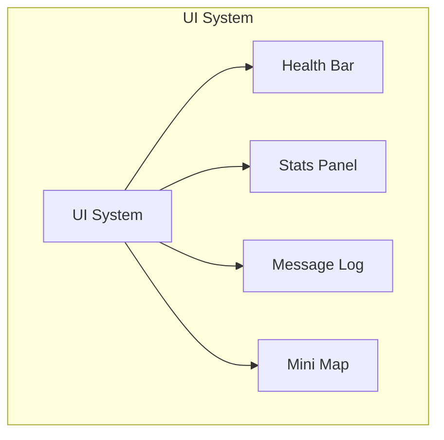

# Vanilla Roguelike: Improvements and Missing Features

## Overview

This document outlines key improvements and missing features for the Vanilla roguelike game, including implementation overviews and architectural considerations to guide future development.

## Table of Contents

1. [Core Game Features](#core-game-features)
2. [Gameplay Enhancements](#gameplay-enhancements)
3. [Technical Improvements](#technical-improvements)
4. [User Experience](#user-experience)
5. [Performance Optimizations](#performance-optimizations)
6. [Implementation Roadmap](#implementation-roadmap)

## Core Game Features

### Inventory System

**Current State**: The game lacks an inventory system for collecting, managing, and using items.

**Implementation Overview**:



**Key Components**:

1. **`InventoryComponent`**: Attached to entities that can carry items
   ```ruby
   module Vanilla
     module Components
       class InventoryComponent
         attr_reader :items, :capacity

         def initialize(capacity: 10)
           @items = []
           @capacity = capacity
         end

         def add(item)
           return false if full?
           @items << item
           true
         end

         def remove(item)
           @items.delete(item)
         end

         def full?
           @items.size >= @capacity
         end
       end
     end
   end
   ```

2. **`ItemComponent`**: Defines item properties and behaviors
   ```ruby
   module Vanilla
     module Components
       class ItemComponent
         attr_reader :name, :description, :weight, :value, :item_type

         def initialize(name:, description:, weight: 1, value: 0, item_type: :misc)
           @name = name
           @description = description
           @weight = weight
           @value = value
           @item_type = item_type
         end

         def use(entity)
           # Default implementation
           false
         end
       end
     end
   end
   ```

3. **`ItemSystem`**: Manages item interactions, pickups, and usage
   ```ruby
   module Vanilla
     module Systems
       class ItemSystem
         def initialize(event_manager)
           @event_manager = event_manager
           @event_manager.subscribe('entity.move', self)
         end

         def handle_event(event)
           return unless event.type == 'entity.move'
           check_for_items(event.payload[:entity], event.payload[:position])
         end

         def check_for_items(entity, position)
           # Check for items at position and handle pickup
         end

         def use_item(entity, item)
           # Trigger item usage
         end
       end
     end
   end
   ```

### Combat System

**Current State**: Basic monster existence but no sophisticated combat mechanics.

**Implementation Overview**:



**Key Components**:

1. **`HealthComponent`**: Tracks entity health and status
   ```ruby
   module Vanilla
     module Components
       class HealthComponent
         attr_reader :current, :maximum, :status

         def initialize(maximum: 10)
           @maximum = maximum
           @current = maximum
           @status = :normal
         end

         def take_damage(amount)
           @current = [@current - amount, 0].max
           @status = :dead if @current <= 0
           @event_manager.publish('entity.damaged', entity: @entity, amount: amount)
         end

         def heal(amount)
           @current = [@current + amount, @maximum].min
         end

         def dead?
           @current <= 0
         end
       end
     end
   end
   ```

2. **`CombatComponent`**: Defines combat capabilities
   ```ruby
   module Vanilla
     module Components
       class CombatComponent
         attr_reader :attack, :defense, :speed

         def initialize(attack: 1, defense: 0, speed: 1)
           @attack = attack
           @defense = defense
           @speed = speed
           @status_effects = []
         end

         def add_status_effect(effect)
           @status_effects << effect
         end

         def calculate_damage_against(target)
           # Damage calculation logic
         end
       end
     end
   end
   ```

3. **`CombatSystem`**: Manages combat interactions
   ```ruby
   module Vanilla
     module Systems
       class CombatSystem
         def initialize(event_manager)
           @event_manager = event_manager
           @event_manager.subscribe('entity.attack', self)
         end

         def handle_event(event)
           return unless event.type == 'entity.attack'
           process_attack(event.payload[:attacker], event.payload[:defender])
         end

         def process_attack(attacker, defender)
           # Combat resolution logic
         end
       end
     end
   end
   ```

### Save/Load System

**Current State**: No persistence between game sessions.

**Implementation Overview**:



**Key Components**:

1. **`SaveManager`**: Coordinates game state serialization
   ```ruby
   module Vanilla
     class SaveManager
       def initialize(game)
         @game = game
         @serializers = register_serializers
       end

       def save_game(filename)
         data = serialize_game
         write_to_file(filename, data)
       end

       def load_game(filename)
         data = read_from_file(filename)
         deserialize_game(data)
       end

       private

       def serialize_game
         # Game serialization logic
       end

       def deserialize_game(data)
         # Game deserialization logic
       end
     end
   end
   ```

2. **Serializers**: Convert game objects to serializable format
   ```ruby
   module Vanilla
     module Serializers
       class EntitySerializer
         def serialize(entity)
           {
             id: entity.id,
             components: serialize_components(entity.components)
           }
         end

         def deserialize(data)
           # Entity deserialization logic
         end
       end
     end
   end
   ```

## Gameplay Enhancements

### Monster AI Improvements

**Current State**: Basic monster movement without sophisticated behaviors.

**Implementation Overview**:



**Key Components**:

1. **`AIComponent`**: Defines entity AI behavior
   ```ruby
   module Vanilla
     module Components
       class AIComponent
         attr_reader :behavior_type, :sight_range, :active

         def initialize(behavior_type: :aggressive, sight_range: 5)
           @behavior_type = behavior_type
           @sight_range = sight_range
           @active = false
           @target = nil
         end

         def set_target(entity)
           @target = entity
           @active = true
         end

         def lose_target
           @target = nil
           @active = false
         end
       end
     end
   end
   ```

2. **`AISystem`**: Processes AI decision-making
   ```ruby
   module Vanilla
     module Systems
       class AISystem
         def initialize(grid, event_manager)
           @grid = grid
           @event_manager = event_manager
           @behavior_handlers = {
             passive: method(:handle_passive),
             aggressive: method(:handle_aggressive),
             patrol: method(:handle_patrol)
           }
         end

         def update(entities)
           entities_with_ai = entities.select { |e| e.has_component?(AIComponent) }
           entities_with_ai.each do |entity|
             process_ai(entity)
           end
         end

         def process_ai(entity)
           ai = entity.get_component(AIComponent)
           handler = @behavior_handlers[ai.behavior_type]
           handler.call(entity, ai) if handler
         end

         private

         def handle_aggressive(entity, ai)
           # Aggressive behavior implementation
         end

         def handle_passive(entity, ai)
           # Passive behavior implementation
         end

         def handle_patrol(entity, ai)
           # Patrol behavior implementation
         end
       end
     end
   end
   ```

### Magic System

**Current State**: No magic or special abilities.

**Implementation Overview**:



**Key Components**:

1. **`ManaComponent`**: Manages magical energy
   ```ruby
   module Vanilla
     module Components
       class ManaComponent
         attr_reader :current, :maximum, :regeneration_rate

         def initialize(maximum: 10, regeneration_rate: 1)
           @maximum = maximum
           @current = maximum
           @regeneration_rate = regeneration_rate
         end

         def use(amount)
           return false if @current < amount
           @current -= amount
           true
         end

         def regenerate
           @current = [@current + @regeneration_rate, @maximum].min
         end
       end
     end
   end
   ```

2. **`SpellComponent`**: Defines spell properties
   ```ruby
   module Vanilla
     module Components
       class SpellComponent
         attr_reader :name, :description, :mana_cost, :damage, :range

         def initialize(name:, description:, mana_cost:, damage: 0, range: 1)
           @name = name
           @description = description
           @mana_cost = mana_cost
           @damage = damage
           @range = range
         end

         def cast(caster, target)
           # Spell casting logic
         end
       end
     end
   end
   ```

3. **`MagicSystem`**: Manages spell effects and magic
   ```ruby
   module Vanilla
     module Systems
       class MagicSystem
         def initialize(grid, event_manager)
           @grid = grid
           @event_manager = event_manager
           @event_manager.subscribe('spell.cast', self)
         end

         def handle_event(event)
           return unless event.type == 'spell.cast'
           cast_spell(event.payload[:caster], event.payload[:spell], event.payload[:target])
         end

         def cast_spell(caster, spell, target)
           # Spell resolution logic
         end
       end
     end
   end
   ```

## Technical Improvements

### Enhanced Renderer

**Current State**: Basic terminal renderer with limited visual feedback.

**Implementation Overview**:



**Key Components**:

1. **`ColorRenderer`**: Add color support to terminal
   ```ruby
   module Vanilla
     module Renderers
       class ColorRenderer < TerminalRenderer
         def initialize
           super
           @color_map = {
             player: :blue,
             monster: :red,
             item: :yellow,
             wall: :white,
             floor: :gray
           }
         end

         def draw_entity(entity, position)
           char = entity.get_component(RenderComponent).character
           color = determine_color(entity)
           draw_colored_char(position.x, position.y, char, color)
         end

         def determine_color(entity)
           # Color determination logic
         end

         def draw_colored_char(x, y, char, color)
           # Terminal color implementation
         end
       end
     end
   end
   ```

2. **`AnimationSystem`**: Support for entity animations
   ```ruby
   module Vanilla
     module Systems
       class AnimationSystem
         def initialize(renderer)
           @renderer = renderer
           @animations = {}
         end

         def register_animation(entity_id, frames, duration)
           @animations[entity_id] = {
             frames: frames,
             duration: duration,
             current_frame: 0,
             timer: 0
           }
         end

         def update(delta_time)
           @animations.each do |entity_id, animation|
             update_animation(entity_id, animation, delta_time)
           end
         end

         def update_animation(entity_id, animation, delta_time)
           # Animation update logic
         end
       end
     end
   end
   ```

### Improved AI Pathfinding

**Current State**: Basic movement without sophisticated pathfinding.

**Implementation Overview**:

```ruby
module Vanilla
  module Algorithms
    class AStar
      def initialize(grid)
        @grid = grid
      end

      def find_path(start, goal)
        open_set = [start]
        came_from = {}
        g_score = { start => 0 }
        f_score = { start => heuristic(start, goal) }

        until open_set.empty?
          current = open_set.min_by { |node| f_score[node] || Float::INFINITY }

          if current == goal
            return reconstruct_path(came_from, current)
          end

          open_set.delete(current)

          neighbors(current).each do |neighbor|
            tentative_g_score = g_score[current] + 1

            if tentative_g_score < (g_score[neighbor] || Float::INFINITY)
              came_from[neighbor] = current
              g_score[neighbor] = tentative_g_score
              f_score[neighbor] = tentative_g_score + heuristic(neighbor, goal)

              open_set << neighbor unless open_set.include?(neighbor)
            end
          end
        end

        nil # No path found
      end

      private

      def reconstruct_path(came_from, current)
        path = [current]

        while came_from.key?(current)
          current = came_from[current]
          path.unshift(current)
        end

        path
      end

      def heuristic(a, b)
        (a.x - b.x).abs + (a.y - b.y).abs # Manhattan distance
      end

      def neighbors(position)
        # Get valid neighboring positions
      end
    end
  end
end
```

## User Experience

### Game State UI

**Current State**: Limited UI showing only the map.

**Implementation Overview**:



**Key Components**:

1. **`UISystem`**: Manages UI elements
   ```ruby
   module Vanilla
     module Systems
       class UISystem
         def initialize(renderer)
           @renderer = renderer
           @ui_elements = []
         end

         def register_element(element)
           @ui_elements << element
         end

         def update(game_state)
           @ui_elements.each do |element|
             element.update(game_state)
           end
         end

         def render
           @ui_elements.each do |element|
             element.render(@renderer)
           end
         end
       end
     end
   end
   ```

2. **`MessageLog`**: Displays game events to player
   ```ruby
   module Vanilla
     module UI
       class MessageLog
         def initialize(x, y, width, height)
           @x = x
           @y = y
           @width = width
           @height = height
           @messages = []
         end

         def add_message(text, color = :white)
           @messages << { text: text, color: color }
           @messages.shift if @messages.size > @height
         end

         def render(renderer)
           @messages.each_with_index do |message, index|
             renderer.draw_text(@x, @y + index, message[:text], message[:color])
           end
         end
       end
     end
   end
   ```

## Performance Optimizations

### Spatial Partitioning

**Current State**: Linear search for entities in grid cells.

**Implementation Overview**:

```ruby
module Vanilla
  class SpatialHash
    def initialize(cell_size = 5)
      @cell_size = cell_size
      @grid = {}
    end

    def insert(entity)
      position = entity.get_component(Components::PositionComponent)
      return unless position

      cell = cell_for_position(position.x, position.y)
      (@grid[cell] ||= []) << entity
    end

    def remove(entity)
      position = entity.get_component(Components::PositionComponent)
      return unless position

      cell = cell_for_position(position.x, position.y)
      @grid[cell]&.delete(entity)
    end

    def nearby_entities(x, y, radius = 1)
      cells = cells_in_radius(x, y, radius)
      entities = []

      cells.each do |cell|
        entities.concat(@grid[cell] || [])
      end

      entities.uniq
    end

    private

    def cell_for_position(x, y)
      cell_x = (x / @cell_size).floor
      cell_y = (y / @cell_size).floor
      [cell_x, cell_y]
    end

    def cells_in_radius(x, y, radius)
      # Calculate cells within radius
    end
  end
end
```

## Implementation Roadmap

### Phase 1: Core Gameplay Enhancements

1. **Inventory System**
   - Implement `InventoryComponent` and `ItemComponent`
   - Create pickup mechanics
   - Add item usage functionality

2. **Combat System**
   - Develop `HealthComponent` and `CombatComponent`
   - Implement basic attack mechanics
   - Add death handling

### Phase 2: Technical Improvements

1. **Enhanced Renderer**
   - Add color support
   - Implement UI framework
   - Create message log

2. **AI Improvements**
   - Implement A* pathfinding
   - Create behavior tree system
   - Add different monster personalities

### Phase 3: Content and Polish

1. **Magic System**
   - Implement `ManaComponent` and spells
   - Add spell effects and animations
   - Create spell discovery mechanics

2. **Save/Load System**
   - Design serialization framework
   - Implement save/load UI
   - Add progress persistence

3. **Game Balance**
   - Tune difficulty progression
   - Balance combat mechanics
   - Adjust item distribution

## Conclusion

The outlined improvements build upon the solid foundation of the Vanilla roguelike game, enhancing both gameplay features and technical capabilities. Implementation should follow the roadmap to ensure a systematic approach to development, with each phase building upon the previous one.