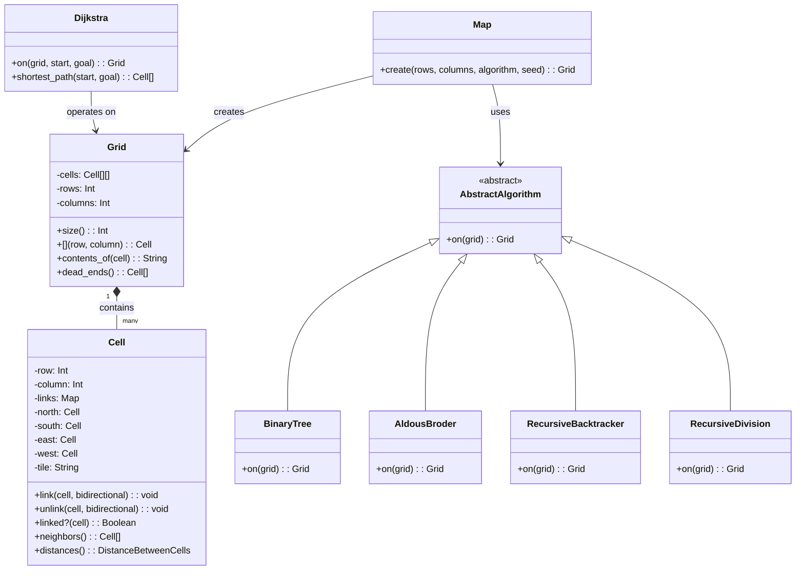
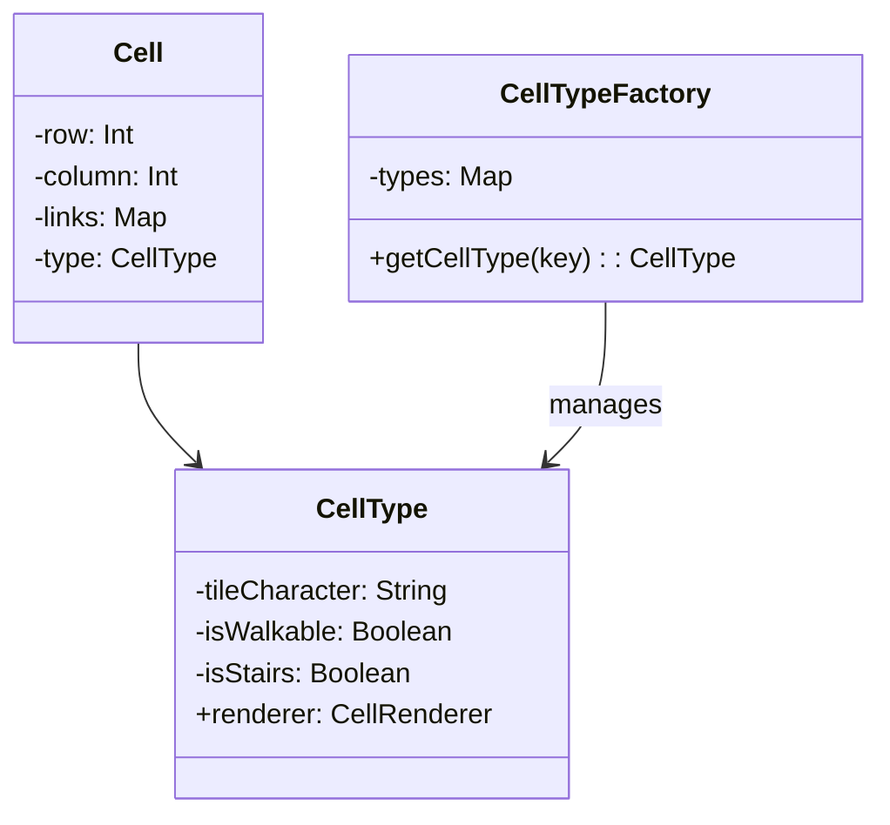
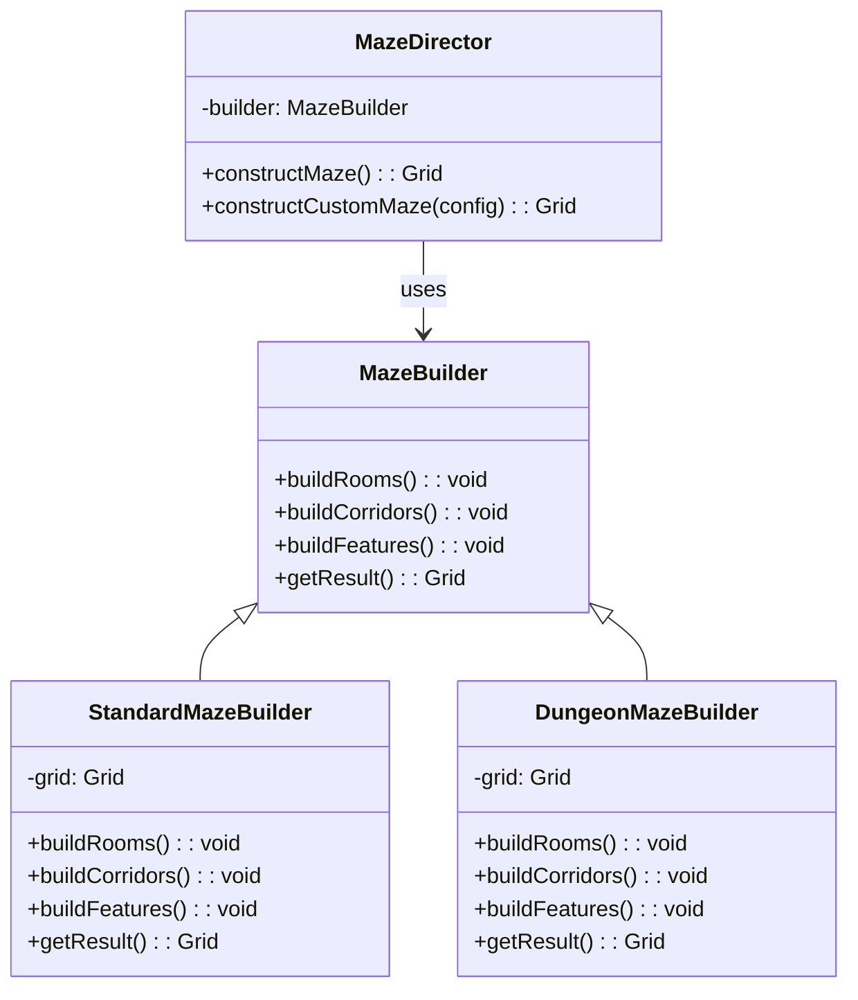
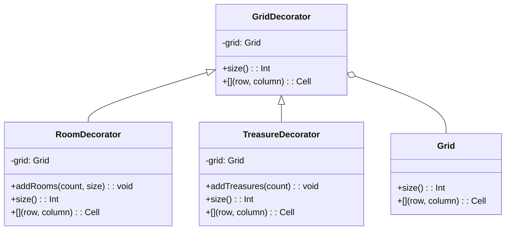
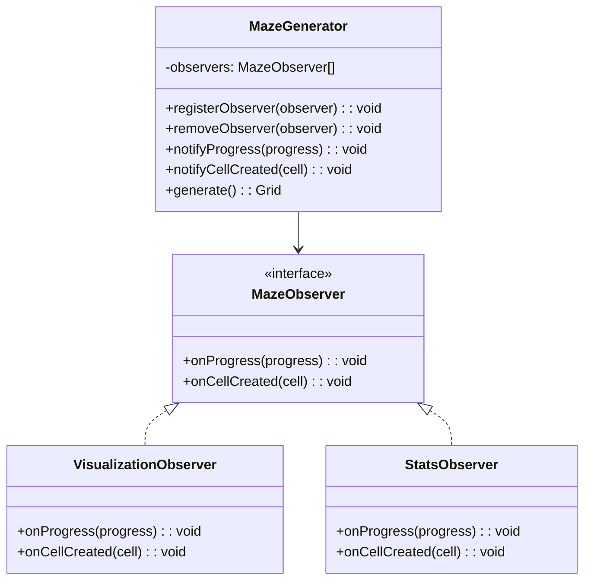
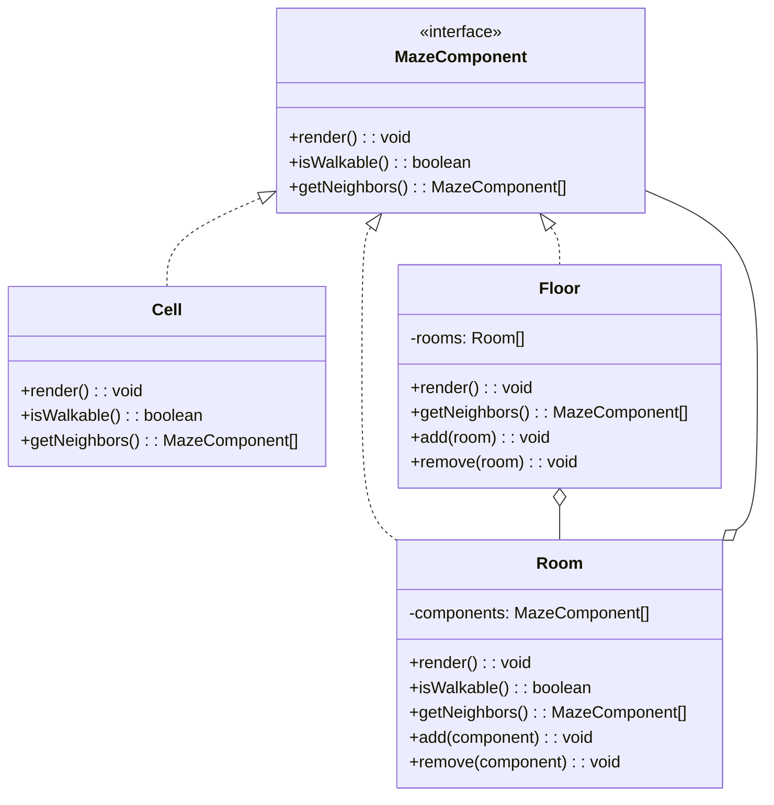
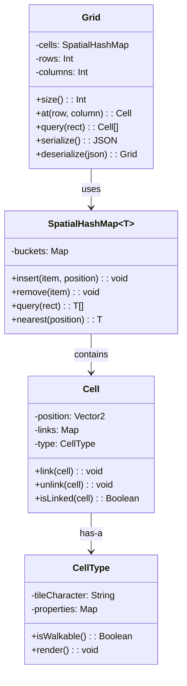
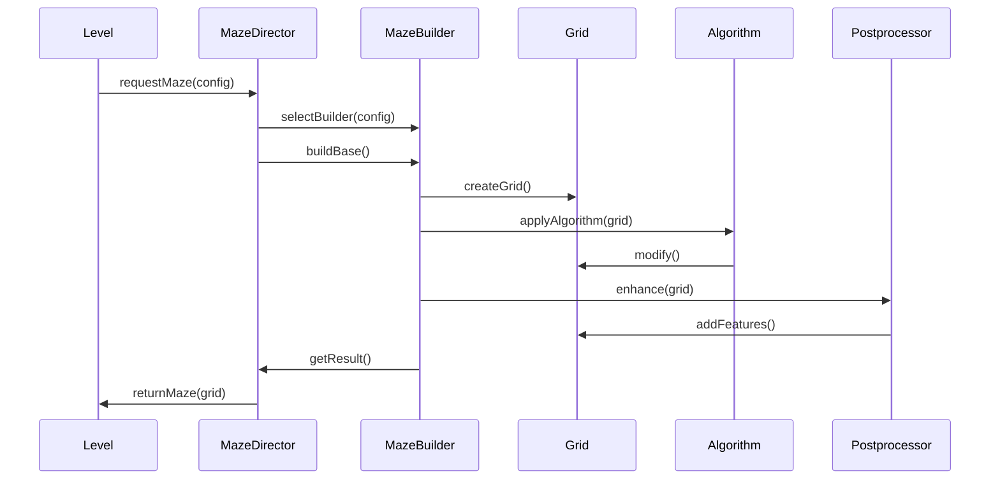
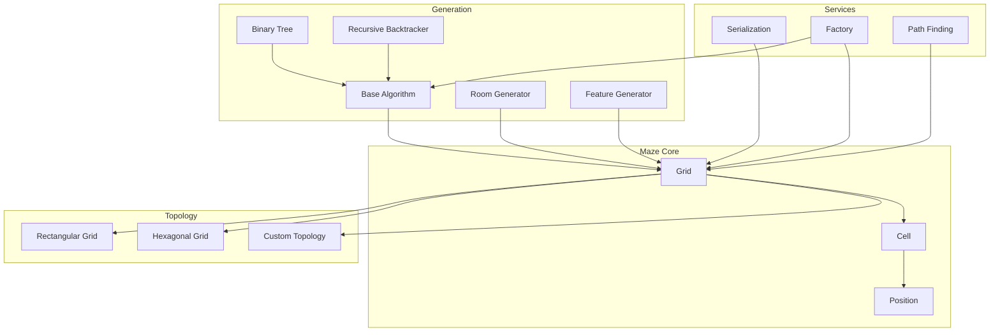

# Maze Generation Architecture: Analysis & Improvements

This document provides a detailed analysis of the current maze generation architecture in Vanilla and proposes improvements based on established game programming patterns and best practices.

## Current Architecture

The existing maze generation subsystem uses several key components:



### Current Implementation Analysis

1. **Strategy Pattern for Algorithms**:
   - Different maze generation algorithms inherit from AbstractAlgorithm
   - Allows selecting different maze generation strategies at runtime
   - Clean implementation of the Strategy Pattern

2. **Grid and Cell Structure**:
   - Grid maintains a 2D array of cells
   - Cells track their positions and links to neighbors
   - Cells can be linked/unlinked to create passages/walls

3. **Pathfinding**:
   - Dijkstra's algorithm for computing distances and paths
   - Used for finding the longest path for placing start/goal positions

4. **Map Factory**:
   - Creates grids using the specified algorithm
   - Seeds random generation for reproducibility

## Limitations in Current Architecture

1. **Memory Efficiency**:
   - Each Cell stores its own state independently
   - No sharing of common cell attributes
   - Potential memory overhead for large mazes

2. **Performance Bottlenecks**:
   - Pathfinding can be slow on large mazes
   - No spatial partitioning for optimizing queries

3. **Generation Flexibility**:
   - Limited ability to combine algorithms
   - No progressive generation (generate-as-you-explore)
   - No support for multi-threaded generation

4. **Extensibility Issues**:
   - Fixed to rectangular grid topology
   - Difficult to add new cell types or grid shapes
   - Limited serialization/deserialization

## Recommended Patterns from Game Programming Patterns

### 1. Flyweight Pattern

The Flyweight pattern can optimize memory usage by sharing common cell data across multiple instances.



**Benefits**:
- Reduces memory footprint for large mazes
- Separates intrinsic (shared) from extrinsic (instance-specific) state
- Improves cache locality for rendering

### 2. Builder Pattern

The Builder pattern provides a structured way to create complex mazes with customizable features.



**Benefits**:
- Separates construction process from representation
- Allows step-by-step construction with validation
- Enables creating different maze variations using the same process

### 3. Decorator Pattern

The Decorator pattern can enhance mazes with additional features without modifying core classes.



**Benefits**:
- Allows adding features to mazes without subclassing
- Enhances mazes with rooms, treasures, traps, etc.
- Enables combining decorators for complex maze features

### 4. Observer Pattern

The Observer pattern enables decoupling maze generation from visualization and event handling.



**Benefits**:
- Decouples generation from visualization
- Enables real-time visualization of generation process
- Supports collecting metrics during generation

### 5. Composite Pattern

The Composite pattern can represent complex maze structures with nested components.



**Benefits**:
- Represents complex maze structures (cells, rooms, floors)
- Enables hierarchical maze organization
- Simplifies operations across different levels of abstraction

## Recommended Architecture Improvements

### 1. Optimized Data Structures



### 2. Improved Generation Pipeline



### 3. Modular Architecture



## Specific Implementation Recommendations

1. **Use a Flyweight for Cell Types**:
   ```ruby
   class CellTypeFactory
     def initialize
       @types = {}
     end

     def get_cell_type(key)
       @types[key] ||= CellType.new(key)
     end
   end

   class Cell
     def initialize(row, column, type_factory)
       @row = row
       @column = column
       @links = {}
       @type = type_factory.get_cell_type(:empty)
     end
   end
   ```

2. **Implement a Builder for Maze Construction**:
   ```ruby
   class MazeBuilder
     def initialize(rows, columns)
       @grid = Grid.new(rows, columns)
     end

     def apply_algorithm(algorithm_class)
       algorithm_class.on(@grid)
       self
     end

     def add_rooms(count, min_size, max_size)
       # Add rooms logic
       self
     end

     def add_features(feature_type, count)
       # Add features like treasures, traps
       self
     end

     def get_result
       @grid
     end
   end
   ```

3. **Add Spatial Partitioning for Large Grids**:
   ```ruby
   class SpatialGrid
     def initialize(cell_size)
       @cells = {}
       @cell_size = cell_size
     end

     def add(entity, position)
       bucket = bucket_for(position)
       @cells[bucket] ||= []
       @cells[bucket] << entity
     end

     def query(rect)
       # Return entities in the given rectangle
     end

     private

     def bucket_for(position)
       x = (position.x / @cell_size).floor
       y = (position.y / @cell_size).floor
       [x, y]
     end
   end
   ```

4. **Implement Progressive Generation**:
   ```ruby
   class ProgressiveMazeGenerator
     def initialize(start_position, visible_radius)
       @generated_cells = {}
       @frontier = [start_position]
       @visible_radius = visible_radius
     end

     def ensure_generated(position)
       return if @generated_cells[position]

       # Generate this cell and its neighbors
       generate_cell(position)

       # Add neighbors to frontier
       neighbors = get_neighbors(position)
       neighbors.each do |neighbor|
         @frontier << neighbor unless @generated_cells[neighbor]
       end
     end

     def generate_visible_from(position)
       cells_in_radius(position, @visible_radius).each do |cell_pos|
         ensure_generated(cell_pos)
       end
     end
   end
   ```

5. **Add Support for Different Grid Topologies**:
   ```ruby
   module Topology
     class Base
       def neighbors(position)
         raise NotImplementedError
       end

       def distance(from, to)
         raise NotImplementedError
       end
     end

     class Rectangular < Base
       def neighbors(position)
         x, y = position
         [
           [x+1, y], [x-1, y], [x, y+1], [x, y-1]
         ]
       end
     end

     class Hexagonal < Base
       def neighbors(position)
         x, y = position
         if y.even?
           [
             [x, y-1], [x+1, y-1], [x+1, y],
             [x, y+1], [x+1, y+1], [x-1, y]
           ]
         else
           [
             [x-1, y-1], [x, y-1], [x+1, y],
             [x-1, y+1], [x, y+1], [x-1, y]
           ]
         end
       end
     end
   end
   ```

## Conclusion

By applying these game programming patterns and architecture improvements to the maze generation subsystem, Vanilla can achieve:

1. **Better Performance**: Through optimized data structures and algorithms
2. **Greater Flexibility**: With the ability to combine algorithms and features
3. **Improved Extensibility**: By supporting different grid topologies and features
4. **Enhanced User Experience**: With progressive generation and visualization
5. **Maintainability**: Through clear separation of concerns and modular design

These improvements maintain compatibility with the existing Entity-Component-System architecture while providing a more robust foundation for future enhancements.

## Next Steps

1. Implement the Flyweight pattern for cell types to improve memory efficiency
2. Create a Builder-based API for maze generation
3. Add spatial partitioning for large grids
4. Develop a prototype for progressive generation
5. Implement serialization/deserialization for saving/loading mazes
6. Add support for alternate grid topologies (hexagonal, triangular)