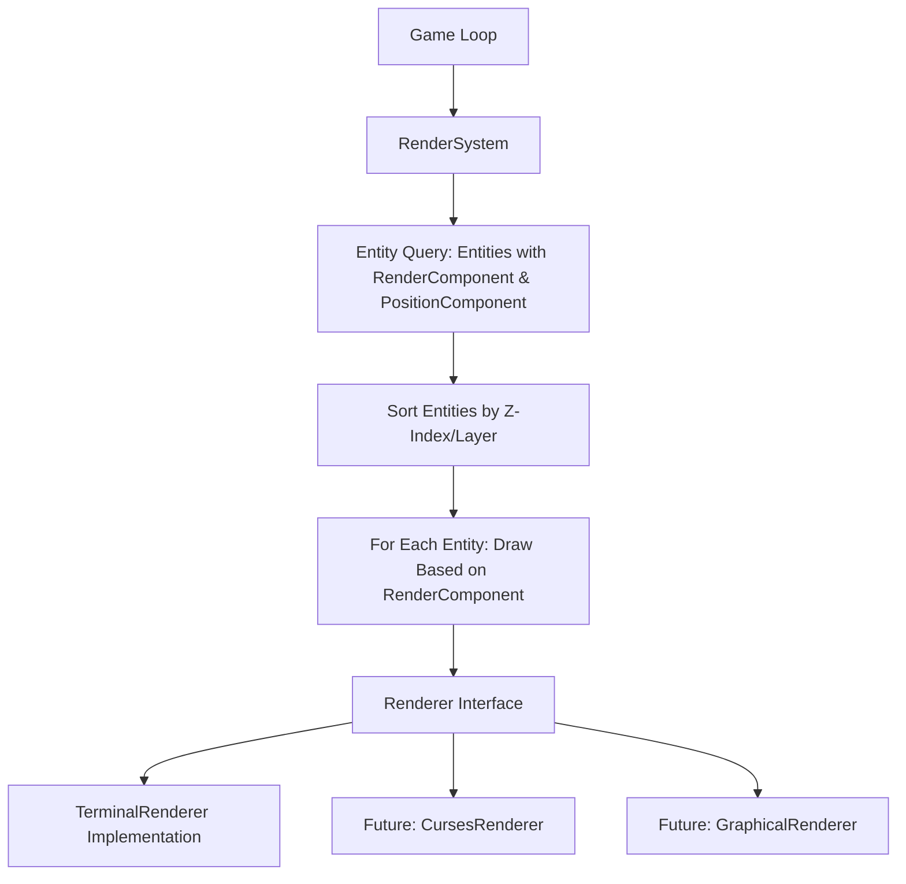

# Renderer + RenderComponent Pattern Implementation Plan

## Overview

This document outlines a comprehensive implementation plan for upgrading Vanilla's rendering system to use the Renderer + RenderComponent Pattern. This approach aligns with Vanilla's Entity-Component-System (ECS) architecture and addresses the limitations of the current drawing implementation.

## Architectural Design



### Core Components

1. **RenderComponent**: Stores visual representation data for entities
2. **Renderer Interface**: Abstracts rendering implementation details
3. **TerminalRenderer**: Concrete implementation for terminal output
4. **RenderSystem**: Processes entities with render components

### Key Benefits

- **Full ECS Alignment**: Consistent with Vanilla's architectural patterns
- **Clean Separation of Concerns**: Rendering logic separated from game logic
- **Extensibility**: Easy to add new renderers or visual effects
- **Testability**: Components can be tested independently
- **Future-proofing**: Supports multiple rendering backends

## Implementation Timeline

### Phase 1: Foundation (Days 1-2)

#### 1.1 Create RenderComponent

```ruby
module Vanilla
  module Components
    class RenderComponent < Component
      attr_reader :character, :color, :layer

      def initialize(character:, color: nil, layer: 0)
        @character = character
        @color = color
        @layer = layer
        super()
      end

      def type
        :render
      end

      def data
        {
          character: @character,
          color: @color,
          layer: @layer
        }
      end

      def self.from_hash(hash)
        new(
          character: hash[:character],
          color: hash[:color],
          layer: hash[:layer] || 0
        )
      end
    end

    # Register component
    Component.register(RenderComponent)
  end
end
```

#### 1.2 Create Renderer Interface

```ruby
module Vanilla
  module Renderers
    class Renderer
      def clear
        raise NotImplementedError, "Renderers must implement #clear"
      end

      def draw_grid(grid)
        raise NotImplementedError, "Renderers must implement #draw_grid"
      end

      def draw_character(row, column, character, color = nil)
        raise NotImplementedError, "Renderers must implement #draw_character"
      end

      def present
        raise NotImplementedError, "Renderers must implement #present"
      end
    end
  end
end
```

#### 1.3 Implement TerminalRenderer

```ruby
module Vanilla
  module Renderers
    class TerminalRenderer < Renderer
      def initialize
        @buffer = nil
        @grid = nil
        @header = ""
      end

      def clear
        # Clear internal buffer
        @buffer = nil
        system("clear")
      end

      def draw_grid(grid)
        @grid = grid
        # Initialize buffer with grid dimensions
        @buffer = Array.new(grid.rows) { Array.new(grid.columns, ' ') }

        # Fill with basic grid content
        grid.rows.times do |row|
          grid.columns.times do |col|
            cell = grid[row, col]
            if cell
              # We'll use an empty space as default, actual cell content
              # will be overlaid by entities with render components
              @buffer[row][col] = ' '
            end
          end
        end

        # Store header info
        @header = "Seed: #{$seed} | Rows: #{grid.rows} | Columns: #{grid.columns}"
      end

      def draw_character(row, column, character, color = nil)
        return unless @buffer && row >= 0 && row < @buffer.size &&
                     column >= 0 && column < @buffer.first.size

        @buffer[row][column] = character
        # Color is stored for future implementation
      end

      def present
        return unless @buffer && @grid

        # Print header
        puts @header
        puts "-" * 35
        puts "\n"

        # Render based on the same logic as the original Terminal class
        output = "+" + "---+" * @grid.columns + "\n"

        @grid.rows.times do |row_idx|
          top = "|"
          bottom = "+"

          @grid.columns.times do |col_idx|
            cell = @grid[row_idx, col_idx]
            next unless cell

            # Use our buffer content instead of grid.contents_of
            body = @buffer[row_idx][col_idx]
            body = " #{body} " if body.size == 1
            body = " #{body}" if body.size == 2

            east_cell = @grid[row_idx, col_idx + 1]
            south_cell = @grid[row_idx + 1, col_idx]

            east_boundary = (east_cell && cell.linked?(east_cell) ? " " : "|")
            south_boundary = (south_cell && cell.linked?(south_cell) ? "   " : "---")
            corner = "+"

            top << body << east_boundary
            bottom << south_boundary << corner
          end

          output << top << "\n"
          output << bottom << "\n"
        end

        puts output
      end
    end
  end
end
```

#### 1.4 Create RenderSystem

```ruby
module Vanilla
  module Systems
    class RenderSystem
      def initialize(renderer)
        @renderer = renderer
        @logger = Vanilla::Logger.instance
      end

      def render(entities, grid)
        @logger.debug("Rendering scene with #{entities.size} entities")

        # Start with a fresh canvas
        @renderer.clear

        # Draw the grid first (background)
        @renderer.draw_grid(grid)

        # Find entities with both position and render components
        drawable_entities = entities.select do |entity|
          entity.has_component?(:position) && entity.has_component?(:render)
        end

        # Sort by layer (z-index) for proper drawing order
        drawable_entities.sort_by! { |e| e.get_component(:render).layer }

        # Draw each entity
        drawable_entities.each do |entity|
          render_component = entity.get_component(:render)
          position = entity.get_component(:position)

          @renderer.draw_character(
            position.row,
            position.column,
            render_component.character,
            render_component.color
          )
        end

        # Present the final rendered scene
        @renderer.present
      end
    end
  end
end
```

### Phase 2: Integration (Days 3-4)

#### 2.1 Add RenderComponents to Existing Entities

```ruby
# Example for Player entity
def initialize(name: 'player', row:, column:)
  super()

  @name = name
  @level = 1
  @experience = 0
  @inventory = []

  # Add required components
  add_component(Components::PositionComponent.new(row: row, column: column))
  add_component(Components::MovementComponent.new)
  add_component(Components::TileComponent.new(tile: Support::TileType::PLAYER))
  add_component(Components::StairsComponent.new)

  # Add new RenderComponent
  add_component(Components::RenderComponent.new(
    character: Support::TileType::PLAYER,
    layer: 10  # Player is usually drawn on top
  ))
end

# Example for Monster entity
def initialize(monster_type: 'goblin', row:, column:, health: 10, damage: 2)
  super()

  @monster_type = monster_type
  @health = health
  @damage = damage

  # Add required components
  add_component(Components::PositionComponent.new(row: row, column: column))
  add_component(Components::MovementComponent.new)
  add_component(Components::TileComponent.new(tile: Support::TileType::MONSTER))

  # Add new RenderComponent
  add_component(Components::RenderComponent.new(
    character: Support::TileType::MONSTER,
    layer: 5  # Monsters are below player
  ))
end
```

#### 2.2 Create RenderSystem Factory Method

```ruby
# In lib/vanilla/systems.rb or new file lib/vanilla/systems/render_system_factory.rb
module Vanilla
  module Systems
    class RenderSystemFactory
      def self.create
        renderer = Vanilla::Renderers::TerminalRenderer.new
        RenderSystem.new(renderer)
      end
    end
  end
end
```

#### 2.3 Integrate with Game Loop

```ruby
# In the Game class's initialize method
def initialize
  @logger = Vanilla::Logger.instance
  @logger.info("Starting Vanilla game")

  # Initialize event system
  @event_manager = Events::EventManager.new(@logger)

  # Input handler
  @input_handler = InputHandler.new(@logger, @event_manager)

  # Initialize render system
  @render_system = Systems::RenderSystemFactory.create
end

# In the game_loop method
def game_loop(level)
  loop do
    # ... existing code ...

    # After game state updates, render the scene
    all_entities = [level.player] + level.instance_variable_get(:@monster_system).monsters
    @render_system.render(all_entities, level.grid)

    # ... rest of game loop ...
  end
end
```

#### 2.4 Create Compatibility Layer

```ruby
# In lib/vanilla/draw.rb - add deprecation notices and forward to new system
module Vanilla
  module Draw
    class << self
      attr_accessor :render_system

      # @deprecated Use RenderSystem directly
      def map(grid, open_maze: true)
        warn "[DEPRECATED] Vanilla::Draw.map is deprecated. Use RenderSystem instead."

        ensure_render_system

        # Get all entities from the global registry or create an empty collection
        entities = Vanilla::EntityRegistry.entities rescue []

        # Render using the new system
        @render_system.render(entities, grid)
      end

      # @deprecated Use RenderSystem directly
      def tile(grid:, row:, column:, tile:)
        warn "[DEPRECATED] Vanilla::Draw.tile is deprecated. Use RenderComponent instead."

        # ... existing implementation ...
      end

      # Other methods with similar deprecation notices

      private

      def ensure_render_system
        @render_system ||= Vanilla::Systems::RenderSystemFactory.create
      end
    end
  end
end
```

### Phase 3: Testing and Refinement (Days 5-6)

#### 3.1 Unit Tests for New Components

```ruby
# spec/lib/vanilla/components/render_component_spec.rb
require 'spec_helper'

RSpec.describe Vanilla::Components::RenderComponent do
  describe '#initialize' do
    it 'sets character, color, and layer' do
      component = described_class.new(character: 'X', color: :red, layer: 5)
      expect(component.character).to eq('X')
      expect(component.color).to eq(:red)
      expect(component.layer).to eq(5)
    end

    it 'defaults layer to 0' do
      component = described_class.new(character: 'X')
      expect(component.layer).to eq(0)
    end
  end

  describe '#type' do
    it 'returns :render' do
      component = described_class.new(character: 'X')
      expect(component.type).to eq(:render)
    end
  end

  # Additional tests for serialization
end
```

#### 3.2 Functional Tests for Rendering System

```ruby
# spec/lib/vanilla/systems/render_system_spec.rb
require 'spec_helper'

RSpec.describe Vanilla::Systems::RenderSystem do
  let(:renderer) { instance_double('Vanilla::Renderers::Renderer') }
  let(:grid) { instance_double('Vanilla::MapUtils::Grid') }
  let(:system) { described_class.new(renderer) }

  describe '#render' do
    it 'draws entities with position and render components' do
      # Setup test entities
      entity1 = Vanilla::Components::Entity.new
      entity1.add_component(Vanilla::Components::PositionComponent.new(row: 1, column: 2))
      entity1.add_component(Vanilla::Components::RenderComponent.new(character: 'A', layer: 1))

      entity2 = Vanilla::Components::Entity.new
      entity2.add_component(Vanilla::Components::PositionComponent.new(row: 3, column: 4))
      entity2.add_component(Vanilla::Components::RenderComponent.new(character: 'B', layer: 0))

      entity3 = Vanilla::Components::Entity.new # No render component
      entity3.add_component(Vanilla::Components::PositionComponent.new(row: 5, column: 6))

      # Expectations
      expect(renderer).to receive(:clear)
      expect(renderer).to receive(:draw_grid).with(grid)

      # Entity2 should be drawn first due to lower layer value
      expect(renderer).to receive(:draw_character).with(3, 4, 'B', nil).ordered
      expect(renderer).to receive(:draw_character).with(1, 2, 'A', nil).ordered

      expect(renderer).to receive(:present)

      # Execute
      system.render([entity1, entity2, entity3], grid)
    end
  end
end
```

#### 3.3 Visual Validation Script

```ruby
# scripts/test_rendering.rb
require_relative '../lib/vanilla'

# Create a test grid
grid = Vanilla::MapUtils::Grid.new(rows: 10, columns: 10)
Vanilla::Algorithms::BinaryTree.on(grid)

# Create renderer and render system
renderer = Vanilla::Renderers::TerminalRenderer.new
render_system = Vanilla::Systems::RenderSystem.new(renderer)

# Create test entities
player = Vanilla::Components::Entity.new
player.add_component(Vanilla::Components::PositionComponent.new(row: 5, column: 5))
player.add_component(Vanilla::Components::RenderComponent.new(character: '@', layer: 10))

monster1 = Vanilla::Components::Entity.new
monster1.add_component(Vanilla::Components::PositionComponent.new(row: 3, column: 7))
monster1.add_component(Vanilla::Components::RenderComponent.new(character: 'M', layer: 5))

monster2 = Vanilla::Components::Entity.new
monster2.add_component(Vanilla::Components::PositionComponent.new(row: 7, column: 2))
monster2.add_component(Vanilla::Components::RenderComponent.new(character: 'M', layer: 5))

stairs = Vanilla::Components::Entity.new
stairs.add_component(Vanilla::Components::PositionComponent.new(row: 9, column: 9))
stairs.add_component(Vanilla::Components::RenderComponent.new(character: '%', layer: 1))

# Render the scene
render_system.render([player, monster1, monster2, stairs], grid)

puts "\nPress any key to exit..."
STDIN.getch
```

### Phase 4: Complete Migration (Day 7)

#### 4.1 Update Game Class to Use RenderSystem Exclusively

Modify the `Game` class to exclusively use the `RenderSystem` for all rendering, removing references to the old `Draw` module.

#### 4.2 Remove the Old Draw Module

Once all code has been migrated to use the new rendering system, remove the deprecated `Draw` module.

#### 4.3 Port Any Additional Functionality

Make sure any special features from the original `terminal.rb` are ported to the new `TerminalRenderer`.

## Future Enhancements

Once the base implementation is complete, consider these enhancements:

1. **Color Support**: Implement ANSI color support in the terminal renderer
2. **Animation System**: Add support for animated entities
3. **UI Components**: Add specialized components for UI elements
4. **Alternative Renderers**: Implement additional renderers (Curses, SDL, etc.)
5. **Event Integration**: Consider adding event-driven rendering in a future update

## Conclusion

This implementation plan provides a structured approach to migrate Vanilla's rendering system to the Renderer + RenderComponent Pattern. This change will align the rendering code with the game's ECS architecture, improve maintainability, and provide a foundation for future enhancements.

The migration will be performed in a way that minimizes disruption to the existing codebase, with compatibility layers ensuring a smooth transition. Once complete, the rendering system will be more modular, extensible, and aligned with modern game development patterns.