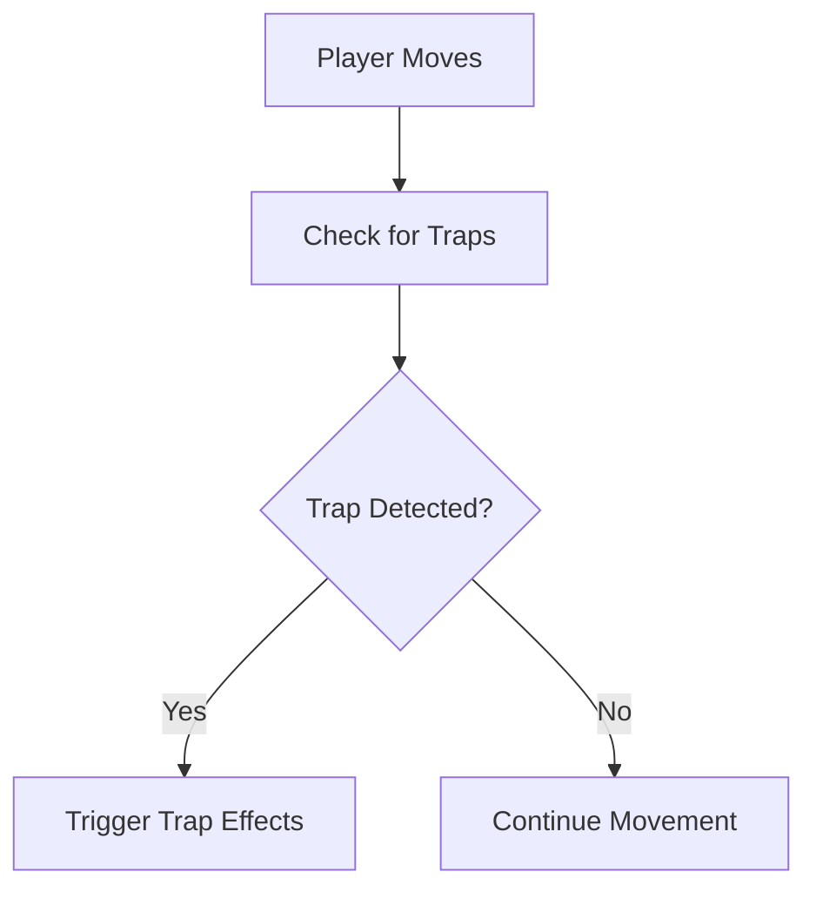

# Traps Implementation Proposal

## Introduction

In roguelike games, traps add an element of surprise and challenge, requiring players to navigate the map carefully. This document proposes an implementation of traps in the Vanilla Roguelike game, enhancing the strategic depth and excitement of exploration.

## Concept

Traps will be hidden on the map and can be triggered by the player or other entities. When triggered, traps can cause various effects, such as damage, status changes, or triggering other events. The player may have abilities or items to detect or disarm traps.

## Implementation Plan

### 1. Data Structures

- **Trap Component:** A component that can be added to entities, representing a trap with properties like type, damage, and status effects.
- **Trap Entity:** A new entity type representing a trap on the map.

### 2. Trap Mechanics

- **Triggering Traps:**
  - Traps are triggered when a player or entity moves onto the same tile.
  - Implement logic to apply trap effects, such as reducing health or applying status effects.

- **Detecting and Disarming Traps:**
  - Players may have skills or items to detect traps within a certain radius.
  - Implement a mechanism for players to attempt disarming traps, possibly involving a skill check.

### 3. Rendering

- **Trap Visibility:**
  - Traps are invisible by default but can be revealed through detection.
  - Use visual cues to indicate detected traps.

### 4. Code Example

```ruby
class TrapComponent
  attr_reader :type, :damage, :status_effect

  def initialize(type:, damage:, status_effect: nil)
    @type = type
    @damage = damage
    @status_effect = status_effect
  end

  def trigger(entity)
    entity.take_damage(@damage)
    apply_status_effect(entity) if @status_effect
  end

  private

  def apply_status_effect(entity)
    # Logic to apply status effect to the entity
  end
end

class TrapEntity < Entity
  def initialize(position, trap_component)
    super()
    add_component(PositionComponent.new(*position))
    add_component(trap_component)
  end
end
```

### 5. Integration with Existing Codebase

- **Map Generation:** Add logic to randomly place traps on the map during generation.
- **Player Interaction:** Update player movement logic to check for traps and handle triggering.
- **Rendering System:** Modify rendering to show detected traps.

## Diagram



## Conclusion

Adding traps to the Vanilla Roguelike game will increase the strategic complexity and excitement of exploration. This proposal outlines a method to integrate traps into the existing codebase, enhancing the player's experience with new challenges and interactions.