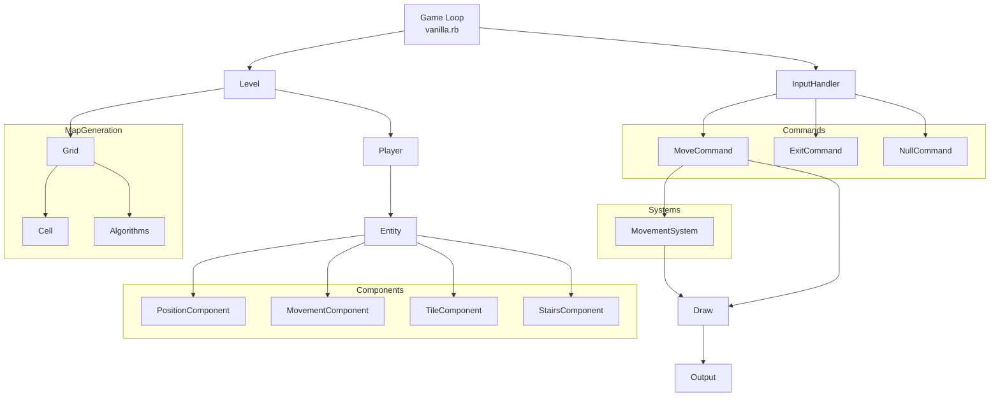

# Vanilla Game Architecture

This document provides an overview of the current architecture of the Vanilla game, describing the relationships between key components and their responsibilities.

## Architecture Overview

## Component Responsibilities

### Core Game Flow

- **Game Loop** (`vanilla.rb`): The entry point and main controller of the game. Handles the game loop, processes user input, and coordinates between different components.

- **InputHandler**: Translates raw key inputs into appropriate command objects. Acts as the first step in the command pattern implementation.

- **Commands**: Implement the Command pattern to encapsulate actions:
  - `MoveCommand`: Handles player movement in a specified direction
  - `ExitCommand`: Terminates the game
  - `NullCommand`: Handles unknown or invalid inputs (null object pattern)

### Level Management

- **Level**: Manages the current game level, including the grid and player. Responsible for level generation and tracking level state.

- **Grid**: Represents the maze/dungeon structure. Contains cells and their connections.

- **Cell**: A single location in the grid. Tracks its position, connections to other cells, and contains methods for maze generation.

### Entity Component System

- **Entity**: Base class for game objects, following the Entity-Component-System pattern. Acts as a container for components.

- **Components**: Data containers that define aspects of an entity:
  - `PositionComponent`: Stores and manages entity position (row, column)
  - `MovementComponent`: Handles movement capabilities and restrictions
  - `TileComponent`: Defines the visual representation of the entity
  - `StairsComponent`: Tracks whether an entity has found stairs

- **Systems**: Logic that operates on entities with specific components:
  - `MovementSystem`: Processes movement requests, handles collision detection, and updates positions

### Rendering and Output

- **Draw**: Utility module for rendering game elements to the terminal. Handles the visual representation of the game state.

- **Output**: Classes for formatting and displaying content to the terminal.

### Algorithms

- Various maze generation algorithms like `BinaryTree`, `AldousBroder`, `RecursiveBacktracker`, etc.
- Pathfinding algorithms like `Dijkstra` for calculating distances and paths.

## Current Implementation Strengths

1. **Entity-Component-System Architecture**:
   - Provides flexibility for extending entity capabilities
   - Clearly separates data (components) from behavior (systems)
   - Allows for component reuse across different entity types

2. **Command Pattern**:
   - Decouples input handling from execution
   - Makes it easy to add new commands
   - Provides a clear flow from user input to game actions

3. **Maze Generation**:
   - Modular approach to maze algorithms
   - Supports multiple generation strategies
   - Well-structured grid representation

## Suggestions for Further Improvements

1. **Complete ECS Implementation**:
   - Add a proper System Manager to systematically update all systems
   - Create an EntityManager to track and manage all game entities
   - Implement a more robust Component Manager for better performance and type safety
   - Add an event system for communication between systems

2. **Additional Systems**:
   - `CollisionSystem`: Dedicated collision detection and response
   - `AISystem`: For enemy movement and behavior
   - `ItemSystem`: For handling item interactions
   - `CombatSystem`: For implementing combat mechanics
   - `InventorySystem`: For managing item collection and use

3. **Performance Optimizations**:
   - Implement spatial partitioning for efficient collision detection when many entities are present
   - Consider caching rendered output for static parts of the grid
   - Profile and optimize critical paths in the code

4. **UI Improvements**:
   - Add a proper UI layer for displaying stats, inventory, etc.
   - Create a menu system for game options and controls
   - Add visual effects for actions like combat and item collection
   - Consider implementing a logging/message area for game events

5. **Technical Debt**:
   - Increase test coverage for edge cases
   - Add comprehensive documentation for each class and module
   - Extract maze generation into a separate library
   - Standardize error handling throughout the codebase

6. **Game Features**:
   - Add enemy entities with basic AI
   - Implement a simple combat system
   - Add item collection and inventory management
   - Create a scoring/progression system
   - Add multiple dungeon levels with increasing difficulty

By implementing these improvements, the Vanilla game could evolve from a maze exploration demo into a more complete roguelike game while maintaining its clean architecture and separation of concerns.