# Vanilla Roguelike - Architecture Documentation

This document provides a comprehensive overview of how the Vanilla Roguelike codebase works, including its architecture, design patterns, and data flow.

## Table of Contents

* [Overview](#overview)
* [Core Architecture](#core-architecture)
* [Entity-Component-System Pattern](#entity-component-system-pattern)
* [Game Loop](#game-loop)
* [System Execution Flow](#system-execution-flow)
* [Input and Command Processing](#input-and-command-processing)
* [Event System](#event-system)
* [Maze Generation](#maze-generation)
* [Rendering Pipeline](#rendering-pipeline)
* [Data Flow Examples](#data-flow-examples)
* [Key Design Patterns](#key-design-patterns)

## Overview

Vanilla is a roguelike game written in Ruby that uses an **Entity-Component-System (ECS)** architecture combined with an **event-driven system** for logging and debugging. The game features procedurally generated mazes, turn-based gameplay, and a modular design that makes it easy to extend with new features.

### High-Level Architecture

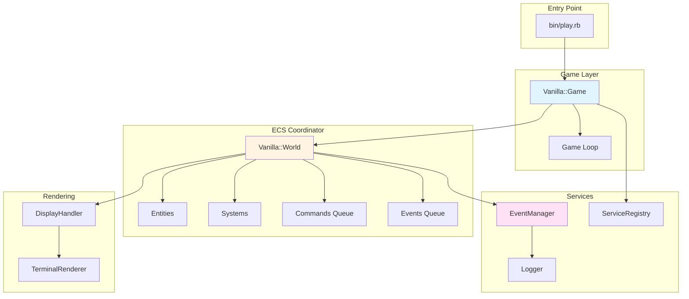

## Core Architecture

The codebase is built around three main pillars:

1. **Entity-Component-System (ECS)**: Separates data (components) from behavior (systems)
2. **Command Pattern**: Encapsulates user actions as command objects
3. **Event System**: Provides decoupled communication and comprehensive logging

### Core Components Relationship

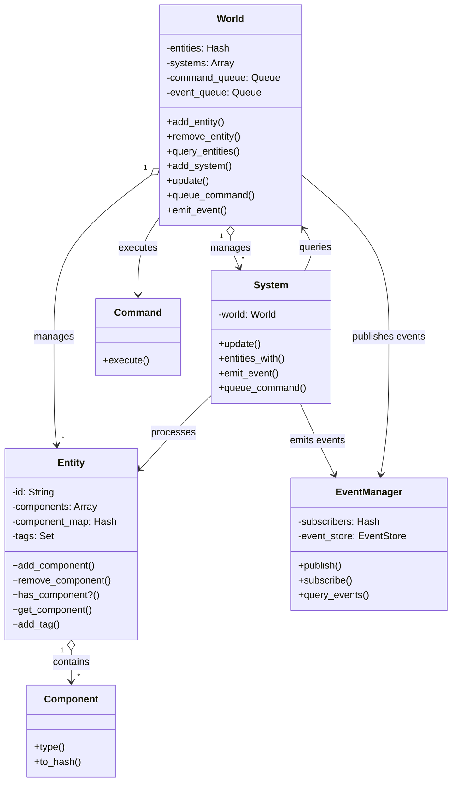

## Entity-Component-System Pattern

### Entities

Entities are simple containers with a unique ID. They don't contain logic—only data through components.

```ruby
# Example: Player Entity
player = Entity.new
player.add_component(PositionComponent.new(row: 5, column: 10))
player.add_component(RenderComponent.new(character: '@', color: :white))
player.add_component(HealthComponent.new(max_health: 100))
player.add_tag(:player)
```

### Components

Components are pure data containers. They define *what* an entity is, not *how* it behaves.

**Key Components:**
- `PositionComponent`: Location in the grid
- `RenderComponent`: Visual representation
- `MovementComponent`: Movement capability
- `InputComponent`: Player input state
- `HealthComponent`: Health and damage
- `InventoryComponent`: Item storage
- `ItemComponent`: Item properties

### Systems

Systems contain the logic that operates on entities with specific component combinations. They define *how* entities behave.

**System Priority Order:**
1. **MazeSystem (0)**: Generates the maze
2. **InputSystem (1)**: Processes keyboard input
3. **MovementSystem (2)**: Moves entities
4. **CollisionSystem (3)**: Handles collisions
5. **MonsterSystem (4)**: Manages monster AI
6. **RenderSystem (10)**: Renders the game

## Game Loop

The game follows a turn-based loop pattern:

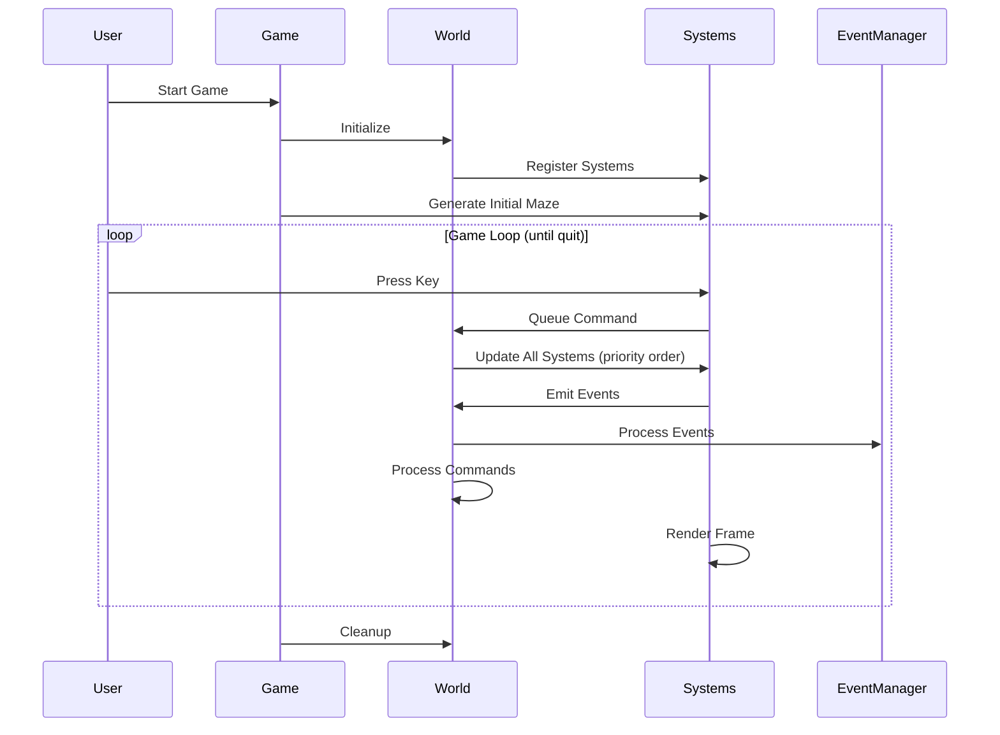

### Game Loop Implementation

```ruby
def game_loop
  @turn = 0
  until @world.quit?
    if message_system&.selection_mode?
      input_system.update(nil)  # Wait for input
      @world.update(nil)         # Process commands
    else
      @world.update(nil)         # Run all systems
      @turn += 1
    end
    render
  end
end
```

## System Execution Flow

Each frame, systems are updated in priority order:

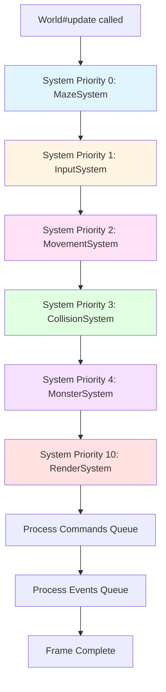

### System Update Pattern

Each system follows this pattern:

```ruby
class MovementSystem < System
  def update(_delta_time)
    # 1. Query entities with required components
    movable_entities = entities_with(:position, :movement, :input, :render)

    # 2. Process each entity
    movable_entities.each { |entity| process_entity_movement(entity) }

    # 3. Emit events if needed
    emit_event(:movement_completed, { count: movable_entities.size })
  end
end
```

## Input and Command Processing

Input flows through multiple layers before execution:

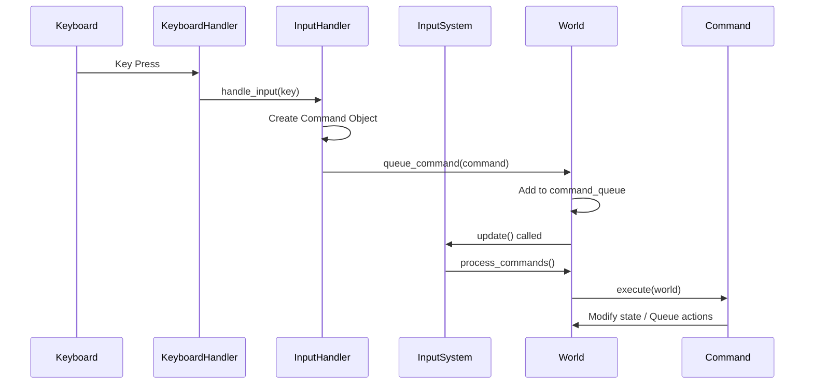

### Command Types

- **MoveCommand**: Moves an entity in a direction
- **ExitCommand**: Quits the game
- **ChangeLevelCommand**: Transitions to next level
- **ToggleMenuModeCommand**: Opens/closes menu
- **NullCommand**: Handles unknown input (no-op)

### Input Processing Example

```ruby
# InputHandler converts keys to commands
def process_command(key, entity)
  case key
  when 'k' then MoveCommand.new(entity, :north)
  when 'j' then MoveCommand.new(entity, :south)
  when 'h' then MoveCommand.new(entity, :west)
  when 'l' then MoveCommand.new(entity, :east)
  when 'q' then ExitCommand.new
  else NullCommand.new
  end
end
```

## Event System

The event system provides decoupled communication and comprehensive logging:

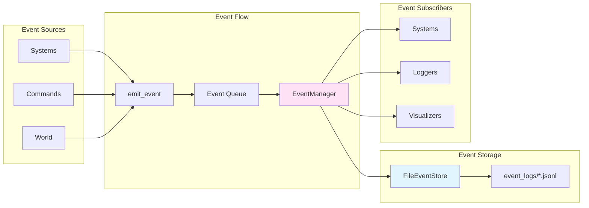

### Event Lifecycle

1. **Emission**: System/Command calls `world.emit_event(type, data)`
2. **Queuing**: Event added to `World#event_queue`
3. **Processing**: `World#process_events` called after systems update
4. **Publishing**: `EventManager#publish` stores and delivers to subscribers
5. **Storage**: Events written to JSONL files in `event_logs/`

### Common Events

- `key_pressed`: User pressed a key
- `command_issued`: A command was created
- `entity_moved`: Entity changed position
- `movement_succeeded`: Movement completed successfully
- `collision_detected`: Two entities collided
- `item_picked_up`: Player picked up an item
- `combat_attack`: Combat action initiated

## Maze Generation

Maze generation happens in the `MazeSystem`:

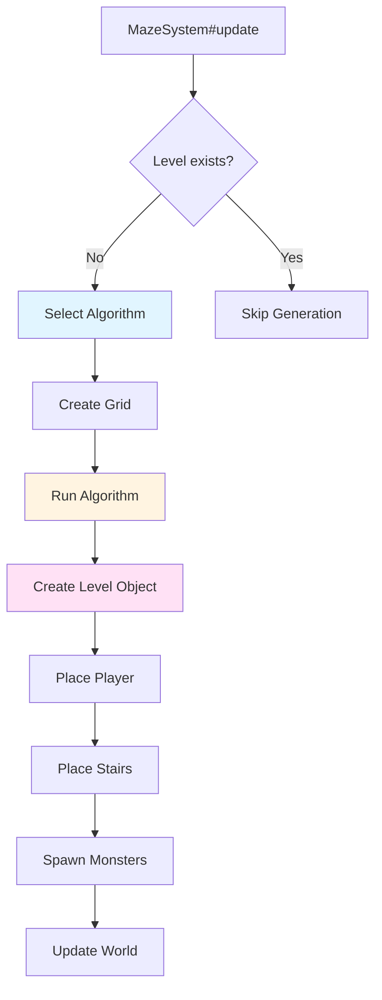

### Available Algorithms

1. **Binary Tree**: Default, creates passages north or east
2. **Aldous-Broder**: Random walk, completely unbiased
3. **Recursive Backtracker**: Long corridors, fewer dead ends
4. **Recursive Division**: Boxy, rectangular mazes

### Grid Structure

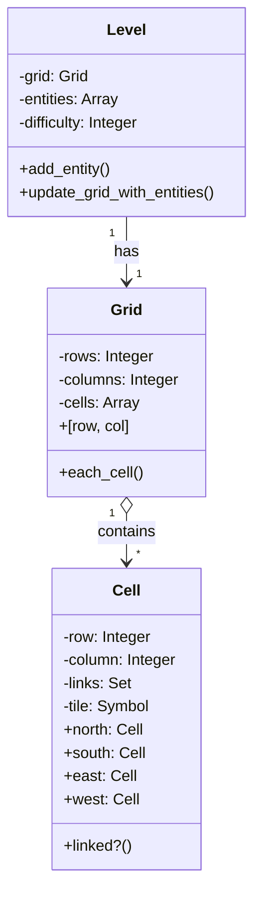

## Rendering Pipeline

Rendering happens in the `RenderSystem`:

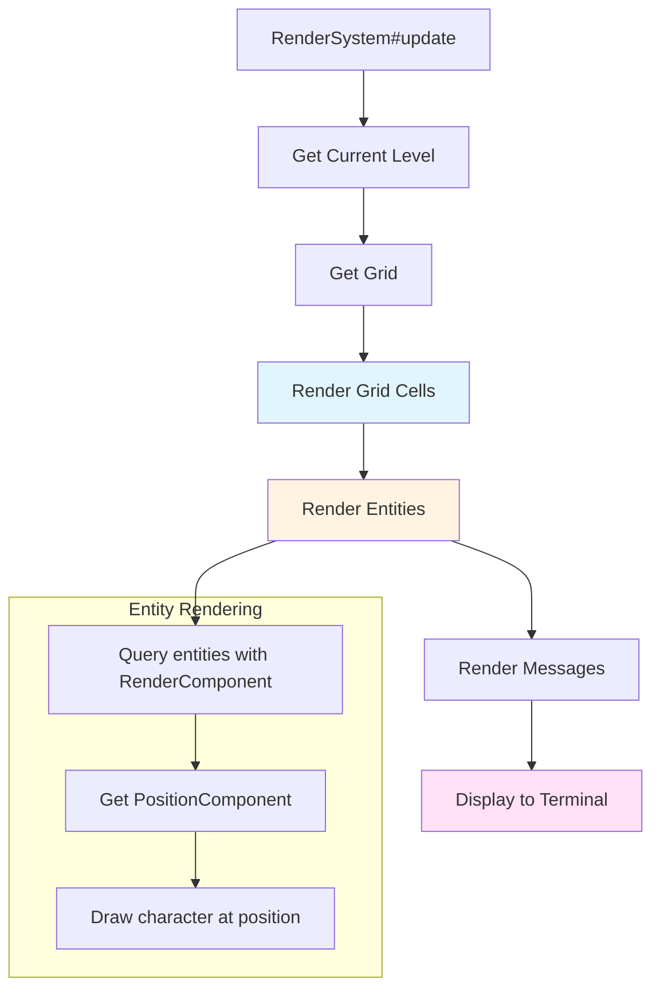

### Rendering Process

1. **Grid Rendering**: Draws walls (`#`) and empty spaces (`.`)
2. **Entity Rendering**: Overlays entities (player `@`, stairs `%`, monsters `M`)
3. **Message Rendering**: Displays game messages
4. **Terminal Update**: Flushes to screen

## Data Flow Examples

### Example 1: Player Movement

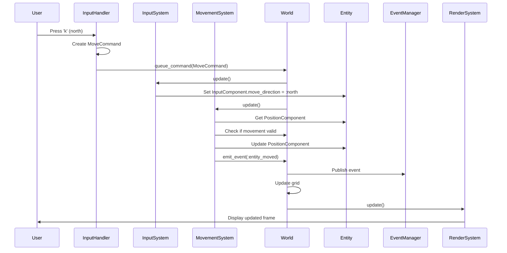

### Example 2: Entity Creation

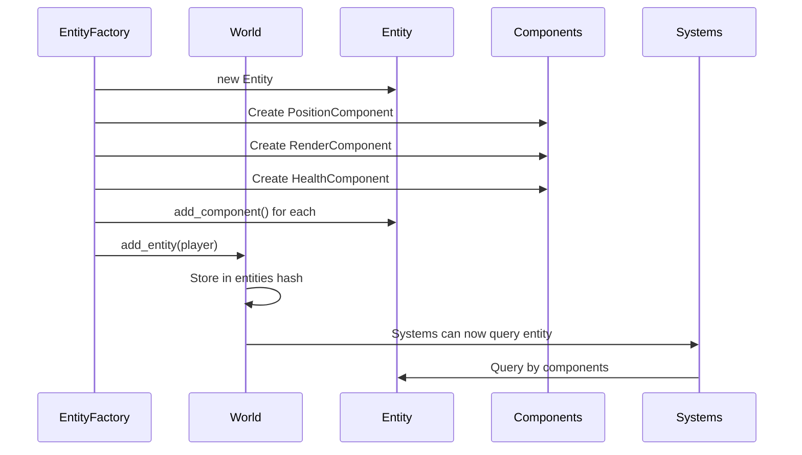

## Key Design Patterns

### 1. Entity-Component-System (ECS)

**Purpose**: Separate data from behavior for flexibility

**Benefits**:
- Easy to add new entity types by composing components
- Systems are reusable across different entity types
- Clear separation of concerns

**Example**:
```ruby
# Create a monster with different components
monster = Entity.new
monster.add_component(PositionComponent.new(row: 10, column: 15))
monster.add_component(RenderComponent.new(character: 'M'))
monster.add_component(HealthComponent.new(max_health: 50))
# No MovementComponent = monster can't move (until AI system adds it)
```

### 2. Command Pattern

**Purpose**: Encapsulate actions as objects

**Benefits**:
- Undo/redo capability (future)
- Command queuing
- Easy to log and replay actions

**Example**:
```ruby
command = MoveCommand.new(player, :north)
world.queue_command(command)
# Command executes later in the game loop
```

### 3. Service Locator Pattern

**Purpose**: Provide global access to services

**Implementation**:
```ruby
Vanilla::ServiceRegistry.register(:game, game)
Vanilla::ServiceRegistry.register(:event_manager, event_manager)

# Access anywhere
game = Vanilla::ServiceRegistry.get(:game)
```

### 4. Observer Pattern (Event System)

**Purpose**: Decouple components through events

**Benefits**:
- Systems don't need direct references
- Easy to add logging and debugging
- Components can react to events without tight coupling

### 5. Factory Pattern

**Purpose**: Centralize entity creation

**Example**:
```ruby
player = EntityFactory.create_player(0, 0)
stairs = EntityFactory.create_stairs(10, 15)
monster = EntityFactory.create_monster(:goblin, 5, 5, 30, 5)
```

## System Interactions

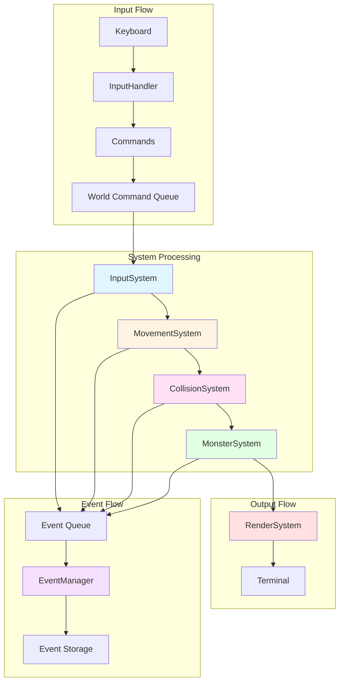

## File Organization

```
lib/vanilla/
├── game.rb              # Main game class and loop
├── world.rb             # ECS coordinator
├── entities/            # Entity definitions
│   ├── entity.rb
│   ├── player.rb
│   └── monster.rb
├── components/          # Component data structures
│   ├── component.rb
│   ├── position_component.rb
│   ├── render_component.rb
│   └── ...
├── systems/             # System logic
│   ├── system.rb
│   ├── movement_system.rb
│   ├── collision_system.rb
│   └── ...
├── commands/            # Command objects
│   ├── command.rb
│   ├── move_command.rb
│   └── ...
├── events/              # Event system
│   ├── event_manager.rb
│   ├── event.rb
│   └── storage/
├── algorithms/           # Maze generation
│   ├── binary_tree.rb
│   └── ...
└── renderers/           # Rendering
    └── terminal_renderer.rb
```

## Key Takeaways

1. **ECS Architecture**: Entities are data containers, Systems contain logic, Components define capabilities
2. **Turn-Based Loop**: Game processes input → updates systems → renders → repeats
3. **Priority-Based Systems**: Systems run in a specific order to ensure correct execution
4. **Event-Driven**: Systems communicate through events, enabling logging and debugging
5. **Command Pattern**: User actions are encapsulated as command objects
6. **Modular Design**: Easy to add new features by creating new components and systems

## Extending the Codebase

To add a new feature:

1. **Create Components**: Define data structures for your feature
2. **Create System**: Implement logic that processes entities with your components
3. **Register System**: Add it to the World with appropriate priority
4. **Create Commands** (if needed): For user interactions
5. **Emit Events**: For logging and other systems to react

Example: Adding a combat system
- Components: `CombatComponent`, `DamageComponent`
- System: `CombatSystem` (processes entities with combat components)
- Commands: `AttackCommand`
- Events: `combat_attack`, `combat_damage`, `combat_death`

