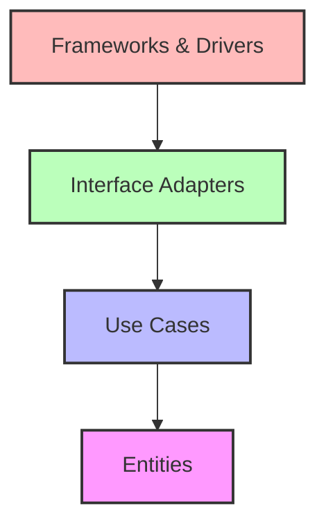
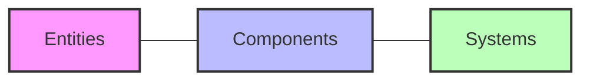
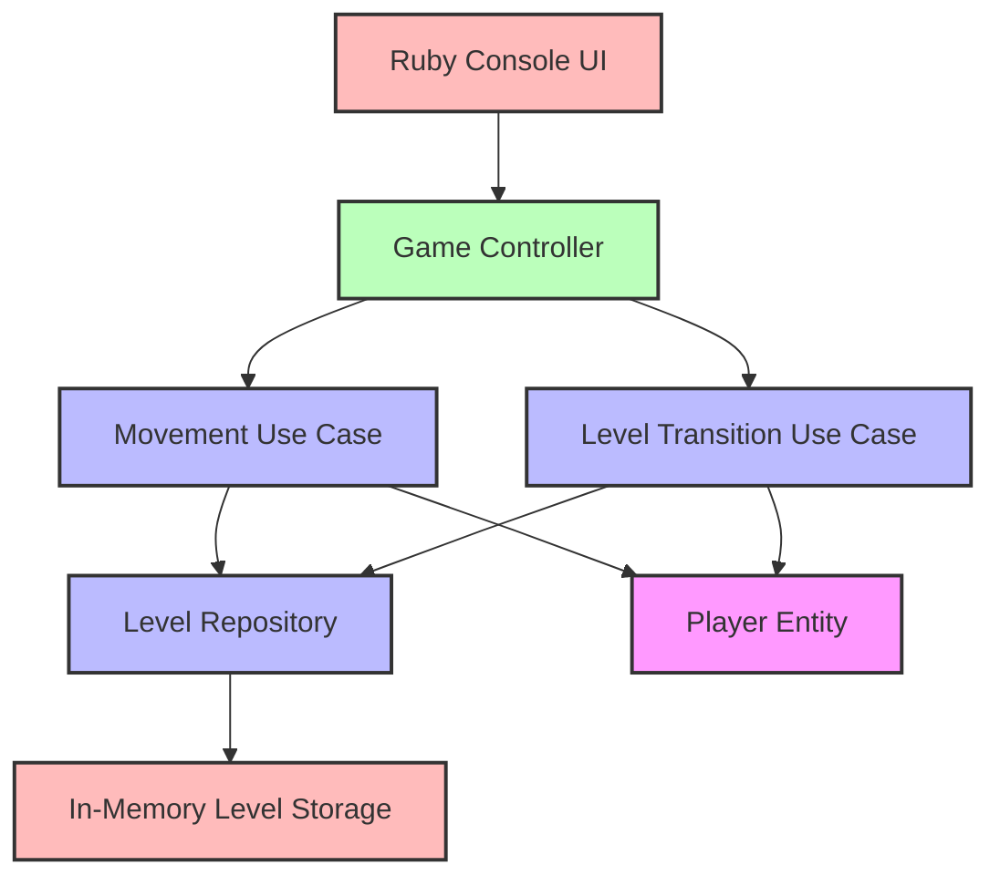
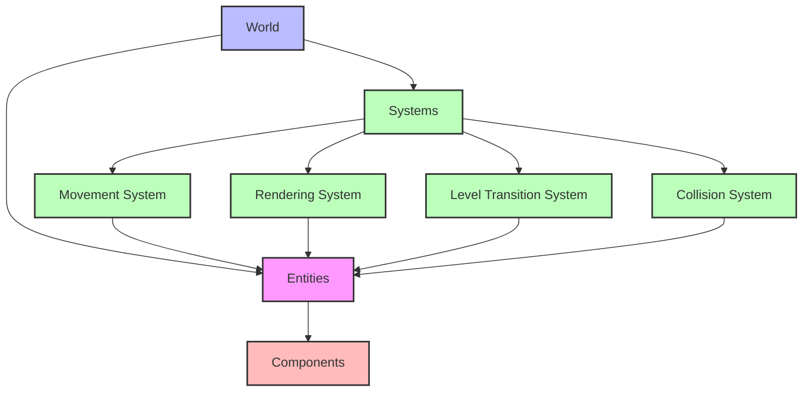
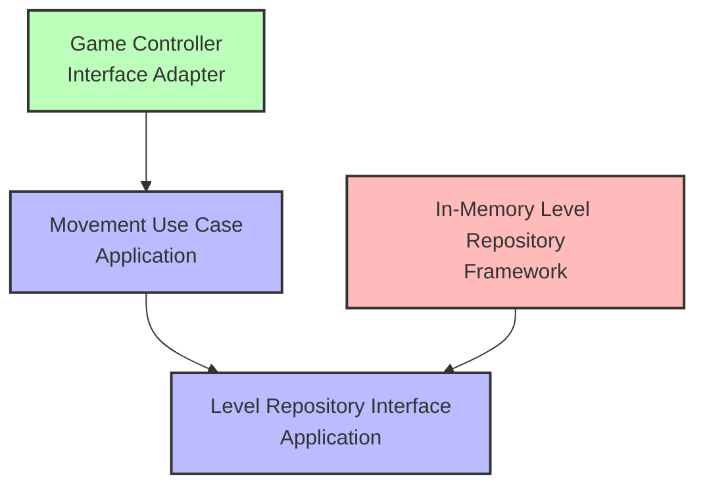
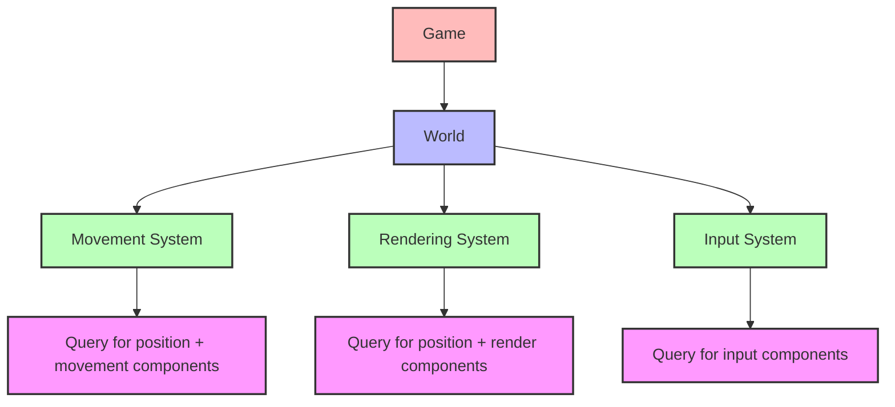
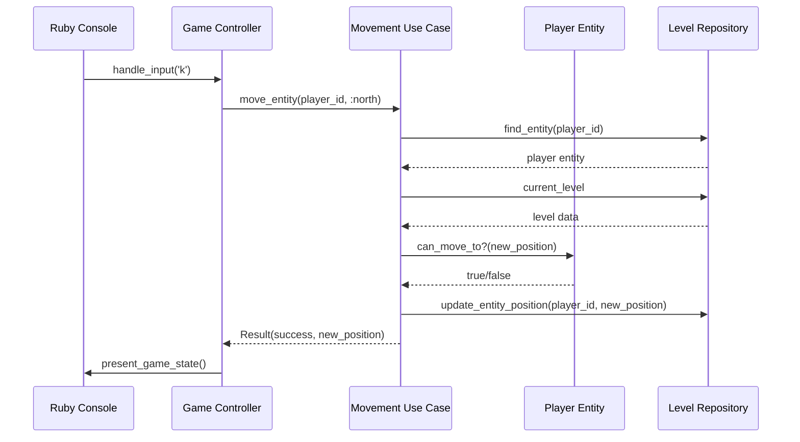
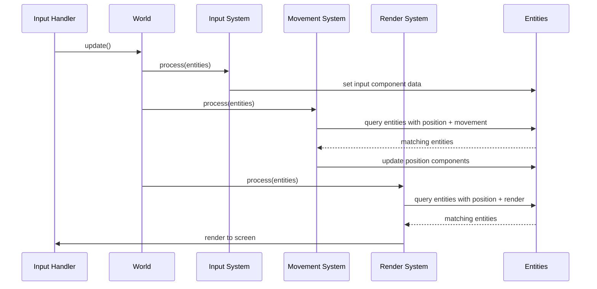

# Architectural Comparison: Clean Architecture vs. Enhanced ECS

## Introduction

This document provides a comprehensive comparison between two architectural approaches proposed for the Vanilla roguelike game:

1. **Clean Architecture**: A layered approach with strict dependency rules flowing inward
2. **Enhanced Entity-Component-System (ECS)**: A compositional approach with clear separation between data and behavior

Both approaches aim to address the recurring issues identified in the crash analysis, but they take fundamentally different philosophical approaches to software architecture. This document explores these differences in depth, providing concrete examples, migration considerations, and detailed analysis to inform the optimal architectural decision for Vanilla's future development.

## Table of Contents

1. [Architectural Philosophy](#architectural-philosophy)
2. [Structural Overview](#structural-overview)
3. [Dependency Management](#dependency-management)
4. [Data Flow Patterns](#data-flow-patterns)
5. [Code Organization](#code-organization)
6. [Code Examples](#code-examples)
7. [Migration Path](#migration-path)
8. [Testability](#testability)
9. [Scalability](#scalability)
10. [Learning Curve](#learning-curve)
11. [Game Development Fit](#game-development-fit)
12. [Performance Considerations](#performance-considerations)
13. [Comparison Matrix](#comparison-matrix)
14. [Final Recommendation](#final-recommendation)

## Architectural Philosophy

### Clean Architecture

Clean Architecture, proposed by Robert C. Martin (Uncle Bob), is built on the fundamental principle that dependencies should only point inward. The architecture is organized into concentric rings, each representing a different level of abstraction:

1. **Entities** (innermost): Core business objects and logic
2. **Use Cases**: Application-specific business rules
3. **Interface Adapters**: Convert data between use cases and external systems
4. **Frameworks & Drivers** (outermost): UI, database, external interfaces



The core philosophy is that inner layers contain high-level policy, while outer layers contain implementation details. Inner layers should remain ignorant of outer layers, creating a system that is:

- **Independent of frameworks**
- **Testable in isolation**
- **Independent of the UI**
- **Independent of the database**
- **Independent of any external agency**

### Enhanced Entity-Component-System (ECS)

ECS is a compositional architectural pattern commonly used in game development. It breaks down game objects into three primary elements:

1. **Entities**: Simple containers for components (essentially just IDs)
2. **Components**: Pure data structures with no behavior
3. **Systems**: Logic that processes entities with specific component combinations



The core philosophy of ECS is:

- **Composition over inheritance**: Entities gain capabilities by adding components, not through inheritance
- **Separation of data and behavior**: Components store data, Systems implement behavior
- **Data-oriented design**: Optimized for cache-friendly processing of similar components
- **Decoupled systems**: Systems operate independently on component data

The Enhanced ECS proposal adds formal dependency injection and standardized query mechanisms to the traditional ECS pattern.

## Structural Overview

### Clean Architecture Structure

In Clean Architecture, the Vanilla codebase would be organized into layers:



### Enhanced ECS Structure

In the Enhanced ECS approach, the Vanilla codebase would be organized around component types and systems:



## Dependency Management

### Clean Architecture

In Clean Architecture, dependencies are managed through:

1. **Dependency Rule**: Outer layers depend on inner layers, never the reverse
2. **Interfaces**: Inner layers define interfaces that outer layers implement
3. **Dependency Inversion**: High-level modules don't depend on low-level modules; both depend on abstractions



### Enhanced ECS

In Enhanced ECS, dependencies are managed through:

1. **World Reference**: Systems receive a reference to the World
2. **Component-Based Access**: Systems query entities based on required components
3. **Formal Dependency Injection**: Dependencies are explicitly passed to systems



## Data Flow Patterns

### Clean Architecture

In Clean Architecture, data typically flows:

1. Input → Controller → Use Case → Entities → Use Case → Presenter → View



### Enhanced ECS

In Enhanced ECS, data typically flows:

1. Input → Input System → Components → Other Systems → Components → Render System



## Code Organization

### Clean Architecture

Clean Architecture organizes code by layer and responsibility:

```
vanilla/
├── domain/
│   ├── entities/
│   │   ├── player.rb
│   │   ├── monster.rb
│   │   └── cell.rb
│   └── value_objects/
│       └── position.rb
├── use_cases/
│   ├── movement_use_case.rb
│   ├── level_transition_use_case.rb
│   └── item_interaction_use_case.rb
├── interface_adapters/
│   ├── controllers/
│   │   └── game_controller.rb
│   ├── presenters/
│   │   └── game_presenter.rb
│   └── repositories/
│       └── in_memory_level_repository.rb
└── frameworks_drivers/
    ├── ui/
    │   └── ruby_console_ui.rb
    └── external_interfaces/
        └── curses_adapter.rb
```

The organization is based on architectural layers, with each subdirectory corresponding to a layer in the Clean Architecture diagram. This creates clear boundaries between:

- Core domain logic (entities and value objects)
- Application-specific use cases
- Interface adapters for external communications
- External frameworks and drivers

### Enhanced ECS

Enhanced ECS organizes code by ECS elements:

```
vanilla/
├── ecs/
│   ├── entity.rb
│   ├── component.rb
│   ├── system.rb
│   └── world.rb
├── components/
│   ├── position_component.rb
│   ├── render_component.rb
│   ├── movement_component.rb
│   ├── player_component.rb
│   ├── monster_component.rb
│   └── item_component.rb
├── systems/
│   ├── movement_system.rb
│   ├── render_system.rb
│   ├── input_system.rb
│   ├── collision_system.rb
│   └── level_transition_system.rb
└── infrastructure/
    ├── game.rb
    ├── level_generator.rb
    └── ui/
        └── console_renderer.rb
```

The organization is based on the ECS pattern, separating:
- Core ECS infrastructure (entities, components, systems, world)
- Component definitions (pure data structures)
- System implementations (game logic)
- Supporting infrastructure

## Code Examples

### Clean Architecture Example

Here's how the movement functionality would be implemented in Clean Architecture:

#### Entity (Domain Layer)

```ruby
# domain/entities/player.rb
module Vanilla
  module Domain
    module Entities
      class Player
        attr_reader :id, :name, :health

        def initialize(id, name, health = 100)
          @id = id
          @name = name
          @health = health
        end
      end
    end
  end
end

# domain/value_objects/position.rb
module Vanilla
  module Domain
    module ValueObjects
      class Position
        attr_reader :row, :column

        def initialize(row, column)
          @row = row
          @column = column
        end

        def north
          Position.new(row - 1, column)
        end

        def south
          Position.new(row + 1, column)
        end

        def east
          Position.new(row, column + 1)
        end

        def west
          Position.new(row, column - 1)
        end

        def ==(other)
          row == other.row && column == other.column
        end
      end
    end
  end
end
```

#### Use Case (Application Layer)

```ruby
# use_cases/movement_use_case.rb
module Vanilla
  module UseCases
    class MovementUseCase
      def initialize(level_repository)
        @level_repository = level_repository
      end

      def move_entity(entity_id, direction)
        entity = @level_repository.find_entity(entity_id)
        return Result.new(success: false, error: "Entity not found") unless entity

        current_position = @level_repository.get_entity_position(entity_id)
        return Result.new(success: false, error: "Position not found") unless current_position

        new_position = calculate_new_position(current_position, direction)

        if can_move_to?(new_position)
          @level_repository.update_entity_position(entity_id, new_position)
          Result.new(success: true, entity_position: new_position)
        else
          Result.new(success: false, error: "Cannot move to target position")
        end
      end

      private

      def calculate_new_position(position, direction)
        case direction
        when :north then position.north
        when :south then position.south
        when :east  then position.east
        when :west  then position.west
        else position
        end
      end

      def can_move_to?(position)
        level = @level_repository.current_level
        cell = level.cell_at(position)
        cell && cell.walkable?
      end
    end

    class Result
      attr_reader :success, :error, :entity_position

      def initialize(success:, error: nil, entity_position: nil)
        @success = success
        @error = error
        @entity_position = entity_position
      end
    end
  end
end
```

#### Repository Interface (Application Layer)

```ruby
# use_cases/repositories/level_repository.rb
module Vanilla
  module UseCases
    module Repositories
      class LevelRepository
        def find_entity(entity_id)
          raise NotImplementedError
        end

        def get_entity_position(entity_id)
          raise NotImplementedError
        end

        def update_entity_position(entity_id, position)
          raise NotImplementedError
        end

        def current_level
          raise NotImplementedError
        end
      end
    end
  end
end
```

#### Repository Implementation (Interface Adapters Layer)

```ruby
# interface_adapters/repositories/in_memory_level_repository.rb
module Vanilla
  module InterfaceAdapters
    module Repositories
      class InMemoryLevelRepository
        include Vanilla::UseCases::Repositories::LevelRepository

        def initialize
          @entities = {}
          @positions = {}
          @current_level = nil
        end

        def find_entity(entity_id)
          @entities[entity_id]
        end

        def get_entity_position(entity_id)
          @positions[entity_id]
        end

        def update_entity_position(entity_id, position)
          @positions[entity_id] = position
          @current_level.update_grid if @current_level
        end

        def current_level
          @current_level
        end

        def set_current_level(level)
          @current_level = level
        end
      end
    end
  end
end
```

#### Controller (Interface Adapters Layer)

```ruby
# interface_adapters/controllers/game_controller.rb
module Vanilla
  module InterfaceAdapters
    module Controllers
      class GameController
        def initialize(movement_use_case, level_transition_use_case)
          @movement_use_case = movement_use_case
          @level_transition_use_case = level_transition_use_case
          @player_id = nil
        end

        def set_player(player_id)
          @player_id = player_id
        end

        def handle_input(key)
          case key
          when "k", "UP"
            handle_move(:north)
          when "j", "DOWN"
            handle_move(:south)
          when "h", "LEFT"
            handle_move(:west)
          when "l", "RIGHT"
            handle_move(:east)
          end
        end

        private

        def handle_move(direction)
          result = @movement_use_case.move_entity(@player_id, direction)

          if result.success
            check_special_interactions(result.entity_position)
          end

          result
        end

        def check_special_interactions(position)
          # Check for stairs, items, etc.
        end
      end
    end
  end
end
```

### Enhanced ECS Example

Here's how the movement functionality would be implemented in Enhanced ECS:

#### Core ECS Classes

```ruby
# ecs/entity.rb
module Vanilla
  module ECS
    class Entity
      attr_reader :id, :components

      def initialize(id = SecureRandom.uuid)
        @id = id
        @components = {}
      end

      def add_component(component)
        @components[component.class.component_type] = component
        component.entity = self
        self
      end

      def get_component(type)
        @components[type]
      end

      def has_component?(type)
        @components.key?(type)
      end
    end
  end
end

# ecs/component.rb
module Vanilla
  module ECS
    class Component
      attr_accessor :entity

      class << self
        def component_type
          @component_type ||= name.split('::').last.gsub(/Component$/, '').downcase.to_sym
        end
      end
    end
  end
end

# ecs/system.rb
module Vanilla
  module ECS
    class System
      class << self
        attr_reader :required_components

        def requires_components(*component_types)
          @required_components = component_types
        end
      end

      def initialize(world)
        @world = world
      end

      def process
        entities = @world.query_entities(self.class.required_components)
        update(entities)
      end

      def update(entities)
        raise NotImplementedError, "Subclasses must implement #update"
      end
    end
  end
end

# ecs/world.rb
module Vanilla
  module ECS
    class World
      attr_reader :entities, :systems

      def initialize
        @entities = {}
        @systems = []
      end

      def add_entity(entity)
        @entities[entity.id] = entity
        entity
      end

      def remove_entity(entity_id)
        @entities.delete(entity_id)
      end

      def add_system(system, priority = 0)
        @systems << [system, priority]
        @systems.sort_by! { |s| s[1] }
      end

      def query_entities(component_types)
        return @entities.values if component_types.empty?

        @entities.values.select do |entity|
          component_types.all? { |type| entity.has_component?(type) }
        end
      end

      def update
        @systems.each do |system, _|
          system.process
        end
      end
    end
  end
end
```

#### Components

```ruby
# components/position_component.rb
module Vanilla
  module Components
    class PositionComponent < ECS::Component
      attr_accessor :row, :column

      def initialize(row, column)
        @row = row
        @column = column
      end
    end
  end
end

# components/movement_component.rb
module Vanilla
  module Components
    class MovementComponent < ECS::Component
      attr_accessor :speed

      def initialize(speed = 1)
        @speed = speed
      end
    end
  end
end

# components/input_component.rb
module Vanilla
  module Components
    class InputComponent < ECS::Component
      attr_accessor :pending_move

      def initialize
        @pending_move = nil
      end
    end
  end
end

# components/player_component.rb
module Vanilla
  module Components
    class PlayerComponent < ECS::Component
      attr_accessor :name, :health

      def initialize(name, health = 100)
        @name = name
        @health = health
      end
    end
  end
end
```

#### Systems

```ruby
# systems/input_system.rb
module Vanilla
  module Systems
    class InputSystem < ECS::System
      requires_components :input

      def initialize(world)
        super
        @pending_input = nil
      end

      def set_input(key)
        @pending_input = key
      end

      def update(entities)
        return unless @pending_input

        direction = key_to_direction(@pending_input)
        @pending_input = nil

        return unless direction

        entities.each do |entity|
          input = entity.get_component(:input)
          input.pending_move = direction
        end
      end

      private

      def key_to_direction(key)
        case key
        when "k", "UP" then :north
        when "j", "DOWN" then :south
        when "h", "LEFT" then :west
        when "l", "RIGHT" then :east
        else nil
        end
      end
    end
  end
end

# systems/movement_system.rb
module Vanilla
  module Systems
    class MovementSystem < ECS::System
      requires_components :position, :movement, :input

      def initialize(world)
        super
        @level_grid = nil
      end

      def set_level_grid(grid)
        @level_grid = grid
      end

      def update(entities)
        return unless @level_grid

        entities.each do |entity|
          input = entity.get_component(:input)
          next unless input.pending_move

          position = entity.get_component(:position)
          direction = input.pending_move

          # Clear pending move
          input.pending_move = nil

          # Calculate new position
          new_row, new_col = calculate_new_position(position, direction)

          # Check if movement is possible
          if can_move_to?(new_row, new_col)
            position.row = new_row
            position.column = new_col

            # Check special tiles
            check_special_tiles(entity, position)
          end
        end
      end

      private

      def calculate_new_position(position, direction)
        row, col = position.row, position.column

        case direction
        when :north then [row - 1, col]
        when :south then [row + 1, col]
        when :east then [row, col + 1]
        when :west then [row, col - 1]
        else [row, col]
        end
      end

      def can_move_to?(row, col)
        cell = @level_grid[row, col]
        cell && cell.walkable?
      end

      def check_special_tiles(entity, position)
        # Check for stairs, items, etc.
      end
    end
  end
end
```

#### Game Integration

```ruby
# infrastructure/game.rb
module Vanilla
  class Game
    def initialize(options = {})
      # Create world
      @world = ECS::World.new

      # Create systems
      input_system = Systems::InputSystem.new(@world)
      movement_system = Systems::MovementSystem.new(@world)
      render_system = Systems::RenderSystem.new(@world)

      # Add systems to world with priority
      @world.add_system(input_system, 1)
      @world.add_system(movement_system, 2)
      @world.add_system(render_system, 3)

      # Create player entity
      player = ECS::Entity.new
      player.add_component(Components::PlayerComponent.new("Hero"))
      player.add_component(Components::PositionComponent.new(5, 5))
      player.add_component(Components::MovementComponent.new)
      player.add_component(Components::InputComponent.new)
      player.add_component(Components::RenderComponent.new('@'))

      # Add entities to world
      @world.add_entity(player)

      # Initialize level
      initialize_level(options[:difficulty] || 1)

      # Store reference to input system
      @input_system = input_system
    end

    def handle_input(key)
      @input_system.set_input(key)
    end

    def update
      @world.update
    end

    private

    def initialize_level(difficulty)
      # Generate level
      level_generator = LevelGenerator.new
      grid = level_generator.generate(difficulty)

      # Set grid reference in movement system
      movement_system = @world.systems.find { |s, _| s.is_a?(Systems::MovementSystem) }&.first
      movement_system.set_level_grid(grid) if movement_system
    end
  end
end
```

## Migration Path

### Clean Architecture Migration

Migrating to Clean Architecture requires a significant restructuring of the codebase:

1. **Identify Domain Entities and Value Objects**
   - Extract core domain concepts into entity classes
   - Create value objects for immutable concepts like Position

2. **Define Use Case Interfaces**
   - Identify key application operations
   - Create use case classes with clear inputs and outputs

3. **Create Repository Interfaces**
   - Define data access interfaces in the application layer
   - Ensure they're agnostic of data storage implementation

4. **Implement Interface Adapters**
   - Create controllers that connect the UI to use cases
   - Implement repositories for data access
   - Create presenters for formatting data for the UI

5. **Build Frameworks & Drivers Layer**
   - Implement UI components
   - Set up dependency injection

This migration is best accomplished with a phased approach, gradually refactoring one part of the application at a time, starting with the core domain and working outward.

### Enhanced ECS Migration

Migrating to Enhanced ECS involves:

1. **Create Core ECS Infrastructure**
   - Implement Entity, Component, System, and World classes
   - Set up entity querying mechanisms

2. **Extract Components from Existing Classes**
   - Identify data in existing entities
   - Convert to component classes

3. **Extract Logic into Systems**
   - Move behavior from classes into systems
   - Ensure systems only access entities through components

4. **Refactor Game Loop**
   - Update main game loop to use World.update()
   - Wire up input handling

This migration can be done incrementally, starting with the core ECS infrastructure and gradually converting existing classes to the ECS pattern.

## Testability

### Clean Architecture Testability

Clean Architecture excels at testability:

- **Isolated Layers**: Each layer can be tested in isolation
- **Dependency Inversion**: Dependencies can be easily mocked
- **Clear Boundaries**: Tests can focus on specific concerns

Example test for a use case:

```ruby
RSpec.describe Vanilla::UseCases::MovementUseCase do
  let(:repository) { double("LevelRepository") }
  let(:use_case) { described_class.new(repository) }
  let(:entity_id) { "player-1" }
  let(:position) { Vanilla::Domain::ValueObjects::Position.new(5, 5) }

  before do
    allow(repository).to receive(:find_entity).with(entity_id).and_return(double("Player"))
    allow(repository).to receive(:get_entity_position).with(entity_id).and_return(position)
    allow(repository).to receive(:current_level).and_return(double("Level"))
  end

  describe "#move_entity" do
    context "when movement is possible" do
      before do
        allow(repository.current_level).to receive(:cell_at).and_return(double("Cell", walkable?: true))
        allow(repository).to receive(:update_entity_position)
      end

      it "returns a successful result" do
        result = use_case.move_entity(entity_id, :north)
        expect(result.success).to be true
        expect(result.entity_position.row).to eq(4)
        expect(result.entity_position.column).to eq(5)
      end

      it "updates the entity's position" do
        expect(repository).to receive(:update_entity_position)
        use_case.move_entity(entity_id, :north)
      end
    end

    context "when movement is blocked" do
      before do
        allow(repository.current_level).to receive(:cell_at).and_return(double("Cell", walkable?: false))
      end

      it "returns a failure result" do
        result = use_case.move_entity(entity_id, :north)
        expect(result.success).to be false
      end

      it "does not update the entity's position" do
        expect(repository).not_to receive(:update_entity_position)
        use_case.move_entity(entity_id, :north)
      end
    end
  end
end
```

### Enhanced ECS Testability

Enhanced ECS provides good testability through:

- **System Isolation**: Systems can be tested independently
- **Component Data Access**: Tests can focus on component data changes
- **World Mocking**: The World can be mocked for system tests

Example test for a system:

```ruby
RSpec.describe Vanilla::Systems::MovementSystem do
  let(:world) { Vanilla::ECS::World.new }
  let(:system) { described_class.new(world) }
  let(:grid) { double("Grid") }
  let(:entity) { Vanilla::ECS::Entity.new("player-1") }

  before do
    system.set_level_grid(grid)

    # Set up components
    position = Vanilla::Components::PositionComponent.new(5, 5)
    movement = Vanilla::Components::MovementComponent.new
    input = Vanilla::Components::InputComponent.new
    input.pending_move = :north

    entity.add_component(position)
    entity.add_component(movement)
    entity.add_component(input)

    world.add_entity(entity)

    # Mock grid cell
    allow(grid).to receive(:[]).with(4, 5).and_return(double("Cell", walkable?: true))
  end

  describe "#update" do
    it "moves the entity in the requested direction" do
      system.update([entity])

      position = entity.get_component(:position)
      expect(position.row).to eq(4)
      expect(position.column).to eq(5)
    end

    it "clears the pending move" do
      system.update([entity])

      input = entity.get_component(:input)
      expect(input.pending_move).to be_nil
    end

    context "when movement is blocked" do
      before do
        allow(grid).to receive(:[]).with(4, 5).and_return(double("Cell", walkable?: false))
      end

      it "does not move the entity" do
        system.update([entity])

        position = entity.get_component(:position)
        expect(position.row).to eq(5)
        expect(position.column).to eq(5)
      end
    end
  end
end
```

## Scalability

### Clean Architecture Scalability

Clean Architecture provides strong scalability advantages:

- **Independent Development**: Teams can work on different layers simultaneously
- **Component Replacement**: External systems can be replaced without affecting core logic
- **Feature Addition**: New use cases can be added without modifying existing ones
- **Growing Complexity**: Inner layers can evolve independently of outer concerns

For Vanilla, this means:

- New game mechanics can be added as use cases without disrupting existing gameplay
- The UI layer could be swapped (e.g., from console to GUI) without affecting game logic
- Storage mechanisms could be changed (e.g., adding save/load features) independently

However, there are some scalability challenges:

- **Abstraction Overhead**: Each feature requires creating multiple classes across layers
- **Interface Proliferation**: As the game grows, the number of interfaces increases rapidly
- **Indirection**: Following the flow of execution becomes more complex

### Enhanced ECS Scalability

Enhanced ECS offers excellent scalability for games:

- **Component Composition**: New entity capabilities are added by creating new components
- **System Independence**: Systems can be added or modified without affecting others
- **Data-Oriented Scaling**: Performance scales well with increasing entities
- **Feature Modularity**: New game features can be added as independent systems

For Vanilla, this means:

- New game mechanics (items, spells, etc.) can be added as components and systems
- Existing systems can be optimized independently
- The game can handle increasing numbers of entities efficiently

Scalability challenges include:

- **Component Interdependencies**: As the system grows, component relationships become more complex
- **System Ordering**: With many systems, execution order becomes critical
- **Shared State**: Managing shared state can become challenging

## Learning Curve

### Clean Architecture Learning Curve

Clean Architecture has a moderate to steep learning curve:

- **Abstract Concepts**: Understanding the dependency rule and layer separation takes time
- **Design Patterns**: Requires familiarity with interfaces, dependency injection, etc.
- **Enforcement**: Maintaining clean layer separation requires discipline

For the Vanilla team, this means:

- **Initial Training**: Team members would need training in Clean Architecture principles
- **Ongoing Review**: Code reviews would need to enforce architectural boundaries
- **Documentation**: Clear documentation of layer responsibilities would be essential

### Enhanced ECS Learning Curve

Enhanced ECS has a more approachable learning curve for game development:

- **Simple Core Concepts**: Entities, components, and systems are straightforward to understand
- **Tangible Model**: The separation maps well to game objects and behaviors
- **Game Development Alignment**: Many game developers are already familiar with ECS patterns

For the Vanilla team, this means:

- **Quick Adoption**: Team members can typically grasp and apply ECS concepts quickly
- **Intuitive Design**: The design aligns naturally with how developers think about game objects
- **Community Resources**: Many resources exist for ECS in game development

## Game Development Fit

### Clean Architecture Game Development Fit

Clean Architecture was not specifically designed for games, which leads to some friction:

- **Game Loop**: Doesn't naturally accommodate the game update loop
- **State Management**: Game state changes don't always map well to use case boundaries
- **Performance Considerations**: The abstraction layers can introduce overhead in performance-critical paths

However, Clean Architecture provides benefits for game development:

- **Stability**: Clear boundaries lead to fewer bugs and regressions
- **Testability**: Comprehensive testing becomes easier
- **Maintainability**: The codebase remains navigable as it grows

### Enhanced ECS Game Development Fit

Enhanced ECS is specifically designed for game development:

- **Game Loop Integration**: Naturally fits the update cycle of games
- **Game Object Modeling**: Directly maps to how game objects behave
- **Performance Focus**: Data-oriented design aligns with game performance needs
- **Industry Standard**: Used by many successful game engines (Unity, Unreal, etc.)

Specific advantages for Vanilla:

- **Entity Variation**: Different monsters, items, etc. can share systems but have different component configurations
- **System Reuse**: Systems like movement or collision can be applied to multiple entity types
- **Performance at Scale**: Can efficiently handle increasing numbers of game objects

## Performance Considerations

### Clean Architecture Performance

Clean Architecture prioritizes maintainability over raw performance:

- **Abstraction Overhead**: Multiple layers of abstraction add some performance cost
- **Object Creation**: Typically results in more object creation and garbage collection
- **Function Call Overhead**: Calls through interfaces add indirection

Performance optimizations are possible but often come at the cost of architectural purity:

- **Caching**: Results can be cached at boundaries between layers
- **Bulk Operations**: Repository interfaces can be designed for batch operations
- **Strategic Violations**: Performance-critical paths might need to bypass some architectural rules

### Enhanced ECS Performance

Enhanced ECS is designed with performance in mind:

- **Data Locality**: Components of the same type can be processed together for cache efficiency
- **Minimal Indirection**: Direct access to component data avoids unnecessary function calls
- **Parallelization Potential**: Independent systems can potentially run in parallel
- **Memory Efficiency**: Components use less memory than full object hierarchies

For Vanilla, this translates to:

- **Smoother Gameplay**: More efficient update loops lead to consistent frame rates
- **More Entities**: The game can handle more monsters, items, etc. on screen
- **Complex Algorithms**: Performance budget allows for more complex AI, pathfinding, etc.

## Comparison Matrix

| Aspect | Clean Architecture | Enhanced ECS |
|--------|-------------------|-------------|
| **Philosophical Approach** | Layered with dependency rules flowing inward | Compositional with separation of data and behavior |
| **Organization** | By architectural layer and responsibility | By entity, component, and system |
| **Dependency Management** | Dependency injection with interfaces | World reference and component queries |
| **Testability** | Excellent (mock interfaces, test layers in isolation) | Good (test systems independently) |
| **Learning Curve** | Moderate to steep | Gentle to moderate |
| **Game Development Fit** | Moderate (not designed for games) | Excellent (designed for games) |
| **Scalability** | Good for team scalability, feature addition | Excellent for entity variation, system addition |
| **Performance** | Moderate (abstraction overhead) | Good (data-oriented design) |
| **Maintainability** | Excellent (clear boundaries) | Good (clear component/system separation) |
| **Migration Difficulty** | High (significant restructuring) | Moderate (incremental adoption possible) |
| **Code Complexity** | Higher (more abstraction, interfaces) | Lower (more concrete, direct) |
| **Flexibility** | Excellent for swapping infrastructure | Good for adding new game features |

## Final Recommendation

After thorough analysis, **Enhanced ECS with Dependency Injection** emerges as the more suitable architecture for Vanilla's ongoing development. This recommendation is based on several key factors:

### Why Enhanced ECS is Recommended

1. **Game Development Alignment**: ECS is specifically designed for games and naturally accommodates the types of features and challenges in roguelike development.

2. **Incremental Migration Path**: Enhanced ECS allows for a more gradual transition from the current architecture, with less disruption to ongoing development.

3. **Lower Learning Curve**: The team can likely adopt ECS concepts more quickly, enabling faster implementation.

4. **Direct Solution to Current Issues**: The identified crash issues (private method access, parameter mismatches) are directly addressed by ECS's clear component/system boundaries.

5. **Performance Benefits**: As Vanilla adds more features, ECS's performance advantages will become increasingly important.

6. **Flexibility for New Systems**: The architectural goal of adding more systems and features aligns perfectly with ECS's design.

### Implementation Strategy

To implement Enhanced ECS effectively:

1. **Start with Core Infrastructure**: Implement the base Entity, Component, System, and World classes

2. **Create Initial Component Types**: Convert current entity properties to components (Position, Render, etc.)

3. **Implement Core Systems**: Build the essential systems (Movement, Rendering, Input)

4. **Migrate Entities**: Convert existing game objects to component-based entities

5. **Refactor Game Loop**: Update the main game loop to use the World.update() pattern

6. **Add Robust Testing**: Implement comprehensive system tests

This approach will allow for incremental progress while maintaining a functional game throughout the transition.

### Clean Architecture Considerations

While Clean Architecture isn't recommended as the primary approach, certain Clean Architecture principles can still be beneficial:

- **Clear Interfaces**: Define clear interfaces for external systems
- **Dependency Injection**: Use formal dependency injection for system references
- **Use Case Organization**: Organize game features in a use-case-centric way

By incorporating these principles into the Enhanced ECS implementation, Vanilla can get the best of both architectural approaches.

## Conclusion

Both Clean Architecture and Enhanced ECS offer valuable approaches to addressing Vanilla's architectural challenges. Clean Architecture provides stronger guarantees around layer separation and dependency management, while Enhanced ECS offers a more natural fit for game development with better performance characteristics.

Given Vanilla's specific context—a roguelike game with ongoing feature development and current issues stemming from component entanglement—the Enhanced ECS approach provides the best balance of addressing immediate concerns while setting up a foundation for future growth.

The recommended implementation strategy allows for incremental adoption, minimizing disruption while steadily improving the codebase structure. This approach will result in a more maintainable, testable, and extensible Vanilla roguelike game.