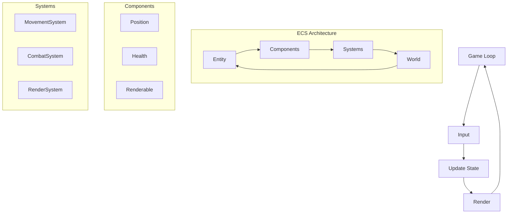

# Chapter 1: Introduction to Game Development and ECS

Welcome to the exciting world of game development! Whether you're a seasoned Ruby developer looking to explore new horizons or a curious beginner eager to craft interactive experiences, this book will guide you through the process of building games using modern techniques. In this first chapter, we'll define what a game is, introduce the Entity-Component-System (ECS) pattern, and preview the project we'll create together: a simple roguelike game. By the end, you'll understand the core concepts of game development and why ECS is a powerful approach to building games.

## What is a Game?

At its core, a game is an interactive experience defined by a few key elements:

* **Input:** How players interact with the game. This could be keyboard presses, mouse clicks, or even gestures—anything that lets the player influence the game world.
* **State:** The data that represents the game at any given moment. This includes the player's position, the health of enemies, the layout of a maze, or the score.
* **Rendering:** The process of displaying the game state to the player, whether through text in a terminal, 2D sprites on a screen, or a fully immersive 3D environment.

Here's a visual representation of the game loop and ECS architecture:

Think of a game as a loop: the player provides input, the game updates its state based on that input, and then it renders the new state for the player to see. This cycle repeats, creating the dynamic experience we associate with games. For example, in Pac-Man, you press an arrow key (input), Pac-Man moves and might eat a pellet (state), and the screen updates to show his new position (rendering).

## Understanding Roguelike Games

Before we dive into building our game, let's understand what makes a roguelike game special. Roguelikes are a subgenre of role-playing games (RPGs) characterized by several key features:

* **Procedural Generation:** Each playthrough features a uniquely generated dungeon, ensuring no two games are exactly alike. This keeps the experience fresh and unpredictable.

* **Turn-Based Gameplay:** Unlike action games, roguelikes are turn-based. When you move, enemies move. This creates a strategic element where you must think carefully about each action.

* **Permadeath:** When your character dies, that's it—no respawning. This creates tension and makes each decision meaningful.

* **ASCII Graphics:** Traditionally, roguelikes use simple text characters to represent the game world (e.g., '@' for the player, '#' for walls, '.' for floors). While modern roguelikes often use tiles or sprites, we'll stick with ASCII for simplicity.

* **Complex Systems:** Despite their simple graphics, roguelikes often feature deep mechanics like inventory management, character stats, and complex item interactions.

Popular examples include Rogue (the genre's namesake), NetHack, and Dungeon Crawl Stone Soup. Our game will incorporate these elements while keeping the implementation manageable for learning purposes.

As developers, our job is to manage these elements efficiently and structure our code to handle complexity as the game grows. That's where architectural patterns like ECS come in.

## Why Use Entity-Component-System (ECS)?

If you've worked with Ruby—or any object-oriented programming (OOP) language—you're likely familiar with building systems using classes and inheritance. For example, in a traditional OOP game, you might create a `Player` class that inherits from a `Character` class, which itself inherits from an `Entity` class. The `Player` might have methods like `move`, `attack`, and `render`. Then, you'd create an `Enemy` class with similar functionality, perhaps duplicating or tweaking some logic.

This approach works fine for small projects, but as your game scales, OOP can become rigid and hard to maintain. Inheritance hierarchies grow deep and tangled, and modifying behavior (say, adding a new ability to only some characters) often requires refactoring or workarounds. Enter the Entity-Component-System pattern, a more flexible alternative that's become a cornerstone of modern game development.

## How ECS Works

ECS breaks down game objects into three distinct parts:

* **Entities:** These are just IDs or containers—think of them as unique identifiers for "things" in your game, like the player, a wall, or a potion. An entity doesn't have behavior or data on its own.
* **Components:** These are pure data structures that define an entity's properties. For example, a `Position` component might hold `x` and `y` coordinates, while a `Health` component stores hit points. Entities are "built" by attaching components to them.
* **Systems:** These are the logic engines. A system operates on entities that have specific components. For instance, a `MovementSystem` might look for entities with both `Position` and `Velocity` components and update their positions each frame.

Here's a quick example: instead of a `Player` class with a `move` method, you'd have:

* An entity (ID: 1) representing the player.
* Components attached to it: `Position(x: 5, y: 5)`, `Velocity(dx: 1, dy: 0)`, and `Renderable(sprite: "player.png")`.
* A `MovementSystem` that updates all entities with `Position` and `Velocity`, and a `RenderSystem` that draws all entities with `Renderable`.

## Benefits Over Traditional OOP

So why ditch the familiar OOP approach for ECS? Here are the key advantages:

* **Flexibility:** Want to add a new feature, like making an enemy shoot projectiles? Just attach a `Shooter` component to it—no need to rewrite a class or extend an inheritance chain.
* **Reusability:** Components and systems are modular. A `CollisionSystem` can work with any entity that has a `Position` and `Collider`, whether it's a player, enemy, or wall.
* **Performance:** ECS is cache-friendly and easier to parallelize, as systems process data in batches rather than jumping between object methods. This matters when your game has hundreds or thousands of entities.
* **Decoupling:** Logic lives in systems, not objects, reducing tight coupling and making it easier to test or swap out behavior.

For Ruby developers, ECS might feel a bit unconventional at first—Ruby loves its objects and duck typing! But as we'll see, we can implement ECS in Ruby in a clean, idiomatic way, leveraging hashes, modules, and simple classes to keep the code expressive and maintainable.

## Overview of the Book's Project: A Simple Roguelike

To bring these concepts to life, we'll build a roguelike game throughout this book. If you're unfamiliar with roguelikes, think of classics like Rogue, NetHack, or Dungeon Crawl Stone Soup. Our game will feature:

* **A Player:** Controlled by you, navigating a maze.
* **A Maze:** A procedurally generated dungeon with walls and open spaces.
* **Items:** Treasures or power-ups scattered around for the player to collect.

We'll keep it simple: text-based rendering in the terminal (think `@` for the player and `#` for walls), keyboard input, and a focus on core mechanics. Here's what the game loop will look like:

1.  Accept input (e.g., arrow keys to move).
2.  Update the game state (move the player, check for collisions or item pickups).
3.  Render the updated maze to the screen.

Using ECS, we'll structure it like this:

* **Entities:** The player, walls, and items, each with a unique ID.
* **Components:** `Position` for where things are, `Renderable` for how they look, `Collidable` for walls, etc.
* **Systems:** A `MovementSystem` to handle player input, a `CollisionSystem` to prevent walking through walls, and a `RenderSystem` to draw the game.

By the end of the book, you'll have a working roguelike and a solid grasp of ECS that you can apply to more complex projects—maybe even a 2D game with a graphical library like Ruby2D or Gosu!

## Outcome

By the end of this chapter, you should understand:

* The basic building blocks of a game: input, state, and rendering.
* Why ECS is a powerful alternative to traditional OOP for game development.
* The scope of our roguelike project and how ECS will help us build it.

In the next chapter, we'll set up our Ruby environment and start coding the ECS framework from scratch. Get ready to dive in—your journey as a game developer has just begun!

