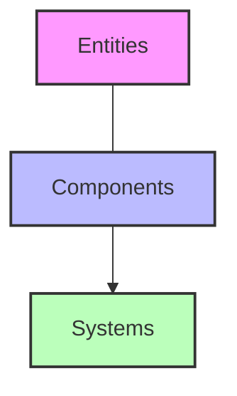

# ECS Implementation Issues Diagnosis

## Executive Summary

This document provides a deep analysis of why the Vanilla roguelike game, despite initially being designed with Entity-Component-System (ECS) principles in mind, has developed significant entanglement issues that cause core functionality to break when new components or systems are added. Rather than recommending a complete architectural rewrite, this analysis focuses on identifying specific design problems in the current implementation that could be addressed with targeted refactoring.

Based on the crash analysis and architectural review, several fundamental issues have been identified in the current ECS implementation that are causing instability:

1. **Incomplete ECS Implementation**: The codebase uses ECS terminology but doesn't fully adhere to core ECS principles
2. **System-to-System Dependencies**: Systems are directly calling other systems instead of operating only on component data
3. **Component Access Violations**: Direct modifications to components from inappropriate contexts
4. **Inconsistent Responsibility Boundaries**: Unclear ownership of functionality between systems
5. **Implicit Dependency Chains**: Hidden dependencies that aren't obvious until runtime

This document explores each issue with concrete examples and proposes targeted solutions to address these problems without requiring a complete rewrite of the architecture.

## Understanding ECS Core Principles

Before examining what's going wrong, let's clarify what makes an effective ECS architecture:



In a properly implemented ECS:

1. **Entities** are just IDs or containers for components
2. **Components** are pure data with no behavior
3. **Systems** contain all behavior but don't store state
4. **Systems operate independently** on components without directly calling other systems
5. **Data flow is unidirectional** - systems read from and write to components, but not to other systems

## Problem 1: Incomplete ECS Implementation

### Diagnosis

The current Vanilla implementation uses ECS terminology but doesn't fully adhere to these principles. Specifically:

- **Components With Behavior**: Components contain methods that modify their own state or other components
- **Entities With Game Logic**: Entities contain game-specific logic rather than being pure component containers
- **Mixed Responsibilities**: Systems often perform multiple unrelated responsibilities

### Evidence

Let's look at a simplified example of how this might appear in the codebase:

```ruby
# Example of a component with behavior (anti-pattern)
class PositionComponent < Component
  attr_accessor :row, :column

  def initialize(row, column)
    @row = row
    @column = column
  end

  # Problematic: Component contains behavior
  def move_north
    @row -= 1
  end

  def move_south
    @row += 1
  end

  # etc...
end
```

```ruby
# Example of an entity with game logic (anti-pattern)
class Player < Entity
  def initialize(row, column)
    super()
    add_component(PositionComponent.new(row, column))
    add_component(RenderComponent.new('@'))
  end

  # Problematic: Entity contains game logic
  def move(direction)
    position = get_component(PositionComponent)
    case direction
    when :north then position.move_north
    when :south then position.move_south
    # etc...
    end

    # Problematic: Entity directly updates game state
    Game.instance.level.update_grid_with_entities
  end
end
```

### Implications

When components contain behavior or entities contain game logic:

1. **Component Coupling**: Components become coupled to other components or game systems
2. **Entity Inheritance Issues**: Leads to complex entity inheritance hierarchies instead of composition
3. **Hidden Dependencies**: Core game state updates happen in unexpected places

### Solution Approach

1. **Refactor Components to Pure Data**
   ```ruby
   # Refactored component (proper ECS)
   class PositionComponent < Component
     attr_accessor :row, :column

     def initialize(row, column)
       @row = row
       @column = column
     end
     # No behavior methods
   end
   ```

2. **Move Entity Logic to Systems**
   ```ruby
   # Refactored movement system (proper ECS)
   class MovementSystem < System
     def update(delta_time)
       entities_with_position = world.query_entities_with(PositionComponent)
       entities_with_position.each do |entity|
         if entity.has_component?(InputComponent)
           input = entity.get_component(InputComponent)
           position = entity.get_component(PositionComponent)

           # Handle movement based on input
           if input.move_direction == :north
             position.row -= 1
           elsif input.move_direction == :south
             position.row += 1
           # etc...
           end
         end
       end
     end
   end
   ```

## Problem 2: System-to-System Dependencies

### Diagnosis

In a proper ECS architecture, systems should operate independently on components without direct calls to other systems. In Vanilla, systems often directly call methods on other systems.

### Evidence

This pattern might appear in the code as:

```ruby
# Example of direct system-to-system dependencies (anti-pattern)
class MovementSystem
  def initialize(render_system, collision_system)
    @render_system = render_system
    @collision_system = collision_system
  end

  def update_entity_position(entity, direction)
    # Check collisions by directly calling another system
    if @collision_system.can_move_to?(entity, direction)
      position = entity.get_component(PositionComponent)
      # Update position...

      # Directly call render system to update display
      @render_system.render_entity(entity)
    end
  end
end
```

This is particularly problematic in level transitions, as seen in the crash analysis:

```ruby
# Potential cause of the level transition crash
class LevelSystem
  def transition_to_next_level(player)
    # Create new level
    new_level = Level.new(difficulty: current_level.difficulty + 1)

    # Directly call private method on another object
    new_level.update_grid_with_entities  # This crashed with private method error

    # Direct call to yet another system
    message_system.log_message("level.descended", 3, importance: :success)  # This crashed with parameter mismatch
  end
end
```

### Implications

Direct system-to-system dependencies create:

1. **Tight Coupling**: Changes to one system break others
2. **Order Dependencies**: Systems must run in a specific order
3. **Circular Dependencies**: System A depends on System B, which depends on System A
4. **Difficult Testing**: Can't test systems in isolation

### Solution Approach

1. **Use Component Data for Communication**
   ```ruby
   # Movement system that doesn't directly call other systems
   class MovementSystem
     def update(delta_time)
       entities = world.query_entities_with(PositionComponent, MovementComponent)

       entities.each do |entity|
         movement = entity.get_component(MovementComponent)
         next unless movement.requested_direction

         position = entity.get_component(PositionComponent)
         # Calculate new position...

         # Check using collision components rather than calling a system
         new_pos = calculate_new_position(position, movement.requested_direction)
         if !position_has_collision(new_pos)
           position.row = new_pos.row
           position.column = new_pos.column
         end

         # Clear the request after processing
         movement.requested_direction = nil
       end
     end

     private

     def position_has_collision(position)
       # Check collision using world data, not another system
       world.grid[position.row][position.column].blocks_movement?
     end
   end
   ```

2. **Use Command Pattern for System Outputs**
   ```ruby
   # System generating a command for another system to process
   class LevelTransitionSystem
     def update(delta_time)
       player = world.query_entities_with(PlayerComponent).first
       stairs = world.query_entities_with(StairsComponent).first

       if entity_at_position?(player, stairs.get_component(PositionComponent))
         # Instead of directly calling another system, queue a command
         world.queue_command(:change_level, {
           difficulty: world.current_difficulty + 1,
           player_id: player.id
         })

         # Add a message command instead of calling message system
         world.queue_command(:log_message, {
           key: "level.descended",
           data: { level: world.current_difficulty + 1 },
           importance: :success
         })
       end
     end
   end
   ```

## Problem 3: Component Access Violations

### Diagnosis

In the current implementation, components are accessed and modified from inappropriate contexts, including:

- **Direct public access to internal component state** from anywhere in the codebase
- **Component modification outside of owning systems**
- **No clear pattern for component state changes**

### Evidence

The crash analysis mentioned a private method error when calling `update_grid_with_entities`. This suggests that methods which should be internal implementation details are being called from inappropriate contexts:

```ruby
# Example of problematic component access (anti-pattern)
class Level
  def initialize
    @grid = Grid.new
    @entities = []
  end

  private

  # This method is private but needs to be called from outside
  def update_grid_with_entities
    # Reset grid
    # Place entities on grid based on positions
  end
end

class Game
  def move_player(direction)
    player = @player_entity
    position = player.get_component(PositionComponent)
    # Update position...

    # Direct call to private method
    @level.update_grid_with_entities  # Crashes here
  end
end
```

### Implications

Component access violations lead to:

1. **Fragile Code**: Changes to component internals break distant parts of the codebase
2. **Inconsistent State**: Components can be in an invalid state if updated incorrectly
3. **Hard-to-Trace Bugs**: State changes can happen from anywhere, making bugs difficult to track

### Solution Approach

1. **Enforce Component Encapsulation**
   ```ruby
   # Updated component with better encapsulation
   class PositionComponent < Component
     attr_reader :row, :column  # Only readable from outside

     def initialize(row, column)
       @row = row
       @column = column
     end

     # Only systems should call these methods
     def set_position(row, column)
       @row = row
       @column = column
     end
   end
   ```

2. **Centralize Component Updates in Systems**
   ```ruby
   # System with clear responsibility for position updates
   class MovementSystem
     def update(delta_time)
       # Process movement...
     end

     # Clear API for position changes
     def request_move(entity_id, direction)
       entity = world.get_entity(entity_id)
       return false unless entity

       movement = entity.get_component(MovementComponent)
       return false unless movement

       movement.requested_direction = direction
       true
     end
   end
   ```

3. **Use Observer Pattern for State Change Notifications**
   ```ruby
   # Using events for grid updates
   class PositionSystem
     def update(delta_time)
       # Process position changes...

       # Emit event when positions change
       if positions_changed
         world.emit_event(:positions_updated)
       end
     end
   end

   class GridSystem
     def initialize(world)
       super
       world.subscribe(:positions_updated, self)
     end

     def handle_event(event_type, data)
       if event_type == :positions_updated
         update_grid_with_entities
       end
     end

     private

     def update_grid_with_entities
       # Now this is called through the proper channel
     end
   end
   ```

## Problem 4: Inconsistent Responsibility Boundaries

### Diagnosis

In the current implementation, there's confusion about which system is responsible for what functionality. This leads to:

- **Duplicate Logic** across multiple systems
- **Responsibility Gaps** where needed functionality isn't clearly owned
- **Overlapping Responsibilities** where multiple systems try to handle the same task

### Evidence

The parameter mismatch error in the crash analysis is a symptom of this problem:

```ruby
# Inconsistent parameter usage (anti-pattern)
class MessageSystem
  def log_message(key, metadata = {}, options = {})
    # Implementation expecting options as a hash
  end
end

# Called incorrectly from one place
message_system.log_message("level.descended", { level: 5 }, importance: :success)  # Correct

# Called differently from another place
message_system.log_message("level.stairs_found", 3, importance: :success)  # Wrong parameter order/types
```

Another example might be overlapping responsibility for entity movement:

```ruby
# Movement logic duplicated across systems (anti-pattern)
class PlayerMovementSystem
  def move_player(direction)
    player = world.get_player
    position = player.get_component(PositionComponent)
    # Move logic...
  end
end

class MonsterMovementSystem
  def move_monster(monster, direction)
    position = monster.get_component(PositionComponent)
    # Very similar move logic duplicated here...
  end
end

class LevelTransitionSystem
  def place_player_on_new_level(player, level)
    position = player.get_component(PositionComponent)
    # Yet more position updating logic...
  end
end
```

### Implications

Inconsistent responsibility boundaries create:

1. **Redundant Code**: Same logic implemented multiple times
2. **Inconsistent Behavior**: Different implementations behave differently
3. **Update Hazards**: Changes need to be made in multiple places
4. **Unclear Ownership**: Developers don't know where to add new functionality

### Solution Approach

1. **Define Clear System Responsibilities**

   Create a document that clearly defines which system is responsible for what functionality:

   | System | Responsibilities |
   |--------|------------------|
   | MovementSystem | All entity position changes |
   | CollisionSystem | Determining if movement is possible |
   | RenderSystem | Drawing entities on screen |
   | InputSystem | Processing user input |
   | MessageSystem | Logging game messages |
   | LevelSystem | Level generation and transitions |

2. **Consolidate Duplicate Logic**
   ```ruby
   # Single system responsible for all movement
   class MovementSystem
     def update(delta_time)
       # Handle automatic movement (monsters, etc)
     end

     # Centralized API for any entity movement
     def request_move(entity_id, direction)
       # Implementation that works for any entity type
     end

     def teleport_entity(entity_id, position)
       # Implementation for instant position changes (level transitions, etc)
     end
   end
   ```

3. **Create Consistent Interface Contracts**
   ```ruby
   # Consistent API with clear documentation
   class MessageSystem
     # Document the expected parameters and types
     # @param key [String] The message key to look up
     # @param metadata [Hash] Optional data to include in the message
     # @param importance [Symbol] The importance level (:normal, :success, :warning, :danger)
     def log_message(key, metadata = {}, importance: :normal)
       # Implementation
     end
   end
   ```

## Problem 5: Implicit Dependency Chains

### Diagnosis

The current implementation has hidden dependencies where components or systems indirectly affect each other through shared state or implicit execution order requirements.

### Evidence

This issue manifests in several ways:

```ruby
# Implicit dependency through game singleton (anti-pattern)
class MovementSystem
  def update(delta_time)
    entities = world.query_entities_with(PositionComponent, MovementComponent)

    entities.each do |entity|
      # Update position...

      # Implicit dependency on global state
      Game.instance.level.update_grid  # This has an implicit dependency chain
    end
  end
end
```

```ruby
# Implicit execution order dependency (anti-pattern)
class InputSystem
  def update(delta_time)
    # Process input...
    if key_pressed(:up)
      player = world.get_player
      position = player.get_component(PositionComponent)
      position.row -= 1  # Directly modify position
    end
  end
end

class CollisionSystem
  def update(delta_time)
    # This system assumes it runs AFTER input system
    # and BEFORE render system
    entities = world.query_entities_with(PositionComponent)

    # Collision resolution that depends on positions already being updated
    # but needs to happen before rendering
  end
end
```

### Implications

Implicit dependency chains create:

1. **Brittle Execution Order**: Systems break if executed in the wrong order
2. **Hidden Coupling**: Systems appear independent but aren't
3. **Unexpected Side Effects**: Changes to one system cause cascading effects
4. **Difficult Debugging**: Problems appear in seemingly unrelated places

### Solution Approach

1. **Make Dependencies Explicit**
   ```ruby
   # System with explicit dependencies
   class MovementSystem
     def initialize(world, grid_system)
       super(world)
       @grid_system = grid_system
     end

     def update(delta_time)
       # Process movement...

       # Explicit dependency
       @grid_system.update_grid
     end
   end
   ```

2. **Use Component Flags for Order Dependencies**
   ```ruby
   # Using component flags to manage execution order
   class InputSystem
     def update(delta_time)
       if key_pressed(:up)
         player = world.get_player

         # Don't directly modify position, set a move request
         movement = player.get_component(MovementComponent)
         movement.requested_direction = :north
         movement.processed = false  # Flag for other systems
       end
     end
   end

   class MovementSystem
     def update(delta_time)
       entities = world.query_entities_with(MovementComponent, PositionComponent)

       entities.each do |entity|
         movement = entity.get_component(MovementComponent)
         next if movement.processed  # Skip already processed movements

         if movement.requested_direction
           position = entity.get_component(PositionComponent)
           # Update position based on request...
           movement.processed = true  # Mark as processed
         end
       end
     end
   end
   ```

3. **Use Event System for Decoupling**
   ```ruby
   # Using events to decouple systems
   class InputSystem
     def update(delta_time)
       if key_pressed(:up)
         player = world.get_player
         # Emit event instead of directly changing state
         world.emit_event(:move_requested, {
           entity_id: player.id,
           direction: :north
         })
       end
     end
   end

   class MovementSystem
     def initialize(world)
       super
       world.subscribe(:move_requested, self)
     end

     def handle_event(event_type, data)
       if event_type == :move_requested
         entity = world.get_entity(data[:entity_id])
         # Process movement request...
       end
     end
   end
   ```

## Real-World Examples from the Codebase

Based on the crash analysis, let's examine what might be happening in the specific crash scenarios:

### Level Transition Crash

```ruby
# What might be happening with the level transition crash
class Game
  def transition_to_next_level
    current_level = @level
    new_level = Level.new(difficulty: current_level.difficulty + 1)

    # Placing player on the new level
    player_position = @player.get_component(PositionComponent)
    # Set player at stairs entry point...

    # This method is private but being called from outside
    new_level.update_grid_with_entities  # CRASH: private method called

    @level = new_level

    # Parameter order/type mismatch
    @message_system.log_message("level.descended", current_level.difficulty + 1, importance: :success)  # CRASH: wrong arguments
  end
end

class Level
  private

  def update_grid_with_entities
    # Implementation...
  end
end
```

### System Interaction Problems

```ruby
# What might be happening with system interactions
class MovementSystem
  def initialize(render_system, collision_system, message_system)
    @render_system = render_system
    @collision_system = collision_system
    @message_system = message_system
  end

  def move_entity(entity, direction)
    if @collision_system.can_move_to?(entity, direction)
      position = entity.get_component(PositionComponent)
      # Update position...

      if entity.has_component?(PlayerComponent)
        # Direct system calls create tight coupling
        @render_system.center_view_on(position)
        @message_system.log_message("movement.player_moved", importance: :info)
      end
    end
  end
end
```

## Comprehensive Solution Strategy

Based on this analysis, the following approach would address the core issues without requiring a complete architectural rewrite:

### 1. Component Refactoring

1. **Convert Components to Pure Data**
   - Remove behavior from all components
   - Make component properties private where appropriate
   - Add proper accessor methods

2. **Create Component Documentation**
   - Document each component's purpose
   - Specify which systems can modify each component
   - Define valid component states

### 2. System Responsibility Clarification

1. **Define System Boundaries**
   - Create a matrix of systems and their responsibilities
   - Document system dependencies
   - Identify and eliminate responsibility overlaps

2. **Create Consistent System Interfaces**
   - Standardize method signatures
   - Document parameter requirements
   - Create consistent error handling

### 3. Communication Pattern Implementation

1. **Command Queue**
   - Implement a command queue in the World class
   - Define standard command formats
   - Process commands at appropriate times in the game loop

2. **Event System**
   - Create a simple event system for state change notifications
   - Allow systems to subscribe to events
   - Emit events for significant state changes

### 4. Dependency Management

1. **Explicit Dependency Injection**
   - Use constructor injection for system dependencies
   - Create a central dependency container
   - Document dependency graphs

2. **System Execution Order**
   - Define and document system execution order
   - Create execution phases if needed
   - Ensure systems don't depend on specific execution order when possible

### 5. Integration Tests

1. **System Interaction Tests**
   - Create tests for common system interactions
   - Verify correct behavior when adding new components/systems
   - Test edge cases and error conditions

2. **Game State Snapshot Tests**
   - Create tests that validate complete game state
   - Verify state consistency after operations
   - Ensure components remain in valid states

## Conclusion

The issues in the current Vanilla ECS implementation stem not from fundamental architectural flaws in ECS itself, but from incomplete or inconsistent application of ECS principles. By addressing the specific issues outlined in this document, the codebase can be incrementally improved without requiring a complete rewrite.

Key recommendations:

1. **Focus on proper component/system separation** rather than creating new architectural layers
2. **Implement explicit communication patterns** between systems
3. **Clarify system responsibilities** and eliminate overlapping functionality
4. **Make dependencies explicit** through proper dependency injection
5. **Create comprehensive tests** for system interactions

By taking this targeted approach, the Vanilla roguelike game can maintain its ECS architecture while addressing the specific issues that are causing crashes when new components or systems are added.

This incremental improvement path will:
- **Require less development time** than a full rewrite
- **Address immediate issues** with specific solutions
- **Preserve existing functionality** while improving architecture
- **Provide incremental benefits** as each issue is addressed
- **Establish patterns** for future feature development